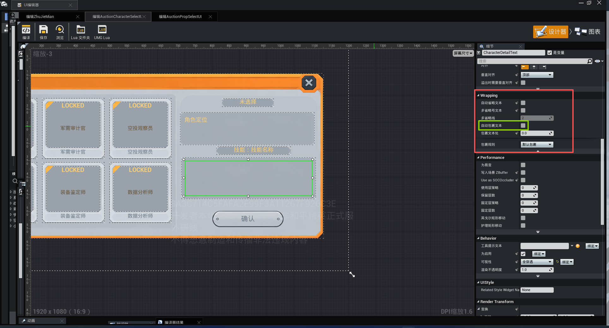

# 2026-09-10 AuctionCharacterSelectUI CharacterDetailText 自动包裹

> 类型：项目证据
> 主题：AuctionCharacterSelectUI / CharacterDetailText / Wrapping
> 适用范围：IslandAuctionKing 的 `/IslandAuctionKing/Asset/Blueprint/Prefabs/UI/AuctionCharacterSelectUI`
> 证据状态：编辑器面板实测（用户截图）；未 MCP 回读，未启动 PIE
> 来源：用户 2026-09-10 截图 `2026-09-10_AuctionCharacterSelectUI_CharacterDetailText_Wrapping.png`
> 更新时间：2026-09-10
> 关联主题：[绿洲 UMG 文本自动包裹与换行](../../知识/通用/UI与交互/绿洲UMG文本自动包裹与换行.md)、[2026-09-09 AuctionCharacterSelectUI 切图绑定](./2026-09-09_AuctionCharacterSelectUI_切图绑定.md)
> 排除范围：本轮未改蓝图、Lua 或配置表；不把本控件当前勾选状态写成全局默认
> 官方依据：`UTextLayoutWidget.AutoWrapText`。官方 Wiki 未覆盖该中文面板名。

## 截图证据

截图路径：`D:\知识库\和平精英绿洲起源\raw\IslandAuctionKing\蓝图与UI\2026-09-10_AuctionCharacterSelectUI_CharacterDetailText_Wrapping.png`

可见事实：

1. 打开的页签是「编辑 AuctionCharacterSelectUI」。
2. 细节面板当前控件名为 `CharacterDetailText`。
3. Wrapping 分组字段为：自动省略文本、多省略号文本、多省略线、自动包裹文本、包裹文本处、包裹规则。
4. 「自动包裹文本」未勾选。
5. 「包裹文本处」为 `0.0`，「包裹规则」为「默认包裹」。
6. 画布中 `CharacterDetailText` 被选中，位于右侧详情区技能条下方。

## 项目含义

该控件若要显示超过框宽的角色详情，需要勾选「自动包裹文本」。本轮只记录面板状态，没有写入蓝图。

通用操作见 [绿洲 UMG 文本自动包裹与换行](../../知识/通用/UI与交互/绿洲UMG文本自动包裹与换行.md)。
