# AI资源检索

AI检索功能允许开发者通过输入关键词，快速查找相关联的资源，提高资源检索效率。
>当前版本仅支持静态网格类型的内容检索

## 功能入口

编辑器内容浏览器和【AI开发助手】都内置了AI检索的功能，两种入口的操作方式一致。

**内容浏览器**

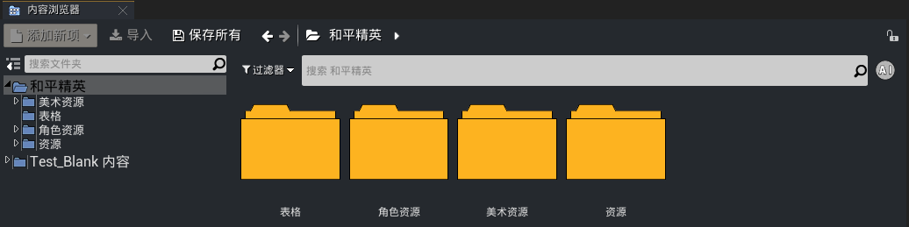

**AI开发助手**

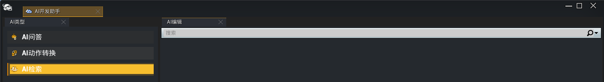

## 操作步骤

以【AI开发助手】为例说明检索功能的使用步骤。

1. 编辑器菜单栏点击打开【AI开发助手】。

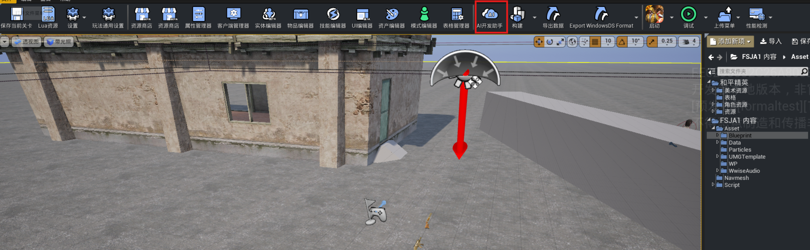

2. 选择【AI检索】页签。

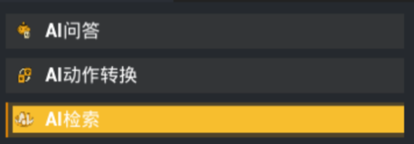

3. 在输入框中输入检索内容，如：“枪械”，按回车即可出现搜索结果：

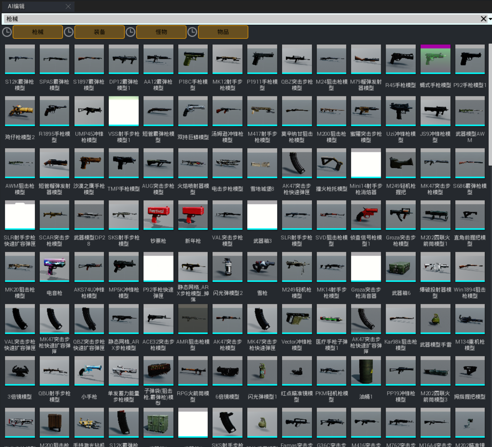

4. 在搜索的同时，下方菜单会出现自动联想的扩展关键词：
>当前搜索暂不支持以单个字母或单个数字作为关键词进行联想

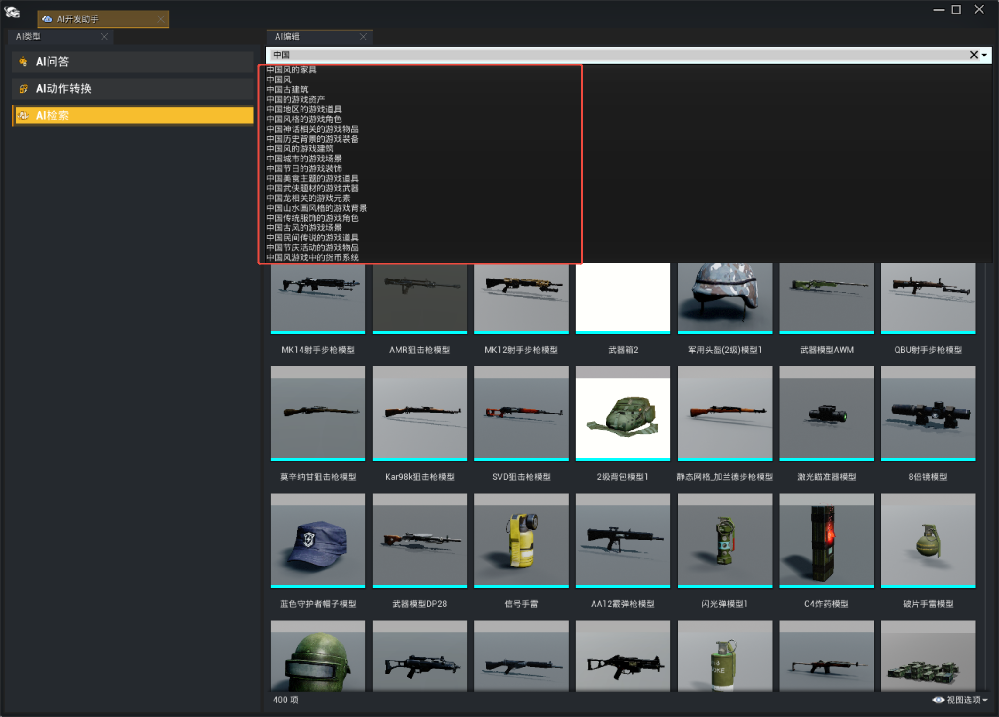

点击右侧按钮，可以展开、收起联想菜单：

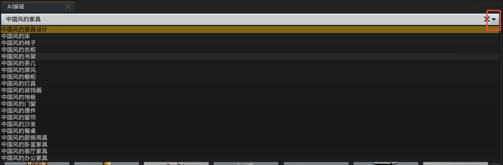

选择需要的联想内容，按回车即可触发搜索：

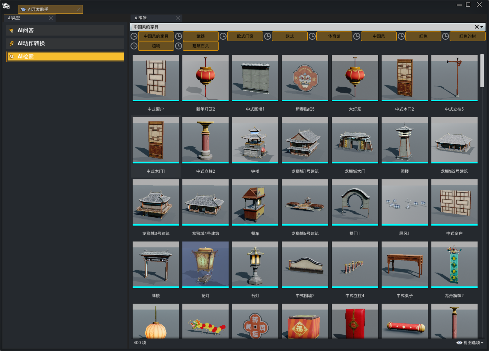

5. 每次搜索都会生成历史，历史保留的数量上限为10，点击历史记录会将关键词填入搜索框，需按回车键确认搜索。

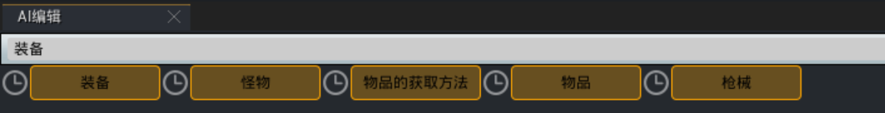

## 收藏夹

可以选择需要的资源拖进收藏夹

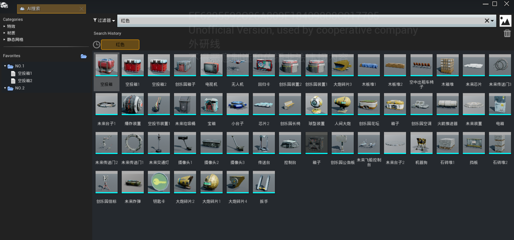

新建和删除文件夹

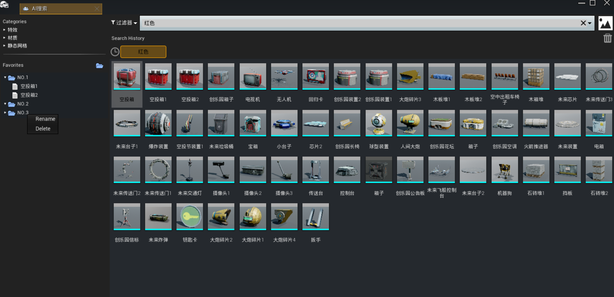

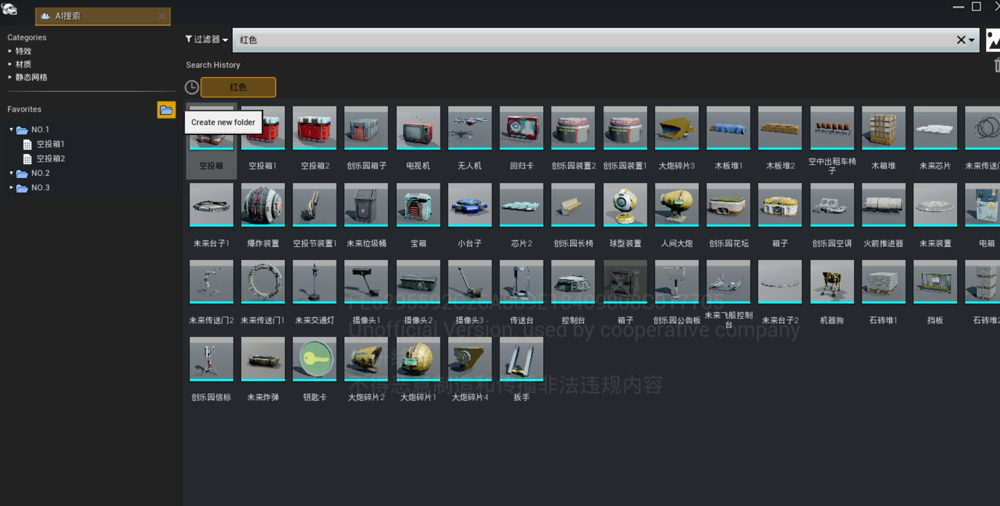

## 过滤器

可根据所需的资产类型进行筛选，以便更快找到目标资源

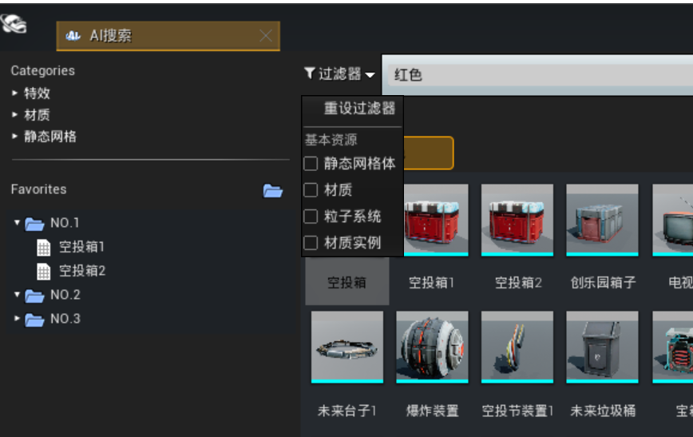

## 图像识别

选择一张图片作为参考，系统将基于图片内容智能检索相似资产
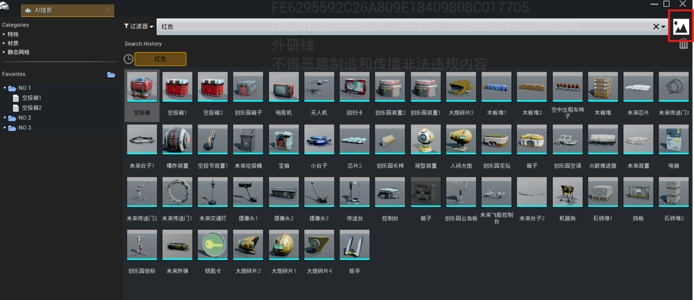
