# AI生成角色

AI生成角色功能允许开发者通过输入关键词并导入风格图片，帮助开发者快速生成可供直接使用的角色模型与外观贴图。

> 目前仅支持生成骨架类型为“主角骨架”的角色，暂不支持其他骨架类型

## 操作步骤

### 生成角色模型

在编辑器主界面的工具栏，点击打开【AI协作】窗口，选择【AI生成角色】进入角色生成界面。

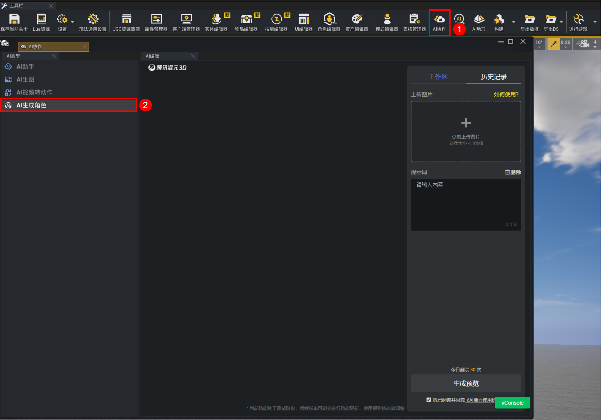

上传风格图并输入提示词后，点击“生成预览”。

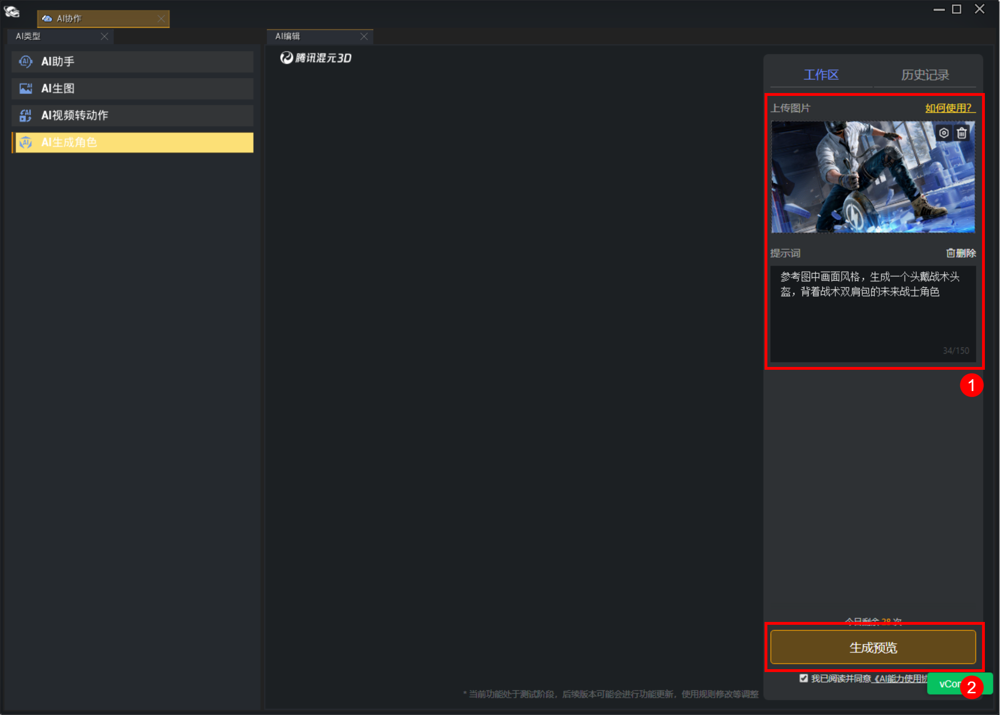

角色模型的生成需要一定时间，可从历史记录查看生成进度，尚未完成的任务会显示“生成模型中”。

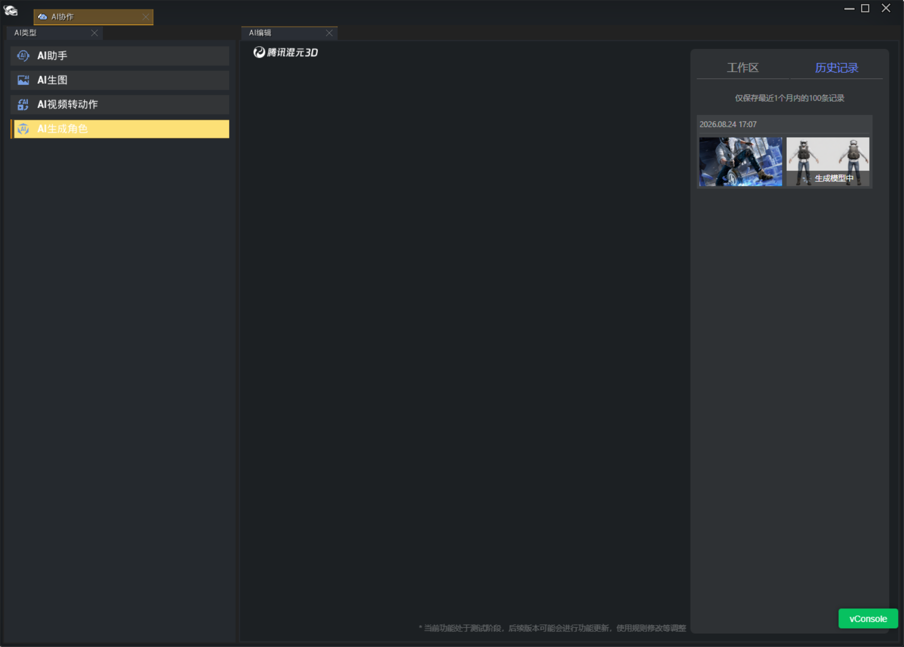

已生成完毕的模型会提示“已生成模型”，选择对应历史记录后点击“下载”即可将角色模型资源保存至本地。

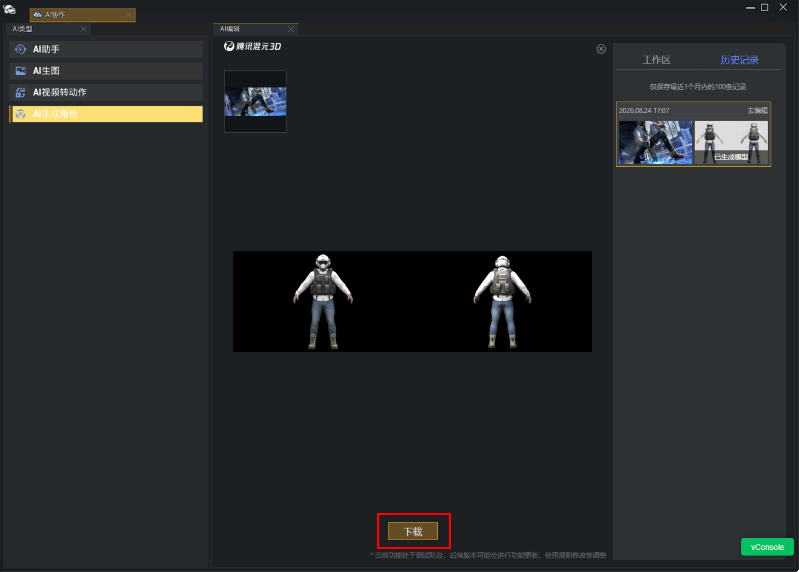

---

### 配置角色模型

首先将先将模型Lod0以及所有纹理贴图导入工程。

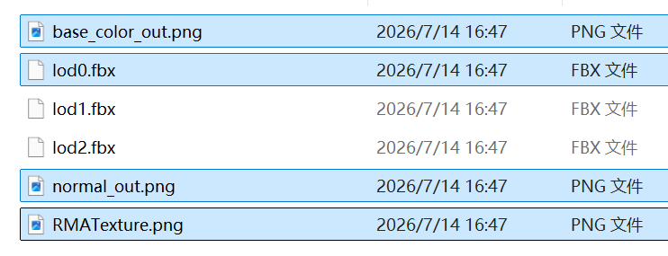
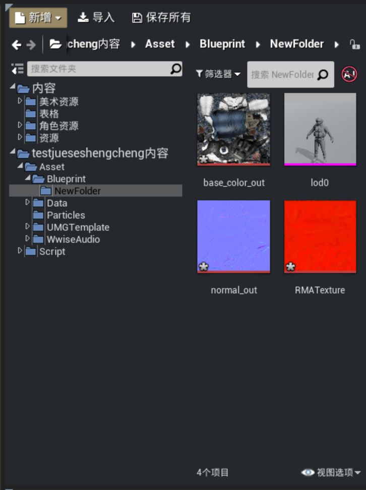

导入模型期间，骨架选择“主角骨架”，勾选【导入动画】，最后点击“导入所有”。

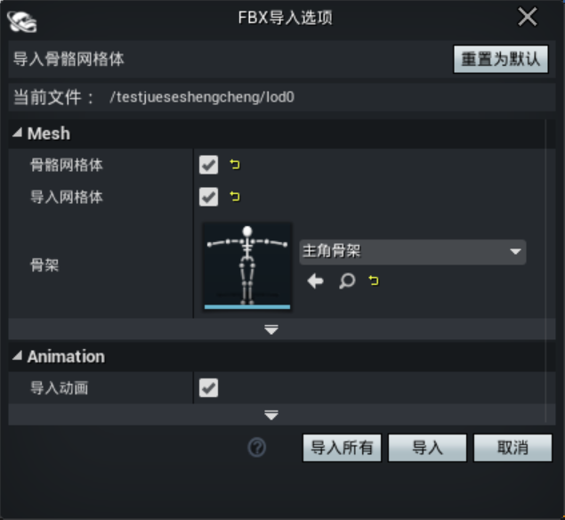

创建一个材质实例，父级选择“通用物件（Spline）”，按下图所示，在对应属性引用对应纹理贴图并保存。

|属性|引用贴图名称|
|:-:|:-:|
|Albedo|base_color_out|
|Normal|normal_out|
|RoughnessMetallicAoEmissive|Baltic_Erangel_road2V_RMA|

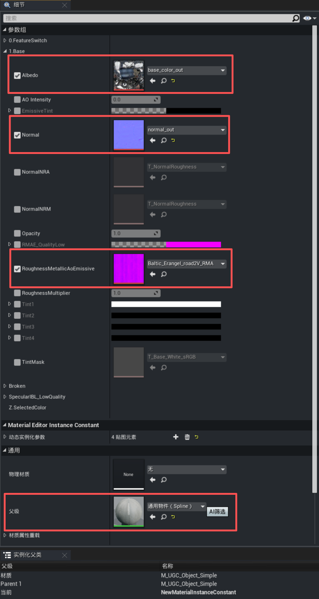

打开模型Lod0并挂载材质实例。

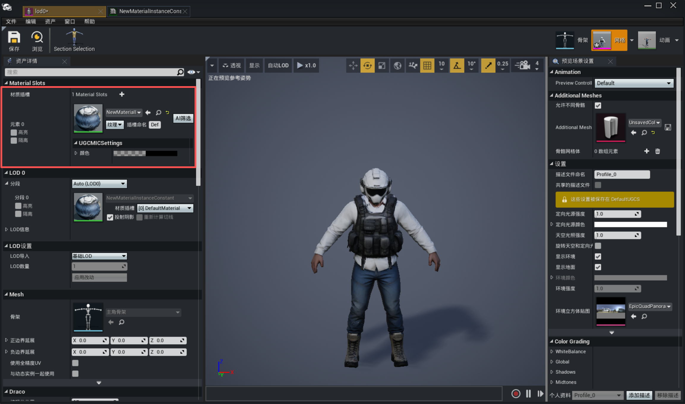

最后从属性【LOD导入】中选择“导入LOD层级 X ”，分别导入模型 Lod1 和 Lod2，完成角色模型的配置。

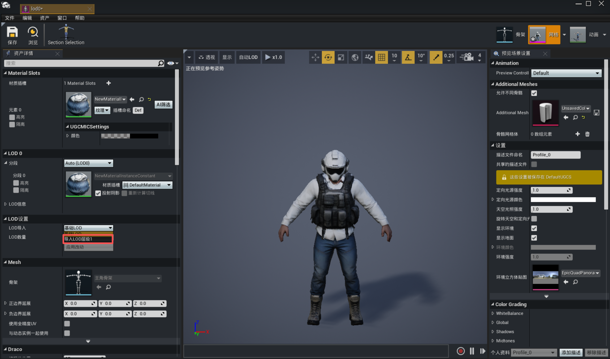

---

### 使用角色模型

以下以替换玩家模型为例，相关代码如下：

``` lua
-- UGCPlayerPawn.lua部分代码

function UGCPlayerPawn:ReceiveBeginPlay()
    UGCPlayerPawn.SuperClass.ReceiveBeginPlay(self)
    -- 设置玩家的LOD模型
    self.timer = Timer.InsertTimer(1, function ()
        UGCPlayerPawnSystem.ChangeAvatarMesh(self, UGCGameSystem.GetUGCResourcesFullPath('Asset/Blueprint/NewFolder/lod0.lod0'),true)
    end)
end
```

最终画面效果如下：

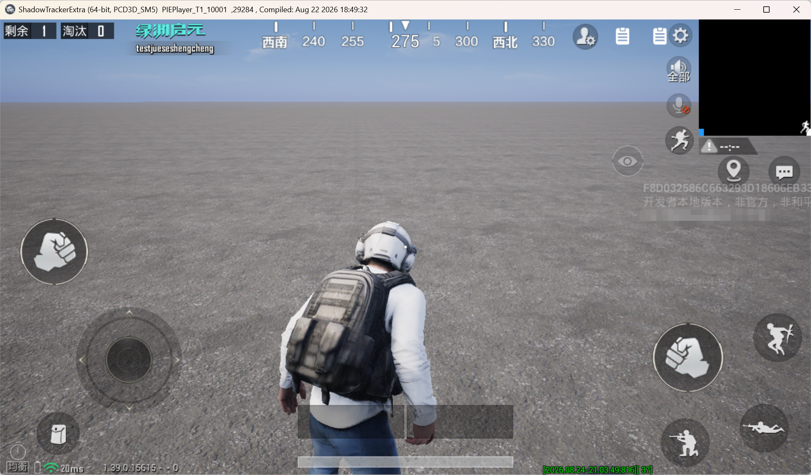
