# 签到模板

签到功能通过奖励机制来增强玩家参与游戏的动力与黏性，是提升玩家活跃度和留存率的有效手段之一，签到模板为开发者提供快速添加签到功能的途径。

## 签到概述

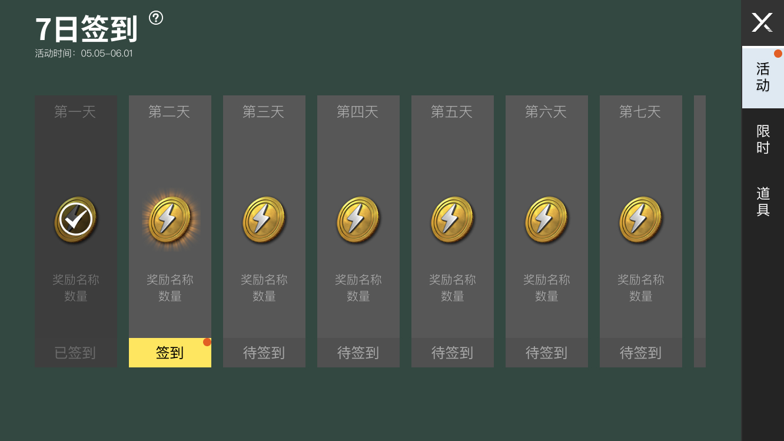

**签到周期**

签到属于一种活动类型，因此需要设定活动的开始时间与结束时间，但是签到周期不一定等同于活动周期，可以将有效的签到时间范围视为活动时间段的子集，未到达或超出活动时间都无法正常签到。

**签到规则**

为了避免玩家刻意追逐高价值奖励、影响活跃与留存的效果，签到的形式统一为累计签到，每天只能签到并领取奖励一次；如果签到中断，下次参与活动按已累计天数顺序继续签到。

**签到类型**

模板支持重置型与非重置型两类签到：

- 非重置型：一次性的签到活动，为了确保通用性，仅提供7天和14天两种模板
- 重置型：支持周签到与月签到
	- 周签到：自然周每周一5:00重置活动与签到进度
	- 月签到：自然月每月1日5:00重置活动与签到进度

**补签规则**

模板支持补签，开发者可以设定允许补签的天数及补签消耗的道具，规则上先签到后补签，即玩家必须完成当天的签到后才能执行补签动作。

## 模板结构

根据设定签到的类型分为一次性签到、周签到和月签到三种模板，玩法内可同时开启多种签到活动，支持按天配置奖励与补签功能。

**【一次性签到模板】**

.png)

**【周签到模板】**

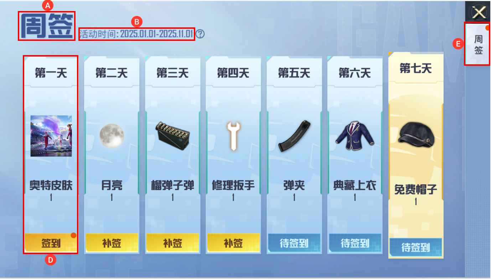

**【月签到模板】**

.png)

**A. 活动名称**

配置签到活动名称，名称限制7个字以内；如果未填写，按以下规则显示：

- 一次性签到：X（7/14）日签到
- 周签到：每周签到
- 月签到：X月签到

**B. 活动起始时间**

配置活动的起始时间，可控制是否外显

**C. 活动说明**

配置签到活动的说明内容

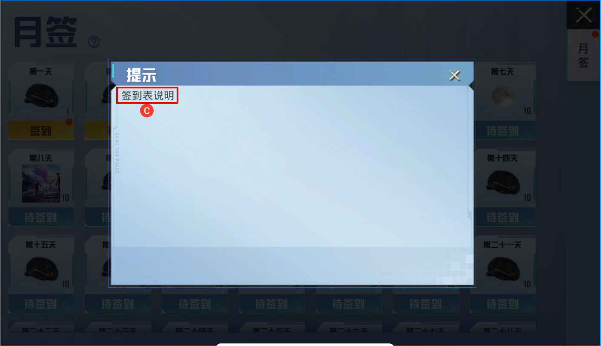

**D. 签到及奖励**

签到区域及对应的物品奖励展示，奖励信息包含物品的icon图、物品名称及物品数量

**E. 活动页签**

签到活动页签tab，可同时存在多种签到活动

**F. 补签道具**

配置补签使用的道具及数量

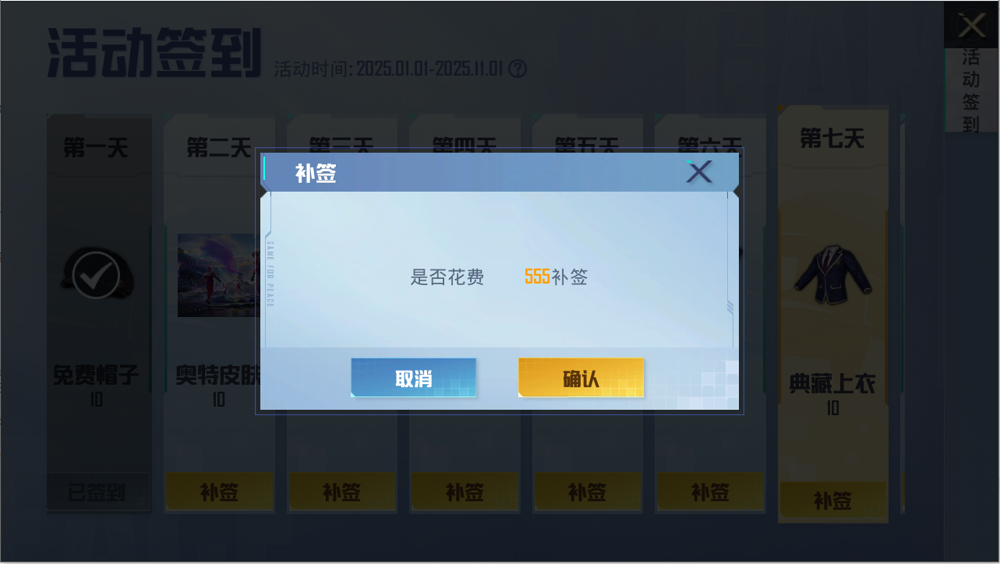

## 下载模板

签到模板通过 [资源商店](../336_资源商店.md) 的形式提供下载，可以在资源商店中搜索“签到模板”找到该模板，点击“下载资源”把模板下载至本地工程。

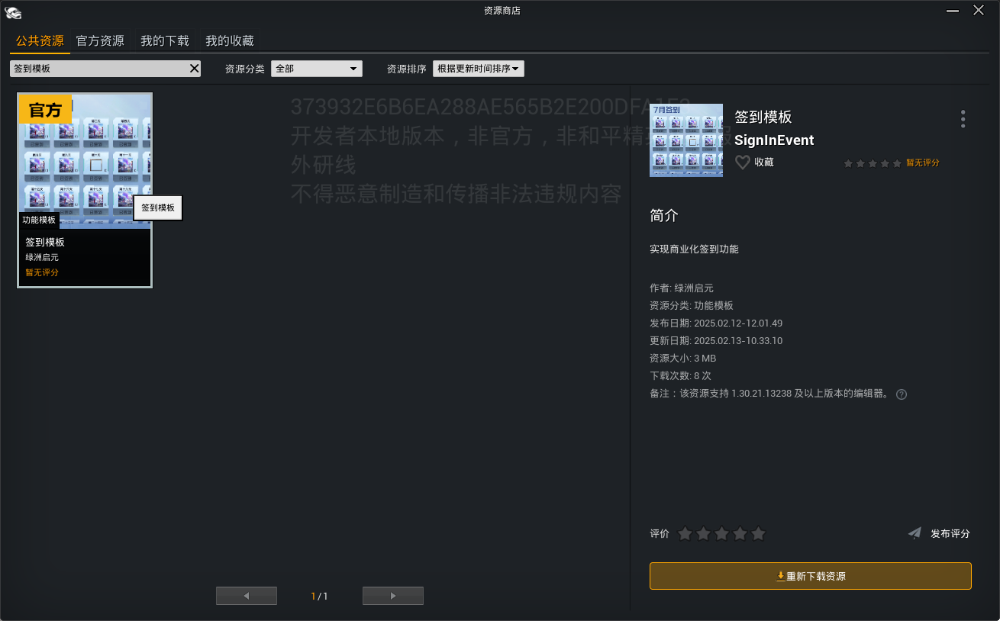

下载后的模板将以 ``ExtendResource`` 资源包的形式追加到工程里，其中 ``SignInEvent/Arts_UI`` 和 ``SignInEvent/Blueprint`` 文件夹内为核心配置资源：

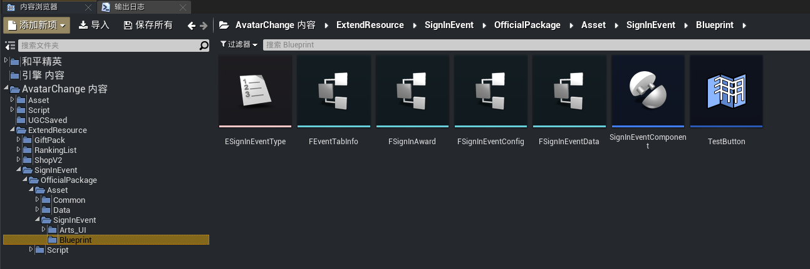

- Arts_UI：UI相关配置的控件类均放置在 ``UIBP`` 子目录下
- Blueprint：签到关联的子组件蓝图存放目录

## 配置依赖

签到功能的运行依赖于 ``SignInEventComponent`` 组件 和 ``Gamepart`` 的特定配置，需要前置将其正确配置好。

### GamePart

签到获取的奖品本质为虚拟物品，而虚拟物品已做了 [GamePart模块化](../通用功能/20090_GamePart模块化.md) 封装，因此需要启用“GP_VirtualItemManager”模块功能。

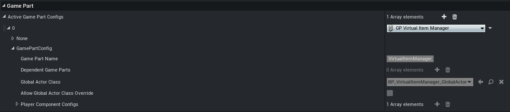

---

### SignInEventComponent

SignInEventComponent组件用于读取签到配置并同步玩家的签到数据，因此需要将其配置在PlayerController上：

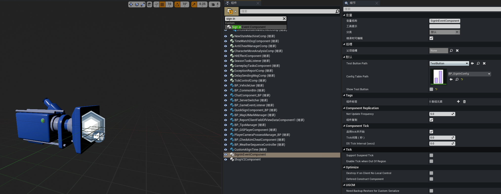

## 签到配置

``SignInEvent_Main_UIBP`` 为签到的主界面控件蓝图，模板结构中各项配置都集中在 ``签到活动表`` 和 ``签到奖励表`` 中。

### 物品表配置

通常把奖励作为签到活跃行为的激励方式，因此需要创建奖励物品，详细的配置方式可参考商业化系统文档中 [物品表配置](./20008_商业化系统.md#物品表（UGCObject）) 部分内容。

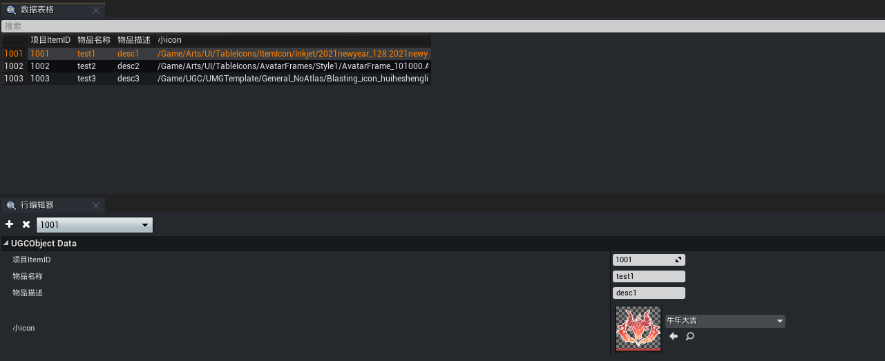

---

### 签到活动表配置

签到活动表决定签到的起始时间、签到的类型及关联奖励，是签到功能的核心数据。

> 创建方式：右键点击 ``各种各样 -> 数据表格 -> FSign in Event Config 结构体``，创建的签到活动表将自动添加到 ``Asset/Data/Table`` 目录下

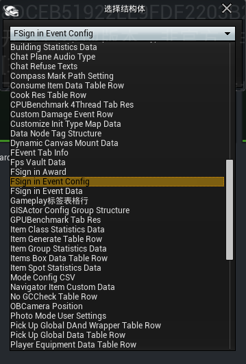

打开签到活动表，插入一条行数据，配置方式如下：

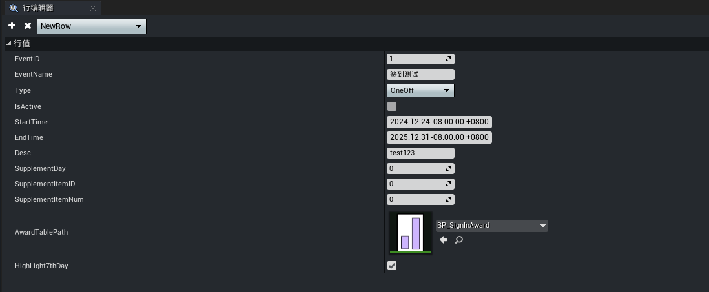

- EventID：签到活动ID，唯一索引
- EventName：签到活动名称，如果不填写则按默认规则显示
- Type：签到活动类型
	- OneOff：一次性（7天/14天）
	- Weekly：周签到
	- Monthly：月签到
- IsActive：活动是否上架生效
- StartTime：活动开始时间
- EndTime：活动结束时间
- Desc：活动说明，如果不填写则隐藏说明按钮
- SupplementDay：可补签的最大天数
- SupplementItemID：补签消耗的物品ID
- SupplementItemNum：单次补签消耗的物品数量
- AwardTablePath：关联的签到奖励表
- HighLight7thDay：是否高亮显示第七天的奖励（仅7天/14天签到活动有效）

---

### 签到奖励表配置

每日签到的奖励信息配置在签到奖励表中，因此该表中的数据行理应与签到周期一致，例如7天签到活动，则配置7行奖励数据。

> 创建方式：右键点击 ``各种各样 -> 数据表格 -> FSign in Award 结构体``，创建的签到奖励表将自动添加到 ``Asset/Data/Table`` 目录下

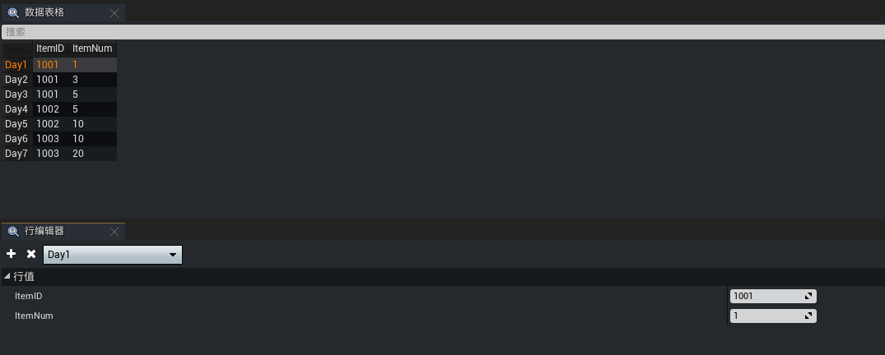

- ItemID：关联 [物品表](./20008_商业化系统.md#物品表（UGCObject）) 的物品ID
- ItemNum：物品数量

模板内预设了7天/14天/月签到奖励表样例，开发者可以将表格复制到 ``Asset/Data/Table`` 目录下配置使用

> 路径：ExtendResource/SignInEvent/OfficialPackage/Asset/Data/Table

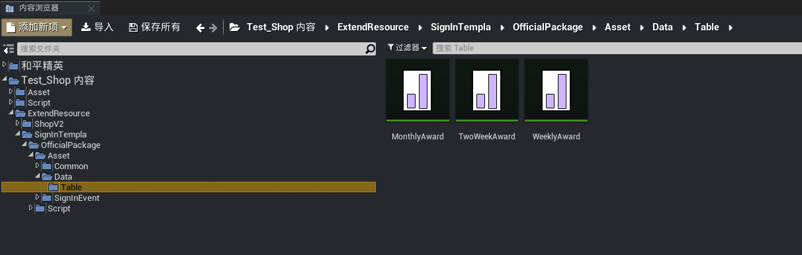

---

### 活动页签配置

签到界面的活动页签在 ``SignInEvent_Main_UIBP`` 控件蓝图中配置，双击打开控件蓝图后，选中层次结构的根节点，在右侧详细信息面板的【默认】分组下存在 ``Tabs`` 数组，每一个数组元素为单页签的配置项：

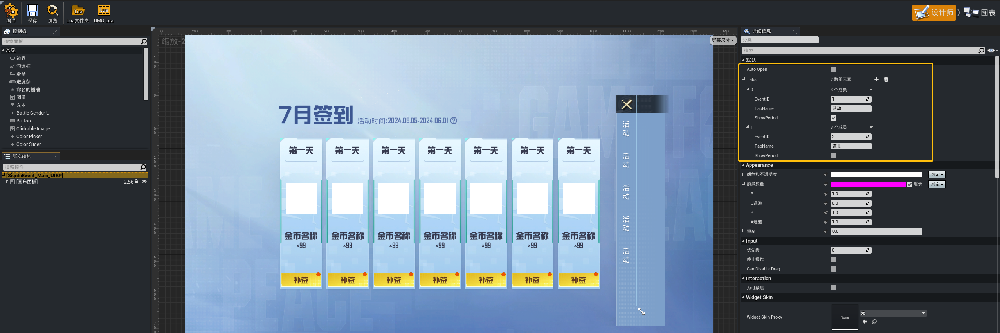

- EventID：签到活动表的活动ID
- TabName：页签的名称
- ShowPeriod：是否外显活动起始时间

---

### PlayerController配置

为了能读取签到的配置及同步数据，``SignInEventComponent`` 组件需要主动关联签到活动表：

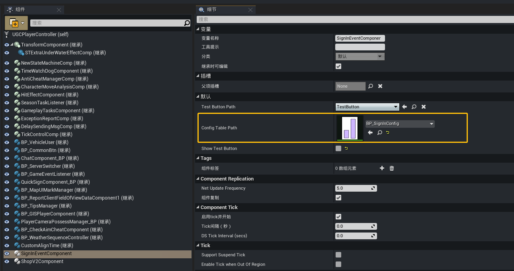

---

### 其他UI配置

开发者可以自定义签到界面的样式，在 ``ArtsUI/UIBP`` 目录下找到并调整目标控件蓝图。

周签到控件蓝图 ```SignInEvent_WeeklyMode_UIBP ```：

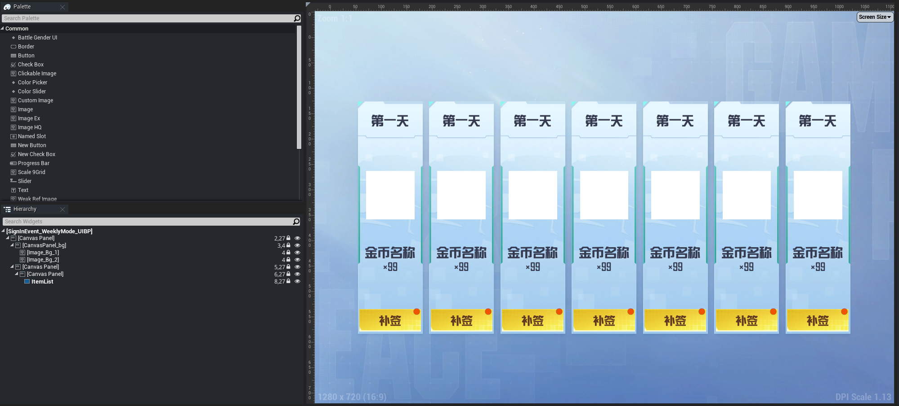

月签到控件蓝图 ```SignInEvent_MonthlyMode_UIBP```：

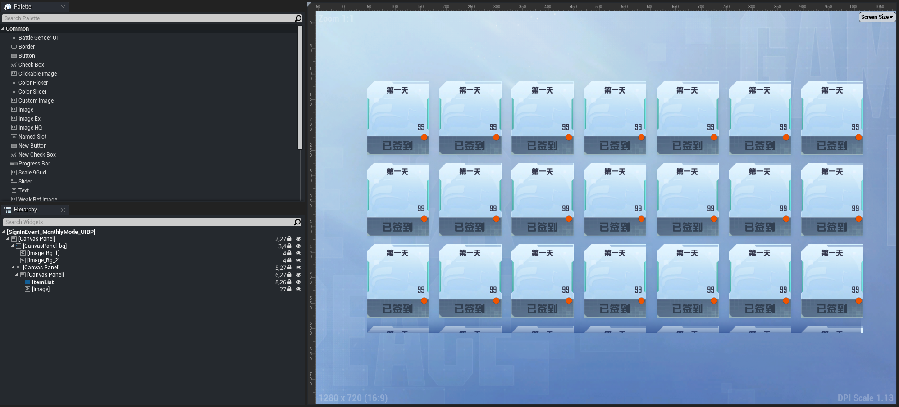

## 签到调试

模板内置了一个简易的调试控件，方便开发者进行功能调试。

> 控件蓝图路径：ExtendResource/SignInEvent/OfficialPackage/Asset/SignInEvent/Blueprint/TestButton

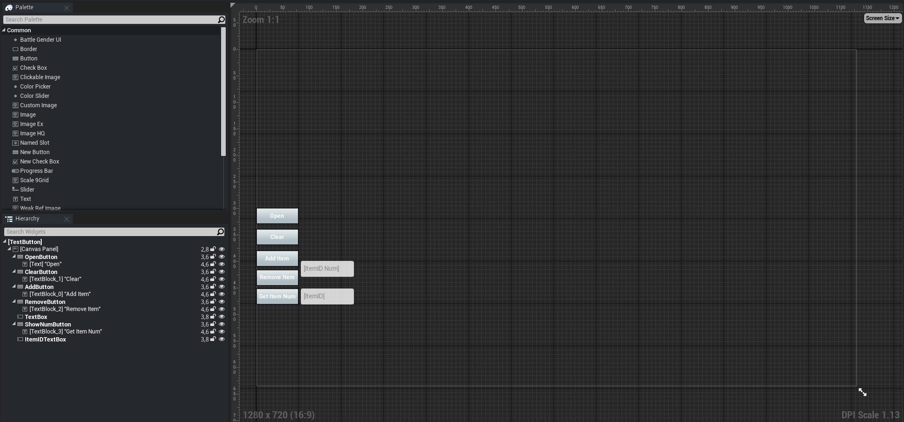

将控件通过 [``AddToViewport``](https://developer.gp.qq.com/api/#/searchContent/UUserWidget?classDetailShow=true&path=class%2Fdetail%2FOthers%2FUUserWidget.json&isSelect=1&apiEnc=%5B%22%E7%B1%BB%22%5D&apiLabel=UUserWidget&autoJump=AddToViewport) 添加到屏幕视口中，启动PIE调试后出现测试UI界面，点击【Open】按钮即打开签到界面，验证签到行为及获取的奖励。

```lua
local PlayerController = STExtraGameplayStatics.GetFirstPlayerController(self);
local SignInMainUIClass = UE.LoadClass(UGCGameSystem.GetUGCResourcesFullPath('ExtendResource/SignInEvent/OfficialPackage/Asset/SignInEvent/Blueprint/TestButton.TestButton_C'));
local SignInMainUI = UserWidget.NewWidgetObjectBP(PlayerController, SignInMainUIClass);
SignInMainUI:AddToViewport(1000);
```

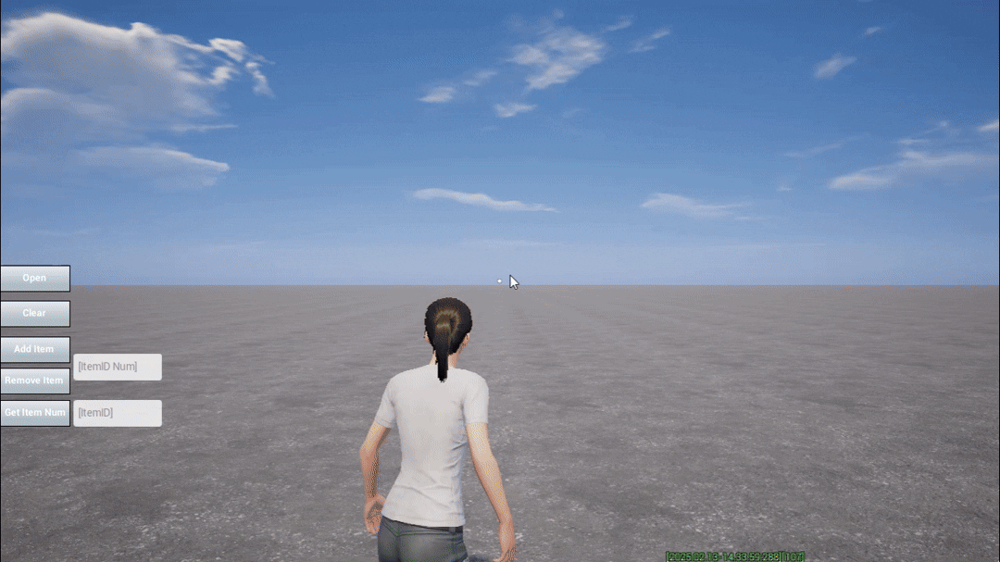

## 注意事项

签到模版使用了 [``存档数据``](../进阶内容/存档/20052_玩家数据存档.md#保存存档) 接口存储签到的记录信息，占用了 “**SignInEvent**” 字段，开发者在业务中需要避免使用该字段名存储自有数据，且执行保存存档前需要确保未覆盖模板产生的数据，以防止数据脏写导致签到数据丢失，在模板的 ``SignInEventComponent`` 脚本中可以看到该部分逻辑。

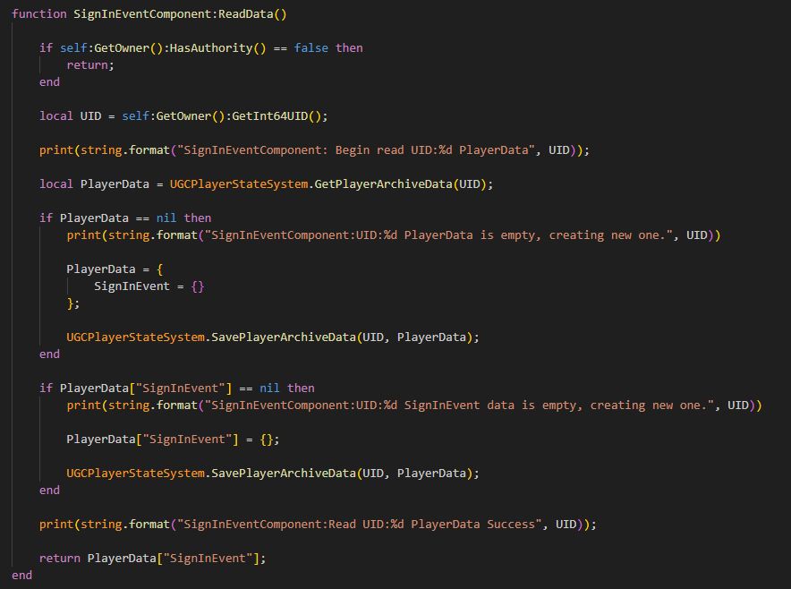

## API参考

签到领取的奖励本质为虚拟物品，可以通过 ``VirtualItemManager`` 提供的功能函数进行管理。

|函数库/类名|函数类型|函数功能范围|
|-|-|-|
|[VirtualItemManager](https://developer.gp.qq.com/api/#/searchContent/VirtualItemManager?classDetailShow=true&path=class%2Fdetail%2F%E5%92%8C%E5%B9%B3%E5%85%A8%E5%B1%80%E6%8E%A5%E5%8F%A3%2F%E5%95%86%E4%B8%9A%E5%8C%96%E4%B8%8E%E5%8A%9F%E8%83%BD%E6%A8%A1%E6%9D%BF%2FVirtualItemManager.json&isSelect=1&apiEnc=%5B%22%E7%B1%BB%22%5D&apiLabel=VirtualItemManager)|对象函数|虚拟物品的添加、删除、查询等数据管理|

模板中提供了部分额外的封装函数可供调用，，需主动引入 ``SignInEventManager`` 类文件：

```lua
UGCGameSystem.UGCRequire("ExtendResource.SignInEvent.OfficialPackage.Script.SignInEvent.SignInEventManager")
```
### **Enums**
#### **ESignInEventType**

签到活动类型

|值|说明|
|-|-|
| Weekly | 周签到 |
| Monthly | 月签到 |
| OneOff | 一次性签到 |

### **Structs**

#### **EventConfigData**

签到活动配置信息

| 字段               | 数据类型 | 说明                             |
|--------------------|----------|-------------------------------|
|EventID             |             number          |   签到活动ID                         |
|EventName         |            string           |  签到活动名称                       |
| Type        | ESignInEventType| 签到活动类型 |
| IsActive       | boolean  | 是否上架                     |
| StartTime     | 	FDateTime   | 活动开始时间                     |
|  EndTime        | 	FDateTime   | 活动结束时间                    |
| Desc   |           string           | 活动说明                     |
| SupplementDay     |             number                 | 最多补签天数 |
|  SupplementItemID      |             number              | 补签消耗道具ID |
| SupplementItemNum       |             number               | 补签消耗道具数量                   |
| HighLight7thDay        | boolean   | 是否七天高亮 |

### **Functions**

#### **OpenMainUI**

打开签到面板

```lua
-- 生效范围：客户端
function SignInEventManager:OpenMainUI()
end
```

---

#### **CloseMainUI**

关闭签到面板

```lua
-- 生效范围：客户端
function SignInEventManager:CloseMainUI()
end
```

---

#### **GetEventConfigData**

获取签到活动配置信息

```lua
-- 生效范围：客户端&&服务端
-- @param EventID number 签到活动ID
function SignInEventManager:GetEventConfigData(EventID):EventConfigData
end
```

---

#### **GetEventDayNum**

获取累计签到的天数

```lua
-- 生效范围：客户端&&服务端
-- @param EventID number 签到活动ID
-- @param PlayerController UGCPlayerController 玩家控制器
function SignInEventManager:GetEventDayNum(EventID, PlayerController):number
end
```
