# 通行证模板

通行证模板提供了一套完整的赛季制玩家成长系统解决方案，模板内预置了基础通行证和高级通行证双轨奖励体系，并包含商品购买、等级奖励、挑战任务等核心功能，帮助开发者快速构建通行证系统。

## 下载模板

通行证模板通过 [资源商店](../336_资源商店.md) 的形式提供下载，可以在资源商店中搜索“通行证模板”并点击下载该模板资源。

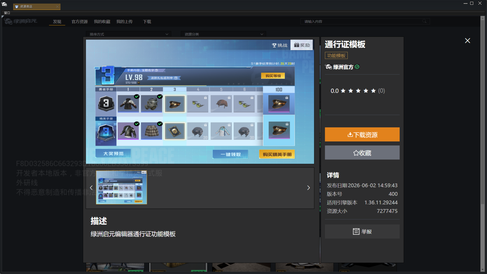

在内容浏览器中点击导入“pass”，将通行证模板导入当前工程内。

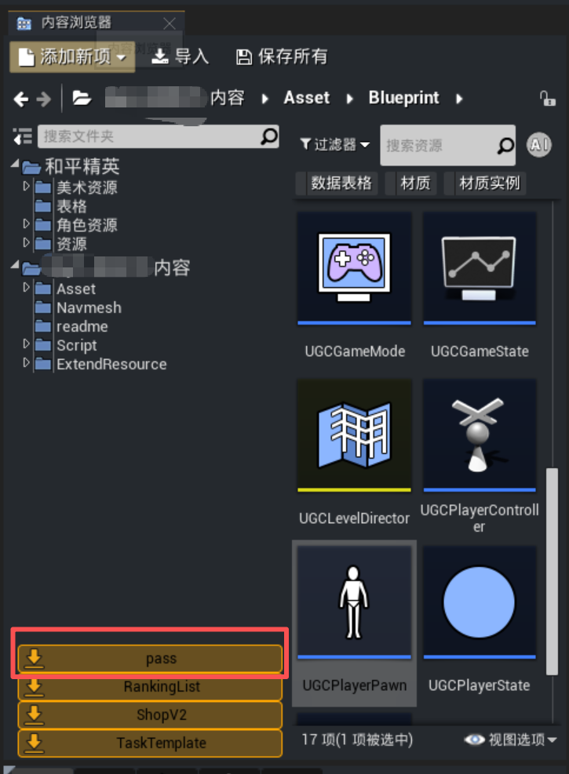

## 配置依赖

### GamePart

在编辑器主界面的工具栏，点击进入【玩法通用设置】。


点击【Active Game Part Configs】右侧的加号，添加并选择需要启用的GamePart模块。

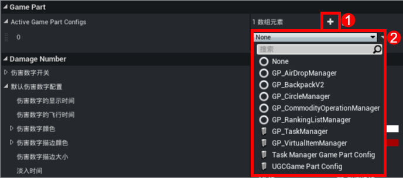

通行证模板存在通行证经验、等级奖励等虚拟物品，需要启用 ``GP_VirtualItemManager`` 模块。

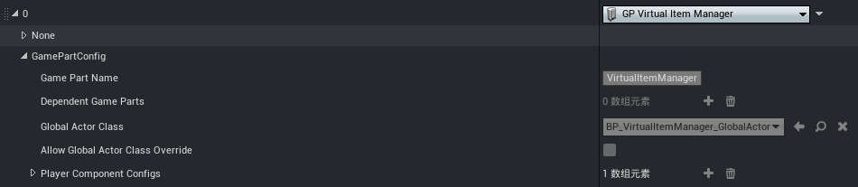

通行证模板中涉及高级通行证的购买等物品交易流程，需要启用 ``GP_CommodityOperationManager`` 模块。

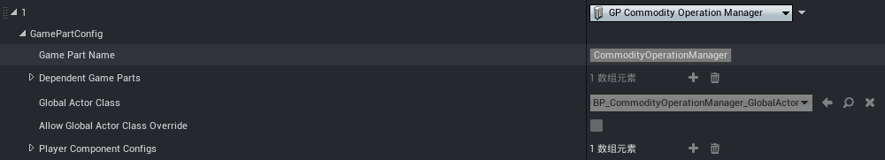

通行证模板存在挑战任务以及任务线，需要启用 ``GP_TaskManager`` 模块，在该模块配置任务和任务线。

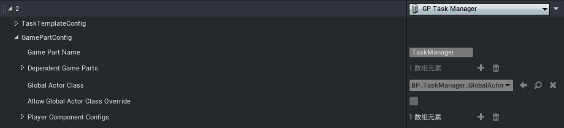

---

### PassComponent

``PassComponent`` 组件用于管理与处理通行证的配置和逻辑，需要将通行证内容配置表（以FPassConfig命名的表格）绑定到该组件。

> PassComponent组件位置：ExtendResource/Pass/OfficialPackage/Asset/Pass/Blueprints/PassComponent

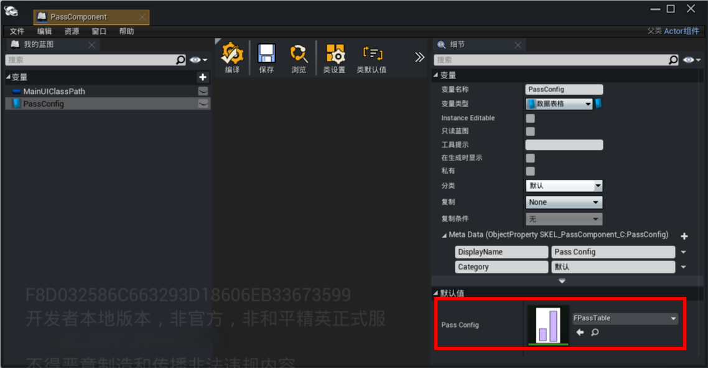

并且需要将 ``PassComponent`` 组件配置在 ``UGCPlayerController`` 上，搜索“Pass Component”并添加。

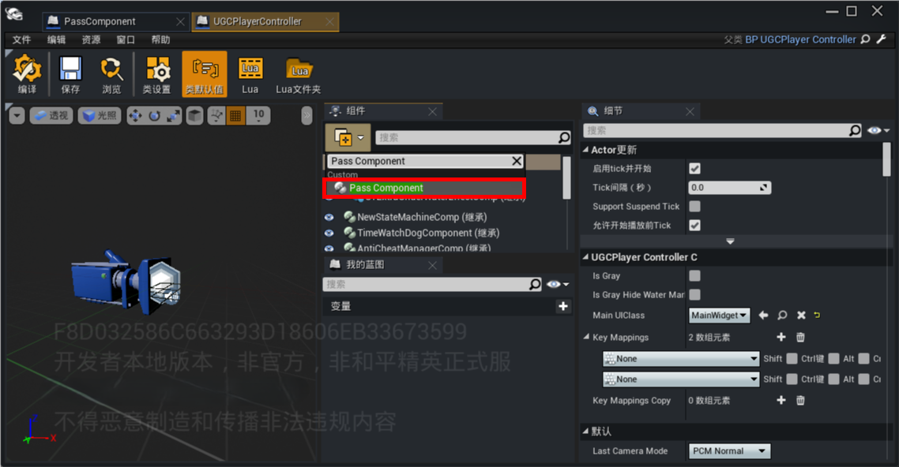

---

### 配置表

在路径 ``Asset/Data/Table`` 中右键创建表格。

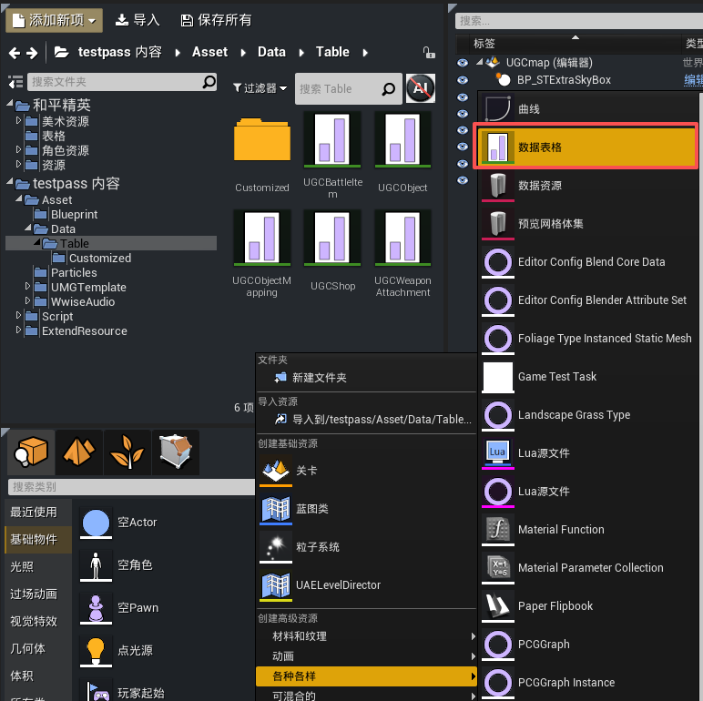

需创建三个配置表格，表格与结构体的对应关系为：通行证奖励配置表（FPassAwardConfig）、通行证内容配置表（FPassConfig）、通行证挑战任务配置表（FPassTaskConfig）。

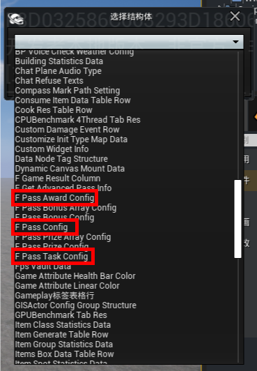
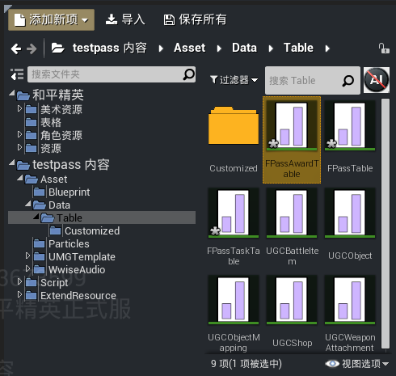

## 模板结构

通行证是一个通过提升等级来获取奖励的赛季性系统，玩家可以通过购买玩法手册获得通行证，玩法手册与通行证有以下具体类型：

- 玩法手册类型：
	- 基础手册：免费获得，仅包含基础通行证
	- 勇者手册：付费获得，包含高级通行证
	- 精英手册：付费获得，包含高级通行证及附赠奖励，附赠奖励可包含虚拟物品、特殊加成等，获取附赠奖励的逻辑需开发者自行实现
- 通行证类型：
	- 基础通行证：玩家默认拥有，提供基础等级奖励
	- 高级通行证：提供更丰厚的等级奖励，需通过购买勇者手册或精英手册获得

通行证包含奖励页和挑战页共两个主要界面，奖励页的界面如下：

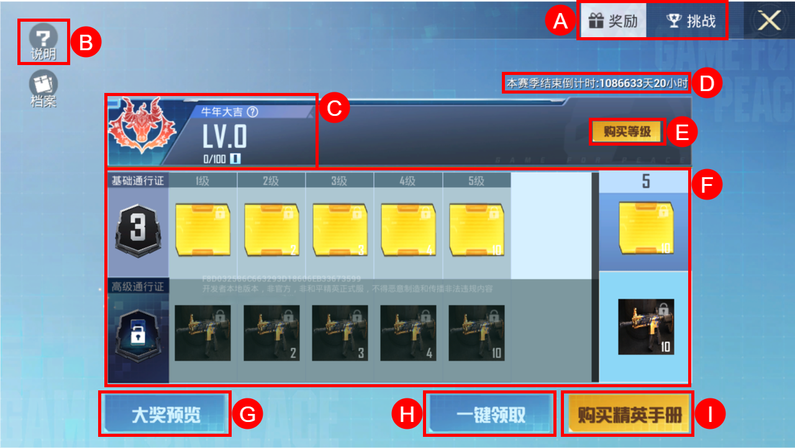

挑战页的界面如下：

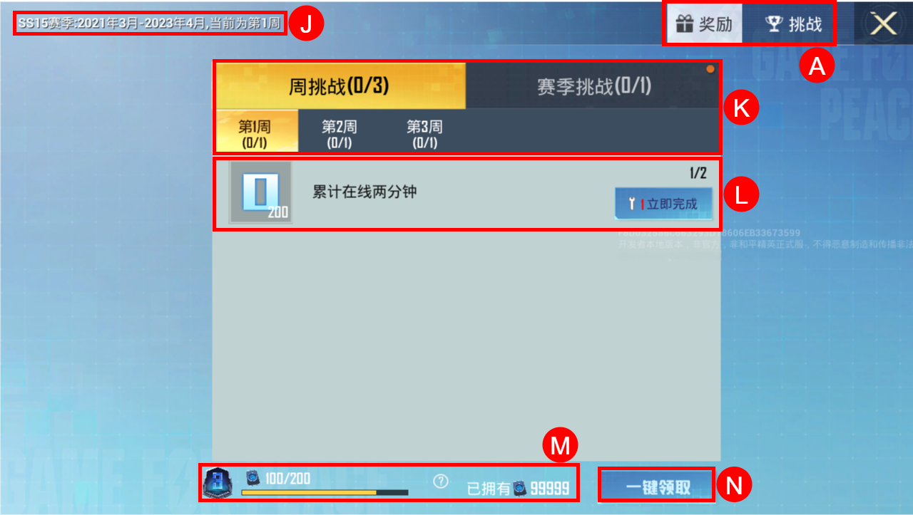

界面中各部分说明如下：

|序号|组件名称|功能说明|
|:-:|:-:|-|
|A|页面切换标签|可选择切换至奖励页或挑战页|
|B|通行证说明入口|点击弹出通行证规则说明窗口<br>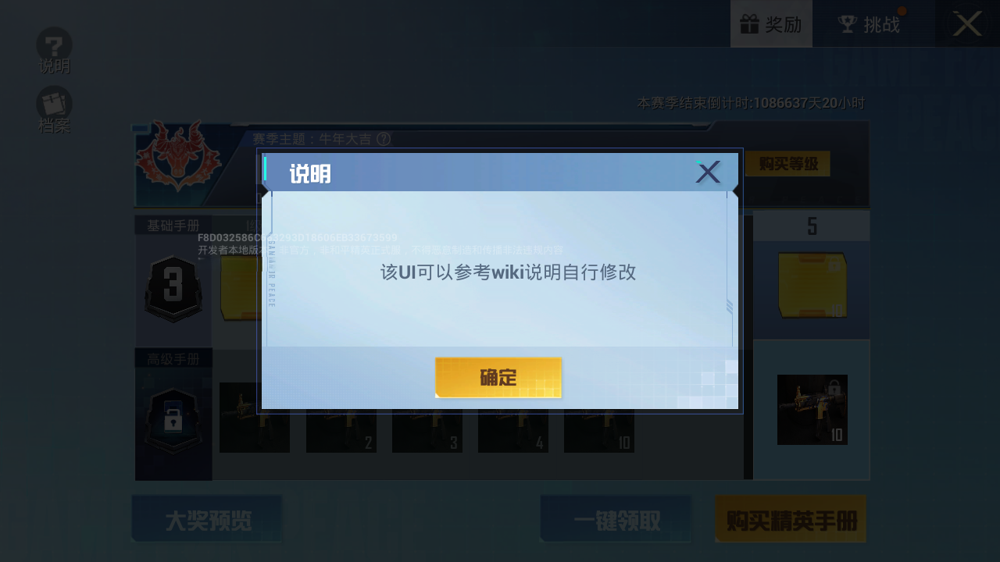|
|C|赛季及通行证等级信息|显示当前赛季的图标和名称以及通行证的等级和经验值|
|D|赛季结束倒计时|显示当前赛季剩余时间|
|E|购买等级入口|点击后会进入提升通行证等级的窗口<br>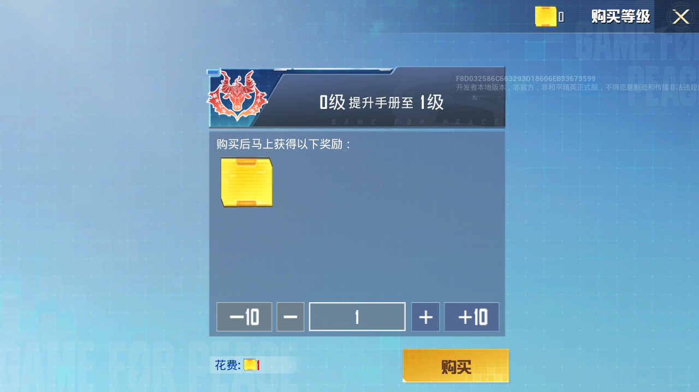|
|F|通行证奖励|并排展示基础通行证和高级通行证的名称、图标以及在各等级的奖励|
|G|大奖预览入口|点击后进入大奖预览窗口，预览本赛季各手册可获得的奖励<br>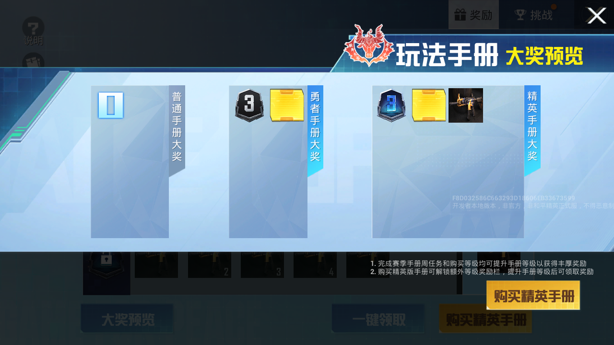|
|H|一键领取按钮|点击可一次性领取所有可领取的等级奖励|
|I|购买精英手册入口|若玩家未拥有高级通行证，可点击进入购买高级手册<br>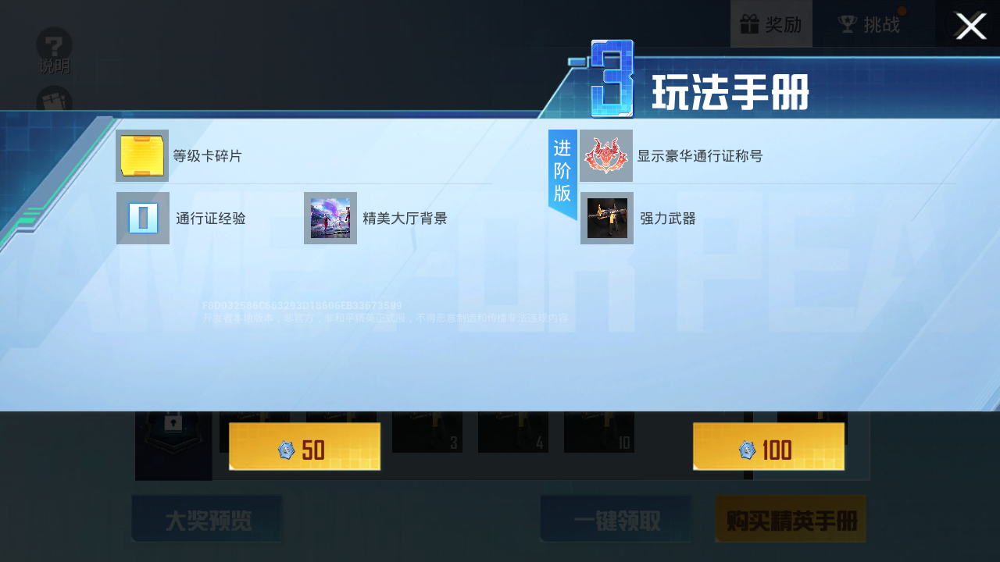|
|J|赛季时间信息|显示本赛季的起止日期，以及当前日期处于赛季的第几周|
|K|挑战类型筛选栏|用于筛选查看周挑战、赛季挑战等不同分类的任务|
|L|挑战任务信息|显示挑战任务的奖励、说明、完成进度和操作按钮|
|M|现有经验值|显示本赛季已获得的总经验值|
|N|一键领取|点击后一次性领取所有已完成但未领取的挑战奖励|

## 通行证配置

### 物品配置

在编辑器主界面的工具栏，点击进入【表格管理器】。

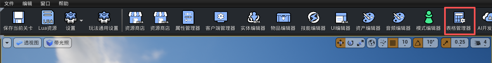

【类型】选择“功能表格”，双击打开表格 ``UGCObject（物品表）`` 。

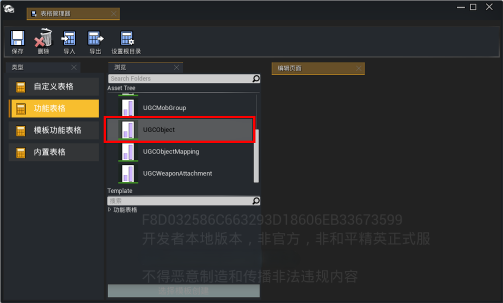

点击加号添加行，输入物品信息，通行证、任务卡、任务奖励、通行证经验等均属于虚拟物品，都需要在此进行配置。

> 关于物品表的完整配置说明，详见 [物品表（UGCObject）](./20008_商业化系统.md#物品表（UGCObject）)

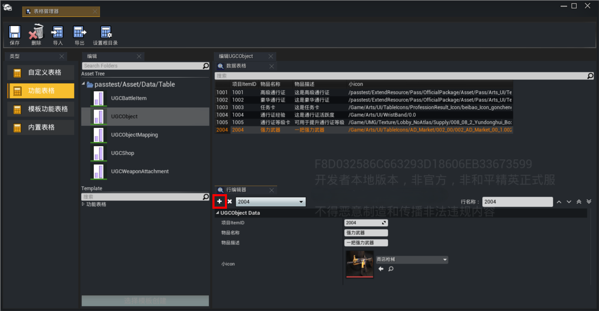

---

### 商品配置

进入【表格管理器】，【类型】选择“功能表格”，双击打开表格 ``UGCShop（商品表）`` ，若未创建，则在下方选择“商品表”进行表格创建。

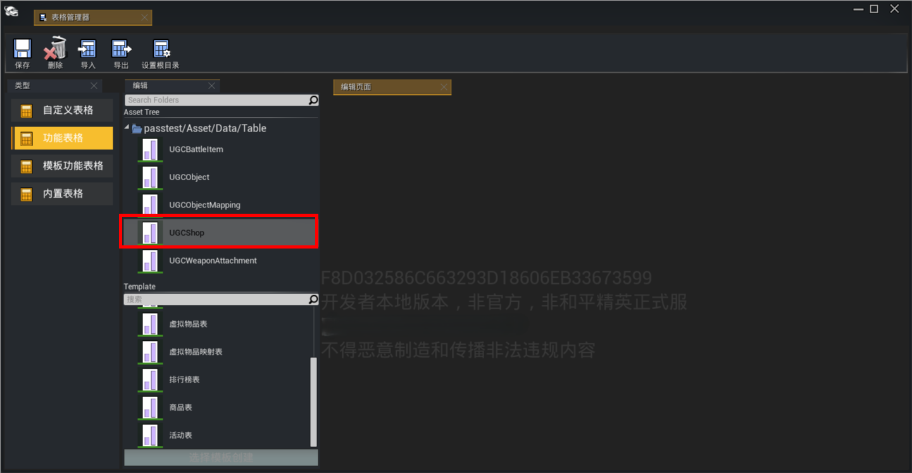

点击加号添加行，并输入商品信息，通行证、任务卡均可在游戏内购买获得，都需要在商品表配置并绑定对应的虚拟物品。

> 关于商品表的完整配置说明，详见 [商品表（UGCShop）](./20008_商业化系统.md#商品表（UGCShop）)

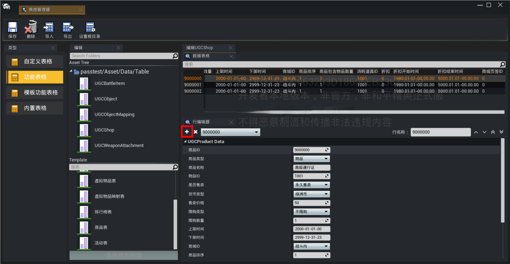

---

### 界面配置

#### 高级手册购买界面配置

打开控件蓝图 ``UGCPass_BuyElite_UIBP`` ，【层次结构】选中根节点 ``UGCPass_BuyElite_UIBP`` ，从【详细信息】中找到【Bonus】属性组进行配置。

> 控件蓝图UGCPass_BuyElite_UIBP位置： ``ExtendResource/Pass/OfficialPackage/Asset/Pass/Arts_UI/UIBP/UGCPass_BuyElite_UIBP``

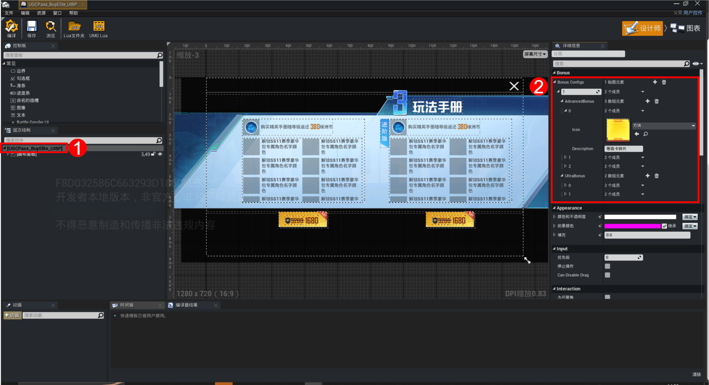

在【Bonus Config】中，每个贴图元素对应一个赛季通行证的显示内容，可配置的属性及说明如下：

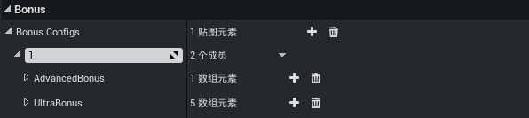

|属性名称|说明|
|:-:|-|
|元素序号|填入通行证内容配置表中对应的【PassID】|
|AdvancedBonus|勇者手册的奖励展示列表|
|UltraBonus|精英手册的奖励展示列表|

以上展示列表中，每个数组元素对应一项奖励展示，序号0的元素单独显示在第一行，其余元素按顺序每行显示两项，每一项的数组元素的配置说明如下：

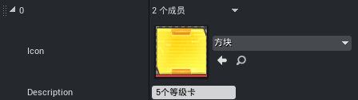

|属性名称|说明|
|:-:|-|
|lcon|该奖励项显示的图标|
|Description|该奖励项的文本描述|

---

#### 高级通行证解锁界面配置

当玩家购买勇者手册或精英手册后，会触发解锁高级通行证的弹窗提示。

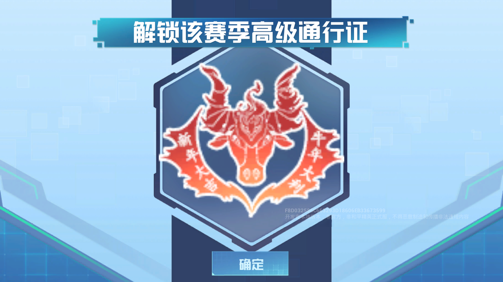

若需要对该弹窗进行配置，首先打开控件蓝图 ``UGCPass_Upgrade_UIBP`` ，【层次结构】选中根节点 ``UGCPass_Upgrade_UIBP`` ，从【详细信息】中找到【Config】属性组进行配置。

> 控件蓝图UGCPass_Upgrade_UIBP位置： ``ExtendResource/Pass/OfficialPackage/Asset/Pass/Arts_UI/UIBP/UGCPass_Upgrade_UIBP``

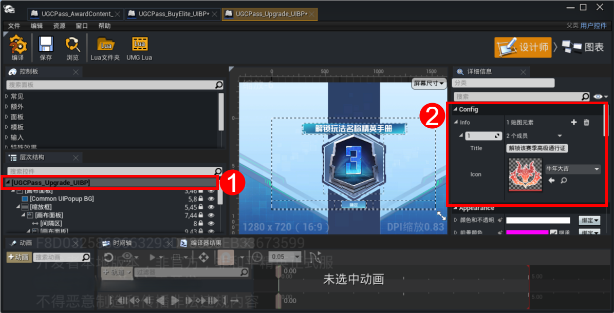

在【Info】中，每个贴图元素对应一个赛季通行证的显示内容，可配置的属性及说明如下：

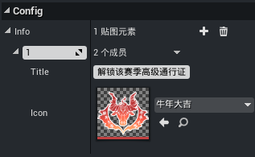

|属性名称|说明|
|:-:|-|
|元素序号|填入通行证内容配置表中对应的【PassID】|
|Title|弹窗中部显示的主标题文本|
|Icon|弹窗中部显示的标志性图标|

---

#### 大奖预览界面配置

打开控件蓝图 ``UGCPass_Prize_UIBP`` ，【层次结构】选中根节点 ``UGCPass_Prize_UIBP`` ，从【详细信息】中找到【Config】属性组进行配置。

> 控件蓝图UGCPass_BuyElite_UIBP位置： ``ExtendResource/Pass/OfficialPackage/Asset/Pass/Arts_UI/UIBP/UGCPass_Prize_UIBP``

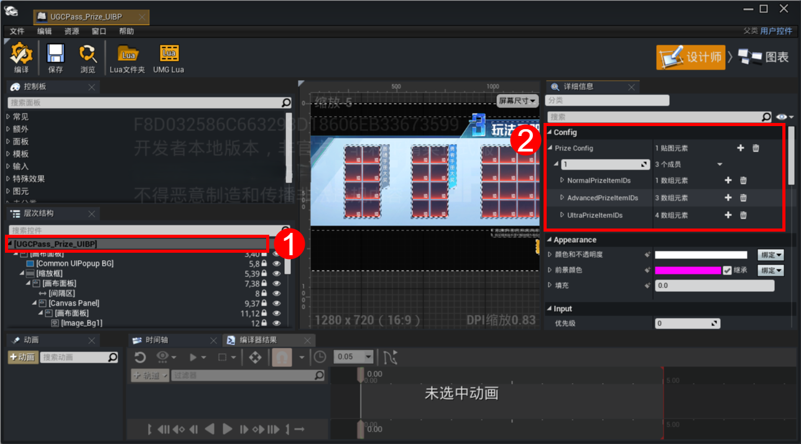

在【Config】中，每个贴图元素对应一个赛季通行证的显示内容，可配置的属性及说明如下：

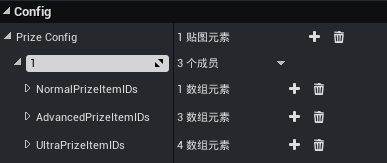

|属性名称|说明|
|:-:|-|
|元素序号|填入通行证内容配置表中对应的【PassID】|
|NormalPrizeItemIDs|普通手册的大奖展示列表|
|AdvancedPrizeItemIDs|勇者手册的大奖展示列表|
|UltraPrizeItemIDs|精英手册的大奖展示列表|

以上展示列表中，每个数组元素对应一项展示的奖励，每一项的数组元素的配置说明如下：

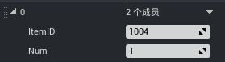

|属性名称|说明|
|:-:|-|
|ItemID|奖励物品ID，对应 ``UGCObject`` 表格中的【项目ItemID】，对应物品的图标会显示在界面中|
|Num|奖励的数量，显示在物品图标的右下角|

---

#### 提示说明窗口配置

通行证模板中包含多个提示说明入口，如需修改提示说明的内容，请按以下步骤操作。

首先找到并打开对应控件蓝图的Lua脚本文件。

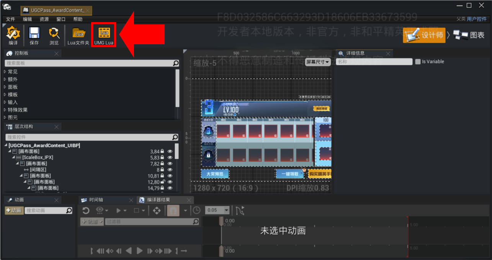

在Lua脚本中，找到该按钮在OnClicked事件上绑定的方法，根据需求，按顺序修改方法中指定的弹窗标题、说明内容以及按钮文字。

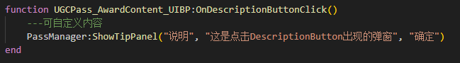
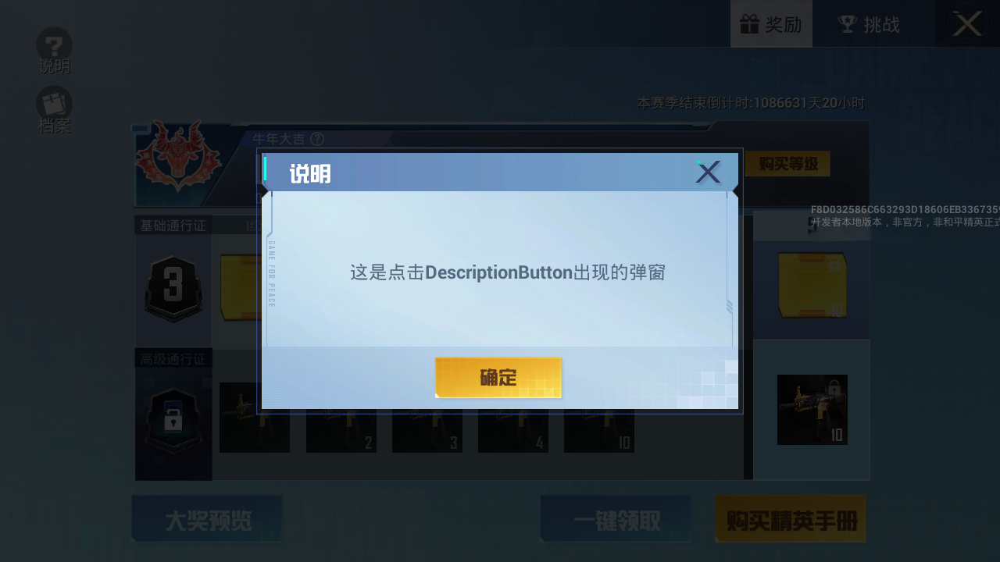

各入口对应的配置信息如下：

|说明入口|控件蓝图|控件名|OnClicked绑定方法|
|:-:|:-:|:-:|:-:|
|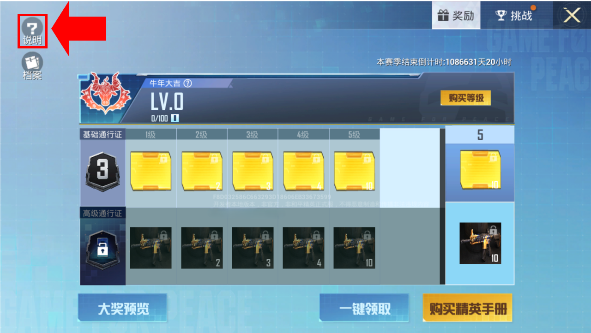|UGCPass_AwardContent_UIBP|DescriptionButton|OnDescriptionButtonClick|
|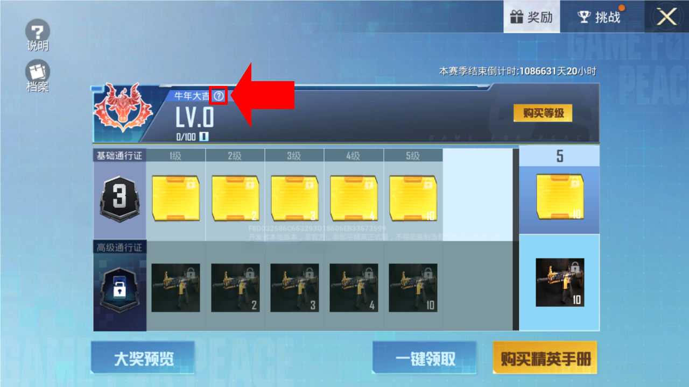|UGCPass_AwardContent_UIBP|RuleButton|OnRuleButtonClick|
|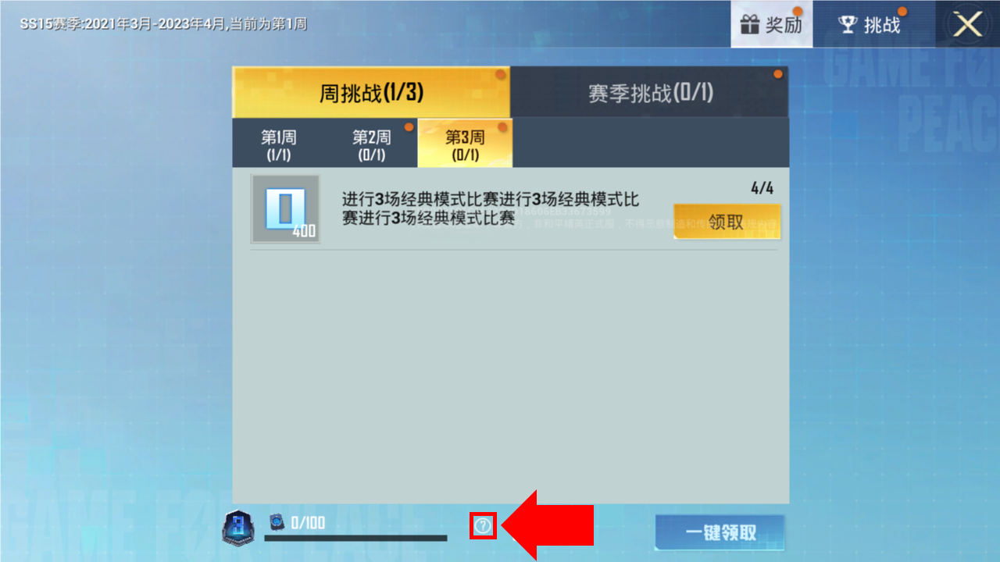|UGCPass_Task_UIBP|DescriptionButton|OnDescriptionClick|

---

### 挑战配置

通行证的挑战模块的本质为任务模块，其中包括挑战任务、挑战任务线和挑战任务配置表。

#### 挑战任务配置

在编辑器主界面的工具栏，点击进入【玩法通用设置】。

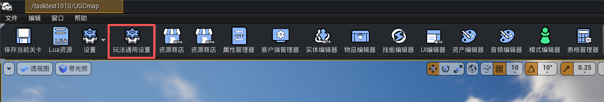

在GamePart的 ``GP_TaskManager`` 模块，点击【Task Config List】旁的加号，添加并设计新的任务。

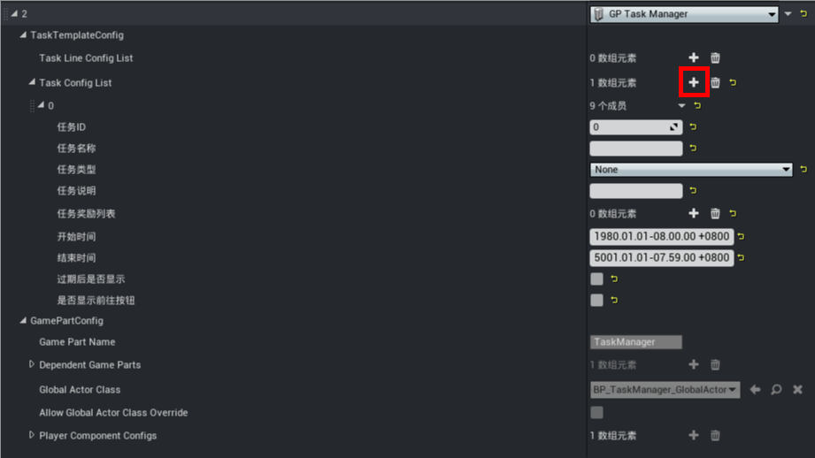

> 关于任务的完整配置说明，详见 [任务模板-任务配置](./20237_任务模板.md#任务配置)

---

#### 挑战任务线配置

在GamePart的 ``GP_TaskManager`` 模块，点击【Task Line Config List】旁的加号，添加一个新的任务线。

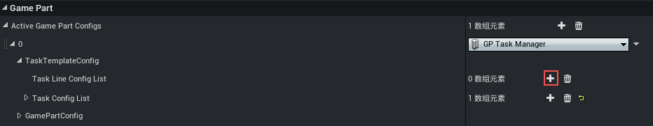

挑战任务线的本质为一个活跃型任务线，【任务线类型】必须选择“活跃型”。

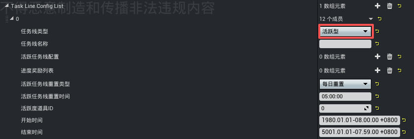

任务线的配置项以及说明如下：

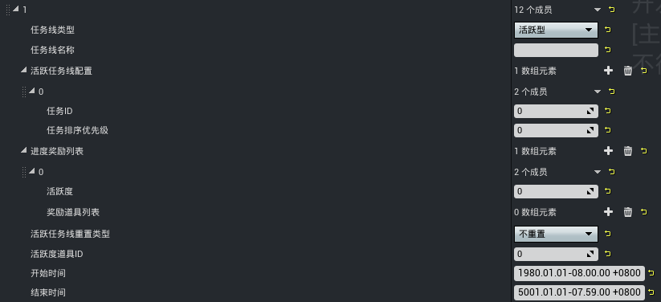

|属性名称|说明|
|:-:|-|
|任务线名称|该通行证任务线的唯一标识名称|
|活跃任务线配置|定义任务线中所包含的任务，每个数组元素对应一个任务，需配置其任务的【任务ID】和【任务排序优先级】|
|任务ID|在【活跃任务线配置】中对应的任务ID，需填入任务配置中对应的【任务ID】|
|任务排序优先级|在【活跃任务线配置】中设定，用于控制对应任务在界面列表中的显示位置，数值越小，位置越靠前。|
|进度奖励列表|通行证的等级列表，每个数组元素对应一个通行证等级，等级按数组索引顺序递增|
|活跃度|在【进度奖励列表】中设定，在此表示达到对应通行证等级所需的总经验值|
|奖励道具列表|在【进度奖励列表】中设定，配置通行证任务线时，此项必须保持为空|
|活跃任务线重置类型|设定任务线的重置方式，配置通行证任务线时，必须选择"不重置"|
|活跃度道具ID|用于计算通行证经验值的道具ID，该道具的累积数量即为经验值，需填入表格 ``UGCObject`` 中对应的的【项目ItemID】|
|开始时间|通行证的起始时间，在此时间之前，该赛季关闭|
|结束时间|通行证的截止时间，在此时间之后，该赛季关闭|

#### 通行证挑战任务配置表

通行证挑战任务配置表用于定义通行证界面中挑战任务的显示规则（如解锁周数、快速完成消耗等），只有在表中配置的任务才会在通行证界面中显示，打开表格后点击加号添加行后即可配置。

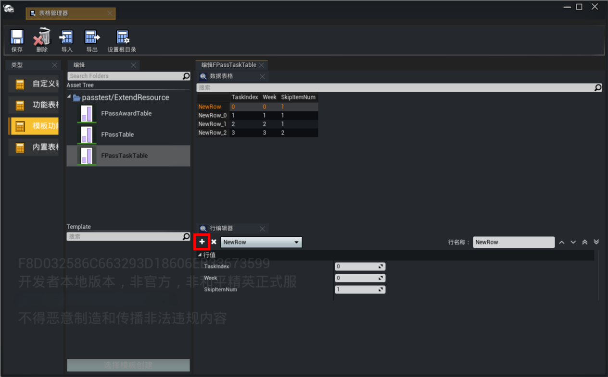

配置项说明如下：

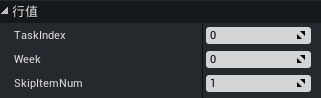

|属性名称|说明|
|:-:|-|
|TaskIndex|任务序号，需填入【活跃任务线配置】的数组索引序号|
|Week|任务解锁的周数，以通行证开始时间作为第一周，如果设置为0，则该任务作为赛季任务|
|SkipItemNum|快速完成该任务所需要消耗的任务卡道具数量|

---

### 奖励配置

通行证奖励配置表用于定义每个通行证等级下，基础通行证和高级通行证分别可领取的奖励内容，表格中的每一行代表一个特定等级的奖励配置，点击加号添加行后即可配置。

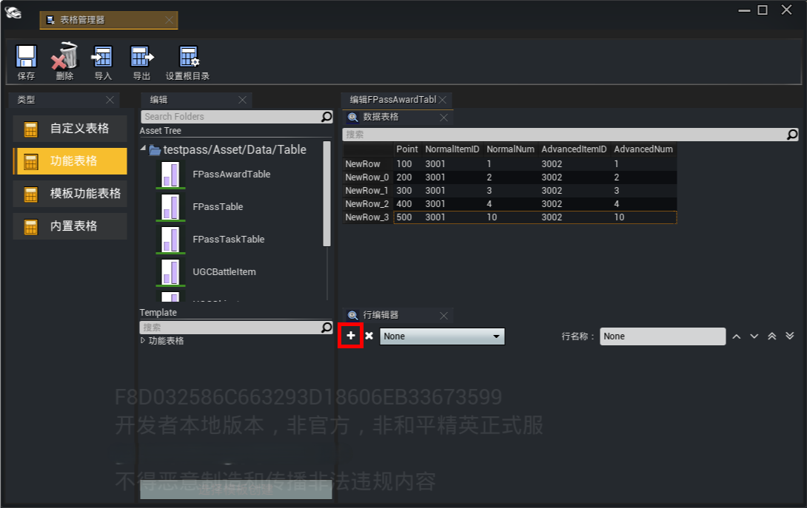

通行证奖励的配置项及说明如下：

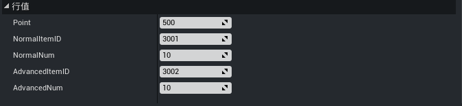

|属性名称|说明|
|:-:|-|
|Point|达到该等级需要的经验值，需填入挑战任务线中对应等级的【活跃度】|
|NormalItemID|该等级基础通行证奖励对应的虚拟物品ID，需填入 ``UGCObject`` 表格中对应的【项目ItemID】|
|NormalItemNum|该等级基础通行证奖励的发放数量|
|AdvancedItemID|该等级高级通行证奖励对应的虚拟物品ID，需填入 ``UGCObject`` 表格中对应的【项目ItemID】|
|AdvancedItemNum|该等级高级通行证奖励的发放数量|

---

### 通行证内容配置

通行证内容配置表定义了每个赛季的通行证核心参数，包括通行证名称、关联商品、关联任务线等关键信息，表格中的每一行对应一个独立的赛季配置。在游戏运行时，系统会根据当前时间自动匹配并开启对应赛季的通行证内容。若需要添加新赛季的通行证内容，打开表格，点击加号添加行后即可配置。

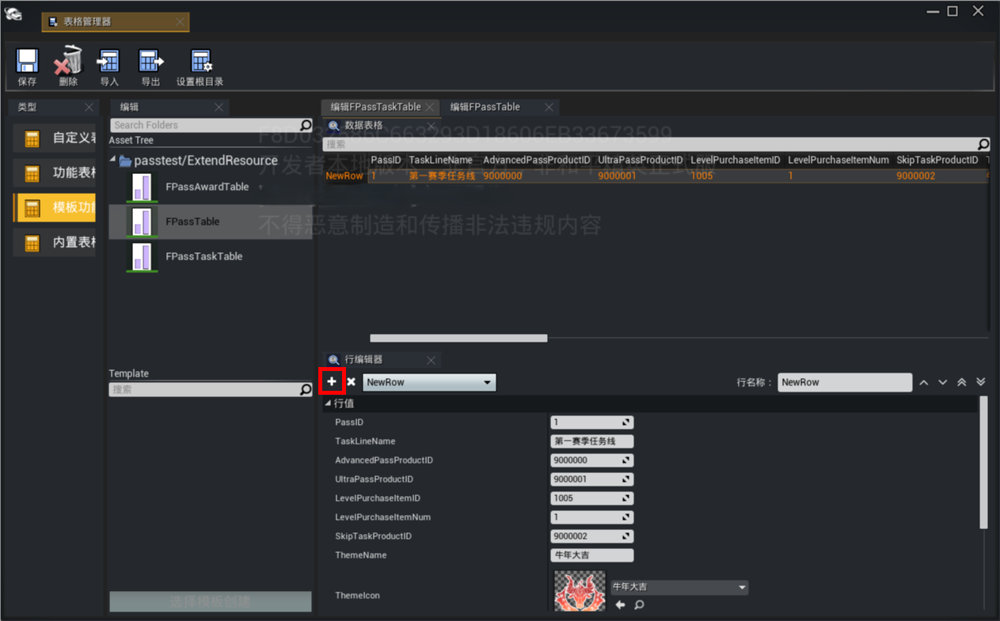

通行证内容的配置项及说明如下：

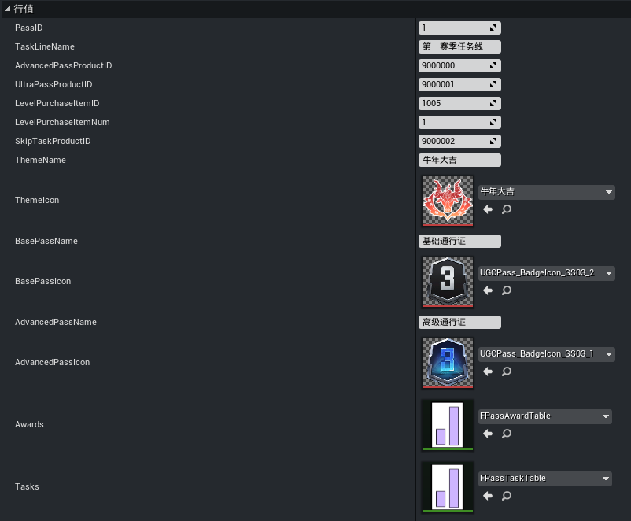

|属性名称|说明|
|:-:|-|
|PassID|通行证ID，用于标识不同通行证，需要确保ID唯一|
|TaskLineName|任务线名，需填入挑战任务线中对应的【任务线名称】|
|AdvancedPassProductID|高级通行证商品ID，需填入表格 ``UGCShop`` 中对应商品的【商品ID】|
|UltraPassProductID|豪华通行证商品ID，需填入表格 ``UGCShop`` 中对应商品的【商品ID】|
|LevelPurchaseItemID|购买通行证等级用到的虚拟物品ID，需填入表格 ``UGCObject`` 中对应物品的【项目ItemID】|
|LevelPurchaseItemNum|购买通行证等级需要的虚拟物品数量|
|SkipTaskProductID|快速完成任务道具（任务卡）的商品ID，需填入表格 ``UGCShop`` 中对应商品的【商品ID】|
|ThemeName|赛季主题名，对应通行证界面的“赛季主题名称”|
|ThemeIcon|赛季图标，对应通行证界面的“赛季图标”|
|BasePassName|基础通行证，对应通行证界面中“通行证奖励”的基础通行证名称|
|BasePassIcon|基础通行证图标，对应通行证界面中“通行证奖励”的基础通行证图标|
|AdvancedPassName|高级通行证名，对应通行证界面中“通行证奖励”的高级通行证名称|
|AdvancedPassIcon|高级通行证图标，对应通行证界面中“通行证奖励”的高级通行证图标|
|Awards|奖励配置表，需选择对应的通行证奖励配置表|
|Tasks|任务配置表，需选择对应的通行证挑战任务配置表|

## 功能调试

为便于进行功能调试，开发者可通过配置通用GM面板，添加一个打开通行证界面的快捷入口，具体配置方法请参阅 [扩展GM功能](../绿洲编辑器基础内容/调试游戏/20109_通用GM面板.md#扩展GM功能) 。此外，模板也提供了一个预置了该入口的配置脚本 ``ExtendResource/Pass/OfficialPackage/Script/pass/gm.lua`` 。

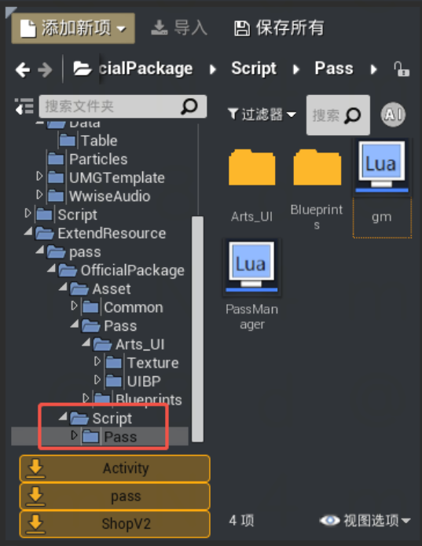

进行调试期间，从通用GM面板中打开通行证界面，即可查看通行证的展示与操作效果。


## API参考

### **Functions**

#### **OpenMainUI**

打开通行证界面

``` Lua
-- 生效范围：客户端
function PassManager:OpenMainUI()
end
```

---

#### **CloseMainUI**

关闭通行证界面

``` Lua
-- 生效范围：客户端
function PassManager:ClosenMainUI()
end
```
