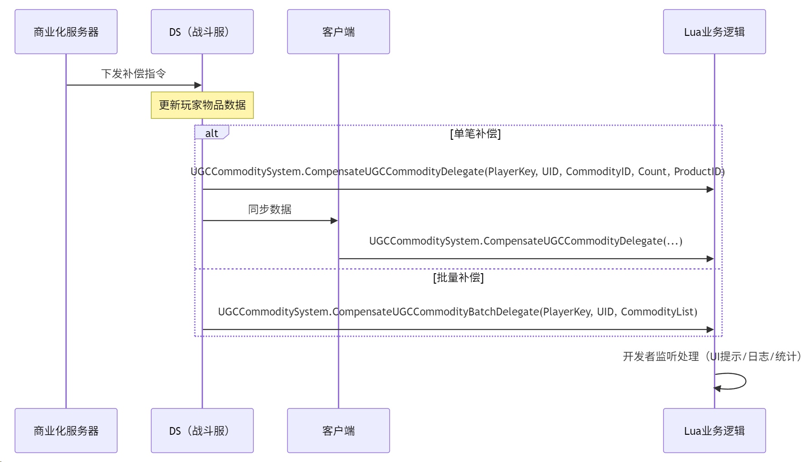
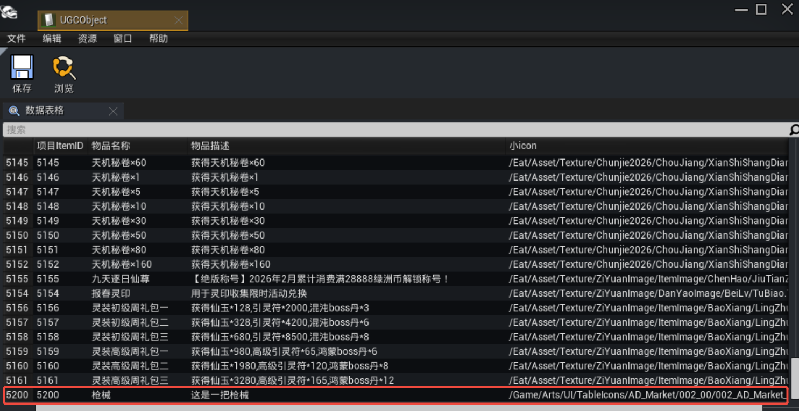
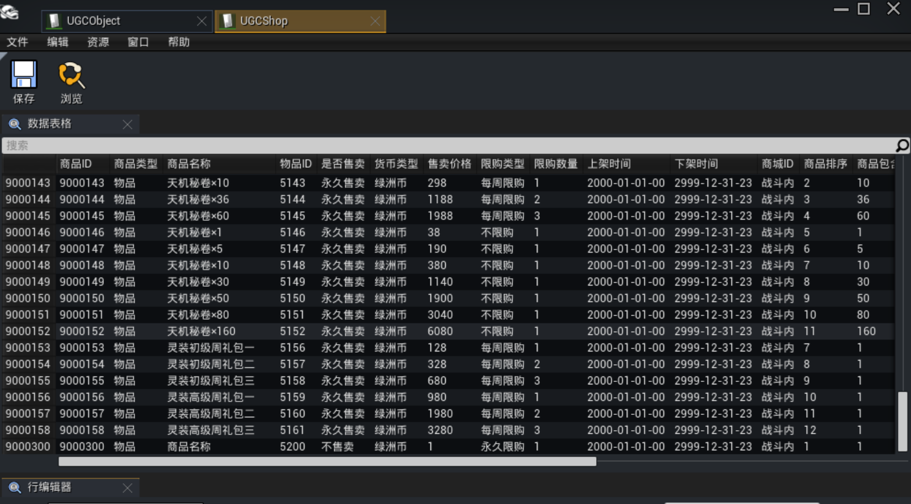

# UGCCommoditySystem 补偿系统 API 文档

---

## 1. 概述

UGC 商业化系统中的**补偿机制**用于在特定场景下向玩家补发商品（物品）。系统提供两个层次的补偿广播委托，以及一个跨局商品变化广播委托：

<!-- ✏️ 修改：表格新增第三行 BuyUGCCommodityResultBetweenGamesDelegate -->

| 委托                                        | 补偿方式         | 生效范围        | 适用场景                               |
| ------------------------------------------- | ---------------- | --------------- | -------------------------------------- |
| `CompensateUGCCommodityDelegate`            | 单个商品补偿     | 服务器 & 客户端 | 单笔补偿，如异常恢复、单商品补发       |
| `CompensateUGCCommodityBatchDelegate`       | 批量商品补偿     | 仅服务器        | 多笔补偿，如活动奖励、批量异常恢复     |
| `BuyUGCCommodityResultBetweenGamesDelegate` | 跨局商品变化通知 | 仅服务器        | 检测玩家在两局之间新增的商品并逐个广播 |

<!-- ✏️ 修改：注意文案增加"或商品变化" -->

> **注意**：补偿操作本身由系统**自动完成**，这些委托仅用于**广播补偿结果或商品变化**，供开发者监听并执行后续逻辑（如日志记录、UI提示、数据同步等）。

---

## 2. 补偿机制流程图



---

## 3. 委托声明

### 3.1 单笔补偿委托

```lua
---补偿玩家商品后广播
---生效范围：服务器&客户端
---@param PlayerKey number @玩家PlayerKey
---@param UID number @玩家UID
---@param CommodityID number @物品ID
---@param Count number @物品数量
---@param ProductID number @商品ID
UGCCommoditySystem.CompensateUGCCommodityDelegate = Delegate.New()
```

### 3.2 批量补偿委托

```lua
---补偿玩家商品后批量广播
---生效范围：服务器
---@param PlayerKey number @玩家PlayerKey
---@param UID number @玩家UID
---@param CommodityList table @补偿列表（含多个商品信息）
UGCCommoditySystem.CompensateUGCCommodityBatchDelegate = Delegate.New()
```

<!-- ✏️ 新增：3.3 跨局商品变化委托（整个小节为新增内容） -->

### 3.3 跨局商品变化委托

```lua
---如果本次游戏对局的商品数据跟上一局结算时的物品数据有差异，那么服务端会在 PlayerController:Server_OnUGCCommodityPlayerDataReady() 之前广播此 Delegate
---可以在PlayerController:ReceiveBeginPlay() 里监听这个 Delegate
---生效范围：服务器
---@param PlayerKey number @玩家PlayerKey
---@param UID number @玩家UID
---@param CommodityID number @物品ID
---@param Count number @物品数量（新增的差异数量）
UGCCommoditySystem.BuyUGCCommodityResultBetweenGamesDelegate = Delegate.New()
```

---

## 4. API 详细说明

### 4.1 `UGCCommoditySystem.CompensateUGCCommodityDelegate`

**委托类型**：`Delegate`

**广播时机**：

- 系统对玩家进行**单笔商品补偿**后
- 系统对玩家进行**批量商品补偿**时，会对 `CommodityList` 中的**每一件商品逐个触发**单笔委托（与批量委托并存触发）
- 补偿操作已完成且数据已更新

**参数说明**：

| 参数          | 类型     | 说明                            |
| ------------- | -------- | ------------------------------- |
| `PlayerKey`   | `number` | 玩家 PlayerKey，服务器端标识    |
| `UID`         | `number` | 玩家 UID                        |
| `CommodityID` | `number` | 物品 ID，对应`UGCObject` 配置表 |
| `Count`       | `number` | 补偿数量（正整数）              |
| `ProductID`   | `number` | 商品 ID，对应`UGCShop` 配置表   |

**生效范围**：服务器 & 客户端（两端都会收到）

**适用场景**：

- 单个商品异常补发
- 单笔退款补偿
- 单个活动奖励补发
- 批量补偿场景下的逐项通知（**与批量委托并存触发**）

---

### 4.2 `UGCCommoditySystem.CompensateUGCCommodityBatchDelegate`

**委托类型**：`Delegate`

**广播时机**：

- 系统对玩家进行**批量商品补偿**后触发
- 同一笔批量补偿**会同时触发单笔委托**：批量委托一次性广播整个 `CommodityList`，单笔委托对列表中的每件商品逐个广播
- 所有补偿项处理完成后一次性触发

**参数说明**：

| 参数            | 类型     | 说明                         |
| --------------- | -------- | ---------------------------- |
| `PlayerKey`     | `number` | 玩家 PlayerKey，服务器端标识 |
| `UID`           | `number` | 玩家 UID                     |
| `CommodityList` | `table`  | 补偿商品列表（数组结构）     |

**`CommodityList` 结构说明**：

```lua
CommodityList = {
    {
        CommodityID = 1001,  -- 物品ID（对应UGCObject表）
        Count       = 5,     -- 物品数量（正整数）
        ProductID   = 900001 -- 商品ID（对应UGCShop表）
    },
    {
        CommodityID = 1002,
        Count       = 3,
        ProductID   = 900002
    },
    -- ... 更多商品项
}
```

**生效范围**：仅服务器

**适用场景**：

- 活动批量奖励发放
- 运营一次性多道具补偿
- 版本更新统一补偿

---

<!-- ✏️ 新增：4.3 整个小节为新增内容 -->

### 4.3 `UGCCommoditySystem.BuyUGCCommodityResultBetweenGamesDelegate`

**委托类型**：`Delegate`

**广播时机**：

- 玩家进入新对局后，系统初始化商品数据时
- 如果本次对局的商品数据与**上一局结算时**的存档数据存在差异（即跨局期间有新增商品），会**逐个差异项广播**
- 在 `PlayerController:Server_OnUGCCommodityPlayerDataReady()` **之前**触发

**参数说明**：

| 参数          | 类型     | 说明                                        |
| ------------- | -------- | ------------------------------------------- |
| `PlayerKey`   | `number` | 玩家 PlayerKey，服务器端标识                |
| `UID`         | `number` | 玩家 UID                                    |
| `CommodityID` | `number` | 物品 ID，对应`UGCObject` 配置表             |
| `Count`       | `number` | 新增的差异数量（当前数量 - 上局结算时数量） |

**生效范围**：仅服务器

**监听时机**：

- 建议在 `PlayerController:ReceiveBeginPlay()` 中注册监听

**适用场景**：

- 检测玩家在两局游戏之间通过大厅购买、活动获得等方式新增的商品
- 跨局数据同步通知（例如根据新增商品初始化对局内效果）
- 对局开始时根据玩家新购商品执行初始化逻辑

---

<!-- ✏️ 修改：原 4.3 "核心差异对比" 改为 4.4，并新增第三列 BuyUGCCommodityResultBetweenGamesDelegate -->

### 4.4 核心差异对比

| 特性         | `CompensateUGCCommodityDelegate` | `CompensateUGCCommodityBatchDelegate` | `BuyUGCCommodityResultBetweenGamesDelegate` |
| ------------ | -------------------------------- | ------------------------------------- | ------------------------------------------- |
| **补偿方式** | 单个商品补偿                     | 批量商品补偿                          | 跨局商品差异逐个通知                        |
| **参数结构** | 单个商品详细信息（5个独立参数）  | 商品列表（`CommodityList` 数组）      | 单个差异商品信息（4个独立参数）             |
| **生效范围** | 服务器 & 客户端                  | 仅服务器                              | 仅服务器                                    |
| **触发频率** | 每补偿一个商品触发一次（**含批量场景下逐个触发**）| 批量补偿完成后触发一次（**与单笔委托并存触发**） | 每个差异商品触发一次                        |
| **触发时机** | 补偿操作完成后（**单笔或批量补偿均会触发**）| 批量补偿完成后    | 对局初始化、商品数据就绪前                  |
| **典型用途** | 单笔异常恢复                     | 活动/运营批量补发（**常与单笔委托同时使用**）  | 跨局新增商品检测                            |

---

## 5. 使用示例

### 5.1 补偿商品配置





---

### 5.2 监听单笔补偿

```lua
-- 在 Server 或 Client 端注册监听（建议在玩家初始化时注册）
function MySystem:InitializeCompensateListener()
    -- 监听单笔补偿
    UGCCommoditySystem.CompensateUGCCommodityDelegate:Add(self.OnCompensateUGCCommodity, self)
end

---单笔补偿回调
---@param PlayerKey number
---@param UID number
---@param CommodityID number
---@param Count number
---@param ProductID number
function MySystem:OnCompensateUGCCommodity(PlayerKey, UID, CommodityID, Count, ProductID)
    print_dev(StringFormat_Dev("[MySystem] 收到单笔补偿 UID=%d CommodityID=%d Count=%d ProductID=%d",
        UID, CommodityID, Count, ProductID))

    -- 示例：记录补偿日志
    self:LogCompensation(PlayerKey, UID, CommodityID, Count, ProductID)

    -- 示例：客户端弹提示（仅客户端需要）
    if not UGCGameSystem.IsServer() then
        self:ShowCompensationTip(CommodityID, Count)
    end
end
```

### 5.3 监听批量补偿（仅 Server）

```lua
-- 仅在服务器端注册
function MySystem:InitializeBatchCompensateListener()
    if not UGCGameSystem.IsServer() then
        return
    end

    -- 监听批量补偿
    UGCCommoditySystem.CompensateUGCCommodityBatchDelegate:Add(self.OnCompensateUGCCommodityBatch, self)
end

---批量补偿回调
---@param PlayerKey number
---@param UID number
---@param CommodityList table
function MySystem:OnCompensateUGCCommodityBatch(PlayerKey, UID, CommodityList)
    print_dev(StringFormat_Dev("[MySystem] 收到批量补偿 UID=%d 商品数量=%d",
        UID, #CommodityList))

    -- 遍历补偿列表处理每一项
    for _, item in ipairs(CommodityList) do
        print_dev(StringFormat_Dev("[MySystem] 补偿项 CommodityID=%d Count=%d ProductID=%d",
            item.CommodityID, item.Count, item.ProductID))

        -- 示例：写入数据库或运营日志
        self:RecordCompensationToDB(UID, item.CommodityID, item.Count, item.ProductID)
    end

    -- 示例：发送运营事件上报
    self:ReportCompensationEvent(UID, CommodityList)
end
```

<!-- ✏️ 新增：5.3 监听跨局商品变化（整个小节为新增内容） -->

### 5.4 监听跨局商品变化（仅 Server）

```lua
-- 在 PlayerController:ReceiveBeginPlay() 中注册监听
function MyPlayerController:ReceiveBeginPlay()
    if UGCGameSystem.IsServer() then
        UGCCommoditySystem.BuyUGCCommodityResultBetweenGamesDelegate:Add(self.OnBuyUGCCommodityResultBetweenGames, self)
    end
end

---跨局商品变化回调
---@param PlayerKey number
---@param UID number
---@param CommodityID number
---@param Count number
function MyPlayerController:OnBuyUGCCommodityResultBetweenGames(PlayerKey, UID, CommodityID, Count)
    print_dev(StringFormat_Dev("[MyPlayerController] 跨局新增商品 UID=%d CommodityID=%d Count=%d",
        UID, CommodityID, Count))

    -- 示例：根据新增商品初始化对局内效果
    self:ApplyNewCommodityEffect(PlayerKey, CommodityID, Count)
end
```

<!-- ✏️ 修改：原 5.3 "注销监听" 改为 5.4，并新增 BuyUGCCommodityResultBetweenGamesDelegate 的注销示例 -->

### 5.5 注销监听

```lua
function MySystem:FinalizeCompensateListener()
    -- 移除单笔补偿监听
    UGCCommoditySystem.CompensateUGCCommodityDelegate:Remove(self.OnCompensateUGCCommodity, self)

    -- 移除批量补偿监听（如果在服务器注册了）
    if UGCGameSystem.IsServer() then
        UGCCommoditySystem.CompensateUGCCommodityBatchDelegate:Remove(self.OnCompensateUGCCommodityBatch, self)
    end
end

function MyPlayerController:ReceiveEndPlay()
    if UGCGameSystem.IsServer() then
        UGCCommoditySystem.BuyUGCCommodityResultBetweenGamesDelegate:Remove(self.OnBuyUGCCommodityResultBetweenGames, self)
    end
end
```

---

## 6. 常见问题

### Q1：补偿操作由谁发起？开发者需要调用补偿接口吗？

**A**：补偿指令由**商业化后台**下发到系统，自动完成数据更新并广播委托。开发者**不需要**手动调用补偿相关接口，只需**监听委托**获取补偿结果通知即可。

### Q2：两个委托的参数中都有 `CommodityID` 和 `ProductID`，它们有什么区别？

**A**：

| 字段          | 含义      | 对应配置表                    |
| ------------- | --------- | ----------------------------- |
| `CommodityID` | 物品的 ID | `UGCObject` 表（物品定义）    |
| `ProductID`   | 商品的 ID | `UGCShop` 表（商品/售卖定义） |

一个 `ProductID`（商品）可能对应一个或多个 `CommodityID`（物品），补偿时通常两者都会提供。

### Q3：客户端能收到批量补偿委托吗？

**A**：不能。`CompensateUGCCommodityBatchDelegate` **仅在服务器端广播**。如果客户端需要感知批量补偿，可以通过以下方式：

- 监听 `UGCCommoditySystem.UGCCommodityPlayerDataChangedDelegate`（物品变化时广播）
- 或服务器收到批量补偿后，由服务器逻辑主动下发自定义通知到客户端。

### Q4：补偿的数据会保存到结算存档吗？

**A**：会。补偿数据会持久化到玩家的结算存档中，确保跨局数据一致性。

### Q5：补偿委托与物品变化委托有什么关系？

**A**：补偿委托（`CompensateUGCCommodityDelegate` / `CompensateUGCCommodityBatchDelegate`）在补偿**完成后立即触发**，专注于补偿这一特定场景；而 `UGCCommodityPlayerDataChangedDelegate` 在**玩家物品数据发生任何变化时**触发，范围更广。两者可同时监听，用途不同。

### Q6：PIE 模式下如何测试补偿功能？

**A**：PIE 模式下系统不会连接真实商业化后台，开发者可以通过直接调用注册的函数，模拟测试补偿的发放。

<!-- ✏️ 新增：Q7 和 Q8 为新增内容 -->

### Q7：`BuyUGCCommodityResultBetweenGamesDelegate` 和补偿委托有什么区别？

**A**：`BuyUGCCommodityResultBetweenGamesDelegate` 并非补偿委托，它用于检测**跨局期间**（即两局游戏之间）玩家商品数据的变化。系统会在新对局初始化时，对比当前商品数据与上一局结算时的存档数据，将新增的差异逐个广播。典型场景是玩家在大厅购买了新商品后进入下一局，服务器可以通过该委托感知到这些新增商品。

### Q8：`BuyUGCCommodityResultBetweenGamesDelegate` 什么时候注册监听最合适？

**A**：建议在 `PlayerController:ReceiveBeginPlay()` 中注册监听。该委托在 `PlayerController:Server_OnUGCCommodityPlayerDataReady()` **之前**触发，因此必须在商品数据就绪前完成注册，否则可能错过广播。

---
## 附录 A：接入补偿系统的成功样例（经验证可用的基准范式）

> 本节为对真实接入中验证可靠、无明显问题的实现做脱敏抽象后的通用范式，可直接作为新工程接入的基准。

### A.1 接入五要素（缺一不可）

| # | 要素                          | 关键动作                                                                                                                                                                                          | 漏掉的典型后果                       |
| - | ----------------------------- | ------------------------------------------------------------------------------------------------------------------------------------------------------------------------------------------------- | ------------------------------------ |
| 1 | **UID / PlayerKey 首行过滤**  | 每个回调第一行必须校验 `UID` 与当前玩家一致，不一致直接 `return`。防止多玩家共享委托时串号（A 玩家的补偿触发 B 玩家的逻辑）。                                                                  | 串号发放、跨玩家数据污染             |
| 2 | **商品 → 物品映射**           | 回调参数里的 `CommodityID`（虚拟物品 ID，对应 `UGCObject` 表）**不能直接当背包道具使用**，必须经项目自定义映射表（如 `VirtualToRealIDConfig[CommodityID].RealID`）转成真实道具 ID；**映射不到要打错误日志并安全跳过，不能静默吞掉**。 | 发错道具 / 静默漏发 / 后续数据对不上 |
| 3 | **统一发放入口 + 显式落盘 + 商业化存档同步** | 确认项目方案后再分发：**① 手动方案**——先用 API 站标准接口 `UGCCommoditySystem.UseUGCCommodity2`（项目内部如另有 `VirtualItemManager:Remove` 自定义扩展亦可）扣除商业化存档数量，再 `UGCBackpackSystemV2.AddItemV2` 入背包；**② 自动方案**——若项目已配置"商业化→背包自动转移"，则**不手动入包**，改监听"补发 / 增加物品通知"与"自动转移结果"事件感知异常（如背包满、转移失败）。无论哪种方案，补偿完成后都要显式调用存档保存接口（推荐 `UGCPlayerStateSystem.SavePlayerArchiveData`），不依赖定时器 / 退出流程兜底。 | ① **商业化存档与背包双账不一致**——玩家实际拿双份；② 退出重进丢失、强杀 / 闪退后补发不生效 |
| 4 | **双缓存兜底**                | ① 跨局补偿到达早于背包 / 虚拟物品初始化 → 先缓存到待处理队列，等初始化完成后统一兑现；② 虚拟物品管理器未实例化 → 缓存，监听 `GamePart` 加载完成事件后补发。**未就绪的补偿绝不能直接丢弃**。         | 局内刚进图、刚开背包时的补偿丢失     |
| 5 | **按生效范围注册 + 对称注销** | 单笔委托双端注册；批量、跨局委托仅服务器注册；`PlayerController:ReceiveEndPlay()` 时对称 `Remove`。                                                                                              | 重连后漏注册、进程退出后残留监听句柄 |

### A.2 代码骨架（脱敏通用版）

> 以下为脱敏后的通用范式，已在多个接入工程中验证稳定。开发者复制时需把 `GetMappedRealItemID`、`ApplyCompensateCommodity`、`ShowCompensationTip` 等项目自定义函数替换为自身实现。

```lua
-- ===== 注册（PlayerController:ReceiveBeginPlay，同步执行，勿延迟）=====
-- ⚠️ 真实行为提醒：发起一次批量补偿时，Batch 委托一次性广播整个 CommodityList，
--     同时单笔委托对列表中每件商品逐个广播 N 次（两个委托并存触发）。
--     推荐按需只监听其中之一，可彻底规避并存触发的防重复杂度。
function UGCPlayerController:ReceiveBeginPlay()
    -- ① 单笔委托：双端注册（客户端用于展示提示，服务端用于发奖）
    UGCCommoditySystem.CompensateUGCCommodityDelegate:Add(self.OnCompensateUGCCommodity, self)

    if UGCGameSystem.IsServer() then
        -- ② 批量委托：仅服务器注册；如同时监听单笔委托，须自己做精确防重（见 §B.2）
        -- UGCCommoditySystem.CompensateUGCCommodityBatchDelegate:Add(self.OnCompensateUGCCommodityBatch, self)
        -- ③ 跨局委托：仅服务器注册
        UGCCommoditySystem.BuyUGCCommodityResultBetweenGamesDelegate:Add(self.OnBuyUGCCommodityResultBetweenGames, self)
    end
end

-- ===== 单笔补偿回调（服务端发奖 + 落盘；客户端弹提示）=====
---@param PlayerKey number
---@param UID number
---@param CommodityID number
---@param Count number
---@param ProductID number
function UGCPlayerController:OnCompensateUGCCommodity(PlayerKey, UID, CommodityID, Count, ProductID)
    -- ① UID 首行过滤
    if UID ~= UGCGameSystem.GetUIDByPlayerController(self) then
        return
    end

    if UGCGameSystem.IsServer() then
        -- ② 商品→物品映射，映射不到打错误日志并安全跳过
        local ItemId = self:GetMappedRealItemID(CommodityID)
        if ItemId == nil or ItemId <= 0 then
            -- 记录错误日志（含 CommodityID/Count），便于定位
            return
        end

        -- ③ 按项目方案分支：手动方案 vs 自动方案（见 §A.1 要素 3 与上命名差异表）
        if self:IsAutoTransferEnabled() then
            -- ──────── 自动方案 ────────
            -- 项目已配置"商业化→背包自动转移"：不手动入包，改监听"补发/增加物品通知"
            -- 与"自动转移结果"事件，由系统自动把商业化存档物品转入背包。
            -- 此分支仅做打点 + 边界处理（监听补发通知用于背包满等异常场景感知）。
            self:WatchAutoTransferResult(CommodityID, Count)
        else
            -- ──────── 手动方案 ────────
            -- 关键顺序：先扣商业化存档 → 再入背包 → 最后显式落盘。
            -- 跳过任一步都会导致双账不一致（玩家拿双份 或 背包到账商业化存档不变）。
            -- API 站标准入口：UGCCommoditySystem.UseUGCCommodity2
            --   签名：(PlayerController, ObjectID, Icon, Desc, Count, bShowDialog)
            --   注意 Icon/Desc 可传 nil，会自动从 UGCObject 表读取；bShowDialog 在 DS 端忽略
            UGCCommoditySystem.UseUGCCommodity2(self, CommodityID, nil, nil, Count, false)

            -- 统一入包（使用增加道具的发放接口，绝不调用消费玩家已有道具的开包类接口）
            UGCBackpackSystemV2.AddItemV2(self, ItemId, Count)
        end

        -- ④ 显式落盘（不能用定时器 / 退出流程兜底；结算之后调用无效）
        UGCPlayerStateSystem.SavePlayerArchiveData(UID, self:BuildArchiveSnapshot())
    else
        -- 客户端：仅做展示，不重复发奖
        self:ShowCompensationTip(CommodityID, Count, ProductID)
    end
end

-- ===== 批量补偿回调（仅服务器；按需注册其一，见注册代码注释）=====
---@param PlayerKey number
---@param UID number
---@param CommodityList table  -- 兼容命名表与位置数组两种形态
function UGCPlayerController:OnCompensateUGCCommodityBatch(PlayerKey, UID, CommodityList)
    -- ① 服务端权限校验
    if not UGCGameSystem.IsServer() then
        return
    end
    -- ② UID 首行过滤
    if UID ~= UGCGameSystem.GetUIDByPlayerController(self) then
        return
    end

    local bAuto = self:IsAutoTransferEnabled()
    local archiveDirty = false

    for _, item in ipairs(CommodityList) do
        local CommodityID = item.CommodityID or item[1]
        local Count       = item.Count       or item[2]
        local ProductID   = item.ProductID   or item[3]
        if CommodityID and Count then
            if bAuto then
                -- 自动方案：仅打点 + 监听补发通知；不手动入包
                self:WatchAutoTransferResult(CommodityID, Count)
            else
                -- 手动方案：先扣商业化存档 → 再入背包
                UGCCommoditySystem.UseUGCCommodity2(self, CommodityID, nil, nil, Count, false)
                local ItemId = self:GetMappedRealItemID(CommodityID)
                if ItemId and ItemId > 0 then
                    UGCBackpackSystemV2.AddItemV2(self, ItemId, Count)
                end
            end
            archiveDirty = true
        end
    end

    -- ③ 批量补偿统一落盘（仅在确实修改过存档时落盘，避免无谓 IO）
    if archiveDirty then
        UGCPlayerStateSystem.SavePlayerArchiveData(UID, self:BuildArchiveSnapshot())
    end
end

-- ===== 跨局补偿回调：未就绪必须缓存，就绪后补发 =====
---@param PlayerKey number
---@param UID number
---@param CommodityID number
---@param Count number
function UGCPlayerController:OnBuyUGCCommodityResultBetweenGames(PlayerKey, UID, CommodityID, Count)
    if UID ~= UGCGameSystem.GetUIDByPlayerController(self) then
        return
    end

    -- 项目自定义：VIM = Virtual Item Manager；nil 即未实例化
    local VIM = self:GetVirtualItemManager()
    if VIM == nil then
        -- 未就绪 → 进缓存队列，等 GamePart 加载完成事件后补发
        table.insert(self.PendingCompensateList, {CommodityID = CommodityID, Count = Count})
        return
    end

    self:ApplyCompensateCommodity(CommodityID, Count)
end

-- ===== 注销（PlayerController:ReceiveEndPlay，对称移除）=====
function UGCPlayerController:ReceiveEndPlay()
    UGCCommoditySystem.CompensateUGCCommodityDelegate:Remove(self.OnCompensateUGCCommodity, self)

    if UGCGameSystem.IsServer() then
        -- 按需：若启用了批量委托则同步注销
        -- UGCCommoditySystem.CompensateUGCCommodityBatchDelegate:Remove(self.OnCompensateUGCCommodityBatch, self)
        UGCCommoditySystem.BuyUGCCommodityResultBetweenGamesDelegate:Remove(self.OnBuyUGCCommodityResultBetweenGames, self)
    end
end
```

### A.3 成功样例的工程实践特征

- 三个委托按生效范围齐全注册（**按需只注册单笔 / 批量其中之一可彻底规避并存触发的防重复杂度**），且**跨局委托在 `ReceiveBeginPlay()` 中同步注册**（早于商品数据就绪）。
- 每个回调首行 **UID 过滤**，杜绝多玩家串号。
- 虚拟物品管理器未初始化时补偿进入**待处理缓存**，`GamePart` 加载完成后统一补发——局内 / 局外均不丢。
- 数量校验与映射均有安全护栏（不满足条件记录错误日志后跳过，不崩溃）。
- **商业化存档与背包同步（核心）**：手动方案严格按"先 `UseUGCCommodity2` 扣商业化存档 → 再 `AddItemV2` 入背包 → 最后 `SavePlayerArchiveData` 落盘"三步走；自动方案不手动入包，改监听"补发通知 + 自动转移结果"事件感知异常。任何一步跳过都会导致双账不一致（玩家拿双份或背包到账但商业化存档不变）。
- 埋点对账（补偿事件上报）贯穿发放流程，便于运营核对。

**结论**：**范式正确的工程即使测试记录无 Fail，也应作为新接入的基准模板；v2 关键差异点在于"广播时机两个委托并存触发"与"商业化存档 ↔ 背包双账同步"，需结合真机日志与项目配置（手动 / 自动方案）确认**。

---

## 附录 B：错误案例与教训（脱敏汇总）

> 以下案例基于对多个接入异常工程的代码级复盘，已去除工程名、商品 ID、开发者信息，仅保留可复现的错误模式。每个案例含「**现象 → 根因 → 修复建议**」。

### B.1 补偿只改内存不落盘（"退出重进补发丢失"）

| 环节     | 内容                                                                                                                            |
| -------- | ------------------------------------------------------------------------------------------------------------------------------- |
| **现象** | 补偿到账后玩家退出重进，道具消失。                                                                                              |
| **根因** | 补偿回调只更新了内存中的存档数据，`Save()` 调用被注释或缺失；落盘依赖定时器 / 退出流程兜底，强杀、闪退、离线时不触发。           |
| **修复** | 补偿处理完成后在回调内显式调用存档保存接口（推荐 `UGCPlayerStateSystem.SavePlayerArchiveData`），不依赖兜底路径。               |

### B.2 防重条件写反（仅在同时监听单笔 + 批量时才会出现）

| 环节     | 内容                                                                                                                                                                                                                                                                                                                                                                                                                                                              |
| -------- | ----------------------------------------------------------------------------------------------------------------------------------------------------------------------------------------------------------------------------------------------------------------------------------------------------------------------------------------------------------------------------------------------------------------------------------------------------------------- |
| **现象** | 同一商品先后收到不同类型补偿（单笔 / 批量）时，后到者收不到。                                                                                                                                                                                                                                                                                                                                                                                                    |
| **根因** | 同时监听 `CompensateUGCCommodityDelegate` + `CompensateUGCCommodityBatchDelegate` 两个委托，且去重逻辑写成"类型不同且在时间窗口内则拒绝"（条件方向写反）。发起一次批量补偿时**两个委托并存触发**——`CompensateUGCCommodityBatchDelegate` 一次性广播整个 `CommodityList`，**同时** `CompensateUGCCommodityDelegate` 对列表中每件商品逐个广播 N 次。反条件写法导致后到的单笔委托被"代发"过的同商品杀掉。                                                                                  |
| **修复** | **推荐做法（按需监听其一，从根源规避）**：业务上只监听单笔 / 批量其中之一委托，彻底规避并存触发的防重复杂度。**仅在业务必须同时监听两个委托时**，再做精确防重：按"商品 + 时间窗口 + **同类型**"去重，**条件方向必须是 `Type == v.Type`，不要写 `~=`**。同时建议在监听注册时就把"按需其一"做成项目约定，避免新人接入时再踩同一坑。 |

### B.3 发奖与展示双套映射不一致（发错道具、数量不对）

| 环节     | 内容                                                                                                                              |
| -------- | --------------------------------------------------------------------------------------------------------------------------------- |
| **现象** | 玩家实际收到的道具与弹窗展示的道具不一致；数量对不上。                                                                            |
| **根因** | 服务端发奖用一套映射（按物品 ID 查表），客户端 / UI 预览用另一套映射（按商品 ID 查配置），两套数据源不一致。                        |
| **修复** | 发奖与展示使用同一映射源；对账时以**服务端实际入包内容**为准。                                                                    |

### B.4 商品映射表缺行（同批补偿部分成功部分失败）

| 环节     | 内容                                                                                                            |
| -------- | --------------------------------------------------------------------------------------------------------------- |
| **现象** | 同一批补偿中，A 商品正常到账、B 商品未到账，且无报错。                                                          |
| **根因** | 映射表中缺少 B 商品对应的物品配置，查询返回空后**静默跳过**（只打了一行日志，无 UI 提示）。                      |
| **修复** | 映射表全量补齐；映射缺失时**打错误日志并计入对账清单**，便于运营发现。                                          |

### B.5 用"消费型开包接口"当作发放接口（第二次不再发放）

| 环节     | 内容                                                                                                                                              |
| -------- | ------------------------------------------------------------------------------------------------------------------------------------------------- |
| **现象** | 某礼包补偿第一次发放成功，第二次不再发放。                                                                                                        |
| **根因** | 补偿直接调用了"开启已有礼包"的接口（先检查背包礼包道具数量、开包后消耗该道具）。第一次开已有道具成功并消耗；第二次背包道具为 0，接口静默返回失败。 |
| **修复** | 补偿发放应使用**增加道具 / 直接发放**的接口（如 `UGCBackpackSystemV2.AddItemV2`），不能依赖"消费玩家已有道具"的路径。                              |

### B.6 补偿到达时数据未就绪，直接丢弃（局内 Fail 局外 Pass）

| 环节     | 内容                                                                                                                                  |
| -------- | ------------------------------------------------------------------------------------------------------------------------------------- |
| **现象** | 局外（大厅 / 桌面）补偿正常到账，局内刚进入对局时收不到；或反之。                                                                      |
| **根因** | 回调前置校验（如虚拟物品数量 `VICount` >= `Count`）失败后**直接丢弃**，无重试队列；局内刚进图数据未就绪、局外数据就绪，导致表现不一致。 |
| **修复** | 数据未就绪 / 数量不足时**进待处理队列**，等数据就绪后补发（参考附录 A 的双缓存兜底）。                                                |

### B.7 补偿事件派发后无业务监听（"通知即完"断链）

| 环节     | 内容                                                                                                                                                                  |
| -------- | --------------------------------------------------------------------------------------------------------------------------------------------------------------------- |
| **现象** | 局内补偿正常，局外 / 跨局补偿丢失。                                                                                                                                  |
| **根因** | 回调只派发了自定义事件并弹提示，但**没有任何业务模块监听该事件**、也没有把补偿写入背包 / 存档——完全依赖平台自动发放，局外无兜底。                                      |
| **修复** | 回调内必须有**实际消费方**（入包 + 落盘），事件派发仅作辅助通知。                                                                                                        |

### B.8 委托注册时机 / 分支遗漏（补偿广播错过）

| 环节     | 内容                                                                                                                                                                       |
| -------- | -------------------------------------------------------------------------------------------------------------------------------------------------------------------------- |
| **现象** | 开局初期或重连后的补偿丢失。                                                                                                                                               |
| **根因** | ① 委托在 `AddTimer`（API 站标准名为 `UGCGameSystem.SetTimer`）延迟 10 秒后才注册，开局前 10 秒内到达的补偿错过；② 批量 / 跨局委托只在首次登录分支注册，杀进程重连分支未注册。 |
| **修复** | 注册**同步执行、不延迟**；首登与重连分支都要注册。                                                                                                                         |

### B.9 批量回调缺 UID / 权限过滤（重复入包、串号）

| 环节     | 内容                                                                                                                                  |
| -------- | ------------------------------------------------------------------------------------------------------------------------------------- |
| **现象** | 多玩家场景下补偿重复发放或发放到错误玩家。                                                                                            |
| **根因** | 批量回调无 `HasAuthority()`（API 站标准名为 `UGCActorComponentUtility.HasAuthority(InActor)`）判断、无 `UID` / `PlayerKey` 过滤，服务端与客户端都执行发奖逻辑。 |
| **修复** | 批量回调加**首行 `UID` 过滤 + 服务端权限校验**；参考附录 A.2。                                                                         |

---

## 附录 C：接入自检清单（上线前逐项核对）

-  **确认方案**：本项目是**手动方案**（默认，未配置自动转移）还是已配置"商业化→背包**自动转移**"。两种方案的入包路径完全不同，先确认再写代码。
-  **手动方案**：先用 `UGCCommoditySystem.UseUGCCommodity2`（或项目自定义 `VirtualItemManager:Remove` 扩展）**扣商业化存档**数量，再 `UGCBackpackSystemV2.AddItemV2` 入背包，最后 `SavePlayerArchiveData` 落盘；**自动方案**：**不手动入包**，改监听"补发 / 增加物品通知"与"自动转移结果"事件感知异常（背包满、转移失败等）。
-  **单笔 / 批量委托按需注册其一（推荐）**，避免并存触发的防重复杂度。发起一次批量补偿时，Batch + 单笔两个委托**并存触发**（Batch 广播整列表 + 单笔逐个广播 N 次），需同时监听两个委托的项目必须做精确防重（`Type == v.Type`，不要写 `~=`）。
-  三个委托按生效范围正确注册（单笔双端 / 批量 + 跨局仅服务端）
-  注册同步完成、无延迟；首登与重连分支均注册
-  每个回调首行 `UID` / `PlayerKey` 过滤
-  商品 → 物品映射表完整，映射不到打错误日志（不静默吞）
-  未就绪（虚拟物品管理器 `nil` / 数量不足 / 背包未初始化）→ 缓存队列 + 就绪补发
-  发放用"增加道具"统一入口（`UGCBackpackSystemV2.AddItemV2`），不用消费玩家已有道具的接口
-  补偿后显式强制落盘（`UGCPlayerStateSystem.SavePlayerArchiveData`，**注意结算后调用无效**），不依赖定时器 / 退出兜底
-  去重逻辑按"同类型去重"写，不写反（**仅在同时监听单笔 + 批量时才需要**）
-  批量回调兼容**命名表 / 位置数组**两种 `CommodityList` 结构
-  批量回调有权限 + `UID` 校验（`UGCActorComponentUtility.HasAuthority(self)` + 首行 `UID` 过滤），不双端重复发
-  PIE 直接调用回调函数模拟测试全场景（局内 / 大厅 / 桌面 / 离线）

---
