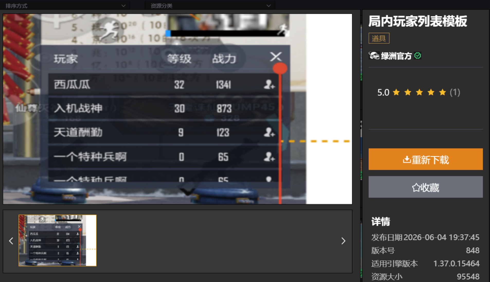
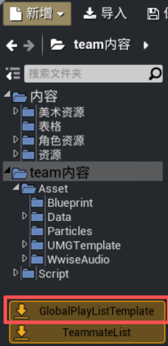
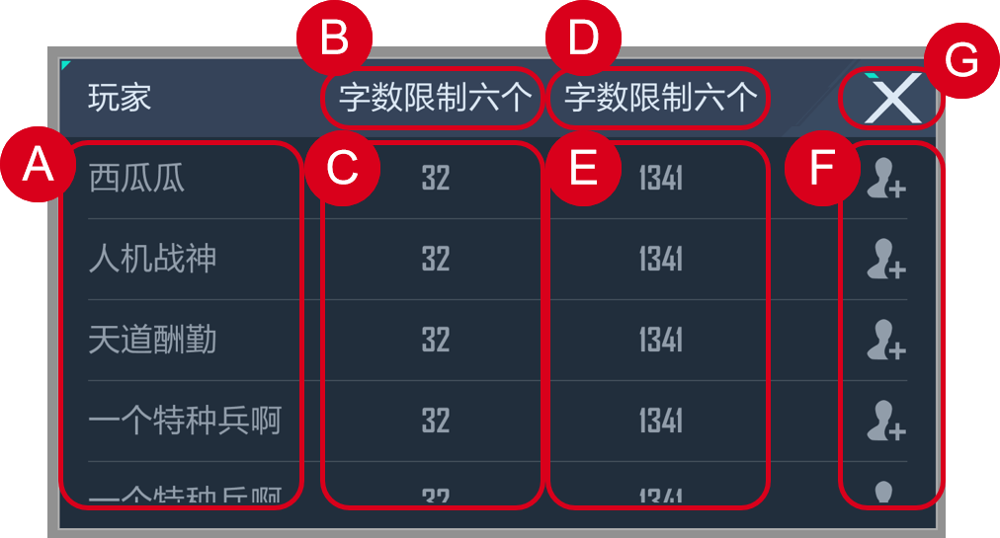
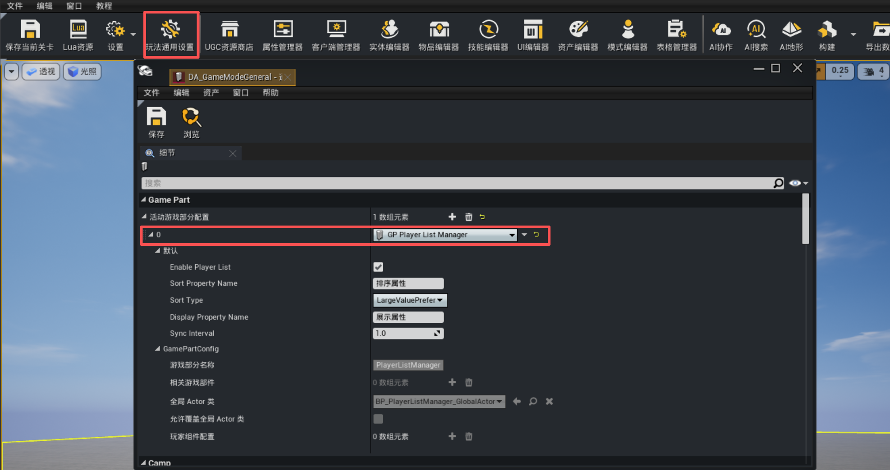
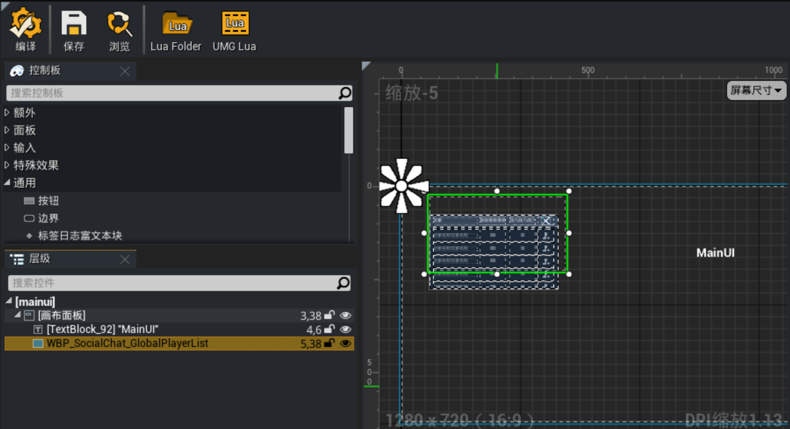

# 局内玩家列表模板

局内玩家列表模版，用于在局内展示所有玩家信息。
支持玩家名称、排序属性、展示属性显示，以及添加好友功能。

## 下载模板

局内玩家列表模板通过资源商店的形式提供下载，可以在资源商店中搜索“局内玩家列表”并点击下载该模板资源。



在内容浏览器中点击导入“GlobalPlayListTemplate”，将局内玩家列表模板导入当前工程内。



## 模板结构



+ **A. 玩家名称**
此处展示当前局内所有玩家的昵称
至多展示4行玩家数据，当ds内玩家超出4人时，列表支持上下滑动查看更多
+ **B. 排序属性名称**
编辑器内配置排序属性名称，同时列表按此属性排序，编辑器内可设定【大值优先 /小值优先】
名称显示上限 6 个字符（超出自动截断）
+ **C. 排序属性数值**
由开发者在服务端自行上报属性，所有榜单信息由 DS 下发给客户端
+ **D. 展示属性名称**
编辑器内配置展示属性名称，此列数值仅做展示，和玩家排序无关
名称显示上限 6 个字符（超出自动截断）
+ **E. 展示属性数值**
由开发者在服务端自行上报属性，所有榜单信息由 DS 下发给客户端
+ **F. 添加好友按钮**
默认展示加好友按钮，点击后触发加好友流程
+ **G. 关闭按钮**
点击后关闭榜单

## 配置依赖

### GamePart

点击【玩法通用设置】，在【活动游戏部分配置】中添加新元素【GP Player List Manger】。



| 配置项 | 说明 |
| :--- | :--- |
| **Enable Player List** | 是否开启局内玩家列表，关闭后模块不生效 |
| **Sort Property Name** | 排序属性名称，排序列标题，如“战力”、“等级”（最多6字） |
| **Sort Type** | 排序类型<br>  • LargeValuePrefer：大值优先 <br> • SmallValuePrefer：小值优先|
| **Display Property Name** | 展示属性名称，展示列标题（留空则不展示该列） |
| **Sync Interval** | 数据同步间隔DS下发数据的最小间隔（秒，≥0.5） |

## 局内玩家列表配置
将`WBP_SocialChat_GlobalPlayerList UI`蓝图拖到项目玩法主UI中，调整至合适的位置。



---

### 客户端监听数据

``` lua
local PlayerListGlobalActor = UGCGamePartSystem.PlayerListManager.GetGlobalActor()
if PlayerListGlobalActor then
    PlayerListGlobalActor.PlayerListUpdateDelegate:Add(function(PlayerListData)
        -- PlayerListData 已排序，可直接渲染UI
        for _, Entry in ipairs(PlayerListData) do
            print(Entry.PlayerName, Entry.SortValue, Entry.DisplayValue)
        end
    end)
end
```

---

### 服务端上报数值
``` lua
local PlayerListGlobalActor = UGCGamePartSystem.PlayerListManager.GetGlobalActor()
if PlayerListGlobalActor then
    -- 上报排序值（决定排名）
    PlayerListGlobalActor:UpdatePlayerSortValue(PlayerController, UID, 1500)

    -- 上报展示值（仅显示）
    PlayerListGlobalActor:UpdatePlayerDisplayValue(PlayerController, UID, 30)
end
```

## 数据结构

---

### FPlayerListConfig（玩家列表配置）
- bEnablePlayerList：是否开启玩家列表
- SortPropertyName：排序属性名称
- SortType：排序类型（1=大值优先，2=小值优先）
- DisplayPropertyName：展示属性名称
- SyncInterval：数据同步间隔

---

### FPlayerListEntry（玩家列表条目）
- UID：玩家 UID
- PlayerName：玩家昵称
- SortValue：排序属性数值
- DisplayValue：展示属性数值

## 使用建议
+  服务端：在玩家属性变化时调用更新接口
+  客户端：监听委托获取数据，自行开发UI
+  配置：根据游戏需求合理设置同步间隔
+  空值判断：调用API前始终检查GlobalActor是否为nil
```lua
local PlayerListGlobalActor = UGCGamePartSystem.PlayerListManager.GetGlobalActor()
if PlayerListGlobalActor then
    -- API
end
```

## API参考

---

### 获取 GlobalActor 实例
``` lua
local PlayerListGlobalActor = UGCGamePartSystem.PlayerListManager.GetGlobalActor()
```
>模块未加载时返回 nil，建议始终做空值判断

---

### UpdatePlayerSortValue
``` lua
---更新排序属性值
---生效范围：服务器
---@param PlayerController BP_UGCPlayerController_C @玩家控制器
---@param UID number @玩家UID
---@param SortValue number @排序数值
---@return boolean @是否更新成功
function PlayerListManager:UpdatePlayerSortValue(PlayerController, UID, SortValue)
```

---

### UpdatePlayerDisplayValue
``` lua
---更新展示属性值
---生效范围：服务器
---@param PlayerController BP_UGCPlayerController_C @玩家控制器
---@param UID number @玩家UID
---@param DisplayValue number @展示数值
---@return boolean @是否更新成功
function PlayerListManager:UpdatePlayerDisplayValue(PlayerController, UID, DisplayValue)
```

---

### GetPlayerListData
```lua
---获取排序后的玩家列表
---生效范围：服务器&客户端
---@return FPlayerListEntry[] @排序后的玩家列表
function PlayerListManager:GetPlayerListData()
```

---

### PlayerListUpdateDelegate
```lua
---玩家列表数据更新委托
---生效范围：客户端
---@param PlayerListData FPlayerListEntry[] @排序后的玩家列表
PlayerListManager.PlayerListUpdateDelegate = Delegate.New()
```

示例：
```lua
PlayerListGlobalActor.PlayerListUpdateDelegate:Add(function(PlayerListData)
    MyUI:RefreshList(PlayerListData)
end)
```

---

### 添加好友
```lua
---是否为好友

---生效范围：客户端

---@param UID number @玩家 UID

---@return boolean @是否为好友

UGCGameSystem.IsMyFriend(UID)

---添加好友

---生效范围：客户端

---@param UID number @玩家 UID

UGCGameSystem.AddFriend(UID)
```
