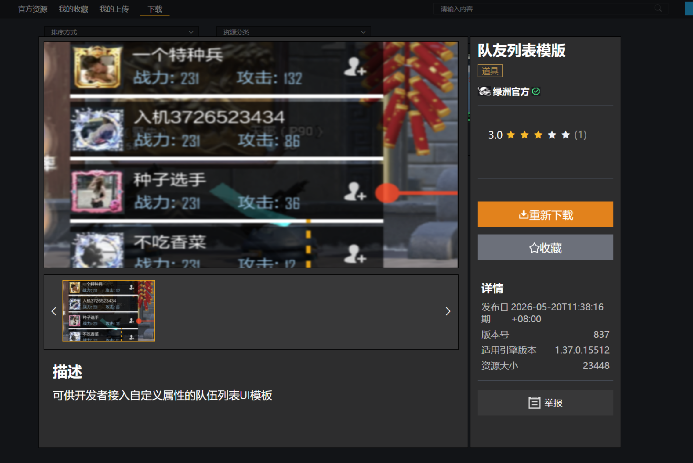
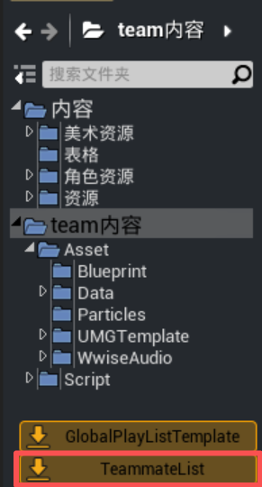
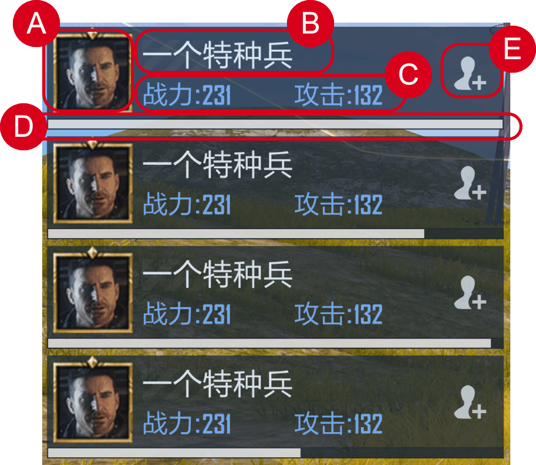
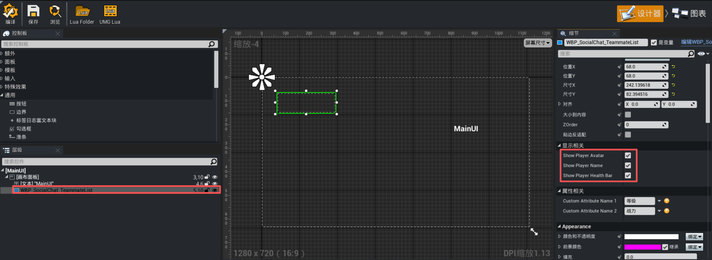
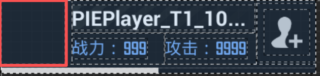
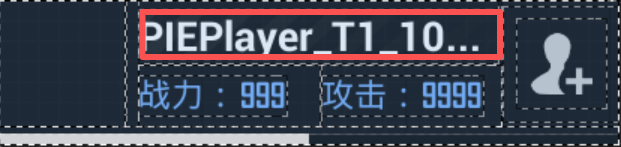
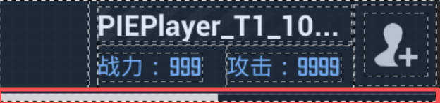
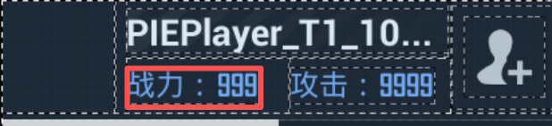

# 队友列表模板
队友列表模版，展示玩法内的玩家队伍列表。
模版支持选择是否展示队内玩家头像、玩家昵称、玩家血条，以及支持自定义展示两条玩法属性值。

## 下载模板
任务模板通过[资源商店](../336_资源商店.md)的形式提供下载，可以在资源商店中搜索“队友列表”并点击下载该模板资源。



在内容浏览器中点击导入“TeammateList”，将通行证模板导入当前工程内。



## 模版结构


+ **A. 玩家头像**
支持配置队友列表是否展示玩家头像
+ **B. 玩家昵称**
支持配置队友列表是否展示玩家昵称
+ **C. 玩家属性**
支持配置自定义属性名称，此处至多配置两条属性，为空则隐藏该属性
属性值在脚本中自定义接入玩法属性
+  **D. 玩家血条**
支持配置队友列表是否展示玩家血条，血条根据玩家当前血量/总血量上限实时变化
+  **E. 添加好友按钮**
默认展示加好友按钮，点击后触发加好友流程

## 队友列表配置
将`WBP_SocialChat_TeammateList`蓝图拖入项目玩法主UI中，点击【编译】按钮，在细节面板中进行配置。



| 属性名 | 类型 | 说明 |
| :--- | :--- | :--- |
| `ShowPlayerAvatar` | `bool` | 是否显示玩家头像 |
| `ShowPlayerName` | `bool` | 是否显示玩家名称 |
| `ShowPlayerHealthBar` | `bool` | 是否显示血条 |
| `CustomAttributeName1` | `FText` | 自定义属性1名称（如"击杀"），为空则隐藏该属性，属性值在脚本中自定义接入玩法属性，详见下文 |
| `CustomAttributeName2` | `FText` | 自定义属性2名称（如"得分"），为空则隐藏该属性，属性值在脚本中自定义接入玩法属性，详见下文 |

### 玩家头像

 **ShowPlayerAvatar**

系统提供的基础信息，默认展示玩家头像



---

### 玩家名称

**ShowPlayerName**

系统提供的基础信息，默认展示玩家名称
队伍列表玩家排序：从上至下， 中文>英文，英文按照首字母排序，中文随机排序



---

### 玩家血条

 **ShowHealthBar**

系统提供的基础信息，默认展示玩家血条
血条会根据玩家当前血量/总血量上限，进行实时的显示、变化


---

### 自定义属性名称

 **CustomAttributeName1**

负责显示的属性1
配置方式：在蓝图中填写名称，上限四个字。



属性显示条件：
- 1：配置属性名称不为空
- 2：Lua侧覆写了对应的取值函数

任意一个不满足则隐藏对应属性

 **覆写**

在`WBP_TeammateList UI`的脚本中，进行函数的覆写

```
-- 假设 TeammateList 是UI中队伍列表UI的变量名
local listWidget = self.TeammateList

-- 覆写属性1：击杀数
function listWidget:GetCustomAttributeValue1(playerKey)
    local ps = UGCGameSystem.GetPlayerStateByPlayerKey(playerKey)
    if ps and UE.IsValid(ps) then
        -- 从 GameAttribute 系统读取击杀数
        return UGCAttributeSystem.GetGameAttributeValue(ps, "KillCount") or 0
    end
    return 0
end

-- 覆写属性2：得分
function listWidget:GetCustomAttributeValue2(playerKey)
    local ps = UGCGameSystem.GetPlayerStateByPlayerKey(playerKey)
    if ps and UE.IsValid(ps) then
        return UGCAttributeSystem.GetGameAttributeValue(ps, "Score") or 0
    end
    return 0
end
```

> 覆写的时机需在 List 的 Construct 之前或之后尽快完成，否则第一次刷新时可能取不到值。

| 参数 | 类型 | 说明 |
| :--- | :--- | :--- |
| `playerKey` | `number` | 队友的 PlayerKey，用于获取该队友的 PlayerState |

---

### 动态更新

如果属性数值会动态变化（如击杀数增加），需要在数值变化后手动调用：
```
function YourHUD:OnPlayerKilled(killedPlayerKey, killerPlayerKey)
    -- 击杀数变化，刷新列表
    if self.TeammateList then
        self.TeammateList:RefreshList()
    end
end
```

## API参考

```lua
---是否为好友

---生效范围：客户端

---@param UID number @玩家 UID

---@return boolean @是否为好友

UGCGameSystem.IsMyFriend(UID)

---添加好友

---生效范围：客户端

---@param UID number @玩家 UID

UGCGameSystem.AddFriend(UID)
```
