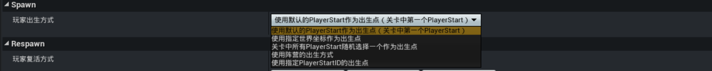
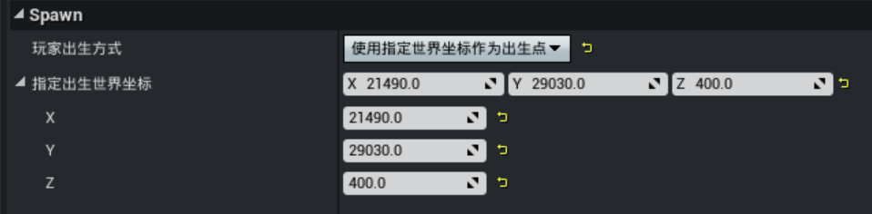
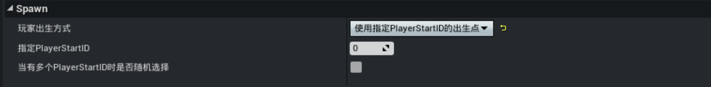
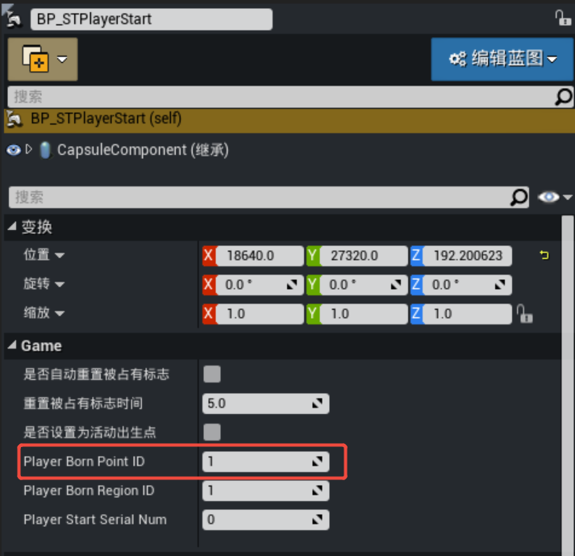
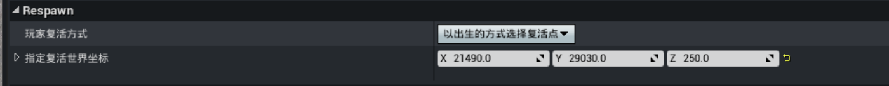
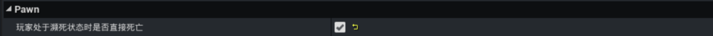

# 出生/复活/死亡配置

出生、复活与死亡是玩家在游戏中最基础的核心状态逻辑，目前开发者可以在编辑器的【玩法通用设置】中便捷地配置玩家的出生、复活与死亡规则。

## 玩家出生配置

在属性组【Respawn】中，选择并配置玩家出生位置的规则，各类玩家出生方式说明如下：

> 进行玩家出生配置前，可根据需求创建并配置玩家出生点，详细步骤参考文档：[创建出生点](../进阶内容/GamePlay系统/角色系统/362_角色出生点.md#创建出生点)
> 玩法通用设置的玩家出生配置会覆盖BP_PlayerStartManager的 [出生规则配置](../进阶内容/GamePlay系统/角色系统/362_角色出生点.md#配置出生规则)

|选项名称|说明|
|-|-|
|使用默认的PlayerStart作为出生点|工程的默认出生方式，该选项会将关卡中第一个找到的 PlayerStart点作为所有玩家的出生位置|
|使用指定世界坐标作为出生点|将属性【指定出生世界坐标】作为所有玩家的出生位置 |
|关卡中所有PlayerStart随机选择一个作为出生点|每位玩家在进入游戏时，都会从关卡中随机选择一个PlayerStart作为其出生位置|
|使用阵营的出生方式|玩家的出生方式由其所属的阵营决定，在此模式下，可以为每个阵营单独配置不同的出生方式，配置阵营可参考文档：[阵营关系配置](../进阶内容/GamePlay系统/角色系统/20095_队伍与阵营.md#阵营关系配置)|
|使用指定PlayerStartID的出生点|玩家将从特定PlayerStartID标识的出生点出生|

### 使用指定PlayerStartID的出生点

【玩家出生方式】选择“使用指定PlayerStartID的出生点”时，玩家将从特定PlayerStartID标识的出生点出生，配置说明如下：

|属性名称|说明|
|-|-|
|指定PlayerStartID|玩家将从具有此PlayerStartID的出生点出生，此处填写的PlayerStartID应与PlayerStart中的【BornPointID】属性值对应，多个不同的PlayerStart可以配置相同的【BornPointID】 |
|当有多个PlayerStartID时是否随机选择|当配置了多个拥有相同ID的出生点时： • 勾选：从这些出生点中随机选择一个作为出生位置 • 不勾选：从这些出生点中选择第一个作为出生位置|

## 玩家复活配置

在属性组【Respawn】中，设置玩家复活位置的规则，相关配置说明如下：

|属性名称|说明|
|-|-|
|玩家复活方式|设置玩家的复活位置规则： • 原地复活：玩家在最近一次的死亡位置复活 • 使用指定世界坐标作为复活点：将属性【指定复活世界坐标】作为所有玩家的复活位置 • 以出生的方式选择复活点：玩家复活位置规则遵循玩家出生位置规则|
|指定复活世界坐标|所有玩家的复活位置，【玩家复活方式】选择“使用指定世界坐标作为复活点”时生效|

## 玩家死亡配置

在属性组【Pawn】中，可配置玩家死亡相关的处理规则，相关配置说明如下：

|属性名称|说明|
|-|-|
|玩家处于濒死状态时是否直接死亡|勾选此项后，玩家在多人模式中一旦血量降至濒死阈值，会直接死亡，而不会进入倒地（濒死但可被救援）状态|
