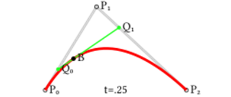
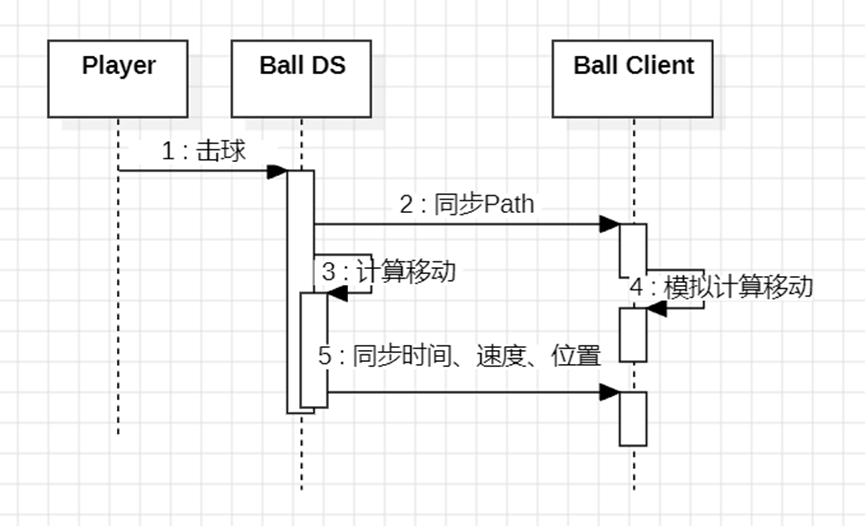

# 刀刃球同步算法

+ 球的位置由两个数据决定，1 贝塞尔曲线，2 飞行时间。通过飞行时间可以计算出这个时间点球在贝塞尔曲线上的位置。

+ 击球时：DS端确定贝塞尔曲线+击球时间戳，通过RPC通知Client。DS和Client同时以击球时间戳模拟球飞行运动。

+ 飞行过程：DS定期推送当前飞行时间。Client收到后对比自己模拟的时间，如果位置不同超过一定距离，则以DS推送的当前时间计算出新的位置。

