# 角色调试工具

## 工具定位

配合新技能编辑器框架，帮助开发者速查一些使用新技能编辑器制作的技能/Buff，帮助开发者高速完成游戏技能开发过程中的数值迭代、表现迭代

-------

## 工具入口

进入PIE调试，找到.png)

进入调试页签，找到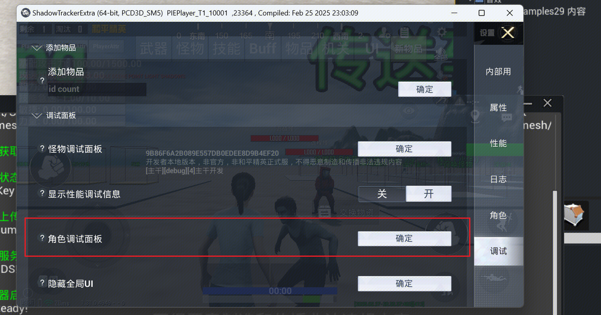

打开后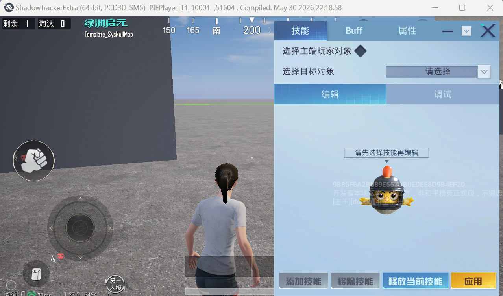

------

## 功能介绍

角色调试工具目前将分为技能调试面板、Buff调试面板、属性调试面板三个板块。

------

## 技能调试面板

技能调试面板，首先需要选中一个进行调试的技能目标。
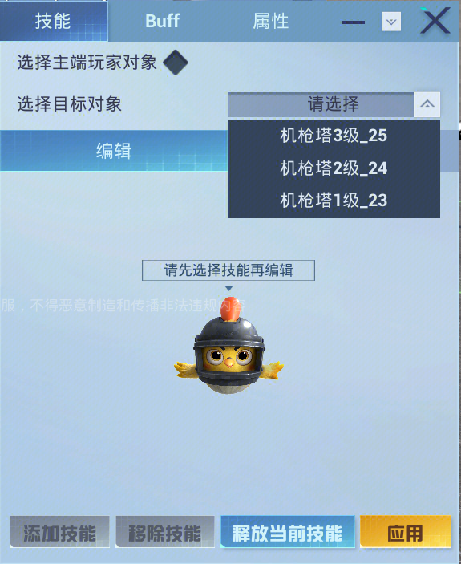
如果勾选了主端玩家对象，即代表选择了当前主端操控的玩家对象，则选择目标对象不会生效。
可以对该调试目标——快速添加、移除一个工程里配置好的技能。
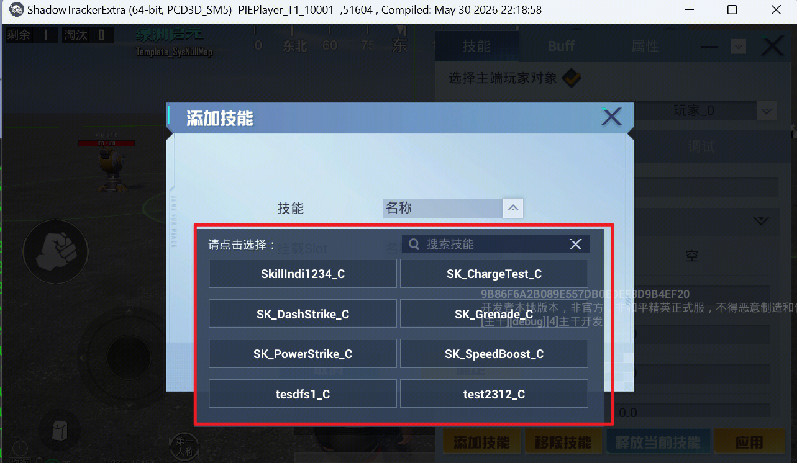
而选中调试目标的一个具体技能后，可以通过编辑页签，快速迭代配置该技能的技能消耗和技能CD。
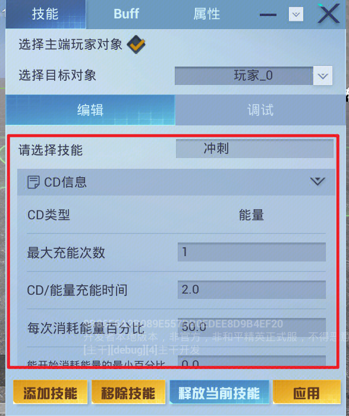
而切到调试页签，则可以快速查看技能的一些运行时数据——
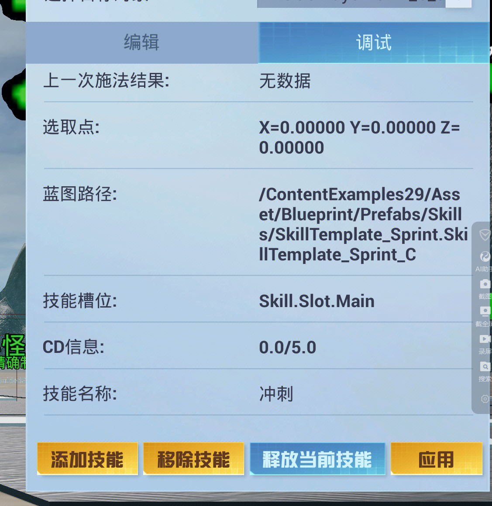

-------

## Buff调试面板

Buff调试面板会把玩家自身的Buff列表默认显示出来，如果还想调一个其他的角色，比如怪物，同样需要进行选中。
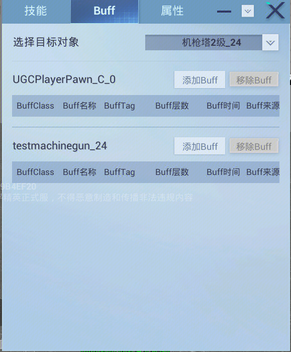
可以利用工具快速添加、移除Buff
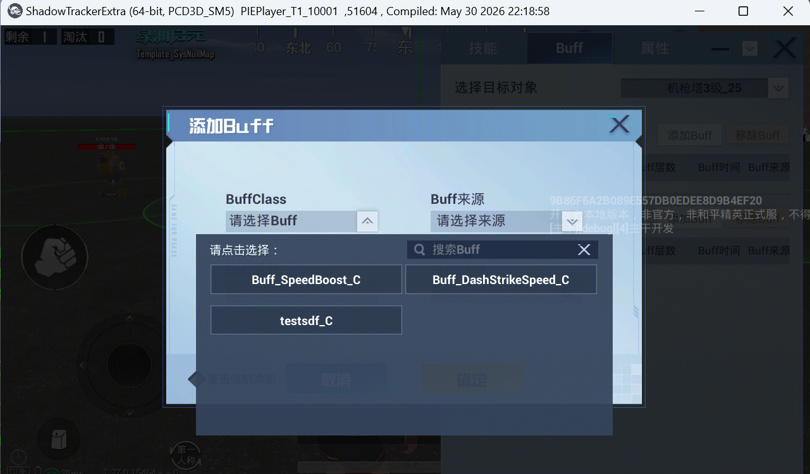
当角色身上携带Buff的时候，其Buff的具体信息会显示在该面板
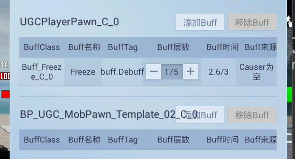

-------

## 属性调试面板

选中一个场景里存在的角色后，将显示其身上全部的属性，和对应的具体值
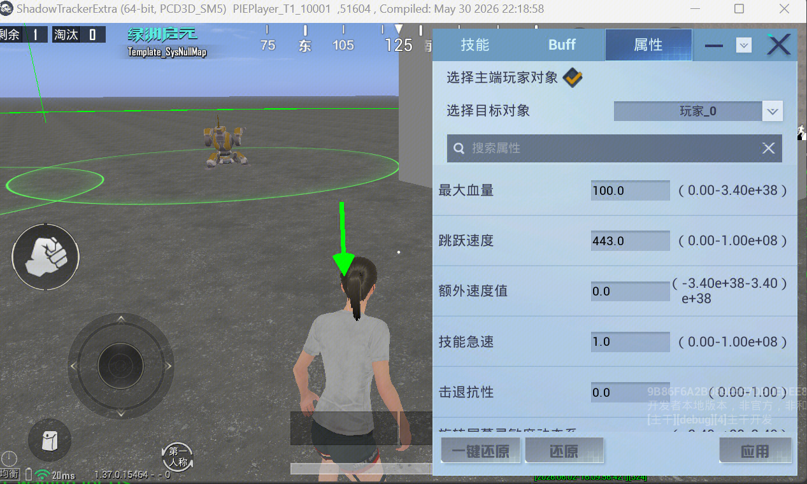
注意选择主端玩家对象的含义和技能调试面板的含义一致，勾选后，即代表此刻选中的主端操作玩家对象，不再启用选中目标对象的目标。
可以直接通过该面板，修改对应属性的值（不需要修改的时候，也可以直接还原）。
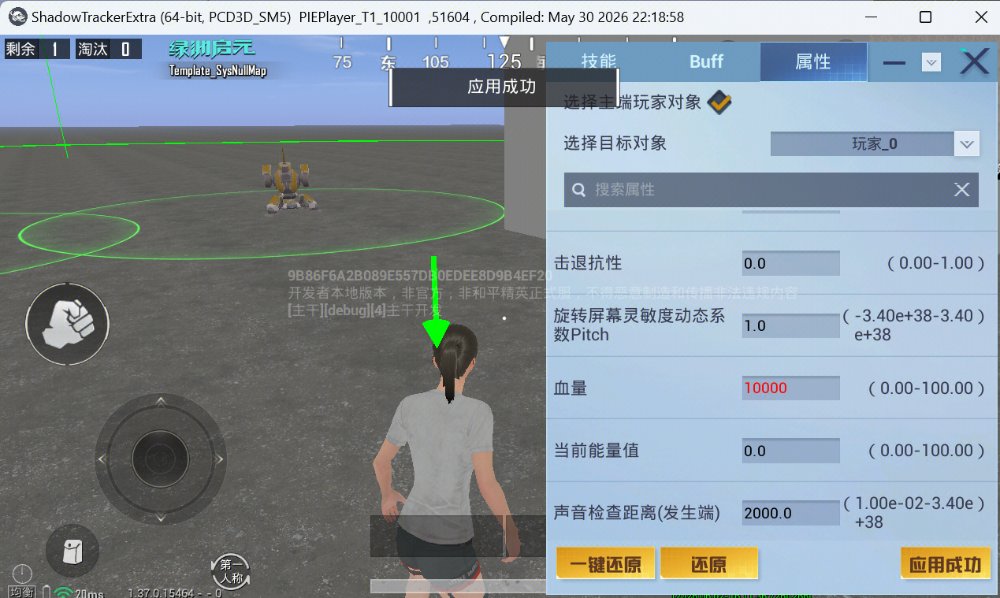

------

## 面板拖拽

可以长按住面板最上面的部分将面板拖动到其他位置，方便进行调试操作。
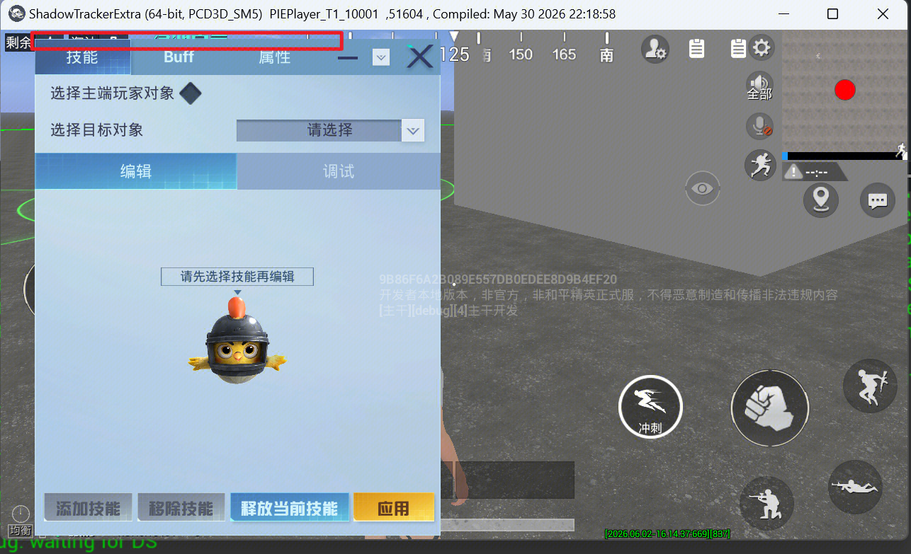
