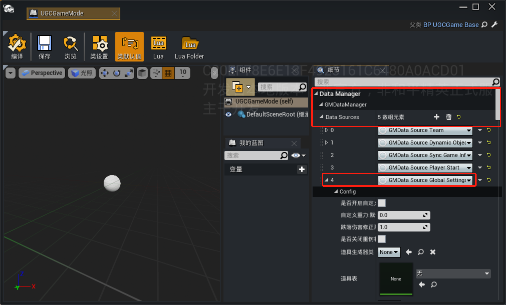
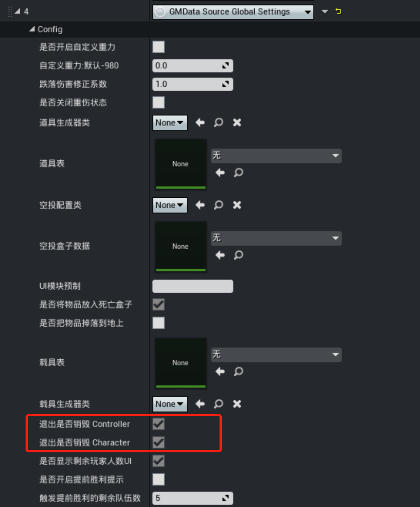
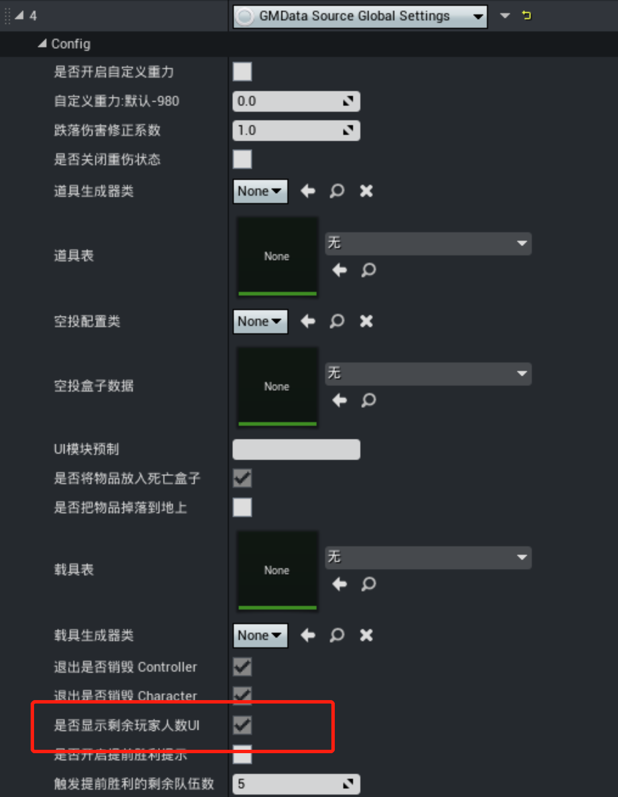
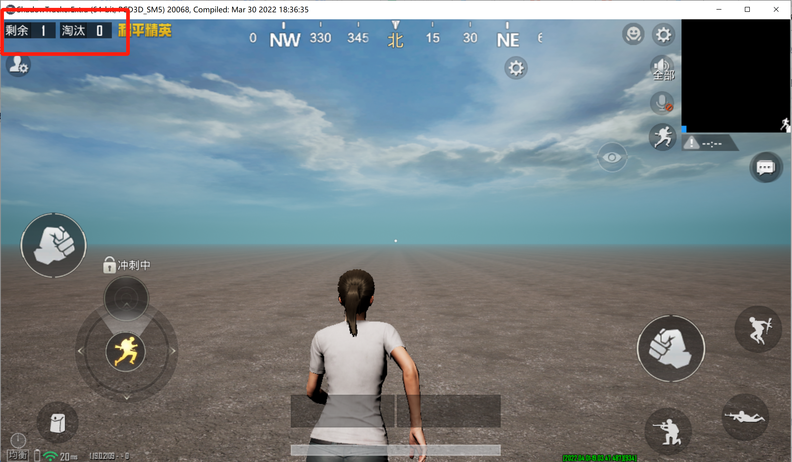
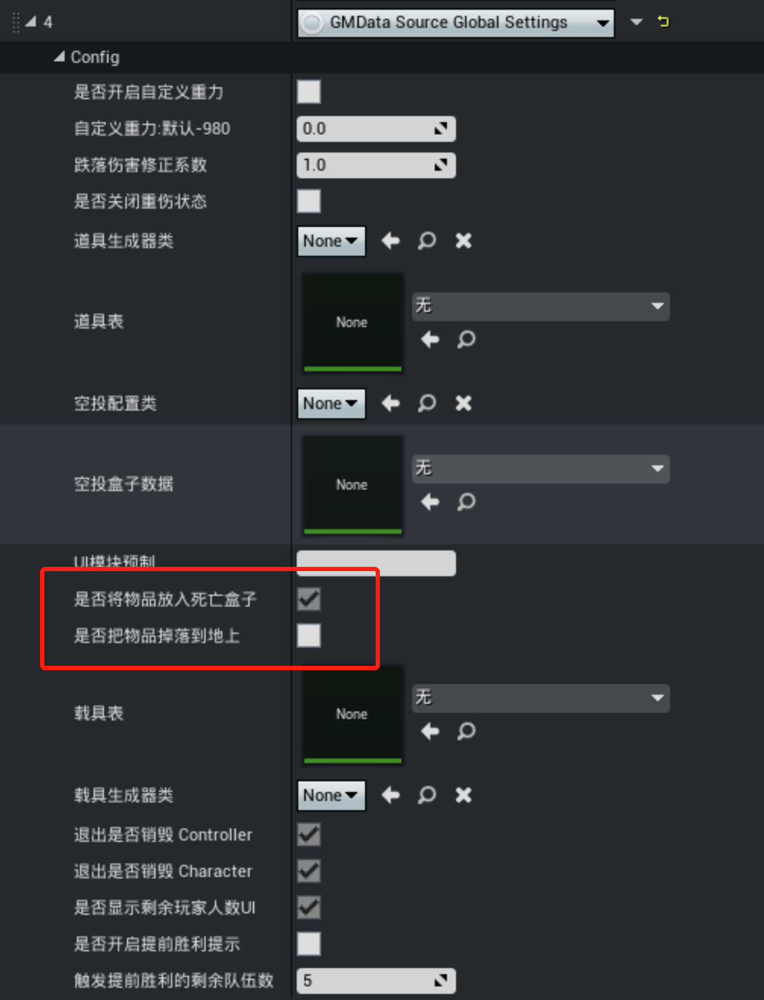
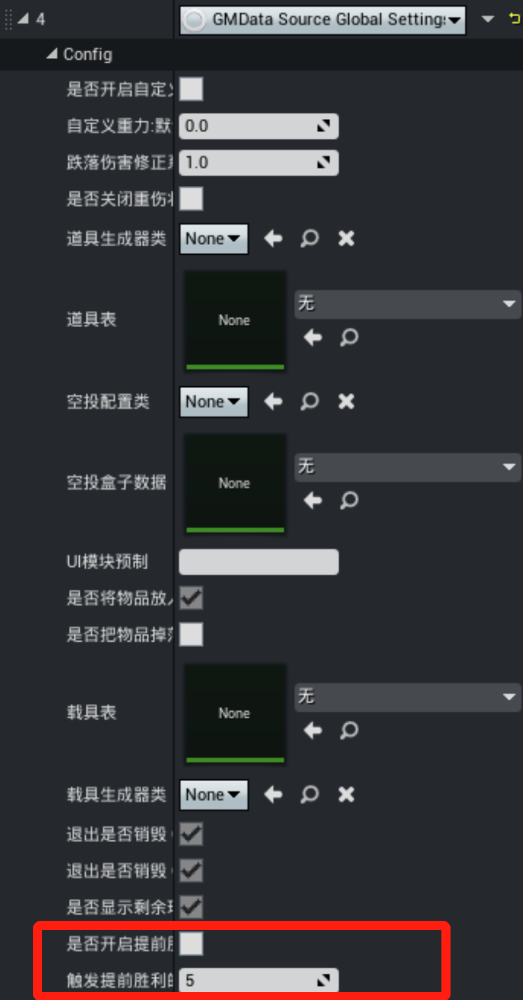

#  预置游戏规则

在游戏制作的过程中，可以通过配置GameMode上预制规则的属性，实现部分游戏规则。预制游戏规则的配置在GameMode蓝图中的DataManager的GlobalSetting中。

## 玩家退出处理

在组队类型的玩法模式中，通常队伍的存活情况对于玩法胜利规则非常重要。当玩家退出游戏时，队伍的存活情况应该如何处理，不同玩法模式要求会有所不同。

和平精英中，队伍存活情况由队伍中的角色是否被销毁所决定，所以GameMode中预制了两条规则用来指定玩家退出游戏后，Character和Controller是否应该被销毁。
>Character被销毁时，若队伍中没有其他存活玩家，则会触发灭队。

## 剩余人数规则

对于多人游戏模式，战斗UI中默认预制了剩余人数统计的功能，若玩法模式中不需要该功能，可以在GameMode中选择开启和关闭。

## 淘汰盒子规则

玩家在游戏模式中被淘汰时，淘汰表现在和平精英中表现为变成盒子，将掉落的道具放入盒子中。若玩法模式不希望采用这种方式，可以在GameMode中配置，如下图所示。

## 提前胜利规则

对于需要淘汰其他队伍来取得胜利的玩法模式，比如吃鸡类玩法，必须具备允许玩家提前胜利的功能，即当剩余队伍数量达到一个阈值的时候，玩家可以选择提前结束游戏，获得游戏的胜利。在GameMode开启对应的选项，可以开启提前胜利功能，并可以配置触发提前胜利的队伍数量。

