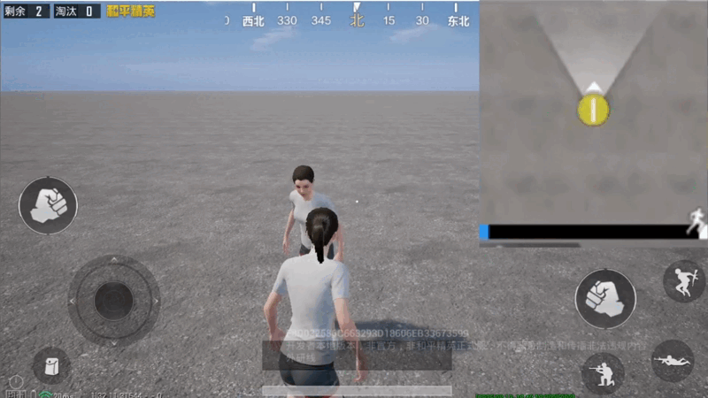
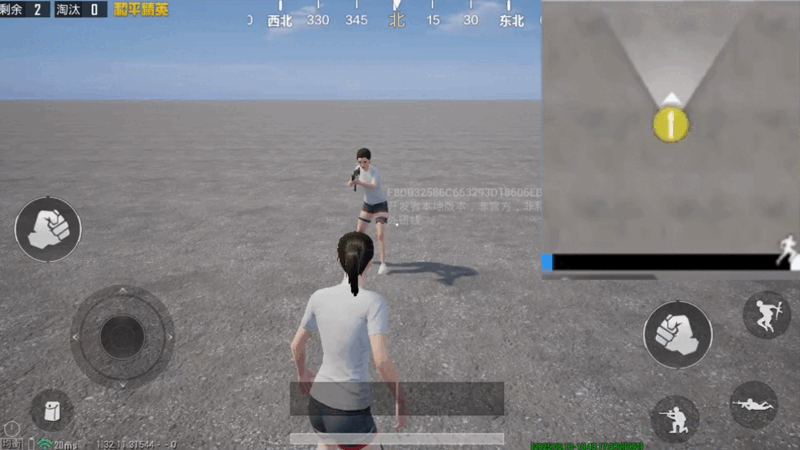
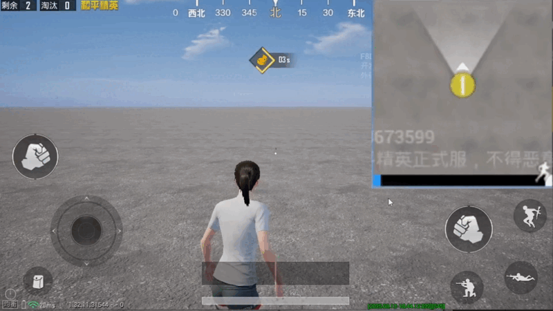
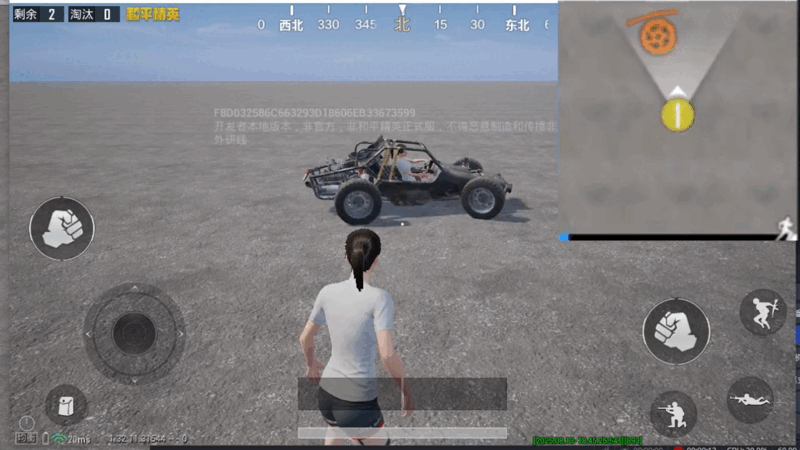
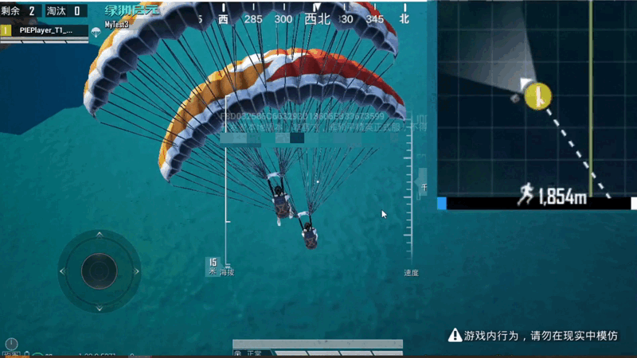
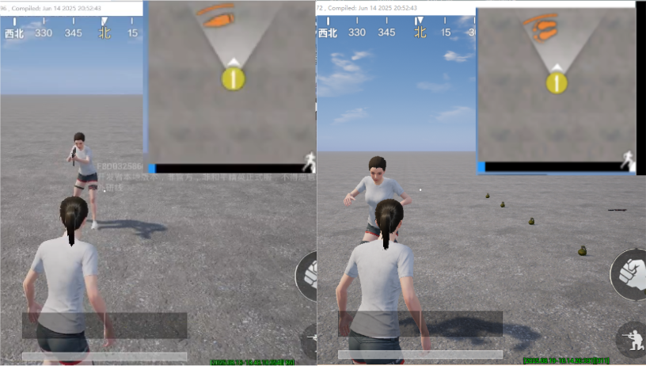
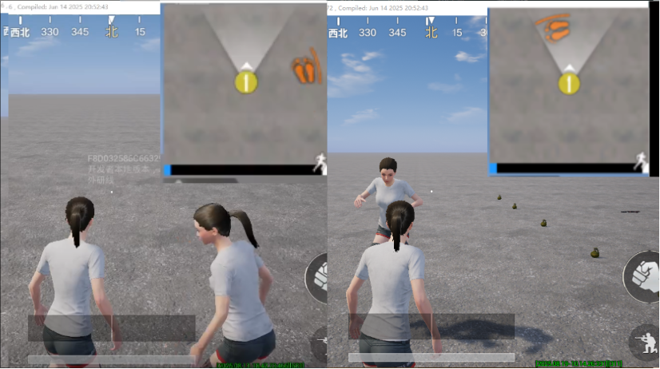
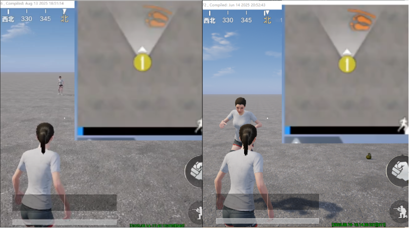

# 小地图音效可视化

为了帮助玩家更清晰地识别游戏中的各种音效，游戏提供了小地图音效可视化功能，以标识的形式把音效显示在小地图上。游戏中默认启用音效可视化，开发者可通过配置参数或调用API，对音效进行选择性可视化，从而改变音效提示的程度。

## 可视音效介绍

游戏中的音效标识会显示在小地图上，玩家可以据此判断音效的类型、方向和距离。

### 可视音效类型

|音效名称|图标|触发条件|示例|
|-|-|-|-|
|脚步||敌人进行跳跃、行走、游泳等移动活动时触发||
|开火||敌人使用枪械射击时触发||
|爆炸||任何投掷物、载具等物体爆炸时触发||
|载具||敌人驾驶载具移动时触发||
|玻璃破碎||其他玩家击碎玻璃时触发||
|降落伞关闭||敌人使用降落伞落地时触发||
|其他|-|其他类型的可视音效包括: 复活基站声、怪物脚步声、NPC脚步声、NPC枪声|-|

---

### 音效可视化的提示内容

|名称|表现规则|示例|
|-|-|-|
|音效类型|根据图标的形态，判断音效的类型||
|方向|根据标识的位置和弧线突起的朝向，判断音效相对玩家的方向 <br>(如果没有配置小地图，提示的方向存在偏差)||
|距离|距离越远，标识越透明||

## 配置音效可视化

点击进入【玩法通用设置】，然后在【MiniMap Setting】中，点击展开列表。音效可视化默认全部启用，通过点击列表的选项，改变所有玩家对该类型音效的可视性。


> - 配置音效可视化前需要配置 [小地图](./152_小地图.md) ，否则音效标识的方向存在偏差。
> - 如需修改指定玩家的音效可视化，请通过客户端动态调用的方式实现，具体操作请参考"动态设置说明"部分。

## 动态设置说明

在玩法进程中，可以调用 [SetVoiceVisualization](https://developer.gp.qq.com/api/#/searchContent/UGCMapMarkManagerSystem?classDetailShow=true&path=class%2Fdetail%2F%E5%92%8C%E5%B9%B3%E5%85%A8%E5%B1%80%E6%8E%A5%E5%8F%A3%2FUI%20%E7%95%8C%E9%9D%A2%2FUGCMapMarkManagerSystem.json&isSelect=1&apiEnc=%5B%22%E7%B1%BB%22%5D&apiLabel=UGCMapMarkManagerSystem&autoJump=SetVoiceVisualization) 动态调整具体音效的可视化，调用 [IsVoiceVisualizationFlagEnable](https://developer.gp.qq.com/api/#/searchContent/UGCMapMarkManagerSystem?classDetailShow=true&path=class%2Fdetail%2F%E5%92%8C%E5%B9%B3%E5%85%A8%E5%B1%80%E6%8E%A5%E5%8F%A3%2FUI%20%E7%95%8C%E9%9D%A2%2FUGCMapMarkManagerSystem.json&isSelect=1&apiEnc=%5B%22%E7%B1%BB%22%5D&apiLabel=UGCMapMarkManagerSystem&autoJump=IsVoiceVisualizationFlagEnable) 查询具体音效的可视化。在客户端调用时仅影响当前玩家，在服务端调用时对全体玩家生效。

示例的代码与运行效果如下。玩家点击第一个按键，会关闭自身对脚步声的可视化；点击第二个按键，对应文本显示脚步声的可视化状态。

``` lua
--UI控件的初始化函数
function MainUI:Construct()
    --给按键绑定点击事件回调
    self.Button_60.OnClicked:Add(self.Button_60_OnClicked, self);
    self.Button_111.OnClicked:Add(self.Button_111_OnClicked, self);
end

function MainUI:Button_60_OnClicked()
		--关闭当前客户端对脚步声的音效可视化
    UGCMapMarkManagerSystem.SetVoiceVisualization(EVoiceVisualizationFlag.CharacterMove,false);
end

function MainUI:Button_111_OnClicked()
    --检测并提示当前客户端对脚步声的可视化状态
    local myVoice = UGCMapMarkManagerSystem.IsVoiceVisualizationFlagEnable(EVoiceVisualizationFlag.CharacterMove);
    if myVoice then
        self.TextBlock_132:SetText("脚步声的可视化在开启状态");
    else
        self.TextBlock_132:SetText("脚步声的可视化在关闭状态");
    end
end
```


## API参考

|函数库/类名|函数类型|函数功能范围|
|-|-|-|
|[SetVoiceVisualization](https://developer.gp.qq.com/api/#/searchContent/UGCMapMarkManagerSystem?classDetailShow=true&path=class%2Fdetail%2F%E5%92%8C%E5%B9%B3%E5%85%A8%E5%B1%80%E6%8E%A5%E5%8F%A3%2FUI%20%E7%95%8C%E9%9D%A2%2FUGCMapMarkManagerSystem.json&isSelect=1&apiEnc=%5B%22%E7%B1%BB%22%5D&apiLabel=UGCMapMarkManagerSystem&autoJump=SetVoiceVisualization)|静态函数|开关小地图上的指定类型音效图标|
|[IsVoiceVisualizationFlagEnable](https://developer.gp.qq.com/api/#/searchContent/UGCMapMarkManagerSystem?classDetailShow=true&path=class%2Fdetail%2F%E5%92%8C%E5%B9%B3%E5%85%A8%E5%B1%80%E6%8E%A5%E5%8F%A3%2FUI%20%E7%95%8C%E9%9D%A2%2FUGCMapMarkManagerSystem.json&isSelect=1&apiEnc=%5B%22%E7%B1%BB%22%5D&apiLabel=UGCMapMarkManagerSystem&autoJump=IsVoiceVisualizationFlagEnable)|静态函数|获取小地图上指定类型音效图标的开关状态|
