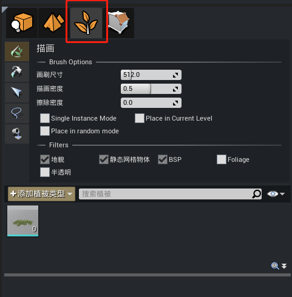
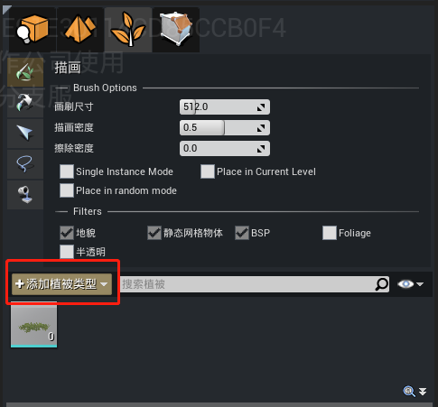
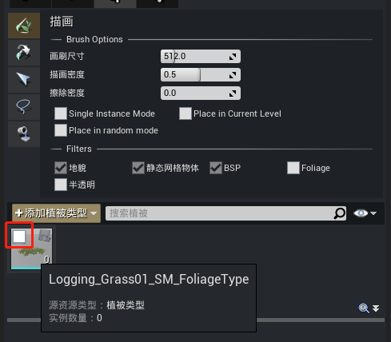
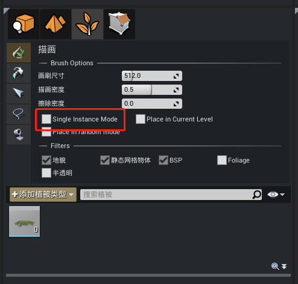

#  植被工具

植被工具是一种用于在其他几何体表面上渲染静态网格体或植被Actor的模式，可用于表现地面上的覆盖物效果。

## 一、创建植被

### 1. 植被编辑模式

点击选择植被编辑模式

### 2. 添加植被类型

点击添加植被类型

### 3. 放置植被

勾选想要放置的植被类型后，在场景中点击鼠标左键放置。

**注意：如果需要放置单株的植物，则需要需要勾选“Single Instance Mode"**

