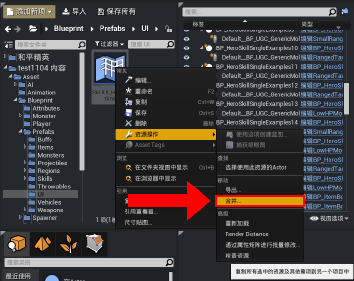
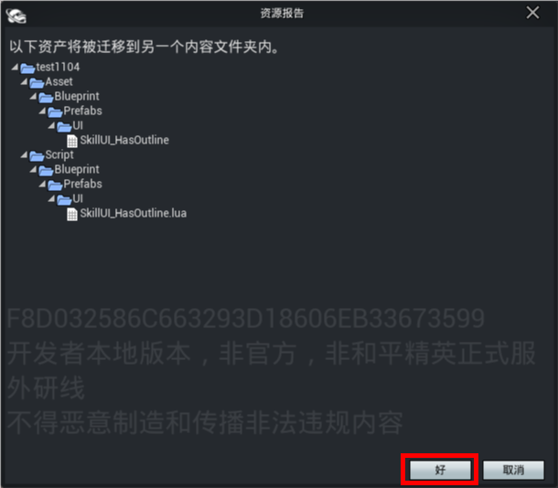
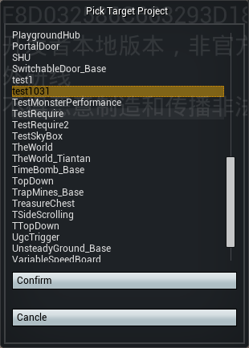
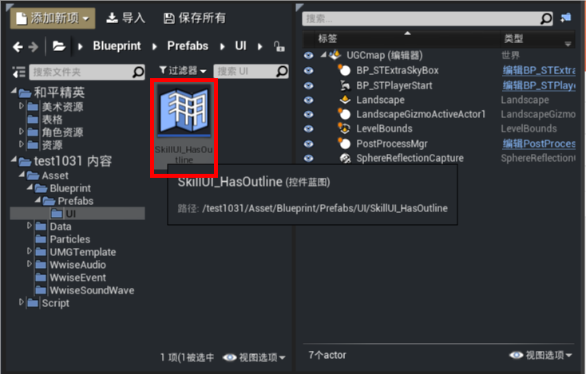

# 资产迁移

绿洲启元编辑器现已支持资产迁移功能，可将指定资产及其关联资源全部加入其他工程中，保证在被加入的工程中也能正常使用该资产。

## 操作流程

首先右键需要迁移的资产，依次选择“资源操作”->“合并”。

在弹出的“资源报告”窗口中，系统将列出所有将被迁移的资产（包括目标资产及其依赖项），确认无误后，点击“好”。

在“Pick Target Project”窗口中，从工程列表中选择要迁入的目标工程名称，最后点击“Confirm”，执行资产迁移。

迁移完成后，目标工程的对应目录中可看到已迁入的资产，可正常编辑或使用。

## 注意事项

- 迁移物品蓝图时，其信息不会自动录入表格 ``UGCBattleltem`` ，迁移完成后需要在目标工程打开对应物品蓝图，打开后系统将自动完成物品ID的生成与表格更新
- 不建议基于操作系统文件资源管理器直接复制资源文件至其他工程，否则会导致资源引用关系异常，请规范使用编辑器的资产迁移功能
- 从资源商店下载资源并导入工程后，其产生在 ``ExtendResource`` 目录的资源暂不支持资产迁移
