#  资源导入

绿洲启元编辑器的资源编辑、导入及导出权限如下：

|  | 导入 | 编辑 | 导出 |
| -| -| -| -|
| **静态模型** | √ | √ | / |
| **骨骼模型** | √ | / | / |
| **动画** | √ | √ | / |
| **贴图** | √ | √ | / |
| **材质** | / | √ | / |
| **特效** | / | √ | / |
| **音频** | √ | √ | / |

## 静态模型导入

### 资源格式

- FBX
- OBJ

---

### 导入方法

将符合格式的资源直接拖动到编辑器Asset目录下用户指定的文件下即可

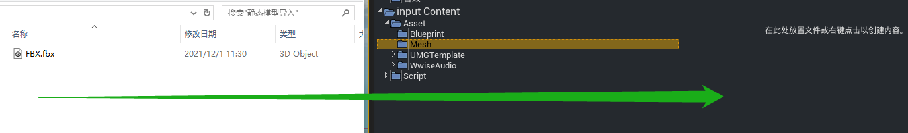

---

### 导入选项

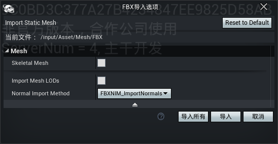

静态模型建议使用默认导入选项

- Skeletal Mesh ：静态模型不勾选，骨骼模型勾选
- Improt Mesh LODs ：导入LOD设置一般不勾选，可在模型设置里单独导入LOD；如果模型资源已经包含LOD可以勾选后一并导入
- Normal Import Method ：导入模型的顶点发线，默认使用第二个内容<br>
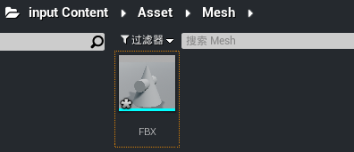

  点击导入后即可完成模型资源导入

## 贴图导入

### 资源格式

- PNG
- JPG
- TGA

---

### 导入方法

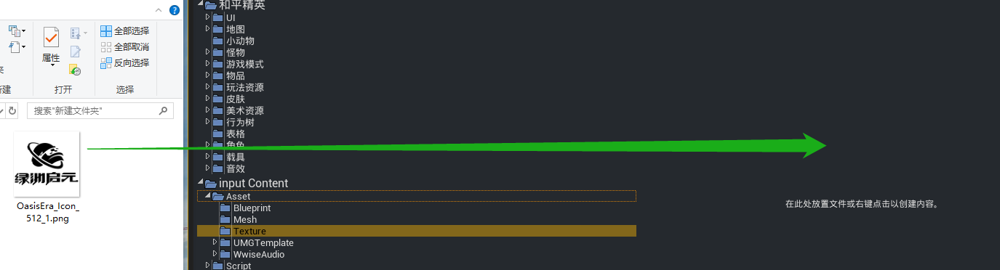

将符合格式的资源直接拖动到编辑器Asset目录下用户指定的文件下即可

---

### 导入选项

默认导入，具体编辑选项见图片编辑内容

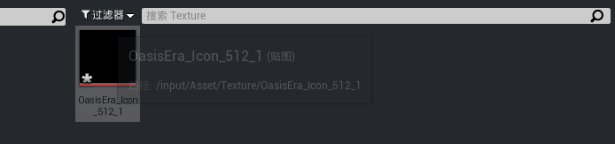

## 骨骼与动画导入

编辑器目前提供了一个通用人形骨架,可用于动画制作，再导入到编辑器内使用

地址：[https://drive.weixin.qq.com/s?k=AJEAIQdfAAotXDHrkA](https://drive.weixin.qq.com/s?k=AJEAIQdfAAotXDHrkA)
```
如游戏内使用替换模型后遇到蒙皮异常，可在对应API启用重定向功能
```

### 资源格式

- FBX

---

### 导入方法

在内容浏览器中点击【导入】，选择并打开对应的FBX文件。

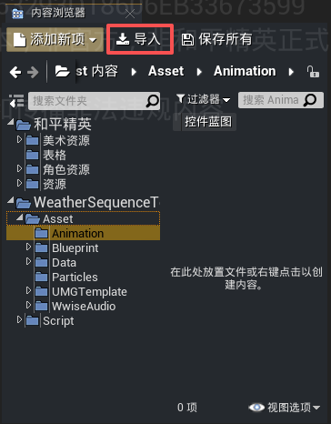

#### 导入动画及骨骼体

当需要导入完整的动画和骨骼网格体，请按以下要求导入：
- 勾选【Skeletal Mesh】、【Import Mesh】与【Import Animations】
- 【Skeleton】不指定现有骨骼，保持为空
- 【Normal Import Method】选择 "Import Normals and Tangents"，以避免潜在的贴图显示问题

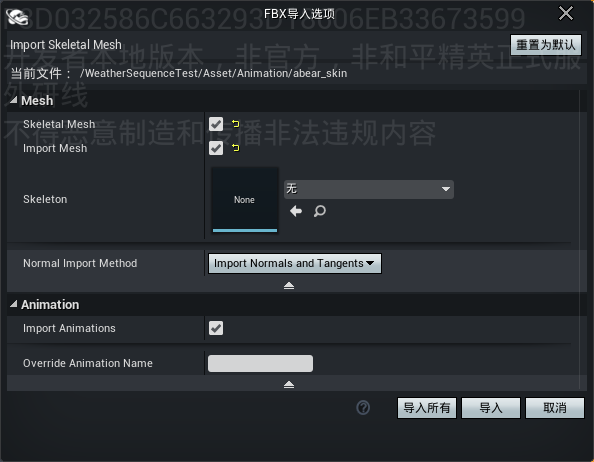

导入成功后系统将自动生成骨骼网格体，骨骼和动画，但导入的网格体初始状态下不包含材质，需要为其新建材质球，并手动导入贴图进行配置。

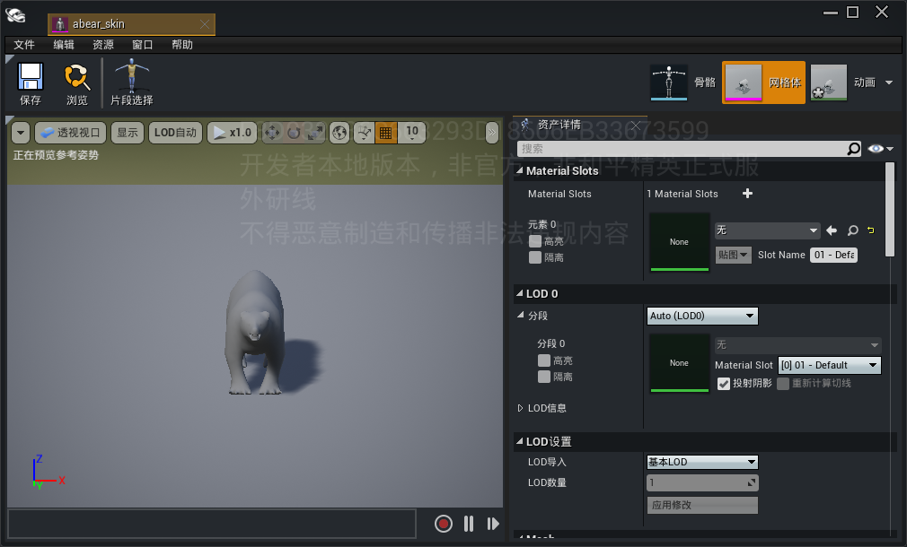

---

#### 仅导入骨骼网格体和骨骼

若只需导入模型和骨骼，无需动画，请按以下要求导入：
- 勾选【Import Mesh】
- 取消勾选【Import Animations】
- 【Skeleton】不指定现有骨骼，保持为空

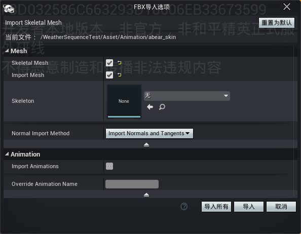

---

#### 仅导入动画

如果项目已具备骨骼网格体和骨骼，只需导入新的动画序列时，请按以下要求导入：
- 【Skeleton】必须指定为项目中已有的、正确的骨骼资产
- 勾选【Skeletal Mesh】与【Import Animations】

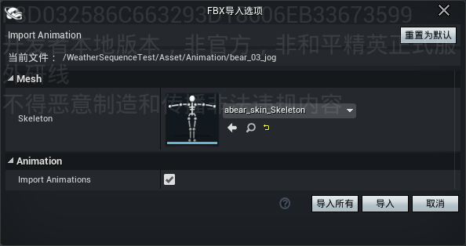

---

### 导入选项


- Skeletal Mesh：是否将传入的FBX作为骨骼对象导入
- Import Mesh：是否导入网格，仅在导入骨骼网格时允许动画导入
- Skeleton：用于导入资产的骨骼。在导入网格时，将此设置为"None"将创建一个新的骨骼；在导入动画时，必须指定此值以导入该资源
- Normal Import Method：法线数据导入方式，决定如何处理模型表面的法线
- Import Animations：是否将传入的FBX作为动画导入
- Override Animation Name：用于覆盖要导入动画的名称，不进行编辑时将使用FBX文件的名称

## 音效导入

### 资源格式

- WAV
- MP3
- AAC

---

### 导入方法

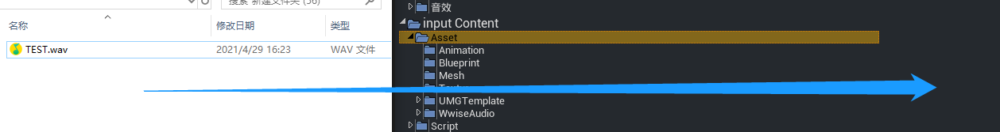

将符合格式的资源直接拖动到编辑器Asset目录下即可，导入后音频资源会自动放置在WwiseEvent路径下

---

### 导入选项

可以根据需求（是否是3D音频等）选择音频资源类型，然后导入

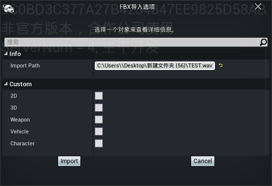

导入后自动放置在WwiseEvent路径

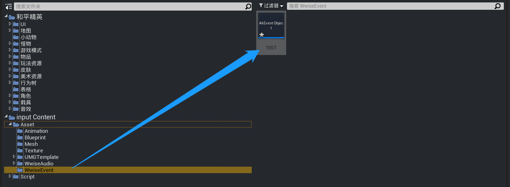

## 注意事项

若拖动资源导入到编辑器内出现禁止的图标，则需要调整系统权限，步骤如下：
1. 控制面板内用户账户，更改为从不通知<br>
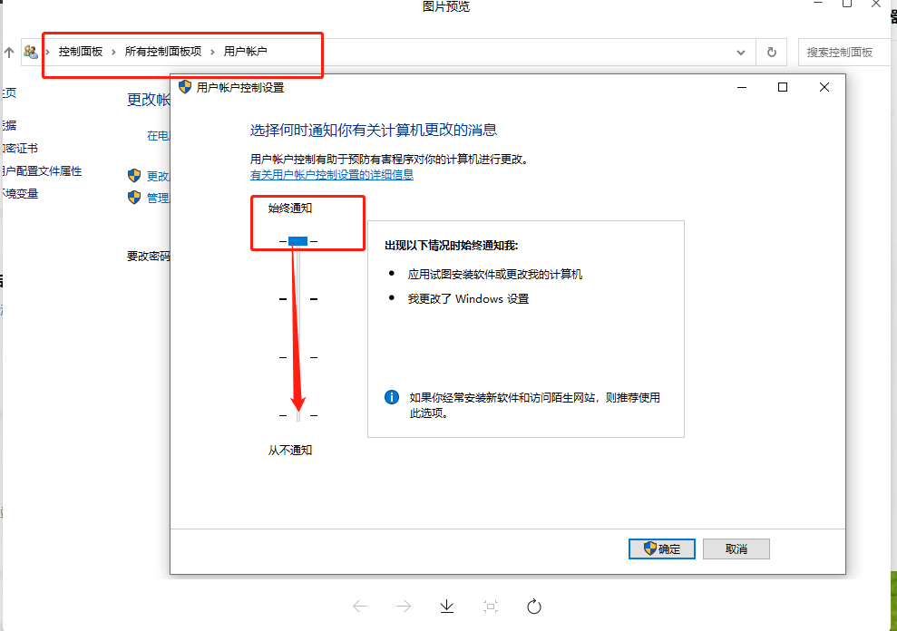

2. cmd运行指令 gpedit.msc，禁用图中标识的两项<br>
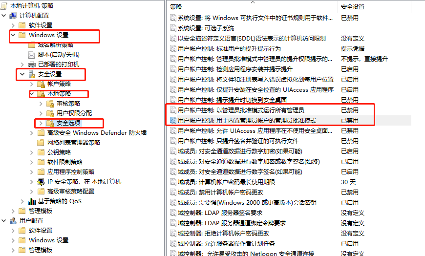
