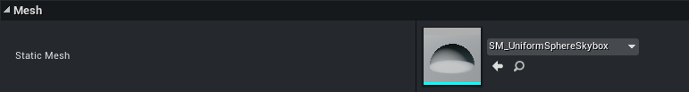
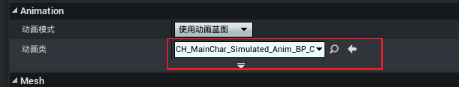
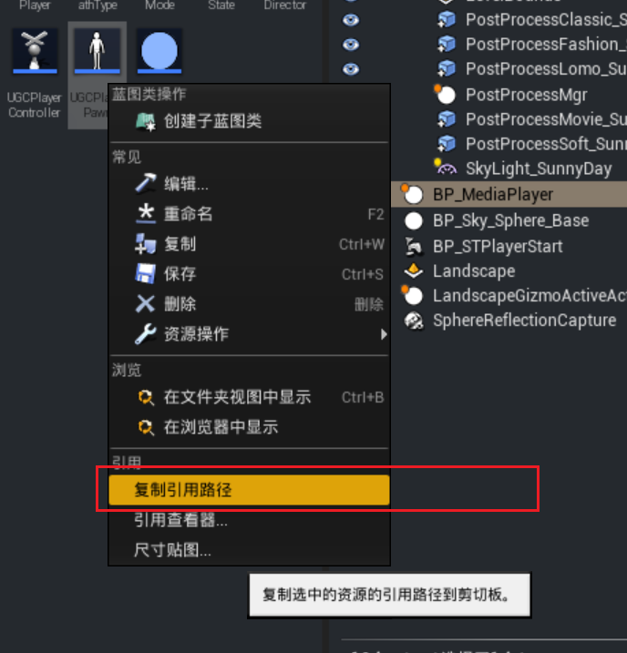
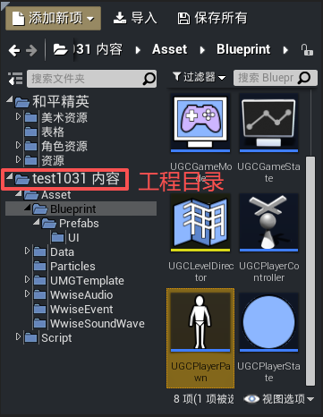
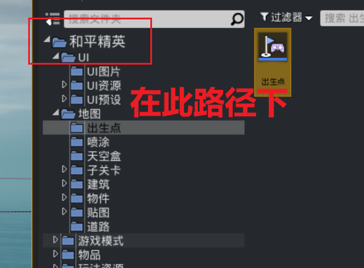
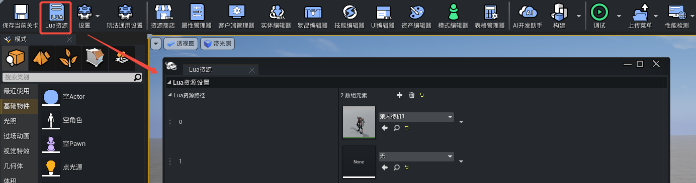
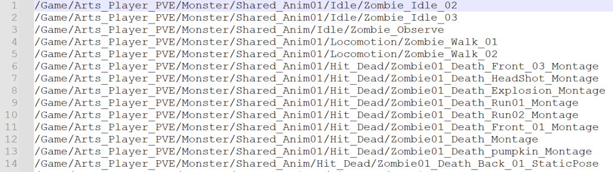

#  资源引用

绿洲启元编辑器可以通过多种方式对资源进行引用。

## 通过属性面板选取资源

- 含缩略图的情形



- 无缩略图的情形



## 通过Lua资源引用指定资源

玩法中通常会大量引用和平精英的美术资源，由于和平每个版本对资源路径可能存在调整或者移除的操作，玩法中引用到的资源受到影响会出现贴图丢失或者白模的现象，这种情况下需要将资源打入玩法包中以避免资源异常的问题。

1. 对需要打入玩法包的资源右键 ``复制引用路径``，将资源的完整路径复制下来。



- 在工程目录下的情形



```UGCGameSystem.GetUGCResourcesFullPath('Asset/Blueprint/UGCPlayerPawn.UGCPlayerPawn_C')```

- 在“和平精英”目录下的情形



```'/Game/BluePrints/Player/PlayerStart/BP_STPlayerStart.BP_STPlayerStart_C'```

2. 点击编辑器菜单栏【Lua资源】按钮，添加数组元素，并将刚才复制的资源路径粘贴进来。



通过Lua资源引用后将写入到工程根目录的 ``ReferenceAssetList.txt`` 文件中，特别需要注意的是，生成的路径形式无后缀名，例如：对于引用路径为 ``/Game/UGC/UGCGame/Vehicle/VehicleTemplate/AquaRail.AquaRail_C``的资源，在文件中的名称为 ``/Game/UGC/UGCGame/Vehicle/VehicleTemplate/AquaRail``。


