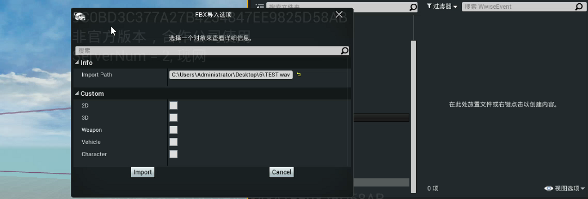
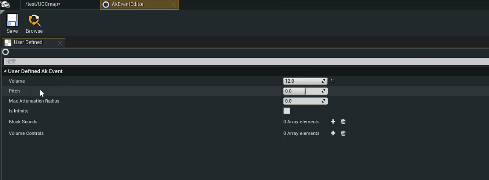
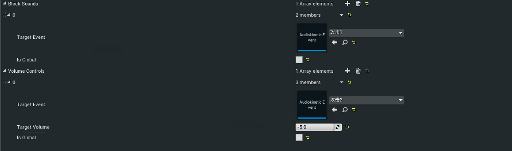

#  音频编辑

音频的导入和编辑操作规范

## 导入格式

mp3 
wav 
aac

## 导入选项

编辑器提供了2D、3D、Weapon、Vehicle、Character 5类音频模板。 
2D,3D音效可基本覆盖玩法逻辑内容相关需求；武器，枪械，角色音效需要结合和平精英内相关逻辑做适配。 
导入音频默认使用2D模板，勾选其他类型可切换模板类型导入

## 内容编辑

### 基础参数设置

Volume：音量调整 
Pitch：音高调整 
Max Attenuation Radius：音效衰减距离 
Is Infinite：音频是否循环播放

### 事件音频接入

Block Sounds：Target音频播放后会打断该音效 
Volume Controls：Target音频播放后会将该音频音量调整到某个值
