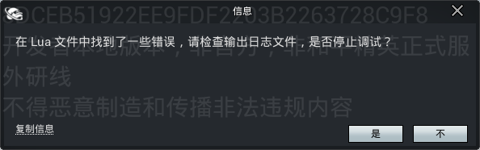
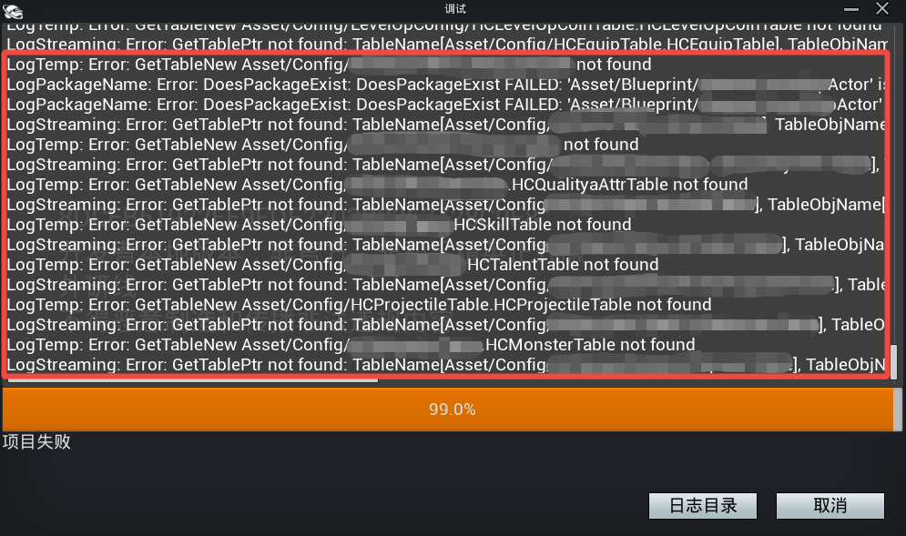
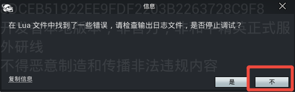

# 1.33 Release Notes

关于版本功能使用中发现及反馈的bug修复安排，可前往 [bug修复计划公示表](https://docs.qq.com/sheet/DSUFnT1BQWGpHYWNN?no_promotion=1&tab=BB08J2) 中查看了解。

## 1.33.12.32564 更新说明

### 编辑器

**bug Fixes**

- 修复PIE模拟【和平精英模拟器】内玩法调试时，设置界面的UI适配问题

---

## 1.33.12.32562 更新说明

### 编辑器

**bug Fixes**

- 修复死亡复活后无法装备近战武器的问题
- 修复多人PVE模板大厅商店购买的物品进对局后被清空的问题

### API

**功能更新**

- 新增复制角色Avatar的函数 [``ServerShowAvatar``](https://developer.gp.qq.com/api/#/searchContent/UGCCharAvatarShowcaseActor?classDetailShow=true&path=class%2Fdetail%2FOthers%2FUGCCharAvatarShowcaseActor.json&isSelect=1&apiEnc=%5B%22%E7%B1%BB%22%5D&apiLabel=UGCCharAvatarShowcaseActor&autoJump=ServerShowAvatar) 与 [``ClientShowAvatar``](https://developer.gp.qq.com/api/#/searchContent/UGCCharAvatarShowcaseActor?classDetailShow=true&path=class%2Fdetail%2FOthers%2FUGCCharAvatarShowcaseActor.json&isSelect=1&apiEnc=%5B%22%E7%B1%BB%22%5D&apiLabel=UGCCharAvatarShowcaseActor&autoJump=ClientShowAvatar)，并支持调用 [``PlayAnim``](https://developer.gp.qq.com/api/#/searchContent/UGCCharAvatarShowcaseActor?classDetailShow=true&path=class%2Fdetail%2FOthers%2FUGCCharAvatarShowcaseActor.json&isSelect=1&apiEnc=%5B%22%E7%B1%BB%22%5D&apiLabel=UGCCharAvatarShowcaseActor&autoJump=PlayAnim) 播放角色指定动画

---

## 1.33.12.32560 更新说明

### 编辑器

**bug Fixes**

- 修复物品表配有同名的物品时，导致上传后管理端显示的icon图片不一致的问题
- 修复部分情况下使用药品时，异常扣除物品数量的问题
- 修复打开旧版本工程创建的技能蓝图出现崩溃的问题

---

## 1.33.12.32558 更新说明

### 编辑器

**bug Fixes**

- 修复背包系统中的仓库面板关闭后无法再次打开的问题

---

## 1.33.12.32556 更新说明

### 编辑器

**功能更新**

- 新增旧版本特效编辑器的入口，通过菜单栏 ``编辑 -> 工程设置 -> 开启粒子编辑器V1`` 可选择切换为旧版本或者新版本的编辑态面板

	

**bug Fixes**

- 修复cook时因引入冗余引用资源导致玩法包体变大的问题
- 修复物品编辑器不显示空白物品模板
- 修复多人PVE模板角色死亡复活后不显示技能UI的问题
- 修复移动端新背包界面样式适配的问题

### API

**bug Fixes**

- 修复 [``GetUIDByPlayerController``](https://developer.gp.qq.com/api/#/searchContent/UGCGameSystem?classDetailShow=true&path=class%2Fdetail%2F%E5%92%8C%E5%B9%B3%E5%85%A8%E5%B1%80%E6%8E%A5%E5%8F%A3%2F%E5%9F%BA%E7%A1%80%E5%8A%9F%E8%83%BD%2FUGCGameSystem.json&isSelect=1&apiEnc=%5B%22%E7%B1%BB%22%5D&apiLabel=UGCGameSystem&autoJump=GetUIDByPlayerController) 客户端调用不生效的问题

---

## 1.33.12.32554 更新说明

### 编辑器

**功能更新**

- 新增魔火龙、远古石灵、丧尸法师、机甲天罚等不同风格的怪物资源
- 新增荣都关卡图的地图模板

**bug Fixes**

- 修复移动端释放带有选取类Task的技能时不显示指示器的问题
- 修复自定义的防弹衣模型设置位置偏移不生效且不跟随玩家动作的问题
- 修复PIE模拟【和平精英模拟器】内玩法调试时，自定义键位设置不生效的问题
- 修复PIE模拟【和平精英模拟器】内玩法调试时，呼出通用设置界面点击设置按钮无响应的问题
- 修复PIE模拟【和平精英模拟器】内玩法调试时，部分区域被遮挡无法响应控件交互的问题
- 修复PIE模拟【和平精英模拟器】内玩法调试时，坦克驾驶位不响应鼠标左键的开炮射击的问题

---

## 1.33.12.32552 更新说明

### 编辑器

**bug Fixes**

- 修复 ``脱战恢复`` 技能多次触发后丢失环身特效的问题
- 修复 ``发射抛体`` 技能Task取消勾选 ``覆写抛体速度及重力系数`` 属性后触发崩溃的问题
- 修复技能编辑器预览Actor类型为“法术场”，清除法术场蓝图时预览窗口中的法术场对象不消失的问题
- 修复物品编辑器于工程物品资源列表中拖拽物品执行复制操作时，创建的新物品数据异常的问题
- 修复属性管理器对固化属性推导不生效的问题

---

## 1.33.12.32550 版本说明

### 编辑器

**新功能**

- 新增 [表格管理器](../通用功能/20208_表格管理器.md) ，统一工程内各类型的表格管理方式，查找或修改表格数据更加方便，同时支持导入导出表格
- 新增 [特效编辑器](../进阶内容/20223_特效编辑器.md)，内置多种特效模板，简化特效的配置流程
- 新增 [小地图音效可视化](../新手入门/游戏场景/20202_小地图音效可视化.md) 功能，支持蓝图配置及动态设置小地图可视化图标的显隐
- 新增 [法术场](../进阶内容/GamePlay系统/技能系统/20217_法术场.md)，可配置化的框架帮助开发者快速实现区域范围的场景技能效果
- 新增 [玩法特权](../商业化及功能模板/20213_玩法特权接入指南.md) 功能，接入后可为玩法定制针对特权玩家的专属权益功能
- 支持通过 [治疗公式](../进阶内容/GamePlay系统/属性与伤害/20216_全局治疗公式.md) 管理全局治疗值的计算逻辑
- 提供玩家 [角色Avatar复制](../进阶内容/GamePlay系统/角色系统/20228_角色Avatar复制.md) 功能，可以在场景中克隆玩家角色模型

**功能更新**

【属性修改器】

- 新增持续修改类型，应用属性修改器的场景将 ``结束时不还原属性`` 调整为 ``临时修改`` 的修改方式，例如 [角色修改属性](../进阶内容/GamePlay系统/技能系统/技能编辑器2.0/20094_技能Task查询手册.md#技能Task-角色修改属性)

> 编辑器默认会对从32升级到33的跨版本工程做自动兼容修改，但是如果工程于32版本未编辑或者保存过，自动修改的结果可能与预期不一致，建议开发者检查涉及修改属性的各场景相关配置

【技能编辑器】

- 新增跃击、爆裂双发、金蝉脱壳、亡语:毒谭、指挥官、脱战恢复和分裂等多种技能模板
- [基础属性配置](../进阶内容/GamePlay系统/技能系统/技能编辑器2.0/20091_技能编辑器.md#技能基础配置) 新增 ``切换视角`` 与 ``切换Pose姿态`` 的3C设置及技能释放的激活条件
- 技能Event新增 [碰撞事件](../进阶内容/GamePlay系统/技能系统/技能编辑器2.0/20112_技能Event查询手册.md#碰撞事件)、[受到治疗事件](../进阶内容/GamePlay系统/技能系统/技能编辑器2.0/20112_技能Event查询手册.md#受到治疗事件) 和 [造成治疗事件](../进阶内容/GamePlay系统/技能系统/技能编辑器2.0/20112_技能Event查询手册.md#造成治疗事件) 等事件组件
- 技能Condition新增 [人称检查](../进阶内容/GamePlay系统/技能系统/技能编辑器2.0/20111_技能Condition查询手册.md#人称检查) 条件组件
- 技能Task新增 [切换姿势](../进阶内容/GamePlay系统/技能系统/技能编辑器2.0/20094_技能Task查询手册.md#技能Task-切换姿势)、[治疗](../进阶内容/GamePlay系统/技能系统/技能编辑器2.0/20094_技能Task查询手册.md#技能Task-治疗)、[生成法术场](../进阶内容/GamePlay系统/技能系统/技能编辑器2.0/20094_技能Task查询手册.md#技能Task-生成法术场)、[切换人称](../进阶内容/GamePlay系统/技能系统/技能编辑器2.0/20094_技能Task查询手册.md#技能Task-切换人称)、[显示Tips](../进阶内容/GamePlay系统/技能系统/技能编辑器2.0/20094_技能Task查询手册.md#技能Task-显示Tips)、[缓存输入](../进阶内容/GamePlay系统/技能系统/技能编辑器2.0/20094_技能Task查询手册.md#技能Task-缓存输入)、[下一次<治疗>属性修改](../进阶内容/GamePlay系统/技能系统/技能编辑器2.0/20094_技能Task查询手册.md#技能Task-下一次<治疗>属性修改) 等Task组件，且【属性】类别下的Task均支持设置修改值为计算公式的属性来源
- [技能Task-选择点](../进阶内容/GamePlay系统/技能系统/技能编辑器2.0/20094_技能Task查询手册.md#技能Task-选择点) 中的单点选取器的碰撞检测功能支持 [过滤器](../通用功能/20218_通用过滤器.md)，可筛选允许重叠的阻挡目标
- [技能Task-发射抛体](../进阶内容/GamePlay系统/技能系统/技能编辑器2.0/20094_技能Task查询手册.md#技能Task-发射抛体) 增加覆写速度、重力系数及伤害的开关，覆写效果以开关及属性设置为准

【Buff编辑器】

- [Buff模板](../进阶内容/GamePlay系统/技能系统/Buff编辑器2.0/20087_Buff编辑器.md#Buff模板) 新增隐身与被透视两种新Buff
- BuffAction新增 [治疗恢复](../进阶内容/GamePlay系统/技能系统/Buff编辑器2.0/20117_BuffAction查询手册.md#治疗恢复)、[调用Lua脚本](../进阶内容/GamePlay系统/技能系统/Buff编辑器2.0/20117_BuffAction查询手册.md#调用Lua脚本)、[下一次伤害属性修改](../进阶内容/GamePlay系统/技能系统/Buff编辑器2.0/20117_BuffAction查询手册.md#下一次伤害属性修改) 与 [修改武器属性](../进阶内容/GamePlay系统/技能系统/Buff编辑器2.0/20117_BuffAction查询手册.md#修改武器属性)

【物品编辑器】

- 新增JS9冲锋枪、ACE32突击步枪、MG-36轻机枪、蝎式手枪、双持巨蟒、十字弩、爆炸猎弓、M79榴弹发射器与AWM狙击枪等枪械模板
- 枪械、近战武器、投掷物与穿戴装备类型的物品均已支持 [自定义物品模型](../进阶内容/GamePlay系统/物资系统/物资编辑器2.0/20212_自定义物品模型.md)
- [物品与背包槽位](../进阶内容/GamePlay系统/物资系统/物资编辑器2.0/20210_物品与背包槽位.md) 均已支持锁定与解锁

【背包系统】

- 支持设置 [半屏/全屏](../进阶内容/GamePlay系统/物资系统/物资编辑器2.0/20104_背包系统.md#设置背包样式) 的背包样式

【怪物系统】

- 新增后排刺客、爆裂虫、冰法师、岩石首领、丧尸法师、泰坦和球形机器人等多种怪物模板
- 怪物血条功能支持设置血条可见性的目标范围
- 装饰器节点新增 [属性监视](../进阶内容/GamePlay系统/怪物系统/20178_装饰器节点查询手册.md#[Generic]属性监视(新))
- 任务节点新增 [修改技能](../进阶内容/GamePlay系统/怪物系统/20179_任务节点查询手册.md#[Generic]修改技能)、[释放技能组](../进阶内容/GamePlay系统/怪物系统/20179_任务节点查询手册.md#[Generic]释放技能组) 和 [寻找指定方向上的可达位置](../进阶内容/GamePlay系统/怪物系统/20179_任务节点查询手册.md#[Generic]寻找指定方向上的可达位置)

【通用抛体】

- 飞行轨迹新增 [弹射轨迹](../通用功能/20165_通用抛体.md#目标弹射轨迹) 与 [穿透轨迹](../通用功能/20165_通用抛体.md#穿透轨迹)，支持实现可弹射及穿透型抛体
- 执行动作新增 [单体治疗](../通用功能/20165_通用抛体.md#单体治疗)、[范围治疗](../通用功能/20165_通用抛体.md#范围治疗)、[生成法术场](../通用功能/20165_通用抛体.md#生成法术场) 与 [抛体分裂](../通用功能/20165_通用抛体.md#抛体分裂)

【模式编辑器】

- 新增 [UGC请求退出DS](../进阶内容/模式编辑器/157_模式编辑器Event,Condition,Action.md#UGC请求退出DS) 动作，将旧的 ``发送游戏结束协议`` 与 ``退出游戏（关闭DS）`` Action功能合并，自动执行玩家数据的结算上报及关闭DS流程，无需再于脚本中单独调用 ``SendPlayerSettlement`` 做结算上报

【二次匹配】

- 支持玩家在子模式内 [组建大厅队伍](../绿洲编辑器基础内容/匹配系统/376_二次匹配功能.md#加入大厅队伍)

**bug Fixes**

- 修复偶现使用冲刺技能没有播放冲刺动作的问题
- 修复首次触发武器命中事件不生效的问题
- 修复抛体造成伤害时对象死亡空指针引起的崩溃问题
- 修复怪物释放技能时，若选择方向的Task可见性设定为全局可见会导致崩溃的问题
- 修复怪物死亡时攻击者被销毁导致空指针引发崩溃的问题
- 修复切换怪物行为树时出现的编辑器进程卡死问题
- 修复技能矩形目标选取器的选择范围与实际表现不符的问题
- 修复技能编辑器某些操作下偶现配置的技能Task被清空的问题
- 修复技能阶段跳转事件偶现配置丢失问题
- 修复签到模板弱网环境下可多次签到的问题
- 修复玩家中途退出后通过补人进入同一对局后无法存档的问题
- 修复通过子关卡移动landscape会触发编辑器崩溃的问题

### 管理平台

**功能更新**

- 新增BUG管理页面，方便查询玩法BUG信息
- 新增内购权限是否开启、单局对局最大时长等玩法设置信息的展示，方便开发者查看
- 上线AI开发助手功能，有问题随时问一问

### API

**功能更新**

- 新增断开客户端连接函数 [``DisconnectClient``](https://developer.gp.qq.com/api/#/searchContent/UGCGameSystem?classDetailShow=true&path=class%2Fdetail%2F%E5%92%8C%E5%B9%B3%E5%85%A8%E5%B1%80%E6%8E%A5%E5%8F%A3%2F%E5%9F%BA%E7%A1%80%E5%8A%9F%E8%83%BD%2FUGCGameSystem.json&isSelect=1&apiEnc=%5B%22%E7%B1%BB%22%5D&apiLabel=UGCGameSystem&autoJump=DisconnectClient)，优化执行断连的代码逻辑

### 其他

新版本的上传功能会对Lua脚本的语法做检测，当存在函数体外执行以下函数时（包含但不限于）会弹窗提示：



```lua
-- 如果函数有对应的Async类型函数，也包含在内，例如：UGCGameSystem.AsyncGetTableData
UGCGameSystem.GetUGCResourcesFullPath
UGCGameSystem.GetTableData
UGCGameSystem.GetTableCount
UGCGameSystem.GetDataTableData
UGCGameSystem.GetDataTableDataByRowName
UGCGameSystem.GetDataTableRowCount
LoadClass
LoadObject
UE.LoadClass
UE.LoadObject
```

建议开发者参考调试日志中的路径排查是否存在以上调用行为，尽快修改为函数体内调用。



临时解决方案可以在出现弹窗时点击【不】按钮，可正常进入调试。


