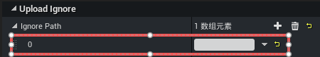

# 1.35 Release Notes

关于版本功能使用中发现及反馈的bug修复安排，可前往 [bug修复计划公示表](https://docs.qq.com/sheet/DSUFnT1BQWGpHYWNN?tab=b5fzcz) 中查看了解。

## 1.35.12.27860 更新说明

### 编辑器

**bug Fixes**

- 修复角色死亡时投掷手雷导致服务端崩溃的问题

---

## 1.35.12.27858 更新说明

### 编辑器

**bug Fixes**

- 修复药品堆叠数量过大时出现拾取异常的问题
- 修复增加部分道具时出现道具数量变化异常的问题

---

## 1.35.12.27856 更新说明

### 编辑器

**bug Fixes**

- 修复点击背包物品的操作按钮无响应的问题

---

## 1.35.12.27854 更新说明

### 编辑器

**bug Fixes**

- 修复子关卡流式卸载时，部分情况下导致客户端崩溃的问题
- 修复背包物品过多时，添加枪械后导致断开连接的问题
- 修复增加背包物品自定义UI时表现为空白的问题
- 修复基于Tag设置背包页签筛选规则时筛选效果不生效的问题
- 修复道具出现“无效物品”时导致无法使用的问题

### API

- 新增载具刷新器工具类 [``BP_UGCVehicleRefresherTool``](https://developer.gp.qq.com/api/#/searchContent/BP_UGCVehicleRefresherTool?classDetailShow=true&path=class%2Fdetail%2FOthers%2FBP_UGCVehicleRefresherTool.json&isSelect=1&apiEnc=%5B%22%E7%B1%BB%22%5D&apiLabel=BP_UGCVehicleRefresherTool) ，用于管理载具的自动刷新和生成
- 新增推荐拾取处理委托 [``UGCPickupUsefulDelegate``](https://developer.gp.qq.com/api/#/searchContent/ASTExtraGameStateBase?classDetailShow=true&path=class%2Fdetail%2FOthers%2FASTExtraGameStateBase.json&isSelect=1&apiEnc=%5B%22%E7%B1%BB%22%5D&apiLabel=ASTExtraGameStateBase&autoJump=UGCPickupUsefulDelegate) 和自动拾取处理委托 [``UGCAutoPickupItemDelegate``](https://developer.gp.qq.com/api/#/searchContent/ASTExtraGameStateBase?classDetailShow=true&path=class%2Fdetail%2FOthers%2FASTExtraGameStateBase.json&isSelect=1&apiEnc=%5B%22%E7%B1%BB%22%5D&apiLabel=ASTExtraGameStateBase&autoJump=UGCAutoPickupItemDelegate)

---

## 1.35.12.27852 更新说明

### 编辑器

**bug Fixes**

- 修复背包物品同步数据时，因频繁发送Reliable RPC导致玩家被踢出对局的问题
- 修复背包物品详情页面板中，物品名称显示错误的问题

---

## 1.35.12.27848 更新说明

### 编辑器

**功能更新**

- 新增单发蓄力步枪技能模板

**bug Fixes**

- 修复执行资产迁移操作时，无法迁移Lua脚本文件的问题
- 修复M202四联火箭筒修改枪械伤害不生效的问题
- 修复删除粒子特效的所有发射器后，重新打开该特效出现新增发射器的问题
- 修复火龙怪物移动动画异常的问题

### API

- 新增获取伤害上下文中的伤害部位函数 [``GetDamagePositionTypeFromContext``](https://developer.gp.qq.com/api/#/searchContent/UGCAttributeSystem?classDetailShow=true&path=class%2Fdetail%2F%E5%92%8C%E5%B9%B3%E5%85%A8%E5%B1%80%E6%8E%A5%E5%8F%A3%2F%E8%A7%92%E8%89%B2%E7%B3%BB%E7%BB%9F%2FUGCAttributeSystem.json&isSelect=1&apiEnc=%5B%22%E7%B1%BB%22%5D&apiLabel=UGCAttributeSystem&autoJump=GetDamagePositionTypeFromContext)

---

## 1.35.12.27846 更新说明

### 编辑器

**bug Fixes**

- 修复技能编辑器中多点目标选择器选择的预览结果与实际不一致的问题
- 修复玩法上传后外研线移动端未更新最新资源文件的问题
- 修复玩法上传后偶现未cook鸿蒙包的问题
- 修复关卡地图中放置道路生成器会导致上传失败的问题
- 优化新背包物品过多时产生卡顿的问题

---

## 1.35.12.27844 更新说明

### 编辑器

**bug Fixes**

- 修复创建的WidgetLayout蓝图隐藏和平主界面控件布局的问题
- 修复新背包系统部分操作情况下，不消耗货币可以解锁背包格子的问题
- 修复新背包系统部分操作情况下，可以通过篡改物品ID刷道具的问题
- 修复怪物技能蓝图模板动画轨道被隐藏的问题
- 修复性能检测工具热力图显示异常的问题
- 修复电磁干扰区被消耗后，小地图依然显示生效范围的问题
- 修复特效编辑器删除粒子发射器时触发崩溃的问题
- 修复物品编辑器中的激光枪模板模型配置错误的问题
- 修复PIE调试中，大唐横刀武器的手持与攻击动画表现异常的问题
- 修复单发蓄力能量步枪射击无伤害及射击表现异常的问题
- 修复部分类型的蓝图打开时，错误地显示在实体编辑器中的问题

---

## 1.35.12.27842 更新说明

### 编辑器

**bug Fixes**

- 修复PIE调试经典海岛关卡图模板时触发编辑器崩溃的问题
- 修复打开部分模板工程触发编辑器崩溃的问题
- 修复二次匹配功能的模式选择界面，外部导入的模式图片显示异常的问题
- 修复PIE调试下发起二次匹配，按钮不切换显示“匹配中”及匹配计时的问题
- 修复编辑器【帮助】菜单栏下，教程与论坛链接错误的问题
- 修复物品编辑器预览窗口中，部分枪械手持模型显示错误的问题
- 修复伤害飘字与治疗飘字无法正常显示的问题
- 修复道路生成器中路灯材质异常的问题
- 优化编辑器登录界面适配问题

---

## 1.35.12.27840 版本说明

### 编辑器

**新功能**

- 新增 [场景破坏物](../通用功能/20293_场景破坏物.md) 蓝图模板，适用于具备生命值属性及行为特性的静态物件对象
- 新增 [输入映射](../进阶内容/输入系统/20290_输入映射.md) 功能，支持开发者扩展输入映射规则
- 新增 [ActorMark组件](../进阶内容/UI系统/20295_通用屏幕指示器.md) 支持实现动态屏幕指示器的效果
- 全新 [EmmyLua](../绿洲编辑器基础内容/脚本编写/20272_EmmyLua调试工具.md) 调试插件，支持代码补全、断点调试、热重载等多点功能，比LuaHelper插件功能更加完善
- 新增空白 [俯视角模板](../玩法案例及模板/20289_俯视角模板.md)，方便快速制作2.5D视角的玩法
- AI开发助手模块新增 [AI资源检索](../AI工具/20292_AI资源检索.md) 功能 , 基于关键词快速查找相关联的资源
- 新增 [性能检测工具](../性能优化及异常处理/20297_性能检测工具.md)，支持对编辑器视口中的渲染数据进行静态分析
- 和平精英集成系统功能增加 [轰炸区](../进阶内容/和平精英集成功能/20279_轰炸区系统.md) 与 [电磁干扰](../进阶内容/和平精英集成功能/20276_电磁干扰区系统.md)
- 新封装 [实体类型](../通用功能/20298_实体类型.md) 概念，可应用于过滤器、技能对象检测等场景

**功能更新**

【物资系统】

**物品编辑器**
- 预览窗口支持对枪械、近战武器和投掷物类型物品的手持/装备效果的预览
- 枪械支持替换 [命中特效和音效](../进阶内容/GamePlay系统/物资系统/物资编辑器2.0/20103_自定义枪械.md#命中特效和音效)
- 物品模板新增 [空白消耗品模板](../进阶内容/GamePlay系统/物资系统/物资编辑器2.0/20101_物品编辑器.md#空白模板实现物品功能)；投掷物品增加基于技能抛体实现的 [投掷物模板](../进阶内容/GamePlay系统/物资系统/物资编辑器2.0/20101_物品编辑器.md#物品模板)
- 新增物品模板资源：

| 类型 | 模板名称 |
| :------: | :------: |
| 特殊武器 | 医疗枪 |
| 科幻武器 | 单发蓄力能量步枪 |
| 经典近战武器 | 雷枪 |

**背包系统**
- 支持 [自定义物品操作按钮](../进阶内容/GamePlay系统/物资系统/物资编辑器2.0/20104_背包系统.md#自定义物品操作按钮)
- 当背包容量已满时，新获得的物品将以拾取物的方式掉落在场景中

【技能系统】

**技能编辑器**
- 技能阶段之间的 [跳转配置](../进阶内容/GamePlay系统/技能系统/技能编辑器2.0/20152_技能状态图.md#定义跳转条件) 优化为事件型跳转与条件型跳转两种模式
- [技能预览](../进阶内容/GamePlay系统/技能系统/技能编辑器2.0/20091_技能编辑器.md#技能预览) Actor类型增加怪物与法术场
- 技能Condition新增 [输入检查](../进阶内容/GamePlay系统/技能系统/技能编辑器2.0/20111_技能Condition查询手册.md#输入检查) 条件组件
- 当禁用或打断带有击退Tag的对象时，将会同时打断/禁用其对应的击退行为
- 技能Task更新列表：

| Task名称 | 更新说明 |
| :------: | ------ |
| [添加冲量](../进阶内容/GamePlay系统/技能系统/技能编辑器2.0/20094_技能Task查询手册.md#技能Task-添加冲量) |冲量方向类型修改为“选中位置方向/施法者方向/选中方向”|
| [冲刺](../进阶内容/GamePlay系统/技能系统/技能编辑器2.0/20094_技能Task查询手册.md#技能Task-冲刺) | 增加属性 ``冲刺结束是否清除速度``|
| [追踪目标](../进阶内容/GamePlay系统/技能系统/技能编辑器2.0/20094_技能Task查询手册.md#技能Task-追踪目标) | 增加属性 ``吸附类型`` 与 ``吸附距离计算忽略Z轴`` |
| [生成粒子](../进阶内容/GamePlay系统/技能系统/技能编辑器2.0/20094_技能Task查询手册.md#技能Task-生成粒子) | 增加属性 ``缩放规则`` |
| [屏幕特效](../进阶内容/GamePlay系统/技能系统/技能编辑器2.0/20094_技能Task查询手册.md#技能Task-屏幕特效:~:text=Task-播放音效-,技能Task-屏幕特效,-技能Task-生成) | 支持自定义屏幕特效 |
| [返回CD](../进阶内容/GamePlay系统/技能系统/技能编辑器2.0/20094_技能Task查询手册.md#技能Task-返还CD) | 增加属性 ``返还类型`` 与 ``返还CD的技能槽位`` |
| [近战攻击](../进阶内容/GamePlay系统/技能系统/技能编辑器2.0/20094_技能Task查询手册.md#技能Task-近战攻击) | 增加属性 ``近战攻击的检测方式`` |
| [Lua自定义](../进阶内容/GamePlay系统/技能系统/技能编辑器2.0/20094_技能Task查询手册.md#技能Task-Lua自定义) | 新增Task |
| [修改抛体](../进阶内容/GamePlay系统/技能系统/技能编辑器2.0/20094_技能Task查询手册.md#技能Task-修改抛体) | 新增Task |
| [显示取消按钮](../进阶内容/GamePlay系统/技能系统/技能编辑器2.0/20094_技能Task查询手册.md#技能Task-显示取消按钮) | 增加属性 ``Cancel Action`` |
| [选择点](../进阶内容/GamePlay系统/技能系统/技能编辑器2.0/20094_技能Task查询手册.md#技能Task-选择点) | 新增 ``右摇杆选点`` 选择器 |
| [选择方向](../进阶内容/GamePlay系统/技能系统/技能编辑器2.0/20094_技能Task查询手册.md#技能Task-选择点) | 新增  ``抛物线方向选择器`` 和 ``右摇杆方向选择器`` |
| [选择目标](../进阶内容/GamePlay系统/技能系统/技能编辑器2.0/20094_技能Task查询手册.md#技能Task-选择目标) | 新增  ``右摇杆目标选择器`` 和 ``瞄准目标选择器`` |
- 新增技能模板资源：

| 类型 | 模板名称 |
| :------: | :------: |
| 主动技能-俯视角技能 | 弹射镖 |
| 主动技能-俯视角技能 | 冰冻箭 |
| 主动技能-俯视角技能 | 蓄力弹 |
| 主动技能-俯视角技能 | 旋风斩 |
| 主动技能-俯视角技能 | 剑气纵横 |
| 主动技能-瞄准型技能 | 钩锁 |
| 主动技能-武器技能-近战武器技能 | 唐刀-连段 |
| 主动技能-武器技能-近战武器技能 | 唐刀-冲刺 |
| 主动技能-武器技能-近战武器技能 | 唐刀-格挡 |
| 主动技能-武器技能-近战武器技能 | 雷枪普攻 |
| 被动技能-投射物构筑 | 巨型弹 |
| 被动技能-投射物构筑 | 水寒剑阵 |
| 被动技能-投射物构筑 | 追踪弹 |
| 被动技能-投射物构筑 | 燃烧弹 |
| 被动技能-投射物构筑 | 火焰环绕 |
| 被动技能-条件型 | 俯视角自瞄 |
| 被动技能-触发型 | 魔术手 |
| 被动技能-状态型 | 缓冲气垫 |
| 被动技能-状态型 | 扩展弹匣 |
| 被动技能-状态型 | 战术冷静 |

**Buff编辑器**
- [生成特效](../进阶内容/GamePlay系统/技能系统/Buff编辑器2.0/20117_BuffAction查询手册.md#生成特效) BuffAction增加缩放规则属性
- 新增可变身为光子鸡等怪物骨骼的 [Buff模板](../进阶内容/GamePlay系统/技能系统/Buff编辑器2.0/20253_变参Buff模板.md#变身-怪物骨骼)

【通用抛体】
- [基础属性](../通用功能/20165_通用抛体.md#基础属性) 新增GameplayTag抛体标签，支持在发射事件时过滤触发条件
- 飞行轨迹组件新增 [环绕轨迹](../通用功能/20165_通用抛体.md#环绕轨迹)
- [触发条件](../通用功能/20165_通用抛体.md#触发条件) 增加环绕逃逸时调用和发射时调用事件
- 执行动作增加 [生成新抛体](../通用功能/20165_通用抛体.md#生成新抛体) 与 [抛体修改器](../通用功能/20165_通用抛体.md#抛体修改器)

【怪物系统】
-  [怪物受击](../进阶内容/GamePlay系统/怪物系统/20252_怪物受击.md) 支持伤害倍率配置，在怪物蓝图中可以直接配置不同部位伤害倍率
- 怪物 [飞行移动](../进阶内容/GamePlay系统/怪物系统/20168_移动与避障.md#飞行移动) 支持选择出生时保持飞行高度与死亡是否落地配置
- [怪物刷新点](../进阶内容/GamePlay系统/怪物系统/20156_怪物刷新器.md#配置刷新点) 支持通过最大刷怪数量控制怪物的刷新节奏
- 导航网格支持 [动态更新](../进阶内容/GamePlay系统/怪物系统/20274_动态更新导航网格.md)，提供全局更新与增量更新两种模式
- 新增适用于海量刷怪场景的 [无骨骼怪物模板](../进阶内容/GamePlay系统/怪物系统/20285_无骨骼怪物模板.md)
- 装饰器节点更新列表：

| 节点名称 | 更新说明 |
| :------: | ------ |
|  [可见性检查](../进阶内容/GamePlay系统/怪物系统/20178_装饰器节点查询手册.md#[Generic]可见性检查)  | 新增节点 |
| [黑板值比较](../进阶内容/GamePlay系统/怪物系统/20178_装饰器节点查询手册.md#[Generic]黑板值比较) | 原属性监视节点调整及更名 |
| [属性比较](../进阶内容/GamePlay系统/怪物系统/20178_装饰器节点查询手册.md#[Generic]属性比较) | 原属性监视(新)节点调整及更名 |
- 新增怪物模板资源：

| 类型 | 模板名称 |
| :------: | :------: |
| 通用怪物-BOSS怪 | 武装猩猩 |
| 通用怪物-BOSS怪 | 半身机械 |
| 通用怪物-精英怪 | 沙虫之母 |
| 通用怪物-精英怪 | 触龙神 |
| 通用怪物-精英怪 | 机甲兽霸王龙 |
| 通用怪物-小怪 | 冰鳞雀 |
| 通用怪物-小怪 | 机甲螳螂 |
| 通用怪物-小怪 | 幽魂 |
| 通用怪物-小怪 | 突袭者 |
| 通用怪物-小怪 | 机甲兽剑龙 |
| 通用怪物-小怪 | 机甲兽三角龙 |
| 通用怪物-小怪 | 机甲兽迅猛龙 |

【小地图】
- 新增 [战争迷雾](../新手入门/游戏场景/152_小地图.md#小地图功能参数)、图例管理等功能，支持多地图配置

【载具系统】
- 驾驶位的座椅模板支持同时 [激活多个武器](../进阶内容/GamePlay系统/载具系统/20245_载具编辑器.md#添加载具武器)

【其他】
- 道路生成器集成在模式编辑工具中，增加 [道路吸附](../新手入门/游戏场景/场景编辑基础/20248_PCG工具箱.md#道路吸附) 功能
- [音频编辑器](../新手入门/资源管理与编辑/20244_音频编辑器.md) 支持基于音频模板创建音频资源，音频编辑增加中断事件与改变音量等能力
- 特效编辑器 [视口区](../进阶内容/20223_特效编辑器.md#特效视口区) 支持添加天空盒背景
- 全局伤害公式 [修改过滤选项](../进阶内容/GamePlay系统/属性与伤害/20099_全局伤害公式.md#过滤伤害修改范围) 增加同阵营伤害和队友伤害
- GM面板的 [预置GM功能](../绿洲编辑器基础内容/调试游戏/20109_通用GM面板.md#预置GM功能) 新增修改载具属性与创建载具
- [角色固化属性](../进阶内容/GamePlay系统/属性与伤害/20205_角色属性与状态.md#角色固化属性) 增加击退强度与击退抗性两类属性
- [属性求值器](../进阶内容/GamePlay系统/技能系统/20108_技能属性绑定.md#使用属性求值器) 增加基于公式计算的绑定方式
- [UISlot锚点](https://developer.gp.qq.com/wikieditor/#/catalog/20185?autoJump=UISlot%E9%94%9A%E7%82%B9) 增加全屏/半屏背包锚点与技能UI锚点，且支持创建自定义锚点
- 通用过滤器增加 [概率过滤器](../通用功能/20218_通用过滤器.md#概率过滤器) 与 [自定义条件过滤器](../通用功能/20218_通用过滤器.md#自定义条件过滤器)
- 战斗日志支持添加 [自定义分类](../绿洲编辑器基础内容/调试游戏/20242_战斗日志.md#打印战斗日志)
-  ugcprint函数已支持现网环境
- 物品/技能/实体等编辑器支持右键复制蓝图与多级派生蓝图显示
- 优化编辑器登录流程与登录界面
- 新增可直接修改 [``GetServerTimeSec``](https://developer.gp.qq.com/api/#/searchContent/UGCGameSystem?classDetailShow=true&path=class%2Fdetail%2F%E5%92%8C%E5%B9%B3%E5%85%A8%E5%B1%80%E6%8E%A5%E5%8F%A3%2F%E5%9F%BA%E7%A1%80%E5%8A%9F%E8%83%BD%2FUGCGameSystem.json&isSelect=1&apiEnc=%5B%22%E7%B1%BB%22%5D&apiLabel=UGCGameSystem&autoJump=GetServerTimeSec) 接口返回的服务端时间的GM指令
- 支持在编辑器 ``编辑 -> 工程设置`` 的 ``Ignore Path`` 属性中，添加需要忽略上传的指定目录
	

**bug Fixes**
- 修复单次购买多个相同商品期间，新增物品数量与GamePart收到的物品管理通知不一致的问题
- 修复在烟雾弹的烟雾材质下描边效果显示异常的问题
- 修复新背包容量已满的情况下，获得虚拟物品转换背包物品时数据转换异常的问题
- 修复新载具编辑器创建的载具蓝图，复用座椅模板配置可能出现乘坐效果异常的现象

### 管理平台

- 管理平台和编辑器支持微信登录
- BUG管理支持修改bug状态，新增字段导出、操作日志功能
- 玩家反馈支持自定义时段生成AI反馈总结
- 运营数据支持选择多个玩法进行数据对比

### API

- 新增 [`StartCustomizeDrop`](https://developer.gp.qq.com/api/#/searchContent/UGCItemSystemV2?classDetailShow=true&path=class%2Fdetail%2F%E5%92%8C%E5%B9%B3%E5%85%A8%E5%B1%80%E6%8E%A5%E5%8F%A3%2F%E7%89%A9%E5%93%81%E4%B8%8E%E8%83%8C%E5%8C%85%2FUGCItemSystemV2.json&isSelect=1&apiEnc=%5B%22%E7%B1%BB%22%5D&apiLabel=UGCItemSystemV2&autoJump=StartCustomizeDrop) 函数支持在指定的位置生成随机的掉落物
- 新增 [`GetMarkLocation`](https://developer.gp.qq.com/api/#/searchContent/UGCMapMarkManagerSystem?classDetailShow=true&path=class%2Fdetail%2F%E5%92%8C%E5%B9%B3%E5%85%A8%E5%B1%80%E6%8E%A5%E5%8F%A3%2FUI%20%E7%95%8C%E9%9D%A2%2FUGCMapMarkManagerSystem.json&isSelect=1&apiEnc=%5B%22%E7%B1%BB%22%5D&apiLabel=UGCMapMarkManagerSystem&autoJump=GetMarkLocation) 函数支持获取小地图标点位置
- 新增 [``GetAllTeammateIndex``](https://developer.gp.qq.com/api/#/searchContent/UGCTeamSystem?classDetailShow=true&path=class%2Fdetail%2F%E5%92%8C%E5%B9%B3%E5%85%A8%E5%B1%80%E6%8E%A5%E5%8F%A3%2F%E7%A4%BE%E4%BA%A4%E7%B3%BB%E7%BB%9F%2FUGCTeamSystem.json&isSelect=1&apiEnc=%5B%22%E7%B1%BB%22%5D&apiLabel=UGCTeamSystem&autoJump=GetAllTeammateIndex)、[``GetTeammateIndexByPlayerKey``](https://developer.gp.qq.com/api/#/searchContent/UGCTeamSystem?classDetailShow=true&path=class%2Fdetail%2F%E5%92%8C%E5%B9%B3%E5%85%A8%E5%B1%80%E6%8E%A5%E5%8F%A3%2F%E7%A4%BE%E4%BA%A4%E7%B3%BB%E7%BB%9F%2FUGCTeamSystem.json&isSelect=1&apiEnc=%5B%22%E7%B1%BB%22%5D&apiLabel=UGCTeamSystem&autoJump=GetTeammateIndexByPlayerKey) 和 [``GetPlayerKeyByTeammateIndex``](https://developer.gp.qq.com/api/#/searchContent/UGCTeamSystem?classDetailShow=true&path=class%2Fdetail%2F%E5%92%8C%E5%B9%B3%E5%85%A8%E5%B1%80%E6%8E%A5%E5%8F%A3%2F%E7%A4%BE%E4%BA%A4%E7%B3%BB%E7%BB%9F%2FUGCTeamSystem.json&isSelect=1&apiEnc=%5B%22%E7%B1%BB%22%5D&apiLabel=UGCTeamSystem&autoJump=GetPlayerKeyByTeammateIndex) 等与玩家队伍头标相关的函数
- 新增 [`GetPlatformInfo`](https://developer.gp.qq.com/api/#/searchContent/UGCGameSystem?classDetailShow=true&path=class%2Fdetail%2F%E5%92%8C%E5%B9%B3%E5%85%A8%E5%B1%80%E6%8E%A5%E5%8F%A3%2F%E5%9F%BA%E7%A1%80%E5%8A%9F%E8%83%BD%2FUGCGameSystem.json&isSelect=1&apiEnc=%5B%22%E7%B1%BB%22%5D&apiLabel=UGCGameSystem&autoJump=GetPlatformInfo)  函数支持获取当前平台信息
- 新增 [``DrawOutline``](https://developer.gp.qq.com/api/#/searchContent/UGCGameSystem?classDetailShow=true&path=class%2Fdetail%2F%E5%92%8C%E5%B9%B3%E5%85%A8%E5%B1%80%E6%8E%A5%E5%8F%A3%2F%E5%9F%BA%E7%A1%80%E5%8A%9F%E8%83%BD%2FUGCGameSystem.json&isSelect=1&apiEnc=%5B%22%E7%B1%BB%22%5D&apiLabel=UGCGameSystem&autoJump=DrawOutline) 函数支持对非角色Pawn的物体对象添加自定义描边效果
- 新增 [``AddOcclusionHighlight``](https://developer.gp.qq.com/api/#/searchContent/UGCPlayerPawnSystem?classDetailShow=true&path=class%2Fdetail%2FOthers%2FUGCPlayerPawnSystem.json&isSelect=1&apiEnc=%5B%22%E7%B1%BB%22%5D&apiLabel=UGCPlayerPawnSystem&autoJump=AddOcclusionHighlight) 与 [``RemoveOcclusionHighlight``](https://developer.gp.qq.com/api/#/searchContent/UGCPlayerPawnSystem?classDetailShow=true&path=class%2Fdetail%2FOthers%2FUGCPlayerPawnSystem.json&isSelect=1&apiEnc=%5B%22%E7%B1%BB%22%5D&apiLabel=UGCPlayerPawnSystem&autoJump=RemoveOcclusionHighlight) 函数支持为角色Pawn添加/移除透视效果
