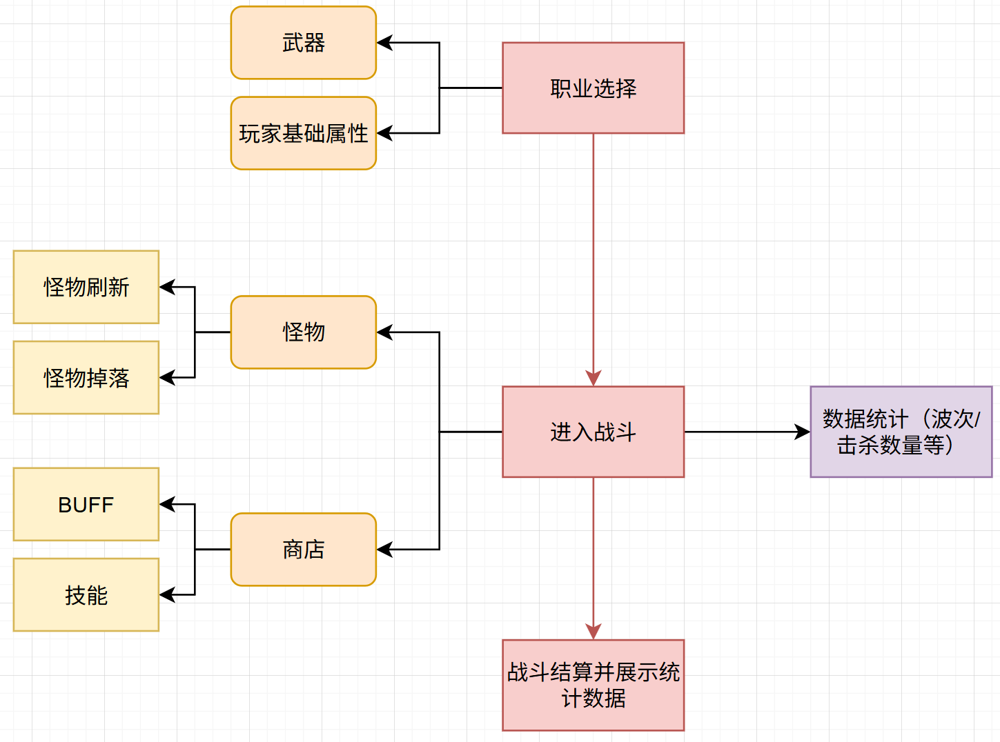
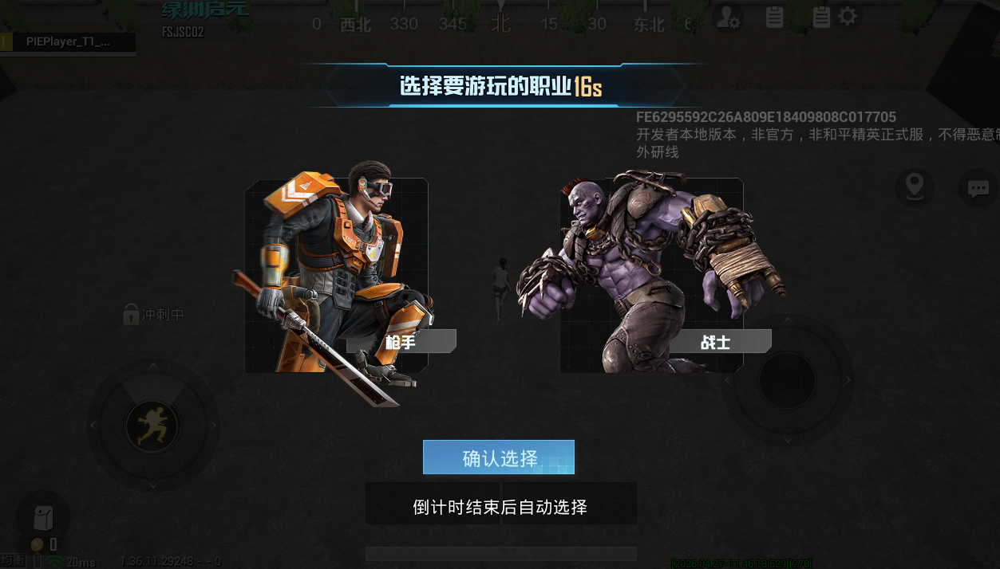
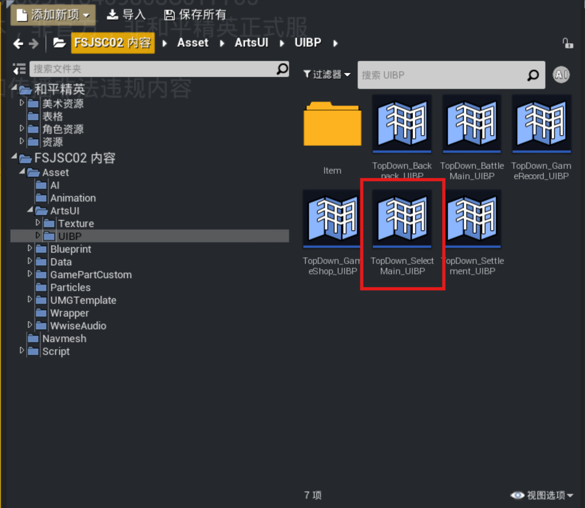
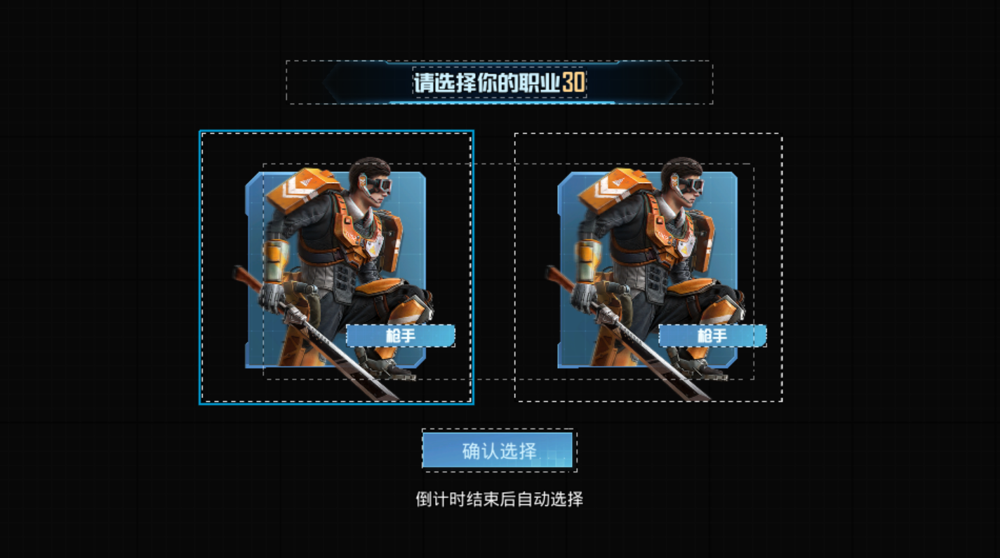
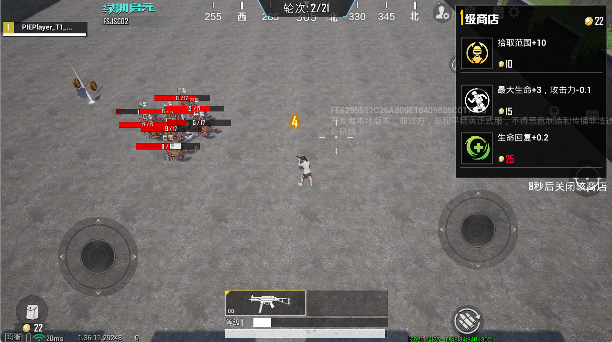
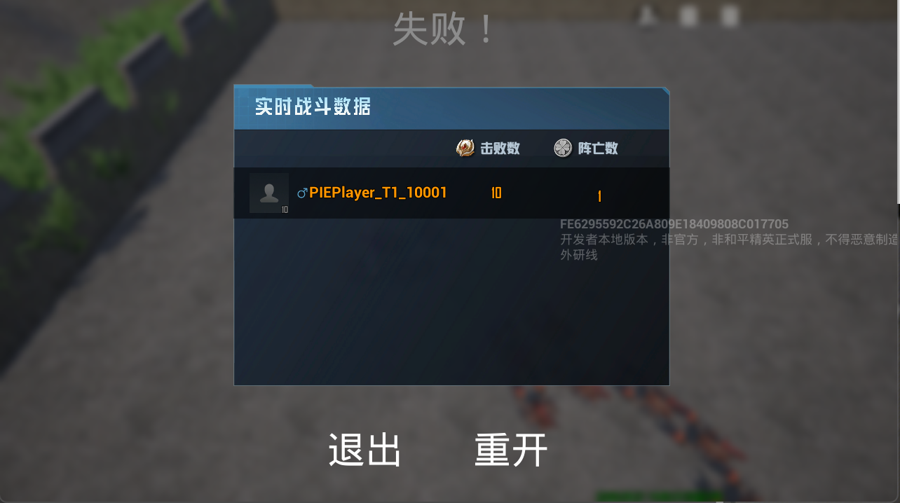

# 游戏流程

整个游戏流程可主要分为三个部分：

1.职业选择（准备阶段）：准备阶段怪物不会刷新且玩家无法移动，玩家选择职业并确认后游戏开始，若倒计时结束仍未选择则默认成为枪手，在多人模式下需所有玩家完成选择后游戏才会开始

此界面对应的控件为Asset/ArtsUI/UIBP/TopDown_SelectMain_UIBP

2.进入战斗：玩家完成职业选择后等待五秒进入战斗阶段，此阶段怪物持续刷新，击杀怪物可获得经验并掉落道具与金币，靠近自动拾取，玩家通过获取的经验与金币提升等级并在商店购买升级来强化自身属性

3.战斗结算：根据玩家的战斗情况，判断结束并结算数据

