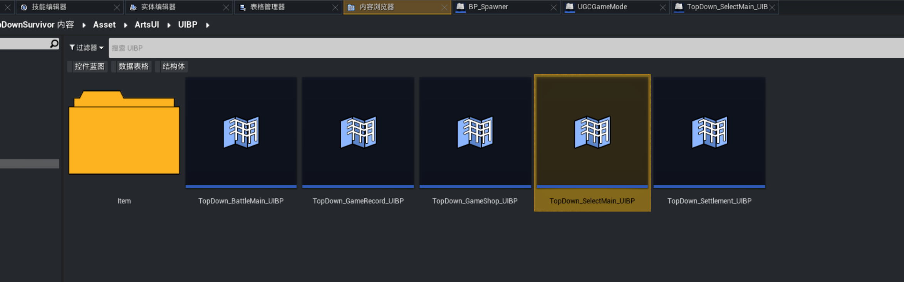
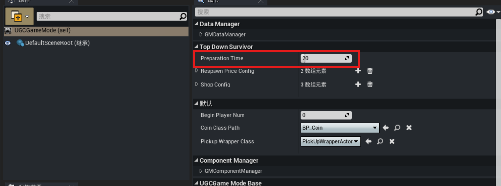
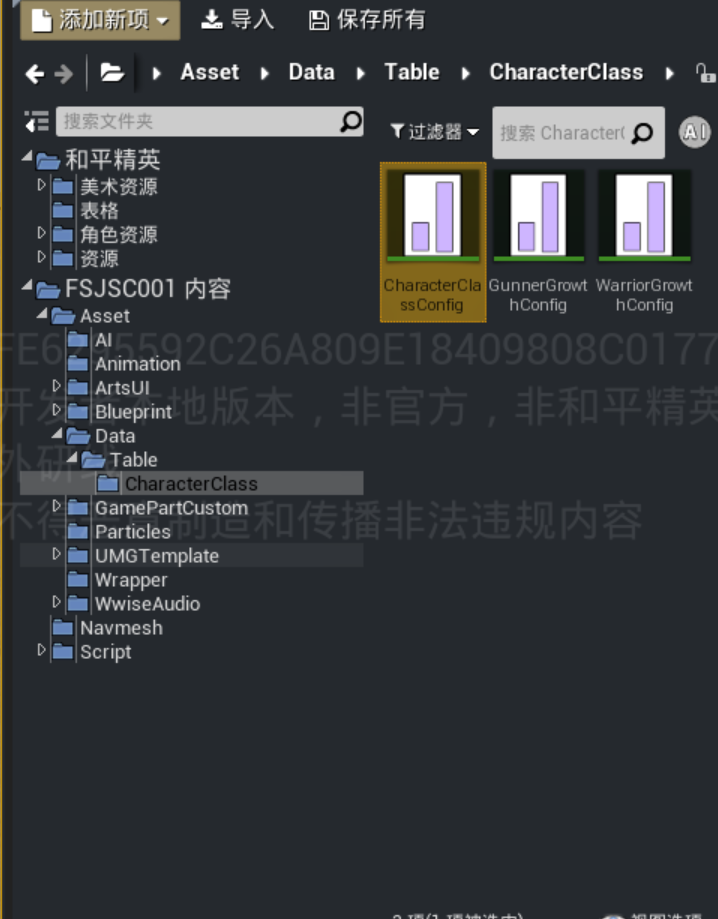
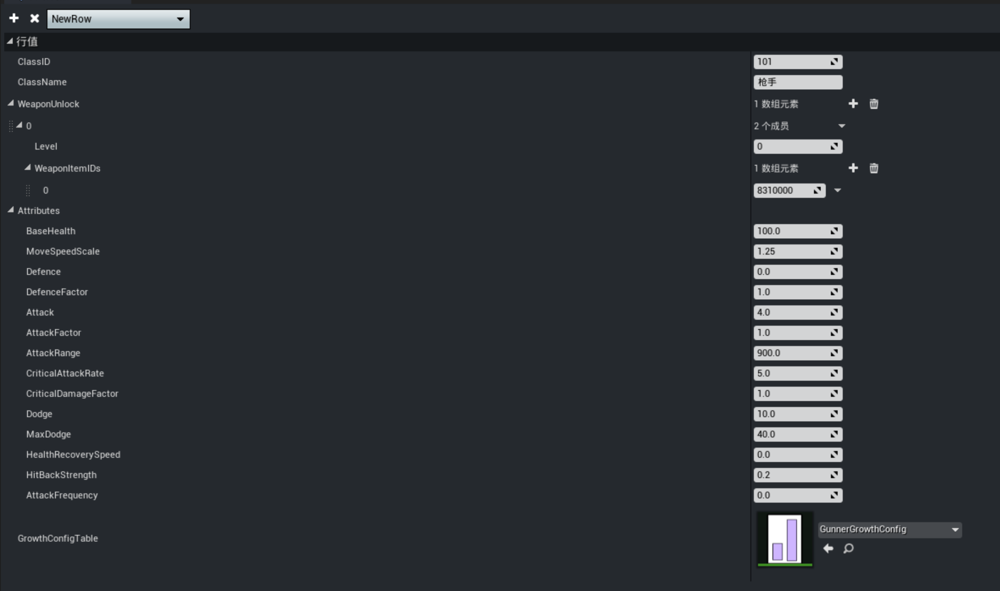
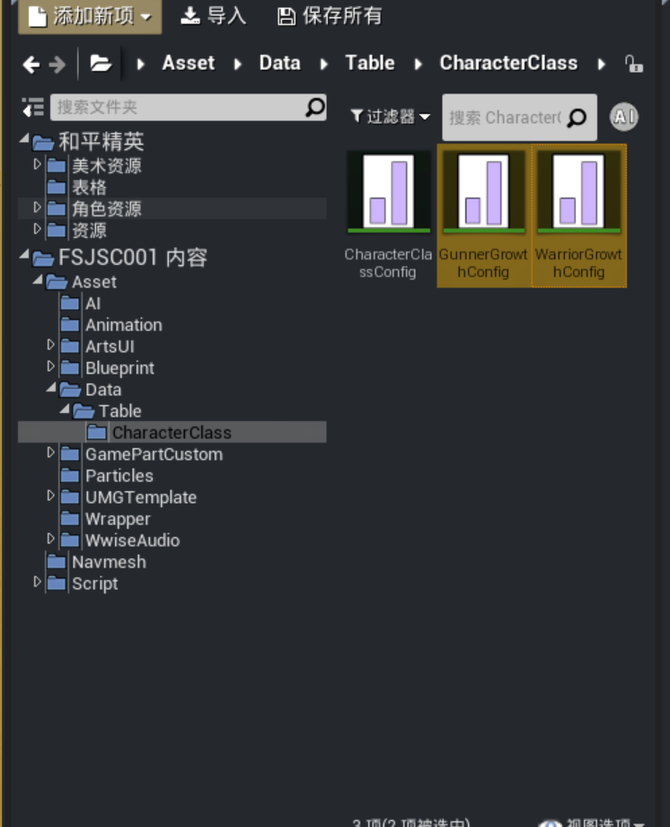
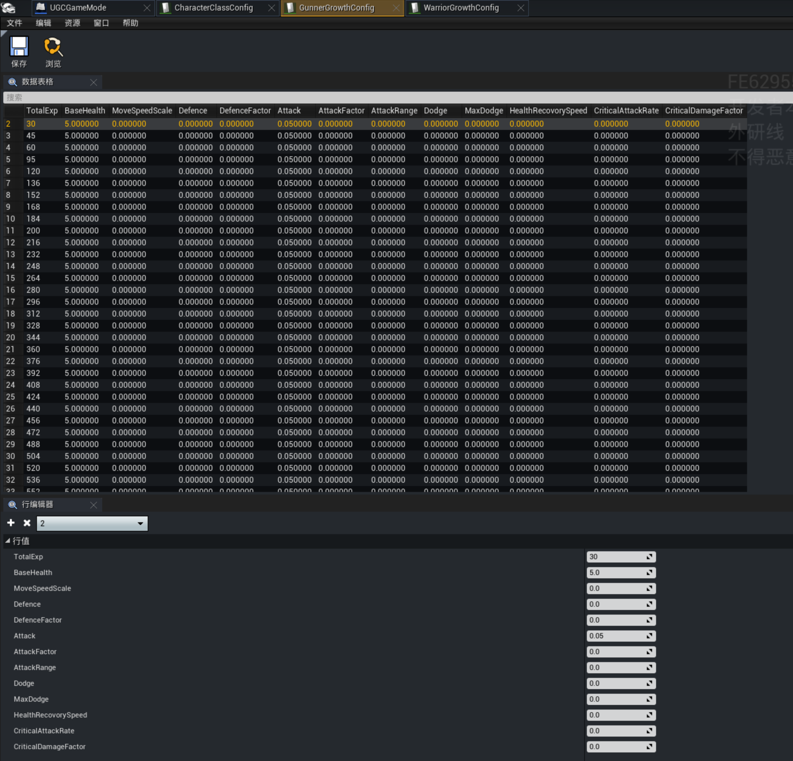
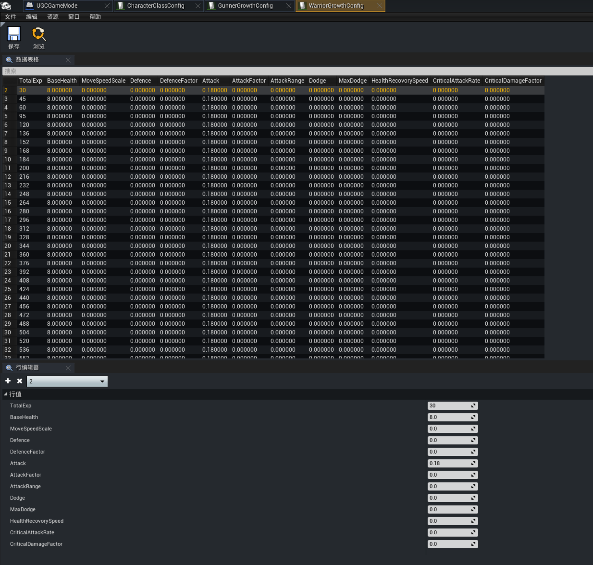

# 职业选择

## 初始配置
在游戏一开始的时候，玩家可以在界面上直接选择想要使用的职业，当前模板中提供了两个职业

- 枪手
- 战士

使用的控件为：Asset/ArtsUI/UIBP/TopDown_SelectMain_UIBP

UGCGameMode里，该选项为调整最开始选职业的时间

## 职业配置
当前这两个职业相关的配置由CharacterClassConfig控制。

 - ClassID：职业编号，用来索引
 - ClassName：职业名称
 - WeaponUnlock：武器解锁配置，不同职业在特定的等级会直接获取指定ID的道具
 - Attributes：职业的一些属性配置
 - GrowthConfigTable：此职业升级的经验配置和不同等级的属性配置，需要额外一张表格保存这些信息

## 成长配置
职业的成长配置由以下两个表格控制。

