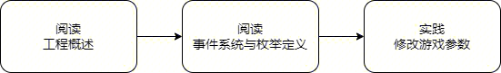
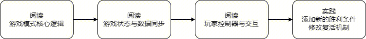
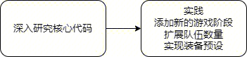
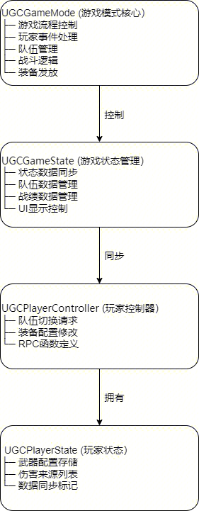

# 团竞2.0目录总览

## 文档导航

### 快速开始

如果你是第一次接触本工程，建议按以下顺序阅读：

1. **\[工程概述]** - 了解整体架构和核心特性
2. **\[游戏模式核心逻辑]**- 理解游戏流程控制
3. **\[事件系统与枚举定义]**- 掌握事件通信机制

***

## 文档列表

### [工程概述](./20356_工程概述.md)

**适用人群**：所有开发者（必读）

**内容概览**：

* 项目简介与技术架构
* 工程目录结构说明
* 游戏流程详解
* 核心系统概览
* 数据流架构
* 快速开始指南
* 开发规范

**关键信息**：

```
游戏阶段：准备 → 战斗 → 结算
胜利条件：达到胜利分数 或 时间耗尽 或 对手离场
核心系统：GameMode, GameState, PlayerController, PlayerState
```

**推荐阅读时间**：15 分钟

***

### [游戏模式核心逻辑](./20358_游戏模式核心逻辑详解.md)

**适用人群**：后端逻辑开发者、数值策划

**内容概览**：

* UGCGameMode 职责与功能
* 核心数据结构（配置参数、范围限制、运行时数据）
* 生命周期函数详解
* 玩家事件处理（登录/退出）
* 状态流转机制
* 队伍管理（分配/切换）
* 战斗逻辑（击杀/复活/胜负判定）
* 装备发放流程
* 出生点管理
* 开发建议与调试技巧

**关键函数**：

```
InitAllClampNumAtGeneralSettings()  - 初始化参数范围
GotoNextStatus()                     - 阶段流转
PlayerChangeTeam()                   - 切换队伍
OnPawnDefeat()                       - 处理死亡
CheckGameEnd()                       - 判定胜负
AddInitialEquipment()                - 发放装备
```

**推荐阅读时间**：30 分钟

***

### [游戏状态与数据同步](./20359_游戏状态与数据同步详解.md)

**适用人群**：网络同步开发者、UI 开发者

**内容概览**：

* UGCGameState 职责与功能
* 核心数据结构（状态/队伍/战绩）
* 数据同步机制（Lazy 模式）
* 游戏阶段管理（SetStatus, OnGameStateChange）
* 队伍数据管理（UpdateTeamData, OnRep\_TeamCurPlayerKeys）
* 战绩数据管理（UpdateScore, OnRep\_PlayerScore）
* 结算数据处理（OnRep\_BattleResult）
* 时间管理
* 装备配置同步
* 开发建议与调试技巧

**关键函数**：

```
GetReplicatedProperties()  - 定义同步属性
SetStatus()                - 切换游戏阶段
UpdateTeamData()           - 更新队伍数据
UpdateScore()              - 更新战绩
OnRep_*()                  - 客户端接收同步数据
```

**推荐阅读时间**：25 分钟

***

### [玩家控制器与交互](./20360_玩家控制器与交互详解.md)

**适用人群**：交互逻辑开发者、UI 开发者

**内容概览**：

* UGCPlayerController 职责与功能
* RPC 函数定义与调用
* 队伍管理（ServerChangeTeam）
* 装备配置管理（InitWeaponEquipConfig, ServerChangeWeapons, ServerChangeWeaponList）
* 武器列表组织（OrganizeWeaponList）
* UI 加载与初始化
* 开发建议与调试技巧

**关键 RPC 函数**：

```
ServerChangeTeam()         - 切换队伍
ServerChangeWeapons()      - 设置完整武器列表
ServerChangeWeaponList()   - 修改单个武器/配件
```

**推荐阅读时间**：20 分钟

***

### [事件系统与枚举定义](./20357_事件系统与枚举定义详解.md)

**适用人群**：所有开发者（必读）

**内容概览**：

* 事件系统概述
* 枚举定义（EGameStatus, ETeamType）
* 客户端事件定义（9 个事件）
* 事件详解（参数、触发时机、使用示例）
* 事件订阅/发布机制
* 开发建议（自定义事件、新游戏阶段、新队伍类型）
* 调试技巧

**关键事件**：

```
101 - GameStatusChanged         - 游戏状态变更
105 - PlayerScoreChanged        - 玩家战绩变更
106 - TeamScoreChanged          - 队伍积分变更
107 - GameEndEvent               - 游戏结束
```

**推荐阅读时间**：20 分钟

***

## 学习路径

### 初级开发者

**目标**：理解工程结构，能够进行简单修改



### 中级开发者

**目标**：理解核心逻辑，能够扩展功能



### 高级开发者

**目标**：掌握系统设计，能够重构优化



***

## 常见开发场景

### 修改游戏参数

**文档**：[工程概述](./20356_工程概述.md)

**操作**：编辑 UGCGameMode 蓝图中的 战斗配置参数、阶段配置参数

***

### 修改默认装备

**文档**：[工程概述](./20356_工程概述.md)

**操作**：编辑 UGCGameMode 蓝图中的装备配置参数

***

### 添加新的 RPC 函数

**文档**：[玩家控制器与交互](./20360_玩家控制器与交互详解.md)

**步骤**：

1. 在 GetAvailableServerRPCs() 中注册
2. 实现 Server\_\* 函数

***

### 添加新的事件

**文档**：[事件系统与枚举定义](./20357_事件系统与枚举定义详解.md)

**步骤**：

1. 在 CTCompetitioClientEvent.lua 中定义事件 ID
2. 在 UGCGameState.lua 中发布事件
3. 在 UI 脚本中订阅事件

***

### 修改胜利条件

**文档**：[游戏模式核心逻辑](./20358_游戏模式核心逻辑详解.md)

**操作**：修改 UGCGameMode:CheckGameEnd() 函数

***

### 自定义装备范围

**文档**：[工程概述](./20356_工程概述.md)

**操作**：编辑 UGCGameMode 蓝图中的装备配置参数

***

##  系统关系图



***
