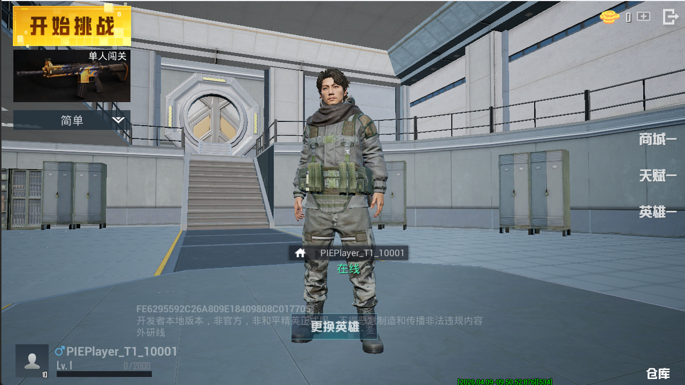
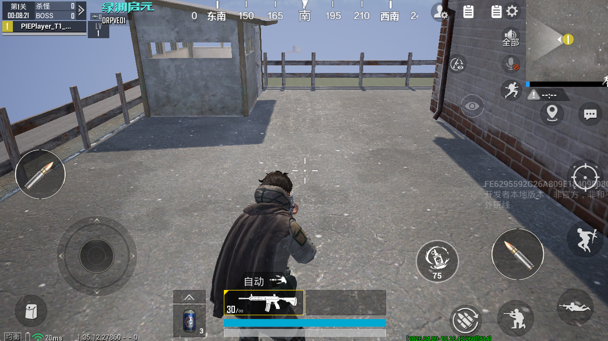
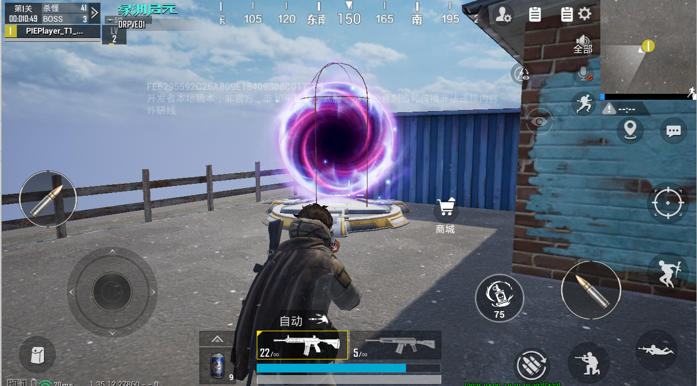
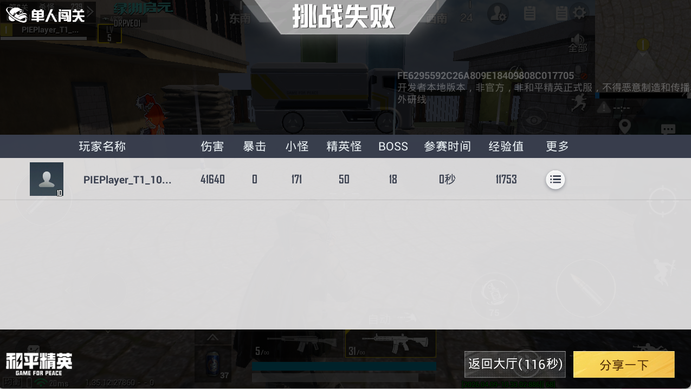
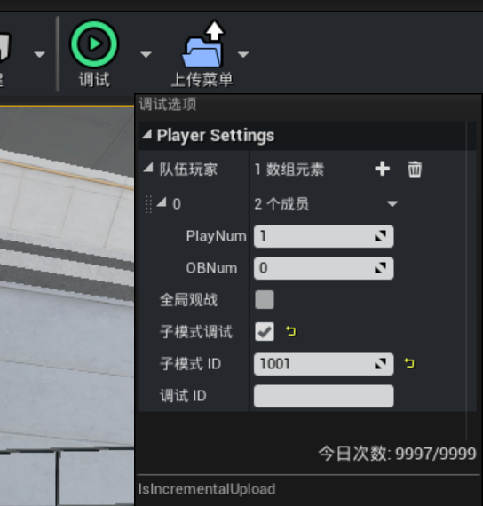
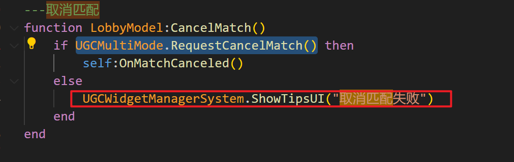

# 概览

该模板是PVE类射击玩法模板，提供该类型玩法的基础结构、系统和部分模块的详细配置样例。

基于此模板可实现单人或多人PVE玩法，涵盖玩家等级属性配置、游戏流程配置、局内商店刷新、英雄制作、怪物制作、关卡副本制作、局内外物品互通等功能。

该模板包含以下系统模块：

**角色相关系统**

- 角色属性
- 元素属性
- 等级系统
- 英雄制作

**二次匹配大厅系统**

- 英雄选择系统
- 模式选择系统
- 商城
- 仓库
- 天赋系统
- 3D大厅

**战斗内系统**

- 关卡控制器
- 物品刷新
- 怪物刷新
- 怪物制作
- 战斗内商店
- 随机词条装备系统

## 游戏流程

枪火大厅中选择模式开始游戏

进入游戏

达成目标后进入商店购买物品或走进传送门进入下一关

完成所有关卡或复活次数用光则结束比赛

## 注意事项

1.PIE运行工程时，需要指定调试的子模式ID，默认大厅子模式ID为：1001。

2.PIE调试中匹配时会有匹配失败弹窗，可以忽略，不影响正常调试

