#  绿洲启元编辑器介绍与安装

作为新一代国民级手游，和平精英有着极高的活跃和玩家体量，也得益于和平精英良好的游戏生态与玩法多样性的诉求，绿洲启元应运而生。目前绿洲启元大厅已经在和平精英客户端内上线，并受到玩家的好评。在绿洲启元，开发者可以自由发挥脑洞，利用绿洲启元编辑器丰富的功能，可以创作出任何创意玩法。

绿洲启元编辑器拥有简洁的创作界面，并为一些常用的玩法功能配备了图形化的使用方式，方便玩法的快速搭建。其中资源库提供了丰富的游戏资源，减少开发者制作美术资源的成本；同时内置了多款玩法模板供学习参考，这些都将有助开发者快速入门。绿洲启元编辑器拥有成熟的GamePlay与网络框架，并且可以在此基础之上使用Lua脚本编写自己的玩法逻辑。除此之外，编辑器还提供了和平精英的部分资源并支持部分玩法功能的接入，例如：开发者可以通过资源引用的方式，在自己的玩法中使用和平精英的资源，比如枪械、载具、关卡场景元素等等；通过配置和编写少量的代码，可以在自己的玩法中实现和平精英常见的功能，比如空投、信号圈、观战等等。在发布侧，绿洲启元编辑器支持一键上传玩法工程，无需再为不同平台适配安装包而烦恼；工程审核通过后，可以直接上线绿洲启元大厅，千万级用户便可以通过和平精英来体验开发者创造的玩法。

如此便捷、优秀的创作工具，开发者们是不是已经跃跃欲试了？下面我们就从安装绿洲启元编辑器开始，来一起体验它的魅力。

## 编辑器环境安装

### 资格申请

进入 [绿洲启元](https://gp.qq.com/developer/index.shtml) 官网，到达“产品介绍”一栏，选择“工坊”后再点击“绿洲启元PC编辑器资格申请”。

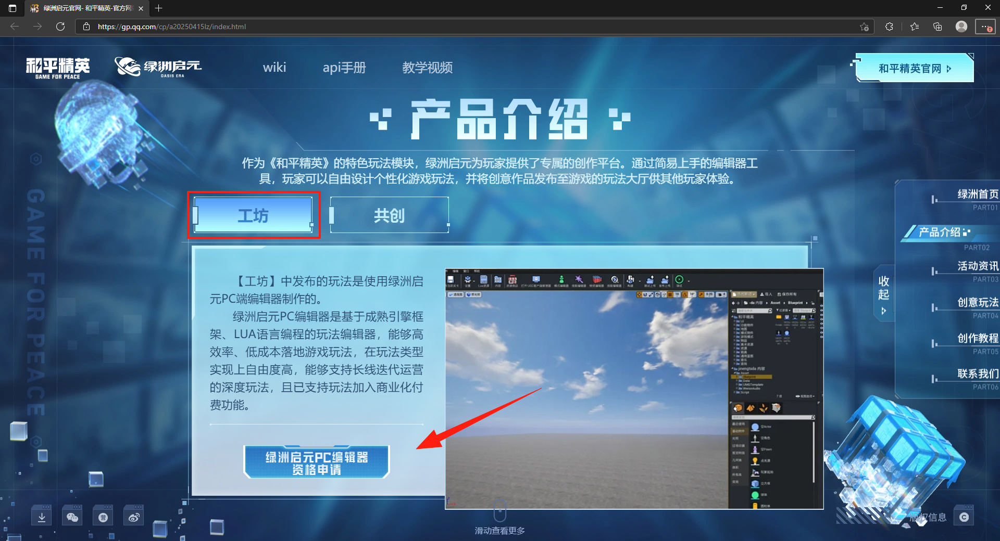

点击“绿洲启元PC编辑器资格申请”后会出现信息登记界面，根据个人情况如实填写信息，点击“提交”。然后在未来5个工作日内（如遇节假日则顺延）等待官方联系，了解资格获取情况。

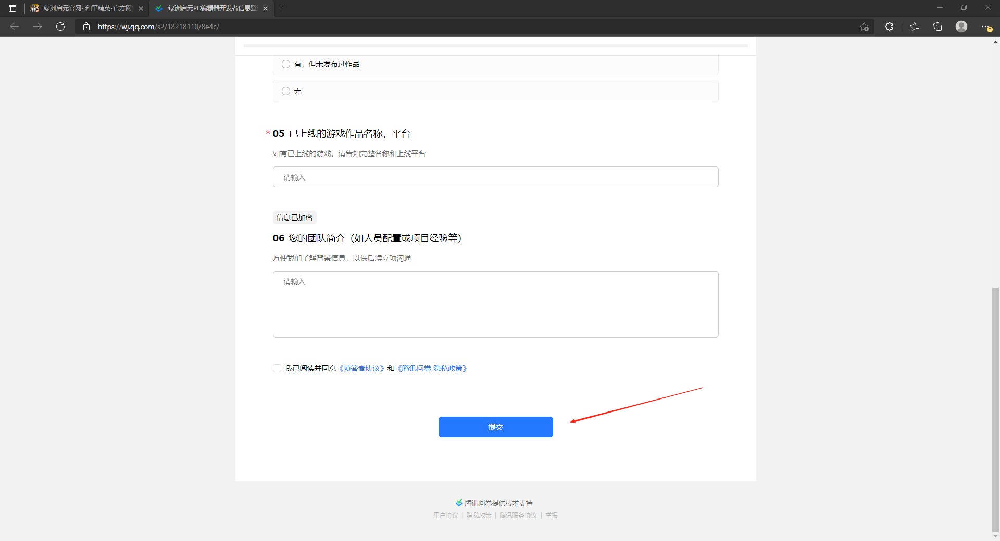

---

### 安装WeGame

**注意：**
> 如果电脑已经安装WeGame，可以跳过此步骤，从“安装编辑器”继续。

进入 [WeGame](https://www.wegame.com.cn/home/) 官网，点击下载WeGame安装包。

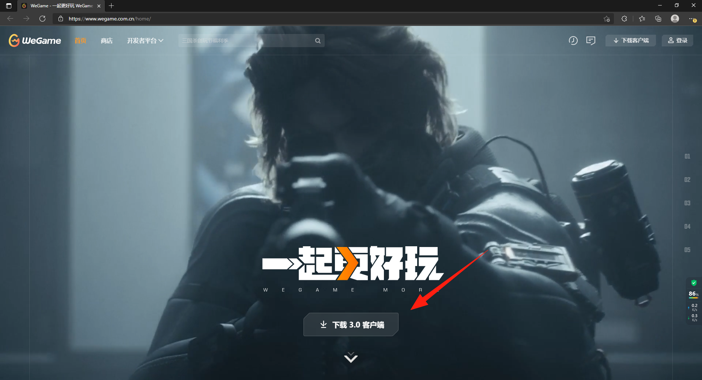

下载完成后打开WeGame安装包，勾选协议，选择安装路径，点击“开始安装”，安装完成后打开WeGame。

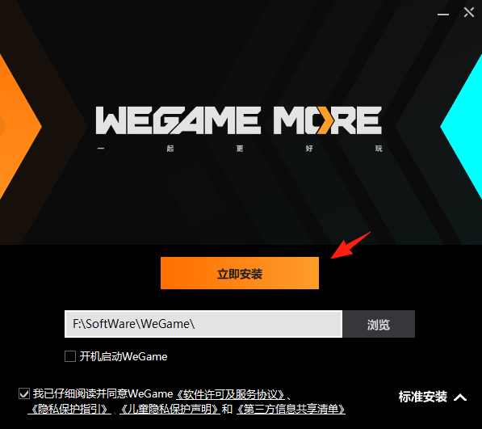

---

### 安装编辑器

打开WeGame，并且使用有编辑器资格的账号登陆WeGame。

**注意：**
> 安装编辑器前必须获得绿洲启元PC编辑器的资格，否则无法下载和安装绿洲启元编辑器。

登录后，在上方搜索栏输入并搜索：和平精英绿洲启元编辑器，然后点击进入详细页面。

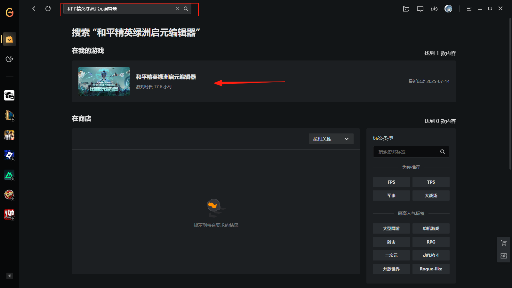

进入详细页后，点击“下载”。

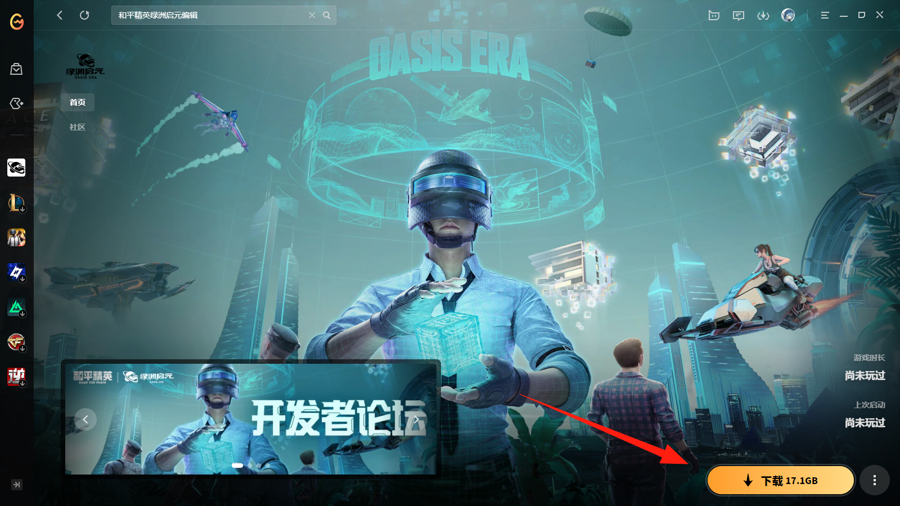

选择安装位置后，点击“保存”，正式开始下载安装编辑器。

**注意：**
> 为确保编辑器的功能使用正常，WeGame及绿洲启元编辑器的安装目录路径，请勿包含空格、括号等特殊符号（仅支持英文及下划线）

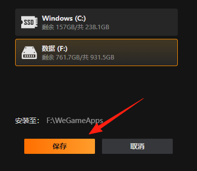

编辑器成功安装后，点击“启动”，进入绿洲启元编辑器登录界面。

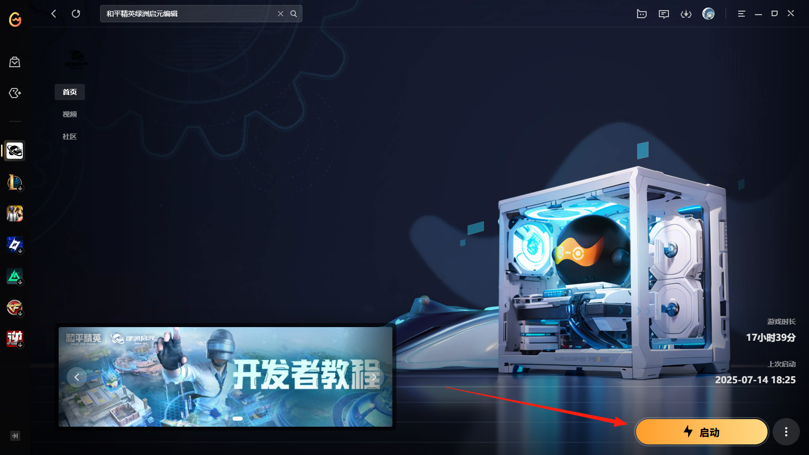

---

### 启动编辑器

> 编辑器运行文件：`WeGameApps\rail_apps\OasisEraEditor(2001776)\ShadowTrackerExtraUGCEditor.exe`

进入绿洲启元编辑器登录界面，请详细阅读《腾讯游戏许可及服务协议》、《隐私保护指引》及《绿洲启元开发者协议》。点击“QQ登录”并通过登录验证后，会打开绿洲启元的玩法工程创建界面。

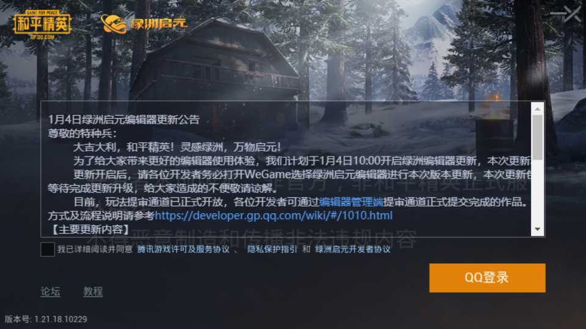
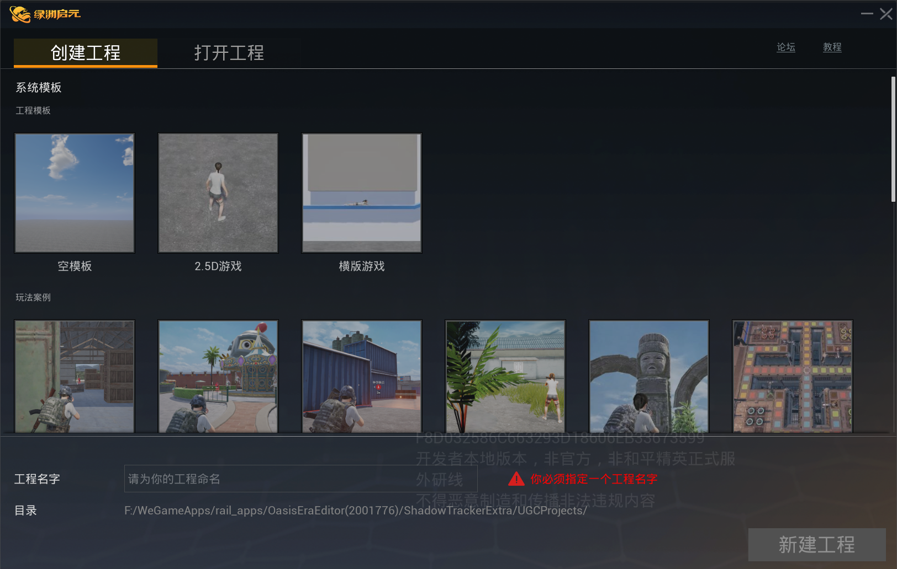

选择任意一个模板工程，输入工程名，点击“新建工程”，会弹出“用户协议”窗口，正式进入创作前请详细阅读《开发者创作准则》。阅读完全文后勾选“已阅读”选项，点击“同意”按钮，便可开启绿洲玩法的创作。

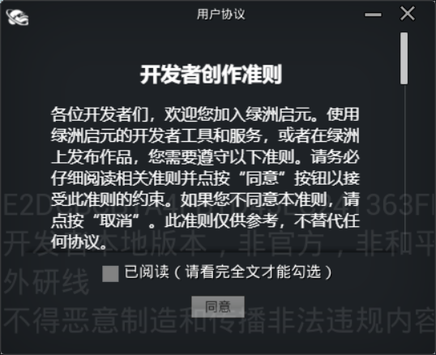
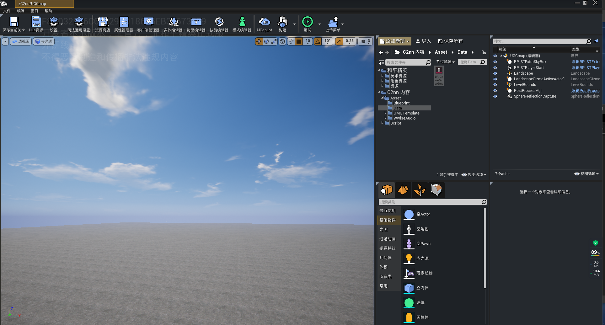

> 编辑器日志目录：`WeGameApps\rail_apps\OasisEraEditor(2001776)\ShadowTrackerExtra\Saved\Logs`
>
> 编辑器日志文件：`ShadowTrackerExtra-backup-[时间].log`
> 例如：`ShadowTrackerExtra-backup-2025.07.01-17.00.00.log`

## 开发环境搭建

绿洲启元编辑器使用Lua作为脚本开发语言，在开始编写代码之前，需要安装代码编辑器和配置相关的运行环境。

### 安装代码编辑器

绿洲启元编辑器支持多种第三方代码编辑器作为脚本的开发及调试工具，其中包括VS Code (Visual Studio Code)这一开源的轻量级代码编辑器，该编辑器支持几乎所有主流编程语言的编辑及辅助能力，同时具备丰富的插件扩展支持，可以作为绿洲启元编辑器的开发工具IDE。

VS Code代码编辑器可以通过VS Code官网进行下载安装（https://code.visualstudio.com/docs/?dv=win）。安装好VS Code之后，打开VS Code，可以看到如下界面。如果是英文版的语言环境，可以通过安装中文插件来进行语言环境的切换。

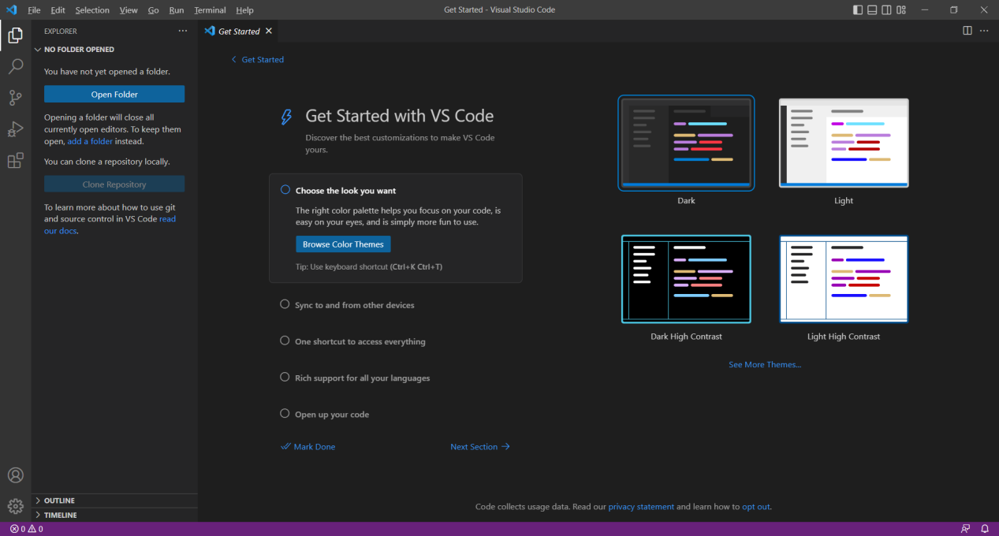

点击“插件管理器”，搜索“chinese”，安装简体中文语言包插件，安装完VS Code会自动弹出切换语言的提示，点击“Change Language and Restart”，会重启VS Code并切换到中文版。

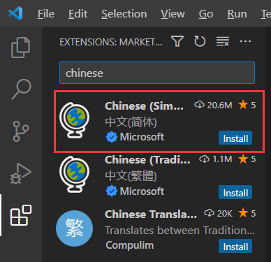

**注意：**
>1. 包括VS Code在内的代码编辑器由第三方提供，和平精英无法对代码编辑器的性能和表现做出任何保证，有关第三方代码编辑器的使用，请以其官方网站或官方渠道发布的内容为准，以上内容仅供参考；
>2. 在使用第三方代码编辑器的过程中，请遵循相关软件的许可协议（如使用VS Code作为开发工具，请遵循 [Visual Studio Code许可协议](https://code.visualstudio.com/license)），请确保已阅读并理解许可协议的内容，以在使用过程中符合其相关规定。

---

### 创建配置文件

安装完VS Code后，对于玩法脚本的打开和编辑还依赖于workspace.code-workspace配置文件，用编辑器打开玩法工程，点击菜单栏 ``文件 -> Generate VS Code Workspace``即会在工程根目录下自动生成该配置文件。

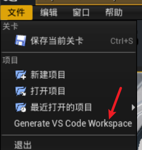

或者可以从其他工程，如空模板中复制同名文件手动放在工程根目录下。

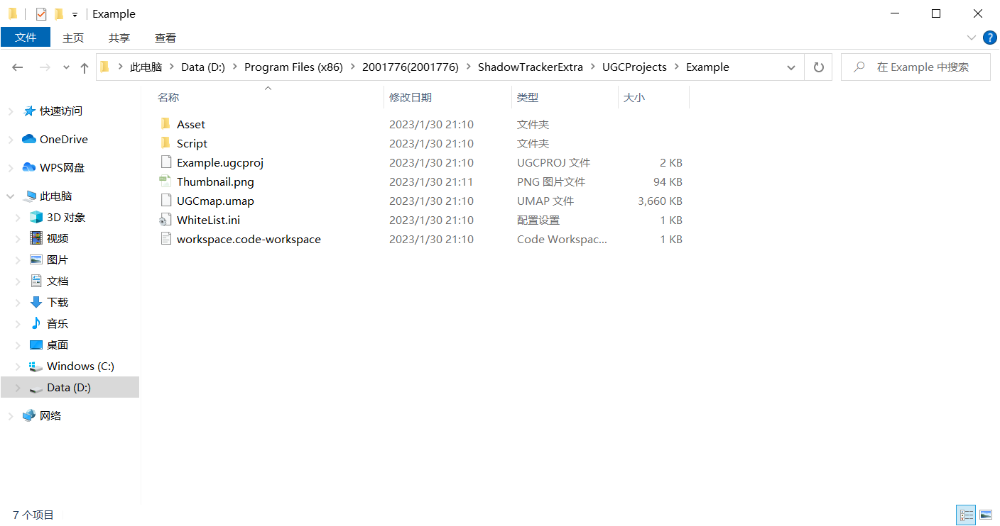

双击workspace.code-workspace配置文件打开VS Code，看到左侧列表如下图，且工程脚本文件能够正常浏览打开，即配置成功。

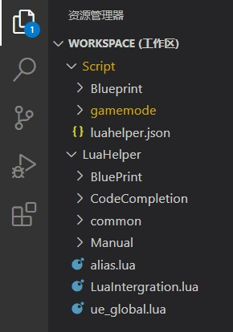

---

### 下载EmmyLua插件

[EmmyLua](./脚本编写/20272_EmmyLua调试工具.md#下载EmmyLua插件) 是Visual Studio Code上功能强大的插件，不但具备IDE常见的自动联想、错误提示和代码跳转等基本功能，还额外支持了远程DS调试和功能更为强大的多端调试功能，推荐开发者安装此插件进行日常代码调试，以提升开发效率。

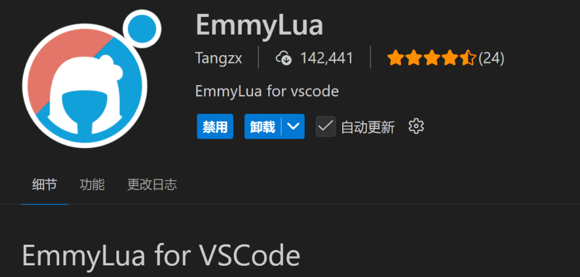

## 编辑器的修复与卸载
如果编辑器在使用途中出现崩溃或无法使用等异常，可以尝试对编辑器进行修复，修复完成后再重新尝试。
点开WeGame界面，右键绿洲启元编辑器的图标，点击“修复游戏”。 
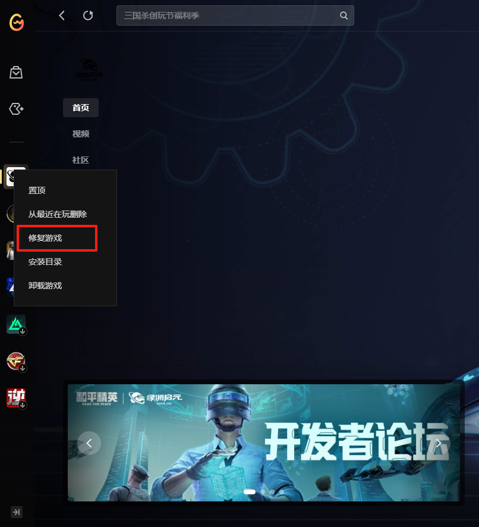

如果修复完成后，编辑器仍旧无法正常使用，可以尝试卸载并重新安装。
点开WeGame界面，右键绿洲启元编辑器的图标，点击“卸载游戏”，卸载完成后，点击右下角安装，进行重新安装。 
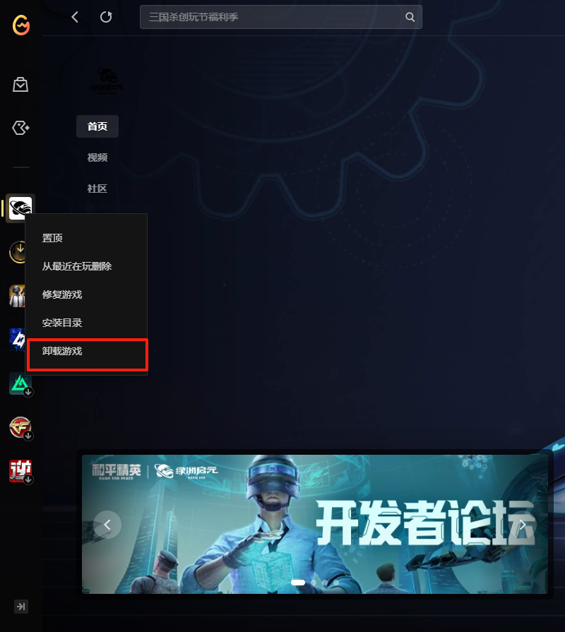

**注意：**
>编辑器卸载会将UGCProjects目录删除，如果目录下有需要保存的项目工程，需要先将项目保存一份副本，在编辑器重新安装完成后，再将副本放回UGCProjects目录。

## 安装问题反馈
如果在安装绿洲启元编辑器的过程中，出现了无法解决，或者其他无法正常进行安装启动编辑器的问题，可以前往开发者论坛发帖询问，我们看到后会尽快回复处理，论坛地址：[绿洲启元 - 开发者论坛](https://forum.developer.gp.qq.com/)
