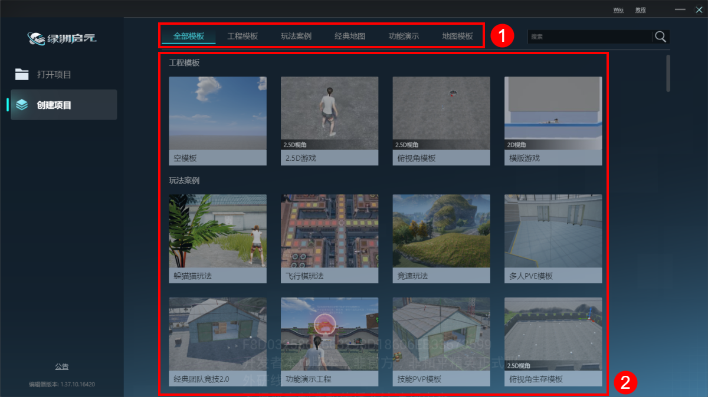
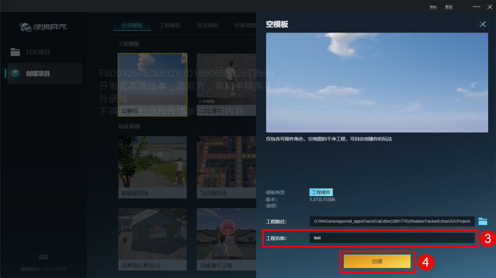
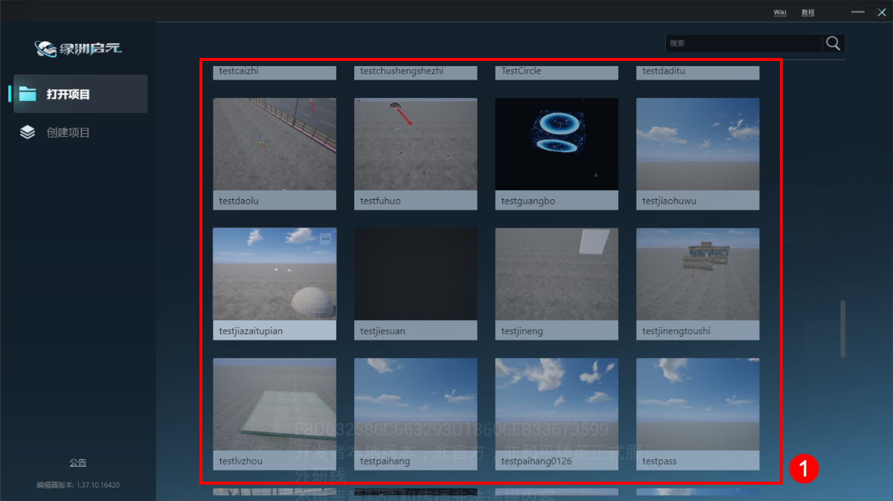
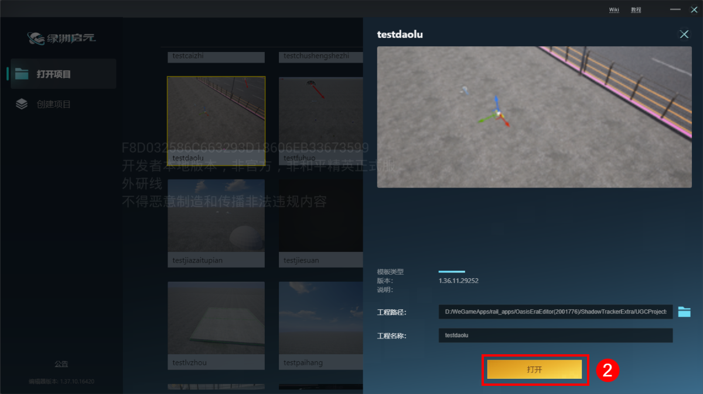
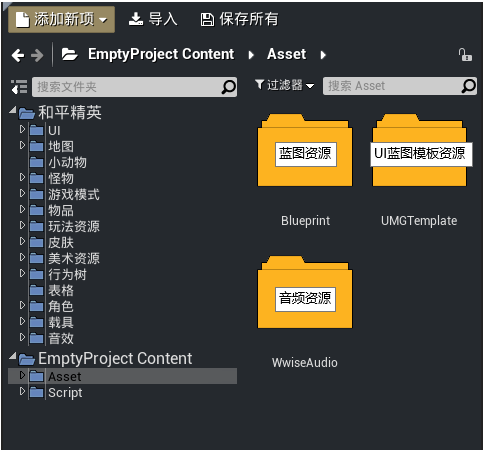
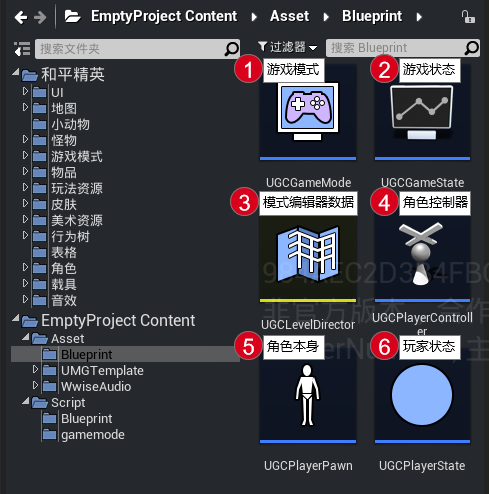
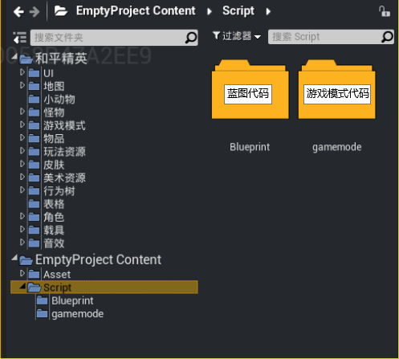
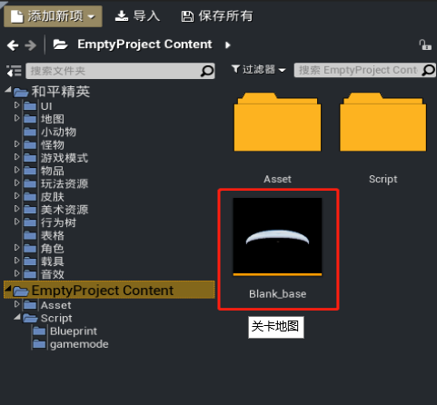

#  创建工程及工程结构介绍

当你安装完绿洲启元编辑器后，魔幻之旅就正式开始了。

## 创建与打开工程

### 1. 创建工程

在“创建项目”页签下，首先选择模板类型，再单击选择其中一项作为模板。

弹出详细窗口后填写工程名称，最后点击“创建”完成工程创建。

**注意事项**
① 工程命名必须为英文，符号只能用 _ 下划线，不支持中文。
② 工程文件不要直接重命名，如果直接重命名，工程中资源之间的引用关系会丢失，工程将无法正常使用，使用编辑器创建会保持资源之间的引用关系，因此创建工程需要使用编辑器来创建。

#### 工程模板类型介绍

绿洲启元编辑器提供多种工程模板，方便开发者快速上手。各模板类型及其说明如下：

|模板类型|说明|
|:-:|-|
|工程模板|包含空模板、2.5D游戏、俯视角模板、横版游戏等基础模板|
|玩法案例|提供如躲猫猫、飞行棋、竞速等常见玩法的完整示例|
|功能演示|展示特定功能的实现方式|
|地图模板|使用和平经典模式地图的空工程，不包含游戏逻辑，可以在原地图的基础上新增自己的创意|
|本地模板|以本地已创建的项目作为模板，便于复用已有工程结构|

---

### 2. 打开工程

在“打开项目”页签下，单击选择需要打开的工程，弹出详细窗口后点击“打开”。

## 工程工作区介绍

### 1. Asset

### 2. Script

### 3. Map

