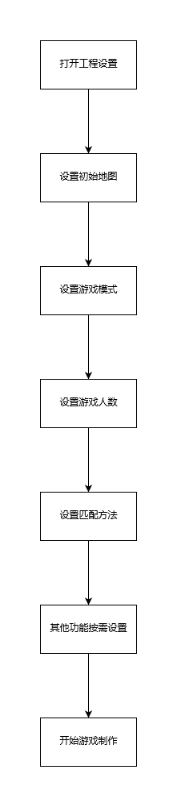
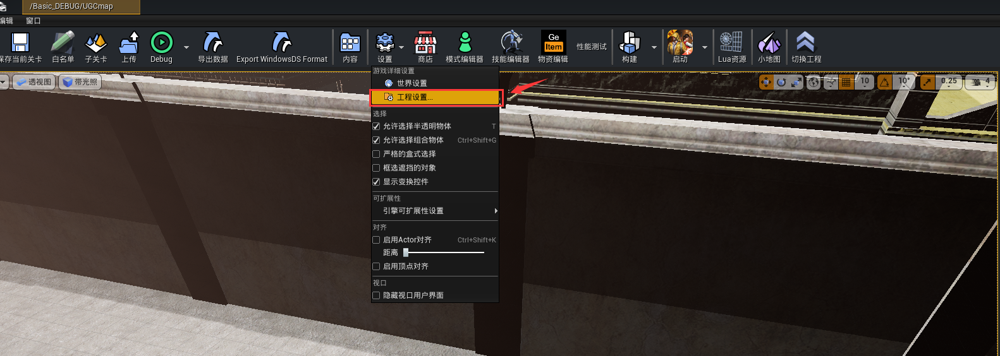
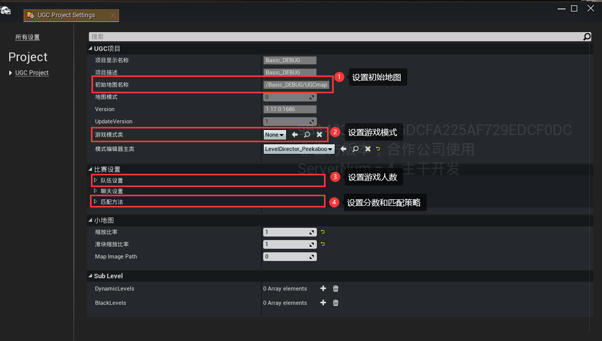

# 项目设置

在使用绿洲启元编辑器创建完工程之后，建议先对项目工程进行设置，再开始你的游戏制作之旅，下面介绍项目设置的主要内容。

## 流程：

## 实战演练：

1. 打开项目之后，打开项目设置：

2. 设置初始地图，游戏模式，游戏人数和匹配方法：

3. 按需设置其他功能，之后即可开始你的游戏制作之旅。

## Wiki参考

项目设置参数的具体含义和解释可参考相关wiki

1. 初始地图和游戏模式：[绿洲启元玩法开发框架介绍](../../进阶内容/352_绿洲启元玩法开发框架介绍.md)

2. 队伍设置和匹配设置：[匹配设置](../匹配系统/127_匹配设置.md)
