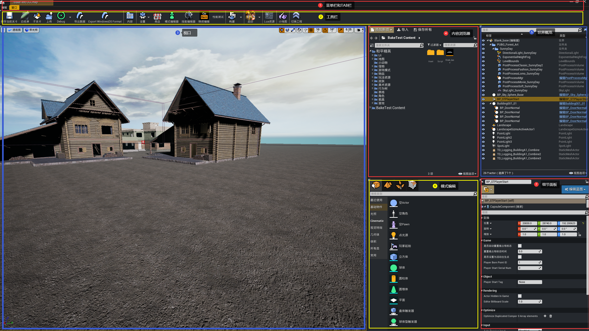
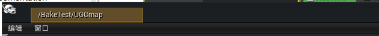
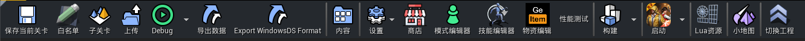
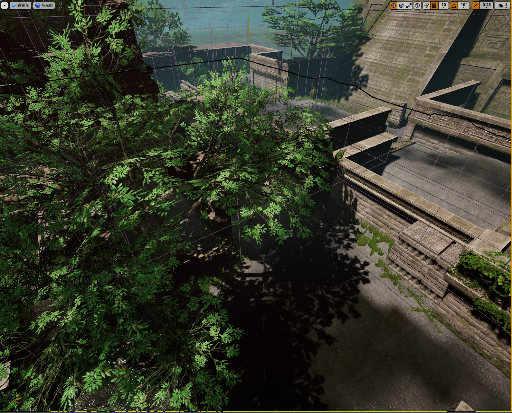
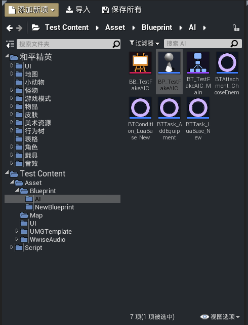
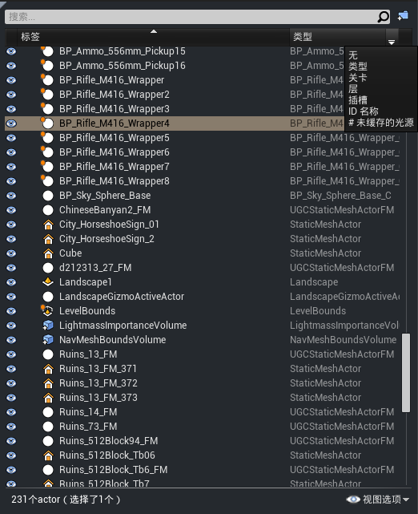
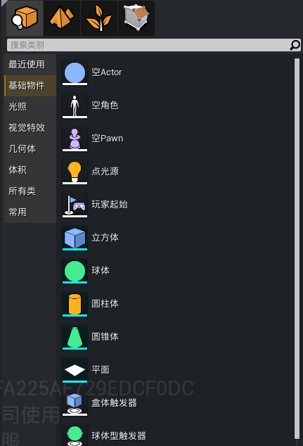
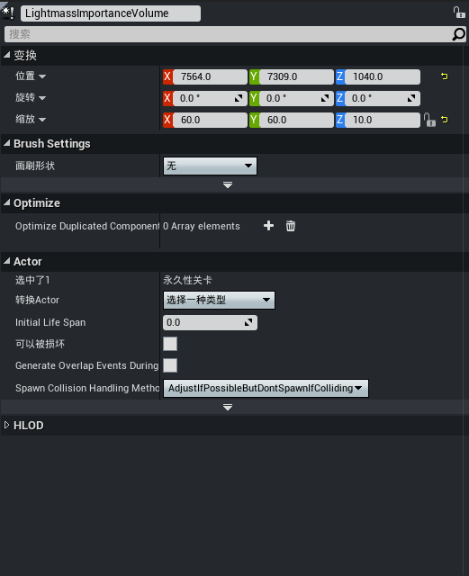

# 场景编辑器概述

场景编辑器是设计师编辑游戏关卡的主要工具，下面我们会简单介绍一下场景编辑器的界面构成。

---

## 界面总览

场景编辑器主要分成7个区域：

1.菜单栏和Tab栏

2.工具栏

3.视口

4.内容浏览器

5.世界大纲

6.模式编辑

7.细节面板

---

## 菜单栏和Tab栏

Tab栏提供了一种快捷的方式访问多个编辑器功能窗口的方式，就像浏览器的网页一样。

菜单栏提供了一个访问常用工具和命令的方法。

---

## 工具栏

工具栏提供了一个访问一系列常见命令和常用工具的方法。

---

## 视口

视口提供了多种视图方式(顶视角，侧视角，前视角，透视图)查看世界，并且提供了在世界中移动，编辑和调整世界中actor的多种方法。

---

## 内容浏览器

内容浏览器以文件夹的形式显示了项目中可以使用的各种资源，包括和平精英资源。可以在内容浏览器中快速的创建，编辑修改，搜索资源。

---

## 世界大纲

世界大纲 面板 以层次化的 树状图形式显示了世界中的所有Actor，可以在 世界大纲 中直接选择和修改Actor，也可以使用 信息 下拉菜单 来额外显示 关卡，图层或者ID名称等信息。

---

## 模式编辑

模式编辑 会针对特定模式，更改关卡编辑器的主要行为。例如：

---

## 细节面板

细节面板 包含了关于视口中当前选中对象的信息，及功能。包含了Actor的Transform编辑框，选中Actor的所有可编辑属性，以及和Actor类型相关的其他编辑功能。

