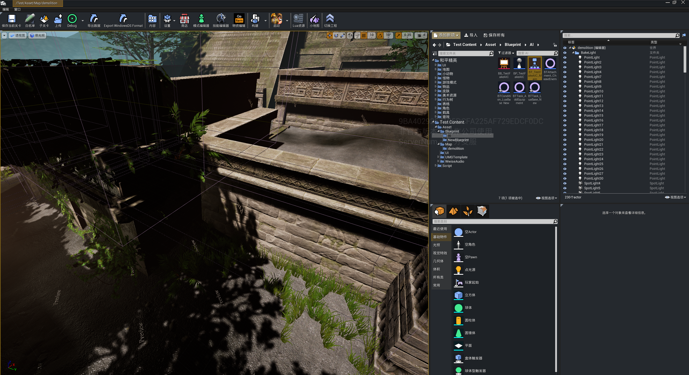
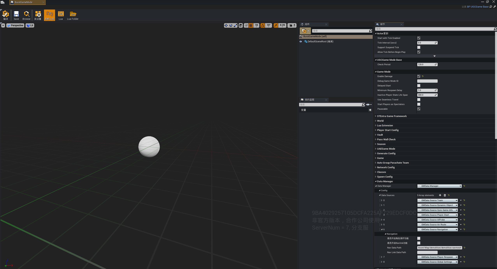
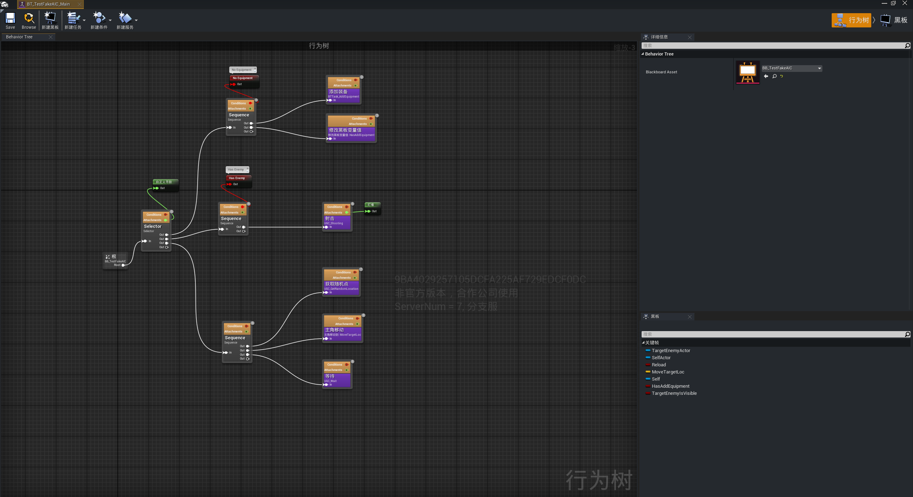
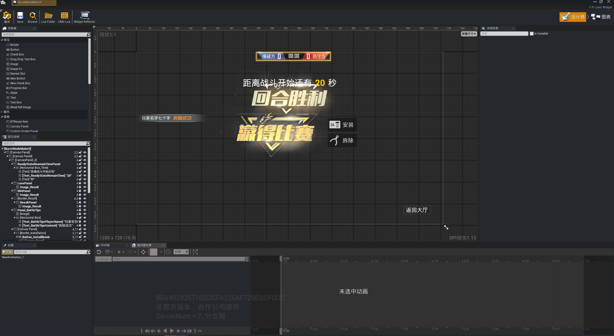
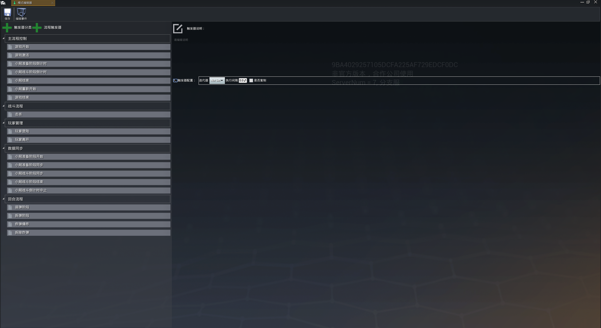
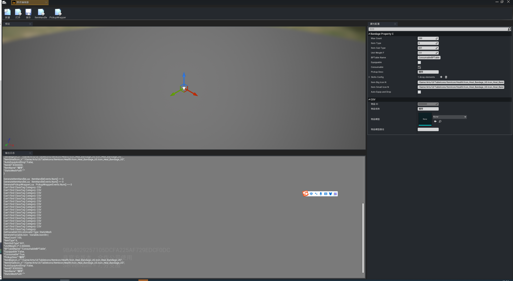
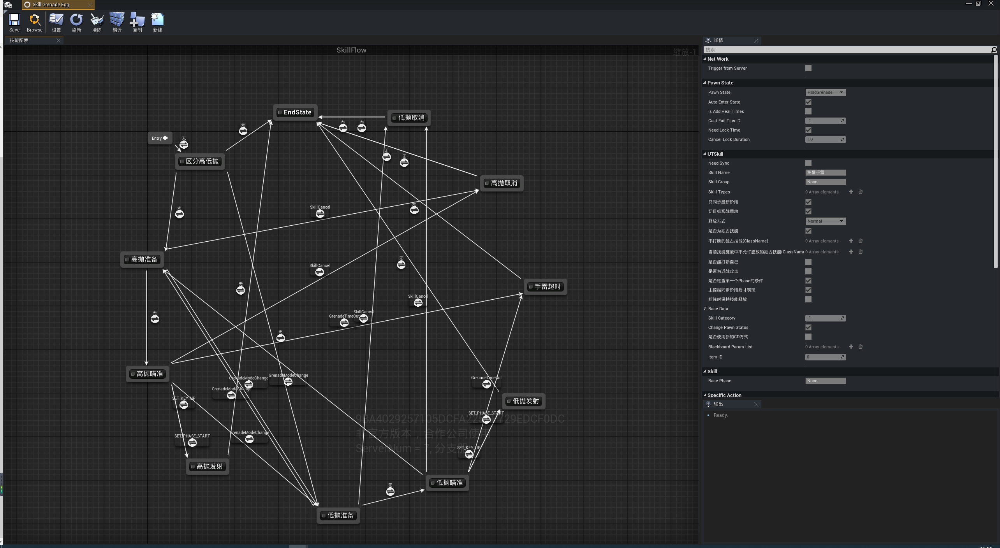
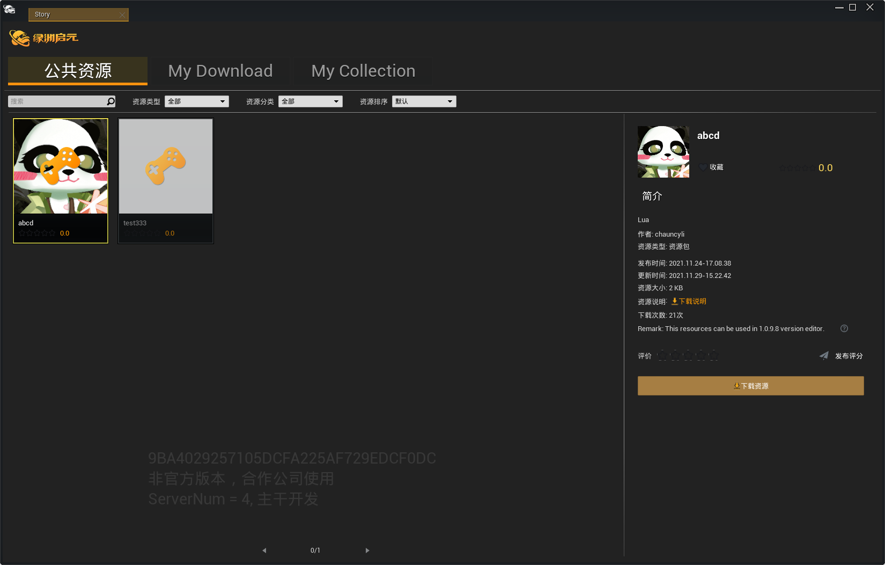

# 编辑器功能窗口概括

在这个页面中，会对绿洲启元编辑器的主要窗口做一个简单总览介绍。

## 场景编辑器

场景编辑器主要帮助你构建关卡，你可以添加各种不同的 Actors、几何体、蓝图类和光照等到游戏项目中。在默认的情况下，新建或者打开项目都会自动打开场景编辑器。

## 蓝图编辑器

蓝图编辑器是修改蓝图的主要地方，并且你可以在蓝图编辑器中生成和修改蓝图对应的Lua。

## 行为树编辑器

在行为树编辑器内，能够可视化的修改一个怪物或者角色的AI，也可以自定义行为树Lua节点。

## UI编辑器

UI编辑器是一个可视化创建UI界面的工具，并可以使用Lua编程编写界面交互逻辑。

## 模式编辑器

模式编辑器可以帮助你快速创建和改变游戏的游戏规则。

## 物资编辑器

物资编辑器是一个协助制作游戏内物品道具的工具。

## 技能编辑器

技能编辑器可以帮助你快速创建游戏内的技能。

## 资源商店

资源商店是一个你可以搜索和下载资源的地方，资源包括模型、动作、贴图和特效等。

