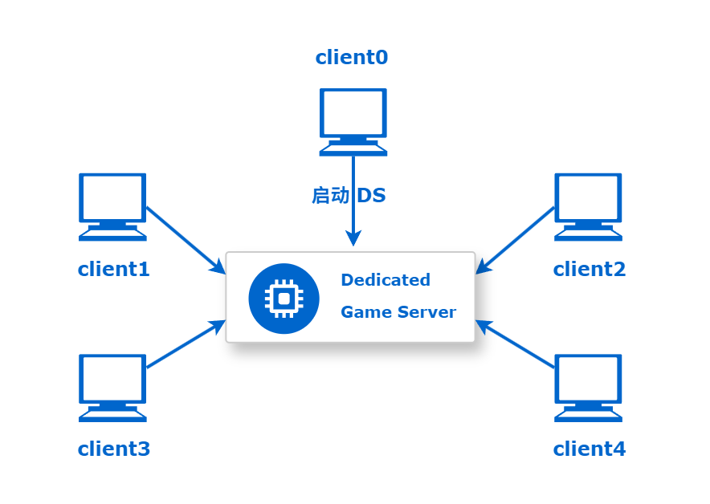
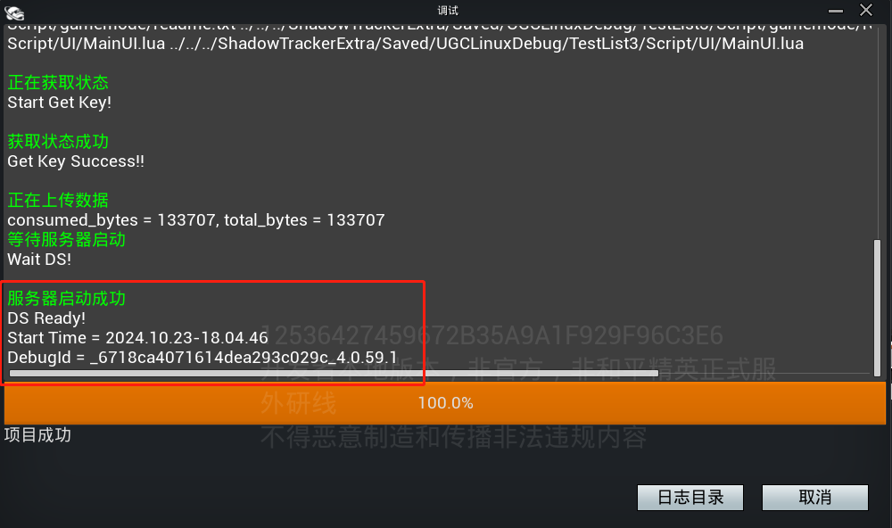
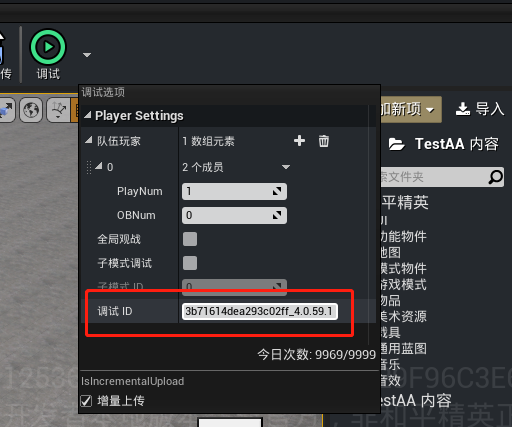
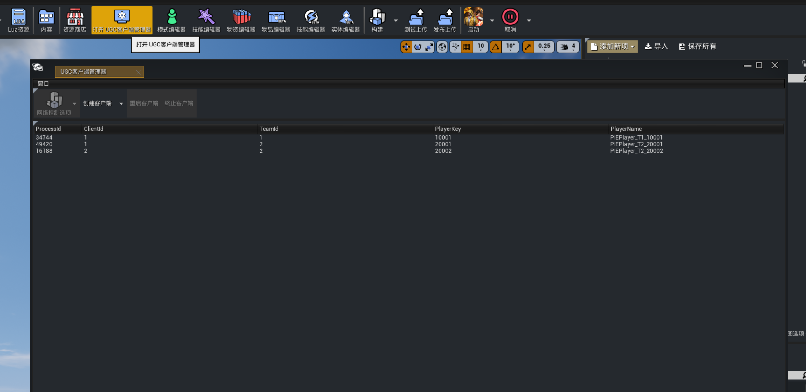

# 编辑器联机调试

联机调试功能提供了局域网环境下，不同主机上的客户端连入同一个服务器环境调试的解决方案，任一主机 [启动调试](./307_编辑器Debug调试.md) 后，通过共享的服务器标识可以让其他主机加入同一个DS环境，实现多客户端联调的效果，方便开发者实时共享调试信息和反馈，达到协作测试的目的。



## 启动服务器

选择一台主机作为DS启动方，通过 [调试工程](./307_编辑器Debug调试.md) 来启动DS服务器。当调试弹窗出现对应提示信息后，则代表服务器启动成功，此时将信息中的 ```DebugId``` 记录下来，作为其他主机加入服务器的凭证。



## 加入服务器

加入方在调试下拉选项中【调试ID】处填写启动服务器时的 ```DebugId``` ，点击调试即可加入服务器。



## 创建客户端

加入服务器成功后，通过 [客户端调试管理器](./20042_客户端调试管理器.md) 可以创建客户端以连入DS对局，开发者可以按需启动任意数量的客户端。

> 启动服务器的主机也可以通过调试选项中的 [玩家设置](./307_编辑器Debug调试.md) 启动相应数量的客户端；而加入方只能通过客户端管理器启动客户端



**注意：**
- 客户端id为唯一标识，如果创建客户端按钮灰色无法点击，代表填写的ClientId与本机已开启的客户端Id重复
- 如果重复添加其他主机已使用过的ClientId，则新启动的客户端会顶替其他客户端，且继承其玩家的状态数据
