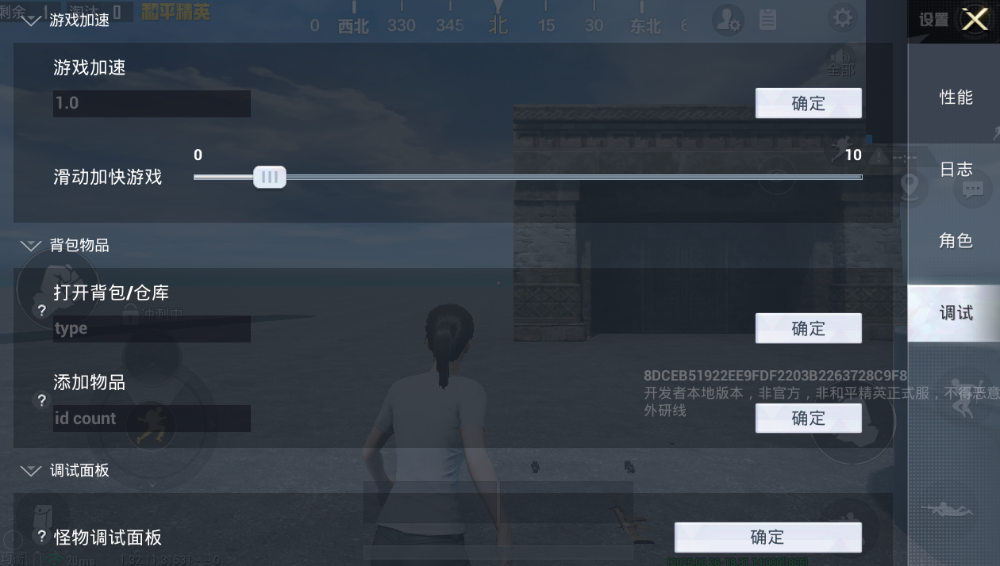
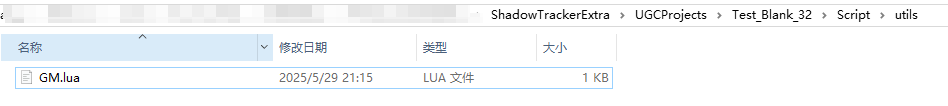
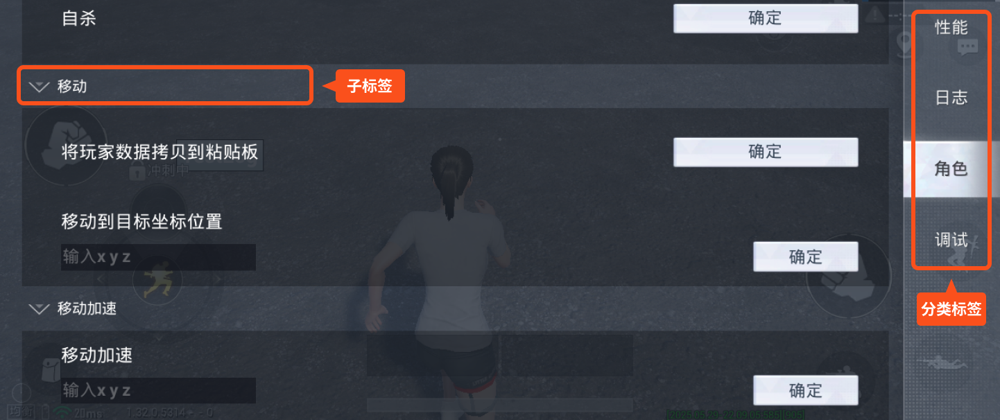
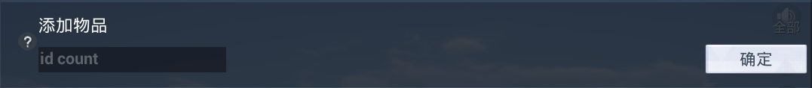
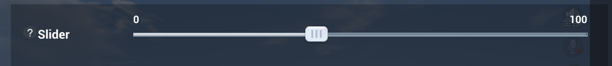
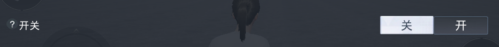
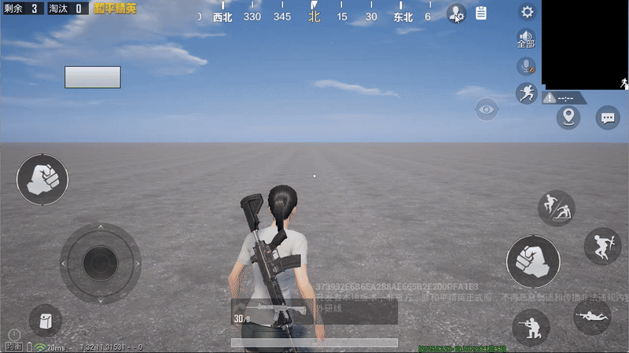
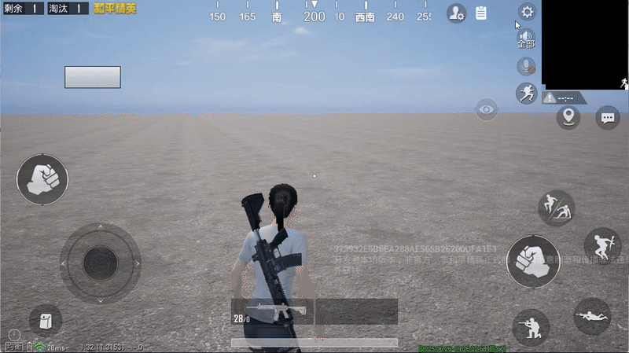
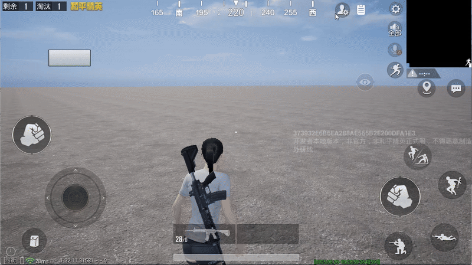
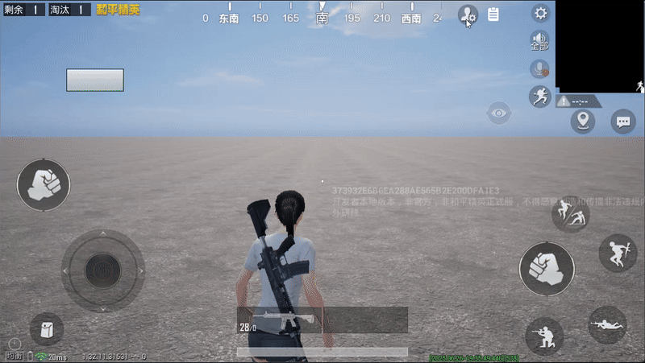

# 通用GM面板

GM（Game Master Command）指令是游戏开发过程中的一类特殊指令，常用于游戏运行时与游戏场景、玩法功能、底层数据等进行交互，以达到快捷的调试功能、验证结果等目的。

通用GM面板是一套为开发者设计的GM工具集，通过图形化界面的交互方式，开发者可以方便地使用预置的GM指令功能，同时提供了一套高度可扩展的框架，允许开发者扩展自定义的GM，极大提升开发效率与调试的灵活性。

## 展开GM面板

进入玩法对局后，GM功能入口固定在主界面右上角 [调试日志](./354_调试日志说明.md#日志打印函数ugcprint) 按钮旁边，点击即可展开GM面板。



> GM功能仅在包含 [编辑器Debug调试](./307_编辑器Debug调试.md) 与 [真机测试](../上传和发布玩法/372_上传工程与真机测试.md) 的环境中提供，因此功能入口也仅在测试环境中生效。

## 预置GM功能

GM面板提供了一批预置的通用GM功能，按功能类型划分为性能、日志、角色、调试等类别，开发者可以直接使用这些GM功能。

**对局**
|GM名称|GM功能|
|-|-|
|头顶信息开关|开启后，将通过字符串的形式在Pawn头顶显示包含PlayerKey、UID、坐标等角色基础信息|
|修改时间|修改 [``GetServerTimeSec``](https://developer.gp.qq.com/api/#/searchContent/UGCGameSystem?classDetailShow=true&path=class%2Fdetail%2F%E5%92%8C%E5%B9%B3%E5%85%A8%E5%B1%80%E6%8E%A5%E5%8F%A3%2F%E5%9F%BA%E7%A1%80%E5%8A%9F%E8%83%BD%2FUGCGameSystem.json&isSelect=1&apiEnc=%5B%22%E7%B1%BB%22%5D&apiLabel=UGCGameSystem&autoJump=GetServerTimeSec) 返回的服务器时间|
|时间显示开关|开启后，将在左上角显示当前真实时间|
|重置时间为当前时间|将 [``GetServerTimeSec``](https://developer.gp.qq.com/api/#/searchContent/UGCGameSystem?classDetailShow=true&path=class%2Fdetail%2F%E5%92%8C%E5%B9%B3%E5%85%A8%E5%B1%80%E6%8E%A5%E5%8F%A3%2F%E5%9F%BA%E7%A1%80%E5%8A%9F%E8%83%BD%2FUGCGameSystem.json&isSelect=1&apiEnc=%5B%22%E7%B1%BB%22%5D&apiLabel=UGCGameSystem&autoJump=GetServerTimeSec) 返回的服务器时间重置为当前真实时间|
|恢复游戏加速|恢复游戏时间膨胀系数|
|游戏加速|设置指定的时间膨胀系数|
|滑动加快游戏|以滑块的交互形式设置时间膨胀系数，效果等同于 ``游戏加速``|
|清空档案|清除玩家的存档数据|
|开启客户端重力修改|修改角色的重力值|
|飘字|切换各种类型飘字的显示|

**性能**

|GM名称|GM功能|
|-|-|
|记录/停止记录UGC Profile|开启UGCProfile的记录，存储路径为`WindowsUGCEditor\ShadowTrackerExtra\Saved\Profiling\CSV`|
|记录/停止记录客户端UGC Stats|开启客户端的UGCStats的记录，存储路径为`WindowsUGCEditor\ShadowTrackerExtra\Saved\Profiling\UnrealStats`|
|记录/停止记录服务端UGC Stats|开启服务端的UGCStats的记录|

**日志**

|GM名称|GM功能|
|-|-|
|打印客户端调试日志|输出客户端调试日志|
|调试日志|打开战斗日志面板|

**角色**

|GM名称|GM功能|
|-|-|
|角色技能信息|显示玩家技能信息|
|无敌|玩家进入无敌状态，再次点击关闭|
|自杀|玩家血量归0|
|将玩家数据拷贝到粘贴板|复制玩家当前的世界坐标位置|
|移动到标点|将玩家移动到小地图上标记的指定位置|
|移动到目标坐标位置|将玩家传送到指定坐标位置|
|恢复移动速度|恢复玩家的移动速度系数至默认值|
|移动加速|设置玩家移动速度系数，效果等同于 [``SetSpeedScale``](https://developer.gp.qq.com/api/#/searchContent/UGCSimpleCharacterSystem?classDetailShow=true&path=class%2Fdetail%2F%E5%92%8C%E5%B9%B3%E5%85%A8%E5%B1%80%E6%8E%A5%E5%8F%A3%2F%E6%80%AA%E7%89%A9%E7%B3%BB%E7%BB%9F%2FUGCSimpleCharacterSystem.json&isSelect=1&apiEnc=%5B%22%E7%B1%BB%22%5D&apiLabel=UGCSimpleCharacterSystem&autoJump=SetSpeedScale)|

**调试**

|GM名称|GM功能|
|-|-|
|导航网格展示|展示场景中导航网格|
|显示抛体子弹落点|自定义抛体的枪械射出抛体之后，使用临时的球来标记落点|
|枪械无限子弹|当前持有的枪械的子弹变为无限|
|填满背包|给背包中发放所有的自定义道具，有二次弹窗确认|
|打开背包/仓库|按指定的类型打开对应的背包或者仓库界面，效果等同于 [``OpenBackpackPanel``](https://developer.gp.qq.com/api/#/searchContent/UGCBackpackSystemV2?classDetailShow=true&path=class%2Fdetail%2F%E5%92%8C%E5%B9%B3%E5%85%A8%E5%B1%80%E6%8E%A5%E5%8F%A3%2F%E7%89%A9%E5%93%81%E4%B8%8E%E8%83%8C%E5%8C%85%2FUGCBackpackSystemV2.json&isSelect=1&apiEnc=%5B%22%E7%B1%BB%22%5D&apiLabel=UGCBackpackSystemV2&autoJump=OpenBackpackPanel)|
|添加物品|为玩家添加指定数量的物品，兼容 [物资编辑器](../../进阶内容/GamePlay系统/物资系统/物资编辑器1.0/185_概述.md) 和 [物品编辑器](../../进阶内容/GamePlay系统/物资系统/物资编辑器2.0/20101_物品编辑器.md) 的物品|
|添加物品 新|新的添加道具界面，提供自动联想，历史记录等功能|
|清空背包|将当前玩家的背包中所有道具全部移除，有二次弹窗确认|
|怪物调试面板|展开 [怪物调试工具](../../进阶内容/GamePlay系统/怪物系统/20161_怪物调试工具.md) 面板|
|显示准星信息|实时打印枪械准星瞄准的对象信息至界面中|
|显示性能调试信息|包含Triangles（三角形）、Drawcalls（绘制调用）、Mem（内存）、FPS（帧率）等性能数据实时显示<br>- Triangles：统计当前同屏显示的三角面数据<br>- Drawcalls：统计当前同屏调用的渲染线程次数<br>- Mem：统计当前同屏/场景内存占用信息（单位：MB）<br>- FPS：显示当前实时运行帧率|
|角色调试面板|展开 [技能调试工具](../../进阶内容/GamePlay系统/技能系统/技能编辑器2.0/20114_技能调试工具.md) 面板|
|隐藏全局UI|隐藏游戏内所有UI元素，存在任何类似移动、点击等输入操作时将自动还原|
|修改载具属性|修改驾驶/乘坐中的载具对象属性值，仅支持 [预置载具属性](../../进阶内容/GamePlay系统/属性与伤害/20246_载具属性对照表.md)|
|创建载具|生成指定的载具对象，参数为Asset起始的完整蓝图路径，例如 ``Asset/Blueprint/Prefabs/Vehicles/Vehicle_Bus.Vehicle_Bus_C``|

## 扩展GM功能

GM面板支持添加自定义的GM功能，通过 ``GM`` 类提供扩展框架，开发者在该类脚本中实现GM配置及功能逻辑。

### 创建GM脚本

GM框架默认从工程的 ``../Script/utils`` 目录下的 ``GM.lua`` 脚本读取配置及定义，因此开发者需要确保该路径下存在目标脚本，如果不存在需手动创建。



同时，需要确保GM脚本中保留以下框架的基础代码，否则将不显示预置GM功能。

```lua
local GM = {}

function GM:Register(DebugUI)
    local UGCGMUI = require("client.ingame.ugc.ugc_gmui")

    local CurFuncList = {}
    -- TODO 此处扩展GM配置
    return CurFuncList
end

return GM
```

---

### 注册GM指令

所有的GM指令功能必须封装在 ``GM`` 类中，且需要先在 ``GM:Register(DebugUI)`` 中进行注册，该函数负责将定义的GM指令与游戏预置的统一调试界面关联起来，允许这些指令可以通过调试界面触发，完整的配置结构如下：

``` lua
function GM:Register(DebugUI)
    local UGCGMUI = require("client.ingame.ugc.ugc_gmui")

    local CurFuncList = {
        ["分类标签1"] = {
            ["子标签1"] = {
                {控件类型枚举值, {控件参数, 提示内容}, 回调函数名},
                -- 更多指令...
            },
            -- 更多子标签...
        },
        -- 更多分类...
    }

    return CurFuncList
end
```

分类标签和子标签分别对应GM面板的一、二级tab页签：



指令的具体参数说明如下：

- 控件类型枚举值：定义GM指令在调试界面中的交互样式，支持 `Button(按钮)` 、`TextInput(文本输入框)` 、`Slider(滑动条)` 、`SwitchButton(开关按钮)` 四种类型的控件
- 控件参数：配置控件在界面中的显示内容和默认值，格式通常为 `{GM名称, 附加参数}` ，不同控件类型参数结构不同
- 提示内容：控件功能的说明文本，以气泡的形式弹窗显示
- 回调函数名：指定触发GM指令时调用的Lua函数名称，函数在 ``GM`` 类中实现

**控件类型对照表**

| 控件类型枚举值 | 控件类型 | 功能说明 | 控件参数 | 图片说明 |
|------------|----------|----------|----------|----------|
| UGCGMUI.ItemTypeEnum.Button | 普通按钮 | 点击直接触发功能，适用于无需参数的指令 | / | |
| UGCGMUI.ItemTypeEnum.TextInput | 文本输入框 | 带输入框的控件，需用户输入参数（如"1001 5"） | 文本框提示内容 |  |
| UGCGMUI.ItemTypeEnum.Slider | 滑动条 | 模块可拖动的数值范围 | {最小值, 最大值, 默认模块位置（0~1，经归一化后的值）} | |
| UGCGMUI.ItemTypeEnum.SwitchButton | 开关按钮 | 二态切换控件（ON/OFF状态） | function () <br>return "close"<br>end <br>以内联函数体形式返回初始开关状态 | |
| UGCGMUI.ItemTypeEnum.NewGMUIButton | 二级界面跳转按钮 | 点击后跳转到指定的GM子模块页面，详见 [二级界面跳转](./20109_通用GM面板.md#二级界面跳转) | {目标模块路径} | / |

---

### 二级界面跳转

当GM功能较为复杂、需要按子模式（如不同玩法模式）拆分管理时，可以使用 `NewGMUIButton` 控件实现从GM主页面跳转到二级GM子模块页面。这样可以避免将所有GM功能堆积在单一面板中，使GM界面结构更清晰、更易维护。

#### 使用场景

- 项目中存在多个玩法子模式（如DeadLock、PVE等），每个子模式有独立的GM调试需求
- 需要将公共GM与子模式GM分开管理
- 希望实现GM面板的多级导航结构

#### 注册跳转按钮

在 `GM:Register` 中注册 `NewGMUIButton` 控件，参数为目标GM子模块的路径：

```lua
-- /Script/utils/GM.lua
local GM = {}

function GM:Register(DebugUI)
    local UGCGMUI = require("client.ingame.ugc.ugc_gmui")
    local CurFuncList = {}

    -- NewGMUIButton 格式：
    -- {ItemType, {{"按钮标题", "Tips提示"}}, "模块路径"}
    -- 第三参是目标模块路径，不是回调函数名
    CurFuncList["测试"] = {
        ["跳转"] = {
            {UGCGMUI.ItemTypeEnum.NewGMUIButton, {{"进入子页面", "点击跳转到 SubGM 子模块"}}, "Script.utils.SubGM"},
        },
    }

    return CurFuncList
end

return GM
```

#### 编写子模块GM脚本

点击跳转按钮后，GM面板会自动加载子模块中注册的功能，并重建页签列表。

子模块GM脚本与普通GM脚本结构相同，需要实现 `Register` 方法返回功能列表：

```lua
-- /Script/utils/SubGM.lua
-- 部分代码
function SubGM:Register(GMUI)
    local UGCGMUI = require("client.ingame.ugc.ugc_gmui")

    return {
        ["子页面"] = {
            ["导航"] = {
                {UGCGMUI.ItemTypeEnum.Button, {{"返回上一级"}, {"调用 SwitchBackToPreviousGMModule"}}, "C_GoBack"},
            },
        },
    }
end
```

#### 返回上一级

在子模块中，可以通过调用 `SwitchBackToPreviousGMModule` 返回到跳转前的GM模块页面：

```lua
-- /Script/utils/SubGM.lua
-- 部分代码
function SubGM:C_GoBack()
    local config = require("client.ingame.ugc.ugc_gmui_config_data")
    if config.UGCGMUI then
        config.UGCGMUI:SwitchBackToPreviousGMModule()
        ugcprint("[SubGM] 已返回上一级GM页面")
    end
end
```

也可以在子模块中注册一个 `NewGMUIButton`，指向上一级模块的路径，实现多级导航之间的灵活切换。

#### 模块路径格式

| 路径类型 | 格式示例 | 说明 |
|----------|----------|------|
| 内置模块 | `ugc.UGCGame.UGCGM.public_gm` | 引擎内置的标准GM模块 |
| 子模式模块 | `ugc.UGCGame.UGCGM.SubModeGM.dead_lock_gm` | 子模式的GM模块 |
| UGC项目模块 | `Script.utils.gm` | UGC项目中用户自定义的GM脚本，路径以 `Script.` 开头 |

> 需要注意的是，以 `Script.` 开头的路径会使用 UGC 项目的加载方式，其他路径使用标准的模块加载方式，请确保路径格式与实际文件位置一致。

#### 注意事项

- 切换到子模块后，当前GM面板中的数据会被清空并替换为新模块的内容，切换前的状态不会自动保留
- 支持多级嵌套导航，即子模块中也可以继续注册 `NewGMUIButton` 跳转到更深层级的模块，每一级都支持返回上一级
- 确保目标模块路径正确且模块文件存在，否则点击按钮后不会有响应

---

### 实现GM函数

GM功能的函数在 ``GM`` 类中定义及实现，为了方便识别函数的作用域，框架提供了 ``函数前缀`` 的方式由开发者定义函数时进行标识，定义形式为：

```lua
GM:{函数前缀}{函数名}(参数1, 参数2)
```

GM框架将控件的参数值通过 ``参数1`` 传递给GM函数作为函数的输入，通常为数值型或者字符型，各类型控件的传值如下：

| 控件类型枚举值 | 函数参数值 |
|------------|----------|
| UGCGMUI.ItemTypeEnum.Button | nil |
| UGCGMUI.ItemTypeEnum.TextInput | 输入框字符内容 |
| UGCGMUI.ItemTypeEnum.Slider | 0~1（滑块的位置经归一化后的值） |
| UGCGMUI.ItemTypeEnum.SwitchButton | open/close |

**CS_前缀**

函数将在客户端与服务端执行，适合验证逻辑执行端及双端保持特定的游戏数据一致的场景。

> GM指令不支持发送RPC，CS函数固定在双端执行，因此开发者需要确保逻辑在正确的端执行，可通过 [``IsServer``](https://developer.gp.qq.com/api/#/searchContent/UGCGameSystem?classDetailShow=true&path=class%2Fdetail%2F%E5%92%8C%E5%B9%B3%E5%85%A8%E5%B1%80%E6%8E%A5%E5%8F%A3%2F%E5%9F%BA%E7%A1%80%E5%8A%9F%E8%83%BD%2FUGCGameSystem.json&isSelect=1&apiEnc=%5B%22%E7%B1%BB%22%5D&apiLabel=UGCGameSystem&autoJump=IsServer) 判断当前所处端

```lua
---@param Param string 参数字符串
---@param PC UGCPlayerController 玩家控制器（仅DS有值，客户端值为nil）
function GM:CS_Switch(Param, PC)
    -- print("GM:Function called CS_Switch"..str)
end
```

**C_前缀**

函数仅在客户端执行，通常用于处理与UI的交互行为、客户端特效或者本地数据处理等。

```lua
---@param Param string 参数字符串
function GM:C_GetItemNum(Param)
    local Num1, Num2 = string.match(Param, "(%-?%d+%.?%d*) (%-?%d+%.?%d*)")
		print(string.format("C_GetItemNum Num1:%d Num2:%d", Num1, Num2))
end
```

**S_前缀**

函数仅在服务端执行，通常用于处理游戏逻辑、玩家数据管理、游戏状态更新等核心功能。

```lua
---@param Param string 参数字符串
---@param PC UGCPlayerController 玩家控制器
function GM:S_AddItems(Param, PC)
    local ItemID, Num = string.match(Param, "(%-?%d+%.?%d*) (%-?%d+%.?%d*)")
		print(string.format("S_AddItems Item:%d Num:%d", ItemID, Num))

		local PlayerPawn = UGCGameSystem.GetPlayerPawnByPlayerController(PC)
		UGCBackpackSystemV2.AddItemV2(PlayerPawn, ItemID, Num)
end
```

## 案例演示

以下将提供几个具体的示例，展示如何注册和实现GM指令的过程及效果。

首先，在 ``GM.lua`` 脚本中注册“双端打印”，“修改玩家生命”，“滑动条Slider”以及“按键开关”四条指令，并绑定对应类型的控件，将GM功能均放置于“调试”类别下。

```lua
-- 注册GM指令：将各调试控件与对应的GM函数进行绑定
function GM:Register(DebugUI)
    local UGCGMUI = require("client.ingame.ugc.ugc_gmui")
    local CurFuncList = {}

    CurFuncList["调试"] = {
        ["SubTab1"] = {
            {UGCGMUI.ItemTypeEnum.Button, {{"双端打印"}, {"点击后执行CS_Func"}}, "CS_Func"},
            {UGCGMUI.ItemTypeEnum.TextInput, {{"修改玩家当前生命", "输入格式：health healthMax"}, {"修改玩家生命"}}, "S_ChangeHealth"},
            {UGCGMUI.ItemTypeEnum.Slider, {{"Slider", {0, 100, 40}}, {"用于调节参数值"}}, "CS_SliderbarFunc"},
            {UGCGMUI.ItemTypeEnum.SwitchButton, {{"开关", function() return "close" end}, {"切换状态"}}, "CS_Switch"},
        },
    }

    return CurFuncList
end
```

**双端打印**

双端打印GM功能设为CS函数，执行后将在客户端和服务端打印对应的log。

``` lua
-- 既能在客户端也能在服务器端调用的示例函数
function GM:CS_Func(param, PC)
    local isServer = UGCGameSystem.IsServer()
    if isServer then
        ugcprint("GM: 服务器调用 CS_Func，处理PC：" .. tostring(PC))
    else
        ugcprint("GM: 客户端调用 CS_Func")
    end
end
```



**修改玩家生命**

修改玩家生命GM功能设为S函数，执行后通过服务端将玩家的当前血量与最大血量设置为目标值。

``` lua
-- 服务端专用命令：修改玩家血量
function GM:S_ChangeHealth(param, PC)
    ugcprint("GM: 执行添加物品命令，参数：" .. tostring(param))
    local health, healthMax = string.match(param, "(%-?%d+%.?%d*) (%-?%d+%.?%d*)")
    if health == nil or healthMax == nil then
        return
    end

    local Pawn = PC:GetPlayerCharacterSafety()

    -- 修改玩家生命值
    UGCPawnAttrSystem.SetHealthMax(Pawn, healthMax)
    UGCPawnAttrSystem.SetHealth(Pawn, health)
end
```



**滑动条Slider**

滑动条GM功能设为CS函数，当操控滑动条时在客户端与服务端打印当前值。

``` lua
-- 滑条控件对应的跨端命令：调节某个参数
function GM:CS_SliderbarFunc(value, PC)
    ugcprint("GM: 调用函数 CS_SliderbarFunc，数值：" .. tostring(value))
end
```



**按键开关**

按键开关GM功能设为CS函数，当状态值发生变化时在客户端与服务端打印当前值。

``` lua
-- 开关控件对应的跨端命令：状态切换
function GM:CS_Switch(str, PC)
    ugcprint("GM: 调用函数 CS_Switch，状态：" .. str)
end
```


