# 战斗日志

为方便开发者在调试中查看战斗相关的日志信息，编辑器提供了全新的战斗日志功能，可实时显示关键事件的打点信息。

.png)

## 战斗日志界面

进入调试后，点击设置按钮左侧的第一个功能键，即可打开战斗日志窗口。

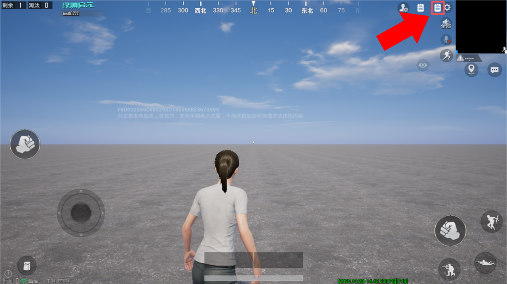


点击战斗日志窗口右上角的"×"按钮，即可关闭日志窗口。


点击日志区域底部的"点击跳转到最新"按钮，可快速跳转至最新生成的日志条目。

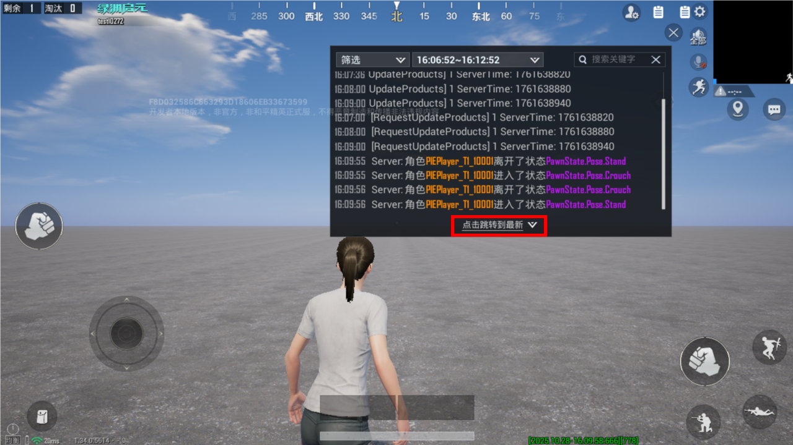

## 日志筛选

### 条件筛选

点击战斗日志窗口左上角的“筛选”按钮，可展开或收起条件筛选面板。

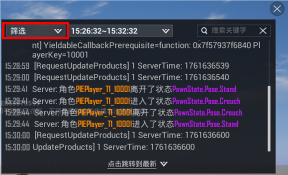

在筛选面板中，可从多个维度精确过滤日志，选择筛选条件后，点击右下角的“筛选”按钮即可显示符合条件的战斗日志。

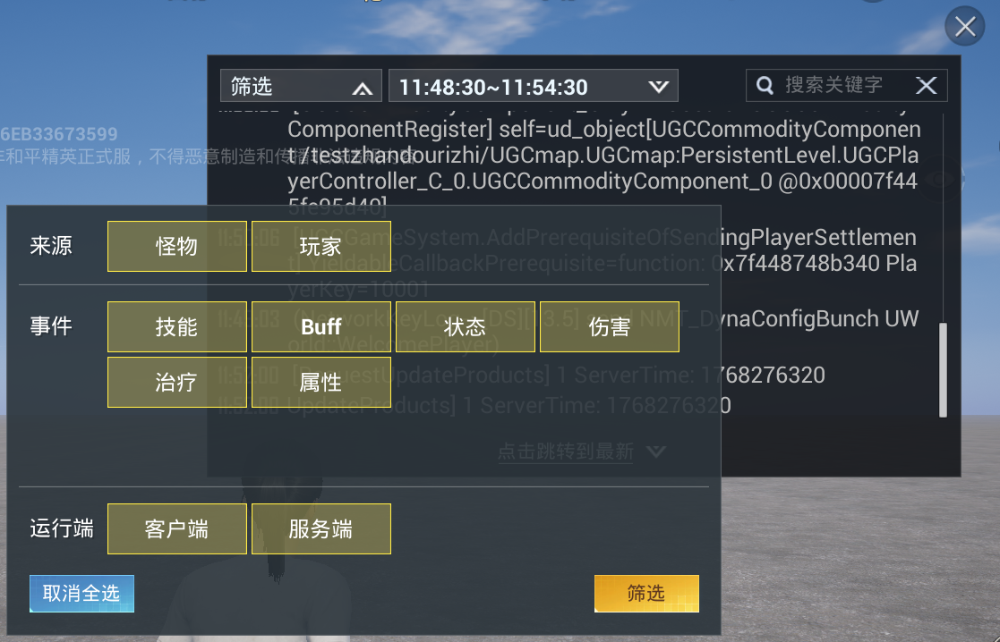

点击“取消全选”可一键清除所有已选条件，再次点击可恢复全选状态。

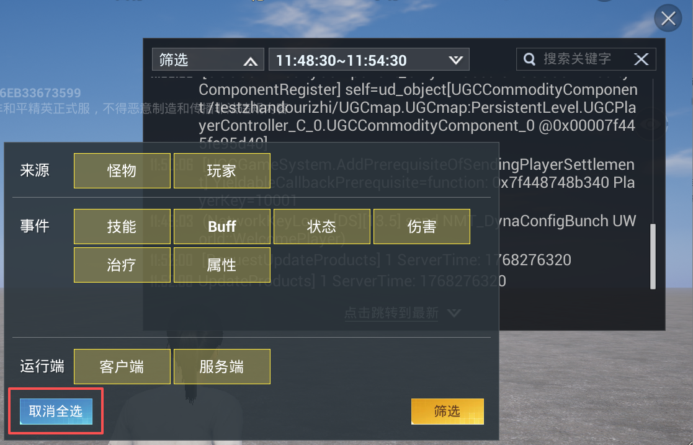

---

### 时间筛选

点击战斗日志窗口上方的时间显示区域，即可展开或收起时间筛选面板。

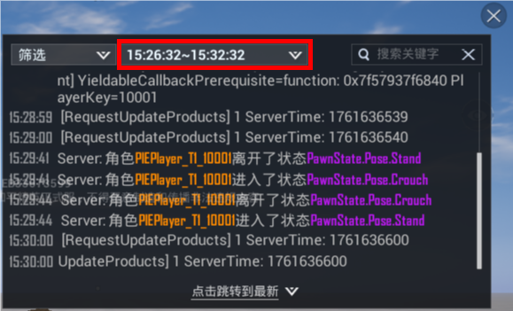

展开时间筛选面板后，首先点击“开始时间”，通过滚动选择器设定查询的起始时间点，然后点击“结束时间”，设定查询的截止时间点，最后点击右下角的“筛选”，日志窗口将立即显示指定时间段内的战斗日志。

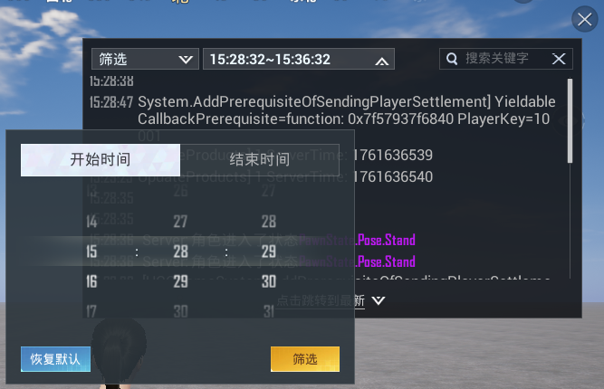

点击"恢复默认"按钮，系统将自动设定以当前时间为基准，前后各延伸3分钟的时间范围（共6分钟），并立即执行筛选。

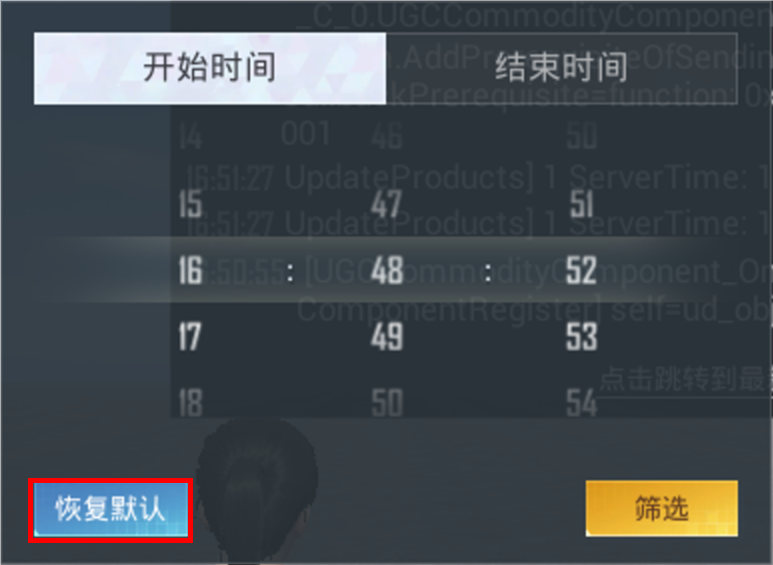

## 日志搜索

在战斗日志窗口右上角的搜索框中输入需要查找的关键词，点击左边的搜索按钮后，系统将自动筛选包含该关键词的所有日志。

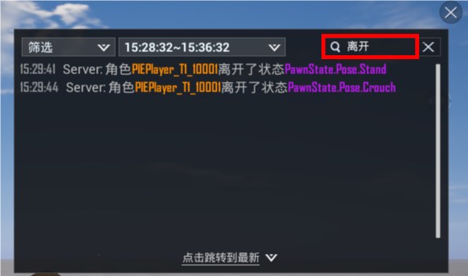

点击搜索框右侧的"×"按钮，可立即清除当前关键词，恢复显示全部日志。

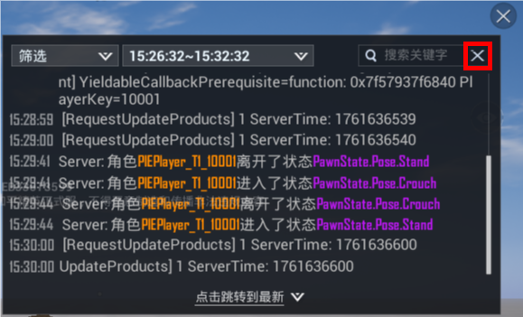

## 日志分类

> 部分日志未被归入现有事件类型。查看时需在条件筛选时勾选全部条件。

|日志内容|事件类型|示例|
|:-:|:-:|:-:|
|角色进入/离开/打断/禁用了某状态|状态||
|角色获得/失去/堆叠了来自某来源的某Buff效果|Buff|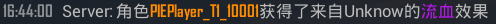|
|角色装备/卸载/释放/结束了某技能|技能|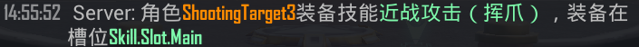|
|角色的某技能生效/失效/被打断了|技能||
|角色A对角色B造成了多少点伤害（血量变化值）|伤害|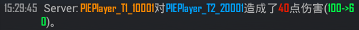|
|角色A击杀了角色B|-|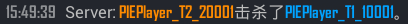|
|角色的某属性发生了变化（变化量）|属性||
|通过 [治疗Task](../../进阶内容/GamePlay系统/技能系统/技能编辑器2.0/20094_技能Task查询手册.md#技能Task-治疗) 技能或者主动调用 [``RecoverGenericCharacterHealth``]() 触发的治疗效果|治疗||

## 打印战斗日志

通过 ``ugcprint(content)`` 打印的日志也会同步显示在战斗日志中。显示格式为：时间戳+打印内容，如下图所示：

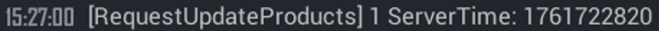|

如果用 ``ugcprint(content, category)`` 的形式进行日志打印，则category的目录会出现在战斗日志的自定义页签里，也可以用该分类进行过滤。

```lua
ugcprint("click trigger", "SkillSlot")
```

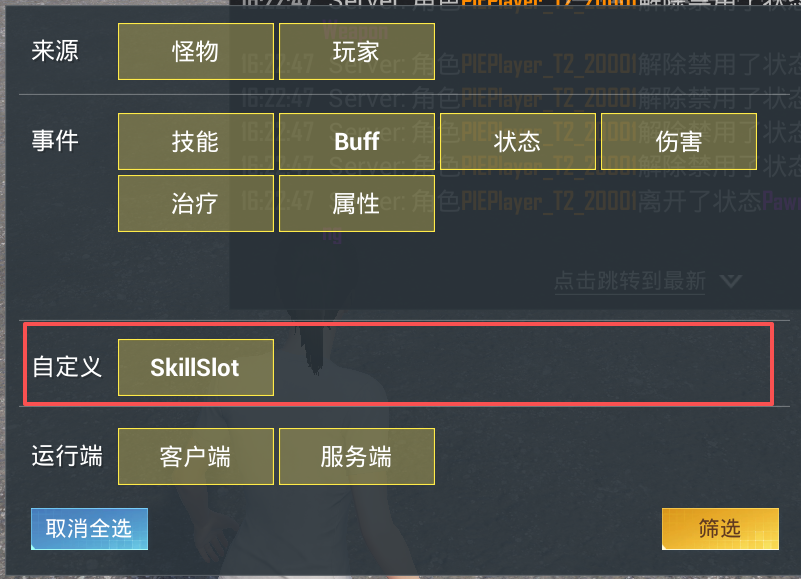

## 日志输出环境

战斗日志（包括通过 ugcprint打印的自定义日志）仅在外研线和 PIE 环境中输出，现网环境不会输出。
