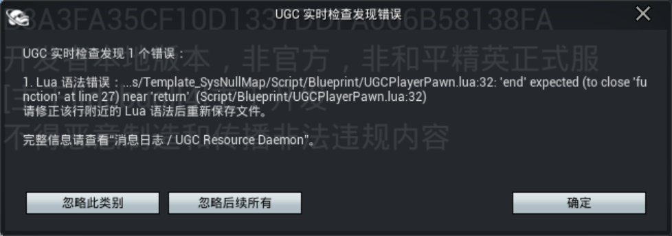
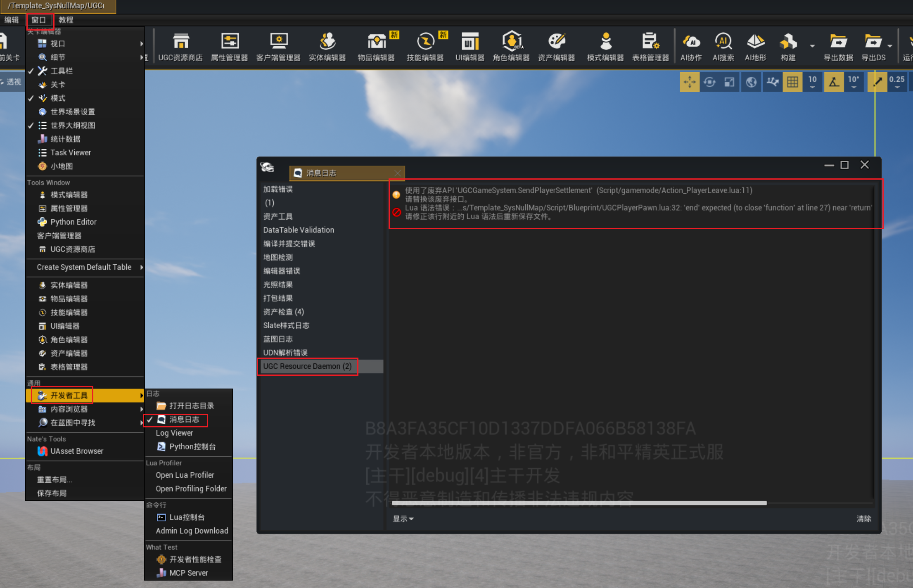
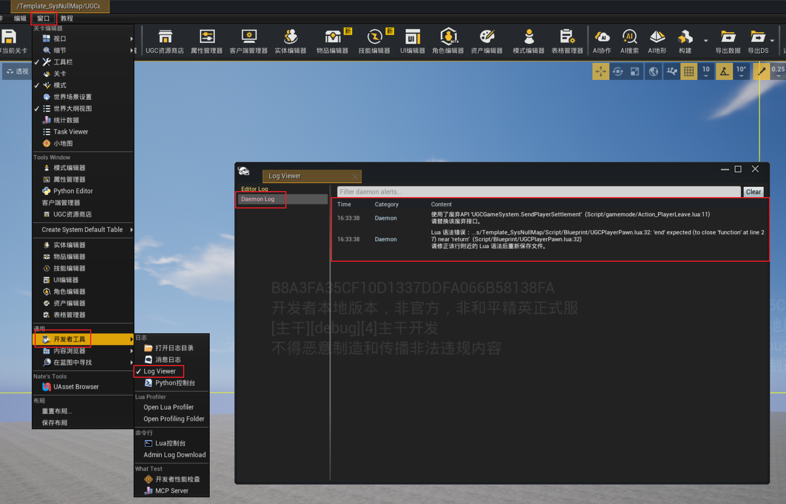
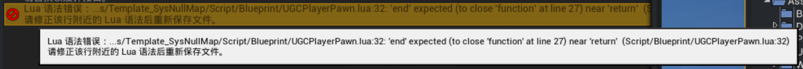

# 前置工程检查

## 一、是什么：规则与触发时机

`UGCEditor`（绿洲启元编辑器）在打开 UGC 工程后，会自动在后台运行一套**实时静态检查**。

它**不**执行玩法逻辑，只读取代码与已加载的资产，对照规则逐条核对，把语法错误、资源引用失效、API 用错上下文等问题在保存或加载阶段就暴露出来，避免留到 Cook、上传或进入 PIE 才被发现，从而降低定位与返工成本。

### 1.1 这是一套什么规则

检查覆盖两类对象：

| 类别 | 扫描范围 | 检查内容 |
|------|---------|----------|
| `Lua` 代码规则 | `Script/` 目录下的 `.lua` 文件 | 语法、全局变量、API 用法、路径写法、资源引用 |
| 资产规则 | 已加载的 `DataTable` 等资源 | 行内引用的资源是否真实存在 |

这套检查把「变量要用 `local`、路径不要写死、API 要区分服务器/客户端、资源要真实存在」等常见踩坑点固化为工程级统一规则，减少因人、因工程而异的隐藏问题。

> 检查结果是**提示**而非**拦截**：不会阻断保存、PIE 或上传。确有合理例外时，可用忽略区间放行（见 四、主动绕过：忽略区间）。

### 1.2 什么时机会触发检查

| 触发时机 | 检查动作 |
|----------|----------|
| 打开工程时 | 全量扫描工程内所有 `Lua` 文件 |
| 修改并保存 `Lua` 文件后 | 约 0.1 秒去抖后，自动增量复查改动的文件 |
| 加载或改动 `DataTable` 等资源时 | 自动复查资源引用 |

检查运行在后台低优先级线程，**不**执行玩法逻辑，**不会影响**编辑器的正常操作。

### 1.3 检查哪些内容

打开工程后，以下内容默认全部开启：

| 规则项 | 检查内容 |
|--------|----------|
| `Lua` 语法 | `Lua` 文件是否能正常编译 |
| 文件位置 | `Lua` 脚本是否误放在 `Asset/` 目录（应放在 `Script/` 目录） |
| 全局变量 | 变量是否漏写 `local`、是否污染全局环境 |
| API 上下文 | 服务器/客户端专用接口是否用错上下文 |
| API 参数个数 | 调用参数个数是否与声明一致 |
| 废弃 API | 是否调用了已废弃的接口 |
| 网络与复制 | `CallUnrealRPC` 是否未显式指定 `Reliable/Unreliable`；是否使用了 `RepLazyProperty` 复制；有 `Replicated` 属性但缺少 `OnRep_` 回调 |
| Tick 日志 | 是否在 `Tick` 函数里打日志 |
| 路径写法 | 是否硬编码本机绝对路径或网络路径；`require` 是否使用反斜杠或绝对路径 |
| 资源引用 | `Lua` 或 `DataTable` 中引用的资源在当前工程里是否存在 |

> 若静态检查因内部原因未能跑完，会提示「静态检查未能完成，请保存文件后重试」。这仅代表本次检查未完成，**并非**代码问题，保存后通常会自动重查，无需为消除这条提示去修改业务代码。

## 二、去哪看：检查结果的出口与格式

### 2.1 三个出口

| 出口 | 内容 | 说明 |
|------|------|------|
| 错误弹窗 | 较严重的问题汇总 | 弹出 `UGC 实时检查发现错误` 对话框，不强制阻断开发 |
| 消息日志页签 | 各类提示与问题 | `Output Log` 面板 `Messages` 中名为 `UGC Resource Daemon` 的页签 |
| `UGCLogViewer` → `DaemonLog` 页签 | 全部结果（含流程提示） | 在 `UGCLogViewer` 中以 `DaemonLog` 通道采集 |



> 错误弹窗



> 消息日志页签



> UGCLogViewer

### 2.2 结果格式

每条检查结果都包含三部分：

1. **描述**：问题是什么。
2. **位置**：`(文件名:行号)`；`DataTable` 问题附带行/列定位。
3. **修复建议**：以 `=>` 开头的具体改法。

> 直接按照 `=>` 后的修复建议修改，是最快的自查路径。



## 三、怎么解决：逐规则处理指南与提示文案

### 3.1 逐规则处理指南

| 规则项 | 结果位置 | 解决方法 |
|--------|----------|----------|
| `Lua` 语法 | 消息日志 / `DaemonLog`，带行号 | 按行号修复语法（如缺少 `end`、括号或拼写不匹配），保存后自动复查 |
| 文件位置（`Lua` 在 `Asset` 目录） | 消息日志 | 将 `.lua` 文件移到 `Script/` 目录，并修正入口引用路径 |
| 全局变量（漏写 `local`） | 消息日志，带文件名、行号及作用域（顶层/函数内） | 私有变量补写 `local`；覆盖了系统对象的则改名；确需保留非常规写法的，用忽略区间包裹（见 四、主动绕过：忽略区间） |
| API 上下文（服务器/客户端用错） | 消息日志，带 `IsServer` 分支信息和行号 | 服务器专用接口移入 `IsServer()` 的 `then` 分支；客户端专用接口移入 `else` / `not IsServer()` 分支 |
| API 参数个数 | 消息日志，带行号 | 对照接口签名修正实参个数 |
| 废弃 API | 消息日志，附替代方案 | 按提示改用替代接口 |
| RPC / 复制 | 消息日志，带行号 | 需要 `Unreliable` 的 `CallUnrealRPC` 改用 `CallUnrealRPC_Unreliable`；确认 `RepLazyProperty` 的复制条件和频率是否合理；有 `Replicated` 属性的补写同名 `OnRep_` 回调，不需要则移除声明 |
| Tick 日志 | 消息日志，带行号 | 从 `Tick` 中移除日志；调试日志应加开关并限频，发布前移除 |
| 路径写法 | 消息日志，带行号 | 本机盘符 / UNC 路径改为工程内可解析的资源路径；`require` 使用相对 `Script` 根目录的路径，以 `/` 分隔且不以 `/` 开头 |
| 资源引用 | 消息日志（`Lua` 提示「该资源找不到：<路径>」；`DataTable` 带行/列） | `Lua` 侧确认资源是否存在、路径是否正确；`DataTable` 侧在提示的行/列修改或清空引用 |

> 【示例代码 E1 - 全局变量（漏写 local）的正误对比】
>
> ```lua
> -- 错误：counter 漏写 local，污染全局环境，会被全局变量检查规则命中
> counter = 0
> function on_tick()
>     counter = counter + 1
> end
>
> -- 正确：用 local 限定在模块作用域内
> local counter = 0
> local function on_tick()
>     counter = counter + 1
> end
> ```

> 【示例代码 E2 - API 上下文（服务器/客户端用错）的正误对比】
> ```lua
> -- 错误：在客户端上下文直接调用服务器专用 API
> function ClientOnInteract()
>     ServerOnlyAPI_SpawnNPC()  -- 会触发：服务器专用 API 在客户端上下文被调用
> end
>
> -- 正确：移入 IsServer() 分支
> function ClientOnInteract()
>     if IsServer() then
>         ServerOnlyAPI_SpawnNPC()
>     end
> end
> ```

> 【示例代码 E3 - require 路径写法的正误对比】
> ```lua
> -- 错误：反斜杠 / 本机绝对路径
> require("D:\MyProj\Script\Lib\utils.lua")
> require("Lib\\utils")
>
> -- 正确：相对 Script 根目录、以 / 分隔、不以 / 开头
> require("Lib/utils")
> ```

### 3.2 提示文案与级别

检查结果分为两个级别：

- **Error**：会弹出 `UGC 实时检查发现错误` 对话框，不强制阻断开发。
- **Warning**：不弹窗，只进入消息日志 / `DaemonLog` 页签。

**Error 弹窗格式**（目前仅 `Lua` 语法错误会触发）：


**Error 级（会弹窗）**：

| 检查项 | 实际提示文案 |
|--------|--------------|
| `Lua` 语法错误 | `Lua 语法错误：{具体语法错误}` |

**点击`忽略`按钮将在本次编辑器运行过程中不再校验，重启编辑器后将正常校验检查**

**Warning 级（不弹窗，修改方法见 [3.1]）**：

| 检查项 | 实际提示文案 |
|--------|--------------|
| 静态检查未完成 | 静态检查未能完成，请保存文件后重试。 |
| `Lua` 误放 `Asset` 目录 | 检测到 `Asset` 目录下存在 `Lua` 脚本，请删除或移动到 `Script` 目录。 |
| 服务器 API 用错上下文 | 服务器专用 API `{API名称}` 在客户端上下文被调用（`if not IsServer` 分支内） |
| 客户端 API 用错上下文 | 客户端专用 API `{API名称}` 在服务器上下文被调用（`if IsServer` 分支内） |
| API 参数个数不一致 | API 实参数量与接口签名不一致 |
| 调用废弃 API | 使用了废弃 API `{API名称}`，替代方案：`{替代接口}`（无替代接口时仅提示前半句） |
| `RepLazyProperty` 复制 | 调用了 `RepLazyProperty` 属性复制，请确认复制条件和频率是否合理 |
| 缺少 `OnRep_` 回调 | 文件包含 `Replicated` 属性但缺少 `OnRep_` 回调，可能需要同步回调处理 |
| 定义全局变量 | 文件存在定义全局变量的行为，请注意 |
| `Tick` 函数打日志 | `Tick` 函数中输出日志可能影响性能 |
| 本机绝对路径 / UNC 路径 | 禁止硬编码本机绝对路径，请改用工程内资源路径。或 禁止在 UGC 中使用 UNC 网络路径。 |
| `require` 路径写法 | `require` 路径使用了反斜杠：`{require路径}` 或 `require` 使用了绝对路径：`{require路径}` |
| 资源引用不存在 | 该资源找不到：`{资源路径}`；`DataTable` 引用另附定位：`DataTable {表路径}，行 {行名}，列 {列名}` |

## 四、主动绕过：忽略区间

如果确认某段代码就是要用非常规写法、希望检查器放行，可用成对的独占行注释把这段代码包起来：

```lua
--- UGC-CHECK-DISABLE-BEGIN
... 此区间内的代码不参与任何实时检查（语法、全局变量、API、路径等均跳过） ...
--- UGC-CHECK-DISABLE-END
```

**要点**：

- 标记以三个横线 `---` 加空格开头；写成两个横线 `--` 不会被识别，那段代码仍会被检查。
- 两行标记必须独占一行且成对出现，支持嵌套。
- 区间内的问题**不会**进入消息日志，也**不会**触发错误弹窗。
- 忽略区间只跳过内容检查，**保留原始行号**，不影响其他结果的定位。
- 只写 `BEGIN` 没写 `END`：检查器会产生一条 Warning，且**不会**静默屏蔽文件余下的内容。

> 单个检查规则**不**支持开发者自行关闭；确有例外，请使用忽略区间包裹。
