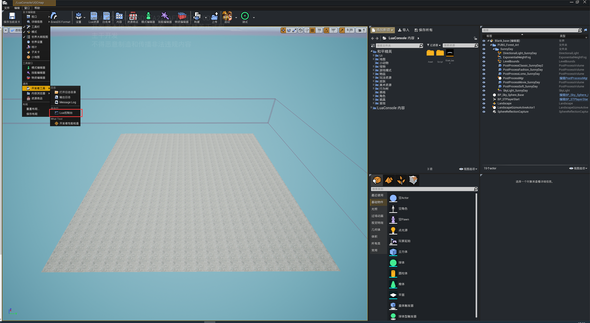
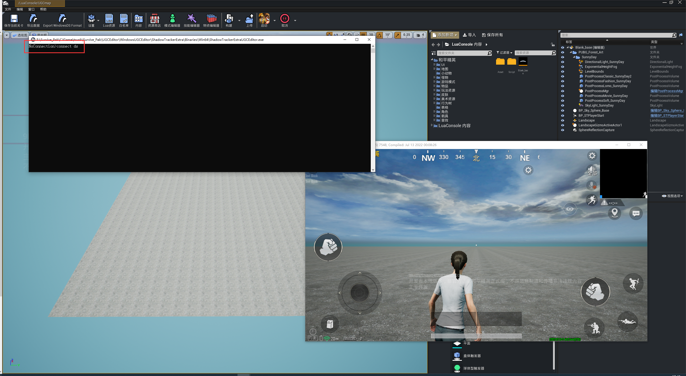
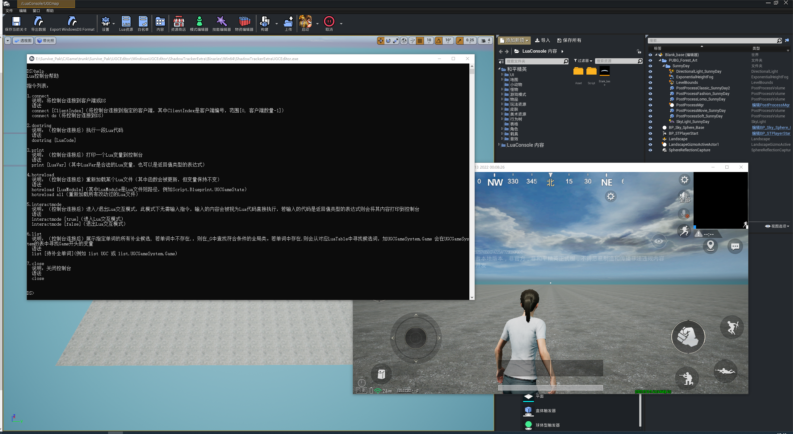
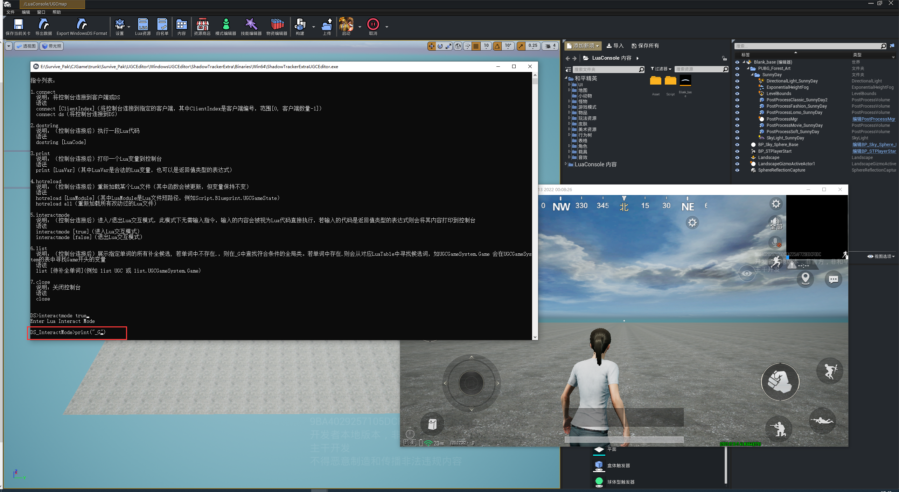
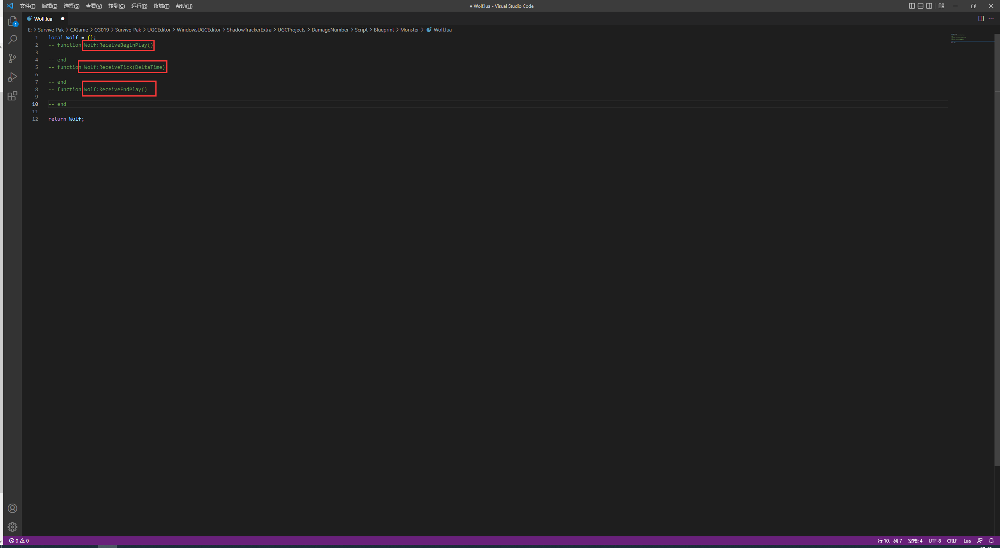
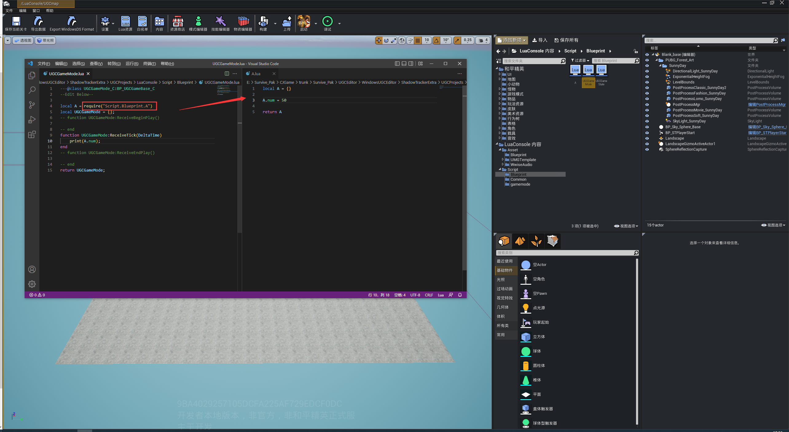
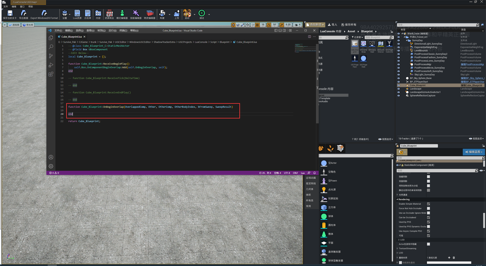
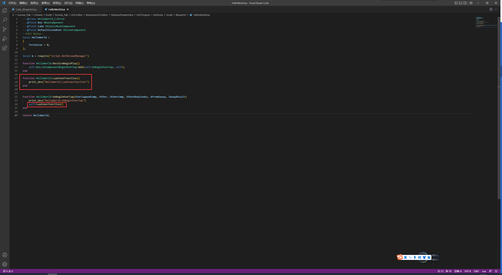
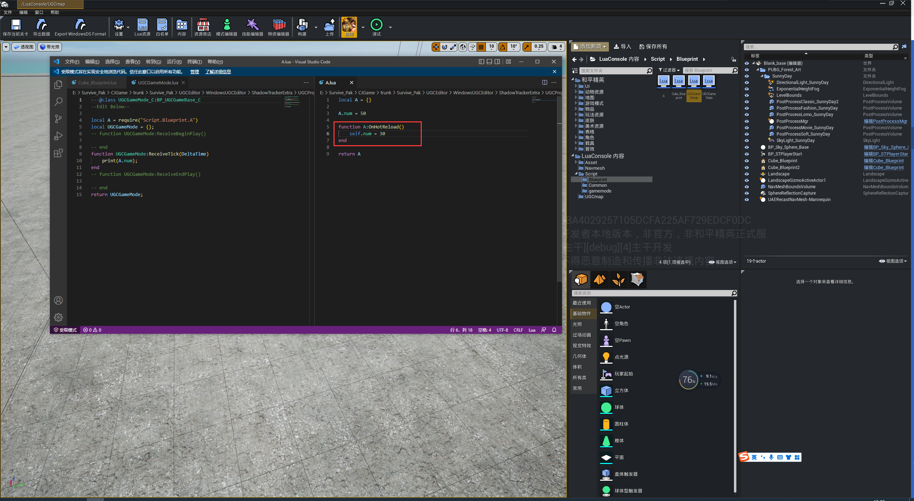
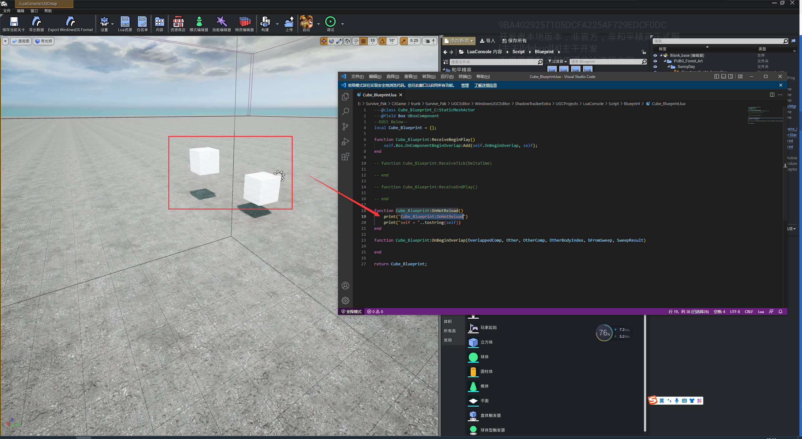

# Lua控制台

## 使用方法：

1.启动PIE

2.打开Lua控制台

3.在控制台中输入connect指令，连接ds或者客户端

4.使用指令对ds或者client进行调试（使用help指令查看所有指令）：

5.进入交互模式实时运行lua语句：

## 热更新指令

在Lua控制台中，支持实时更新lua脚本,更多详细说明，请参考help指令：

### 用法：

目前支持以下两种用法：

1.蓝图lua事件函数：

2.使用require加载的lua module：

如上图，热更新lua module A的时候，UGCGameMode中的 local A 也会跟着更新

注，暂不支持绑定的热更新(因为蓝图函数无法执行重载)：

如上图，热更新的时候，Box绑定的OnComponentBeginOverlap并不会自动更新

如果希望绑定也可以热更新，可以参考下图方法：

在绑定函数中放一个Lua函数(LuaInnerFunction)，可以热更新这个Lua函数（LuaInnerFunction）

### 回调：

热更新前会触发module的一个回调：

如上图，热更新lua module A的时候，会触发回调函数OnHotReload(self)

注，对于Actor的回调函数，会每个Actor触发一次：

如上图，热更新Script.Blueprint.Cube_Blueprint 的时候，在场景中的两个Actor，都会触发一次回调函数OnHotReload(self)。

## 自动补全

1.可以Tab 对单词进行自动补全，并在候选词之间切换

2.可以使用list指令列出所有自动补全候选词

3.自动补全在交互模式下生效
