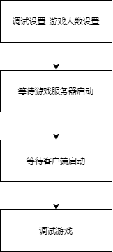
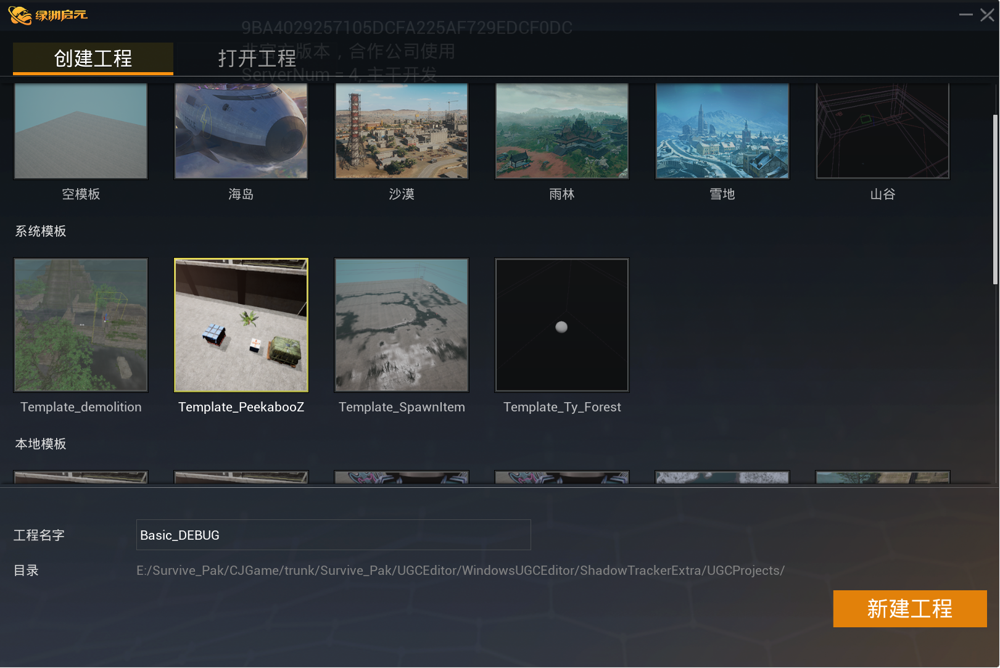
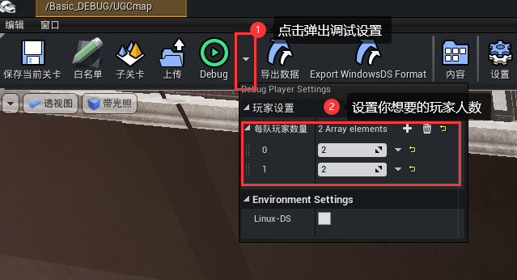
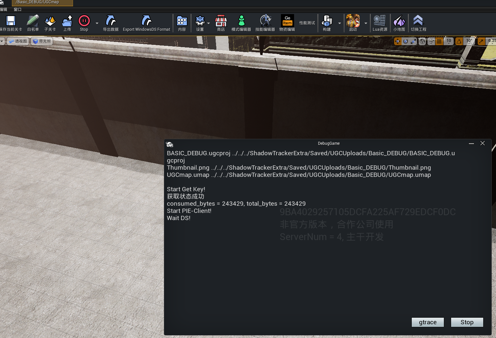
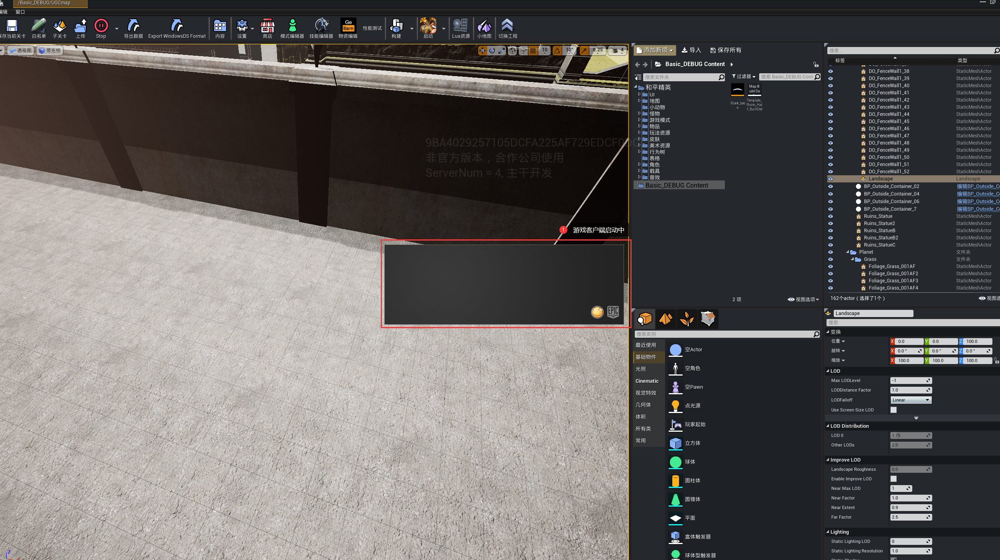
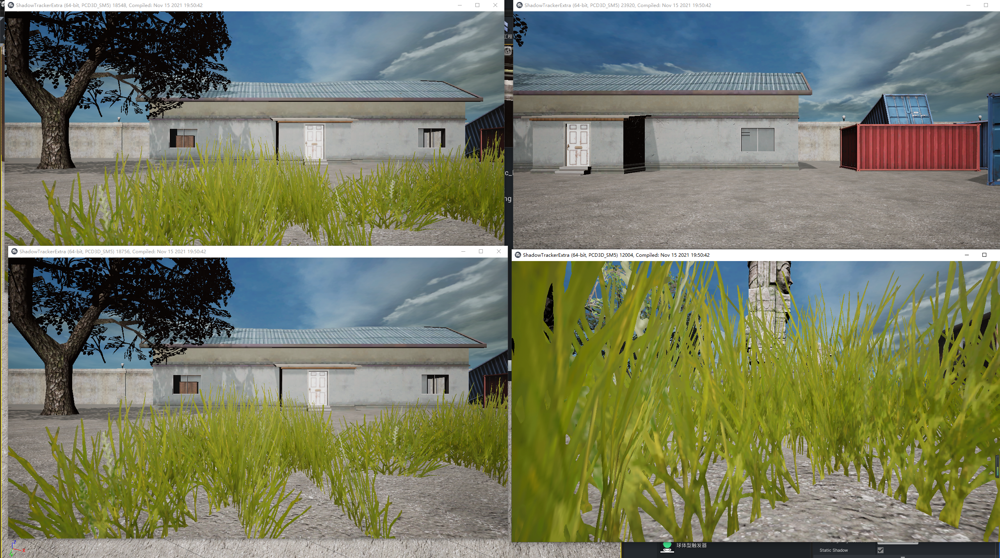
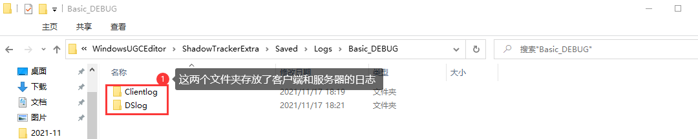
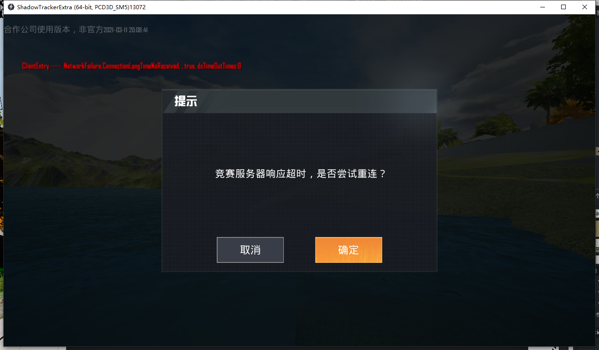
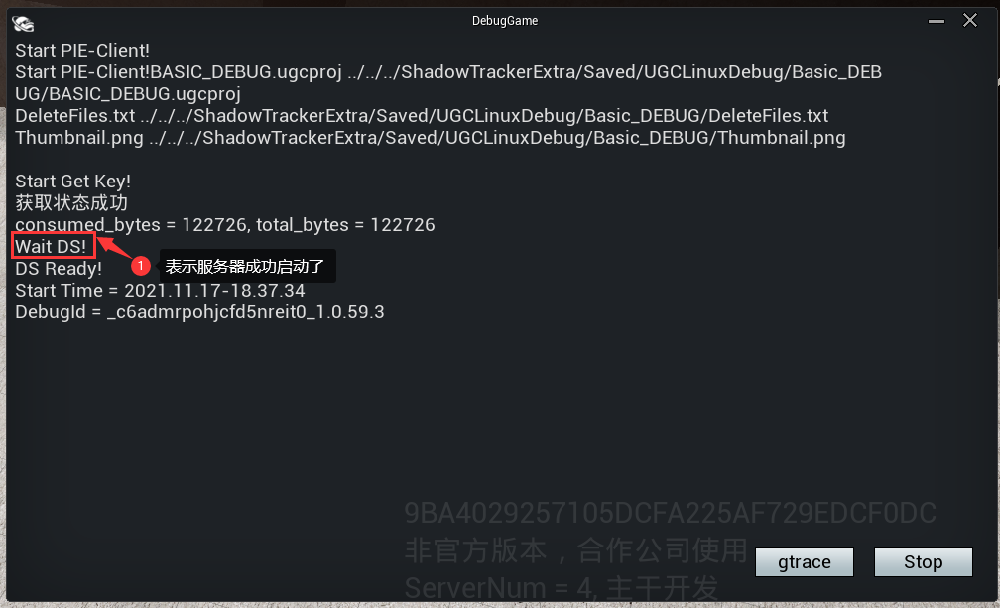

# 编辑器Debug调试

当你在绿洲启元编辑器启动开发时，需要经常调试玩法来验证功能，下面会逐步介绍如何在编辑器内调试你的游戏。

## 流程

## 实战演练

1. 登录绿洲启元编辑器之后，我们选择 Template_PeekabooZ 模板创建工程

2. 对DEBUG选项进行调整

3. 点击DEBUG,等待服务器启动

4. 等待客户端启动

5. 进入游戏，开始调试你的游戏吧

## 常见问题

#### 1. 调试的日志位置在哪里?

这要看你的绿洲启元编辑器安装在哪里，你的项目名字是什么。

举例来说，我的绿洲启元编辑器安装在 D:\UGCEditor，项目名字是Basic_DEBUG，那么我的日志就在：
D:\UGCEditor\WindowsUGCEditor\ShadowTrackerExtra\Saved\Logs\Basic_DEBUG目录下的两个文件夹Clientlog 和 DSlog中，分别为客户端日志和服务器日志：

#### 2. 出现了服务器超时的提示怎么办？

有时候会出现如下图的情况，属于网络波动的正常情况，请等待一会就好了：

#### 3. 服务器什么时候启动完毕？

服务器成功启动会有对应的提示，如果出现 DS Failed 的日志提示，请根据日志提示修复工程后再次尝试调试

