# 特效编辑器

特效编辑器支持从特效模板中创建特效，并且根据您的需要，进行修改。

## 基本概念

### 粒子系统介绍

在游戏场景中存在的粒子/特效，实际上是一个粒子系统（Particle System），一个粒子系统中包括多个粒子发射器（Particle Emmitter），每一个粒子发射器包含多个模块。

.png)

以【网格粒子模板】的【径向】特效为例，它共包含五个粒子发射器。第一个为普通发射器，它控制地面贴图效果；第二个和第五个为爆发粒子发射器，它控制火星和沙砾的爆发效果；第三个和第四个为网格粒子发射器，它控制网格的生成效果。

|整体特效|第一个发射器|第二个发射器|第三个发射器|第四个发射器|第五个发射器|
|:-:|:-:|:-:|:-:|:-:|:-:|
||||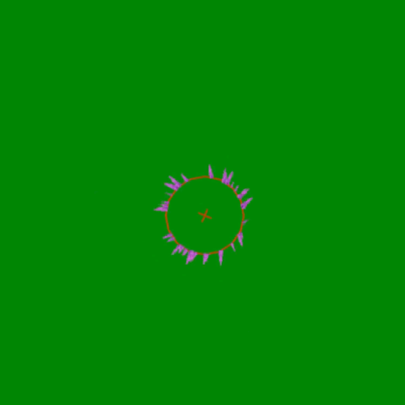|||

---

### 粒子发射器介绍

特效编辑器提供了多种粒子发射器，开发者可以通过组装发射器，实现完整、绚丽的特效。

|发射器类型|效果|说明|
|:-:|:-:|-|
|普通粒子发射器|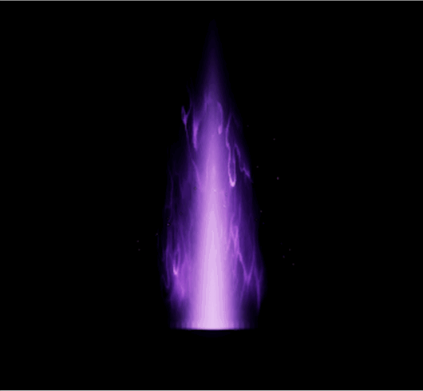|这是最常见、最基础的粒子发射器类型，也被称为“精灵”发射器。|
|爆发粒子发射器||“爆发”其实是一种发射模式（Burst），它通常与普通粒子发射器结合使用。|
|拖尾粒子发射器||用于创建带状或轨迹类的效果。|
|射线粒子发射器|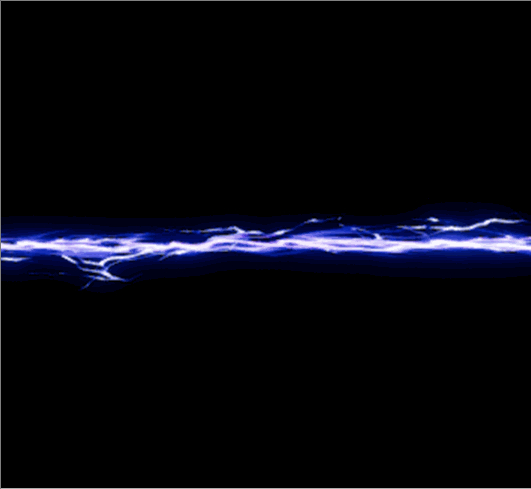|用于模拟激光、闪电、能量射线等线性效果。|
|网格粒子发射器|.gif)|与普通发射器使用2D纹理不同，网格体发射器使用3D静态网格体（Static Mesh） 作为粒子。|

## 特效编辑器界面及操作

在编辑器主界面的工具栏，点击进入【资产编辑器】，然后选择【特效】，将打开特效编辑器的操作界面。

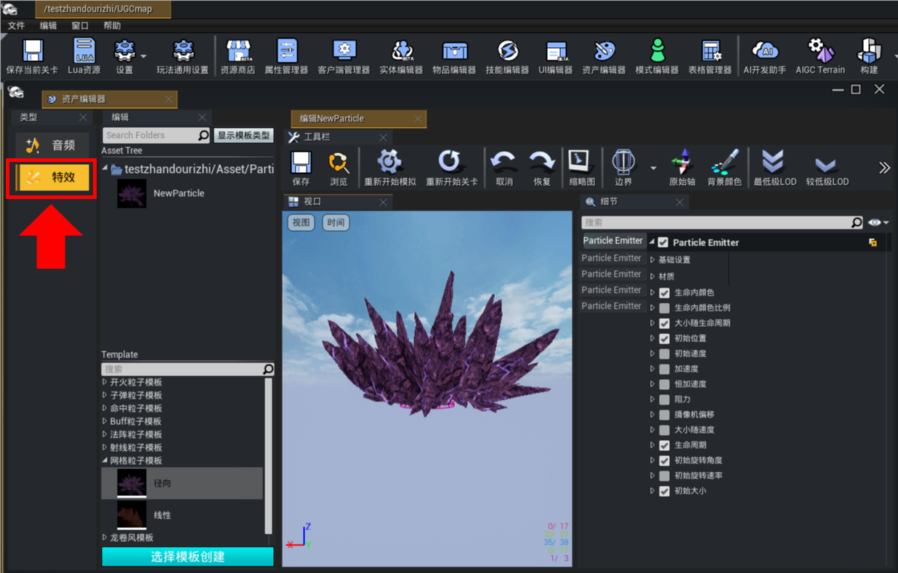

特效编辑器的界面图以及各页面的具体说明如下：

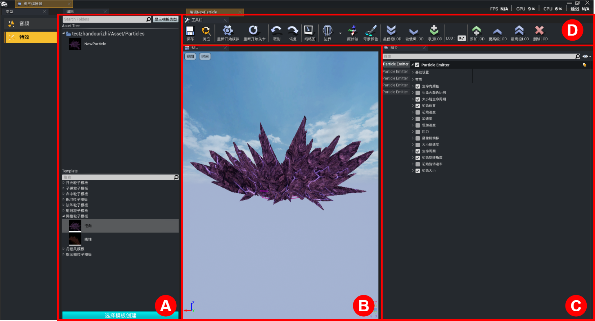

|序号|页面名称|功能说明|
|:-:|:-:|-|
|A|特效浏览区|特效的查看、创建及搜索|
|B|特效视口区|实时预览粒子效果，支持通过【细节】筛选特定发射器|
|C|细节编辑区|编辑特效中的发射器及模块|
|D|工具栏|提供保存、浏览、重新开始模拟等特效管理操作|

---
### 特效浏览区

在特效浏览区的【Asset Tree】可以查看选择已创建的特效，在【Template】可单击选择特效模板，然后点击“选择模板创建”，进行特效创建。

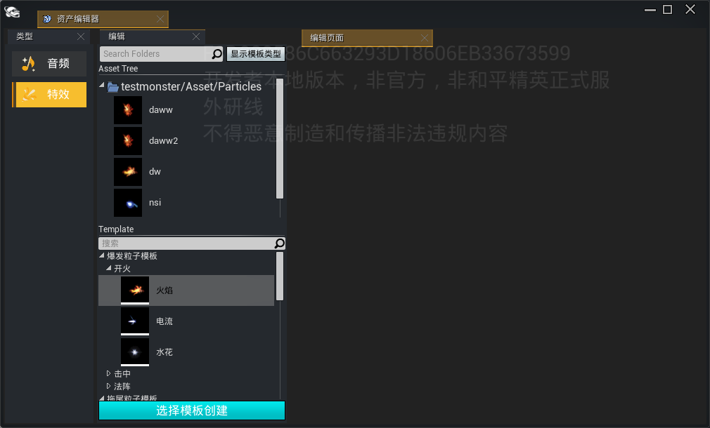

---

### 特效视口区

双击打开特效文件后，可在【特效视口区】实时预览粒子效果，通过左上角的【视图】和【时间】控件，可以切换浏览模式与调整播放控制，关于视口的操作方法，请参阅 [编辑器视口](https://dev.epicgames.com/documentation/zh-cn/unreal-engine/editor-viewports?application_version=4.27) 。

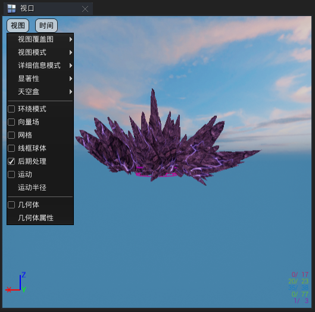

在【视图】控件的天空盒选项中，可勾选显示天空盒，切换不同的天空盒样式，改变预览特效时的天空盒背景。

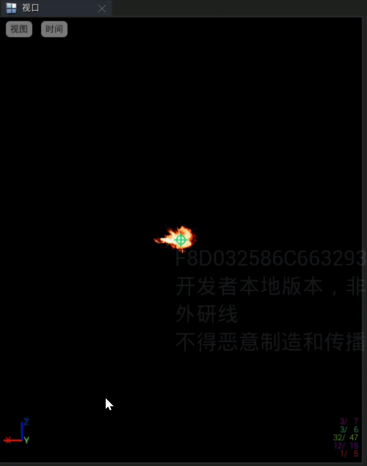

---

### 细节编辑区

一个完整的特效存在多个粒子发射器，一个发射器存在多个模块。打开特效后，可在【细节编辑区】对特效进行编辑调整，实现定制化效果。

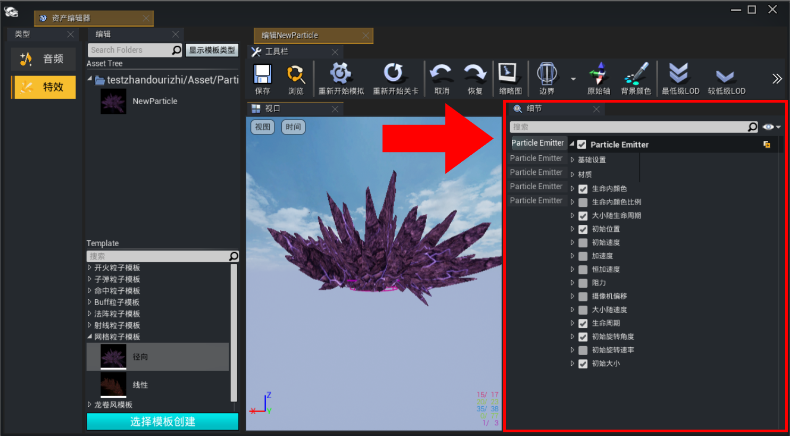

在左侧选择发射器，可查看发射器包含的模块或模块的详细配置信息。

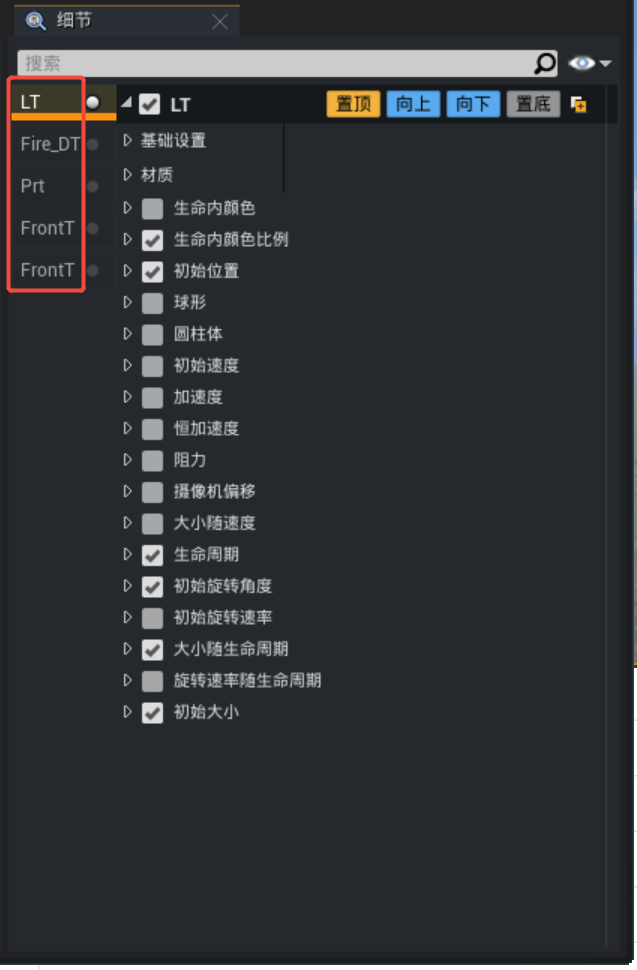

点击发射器旁的单选按钮，可单独显示对应发射器；再次点击会取消单选，可显示所有发射器。

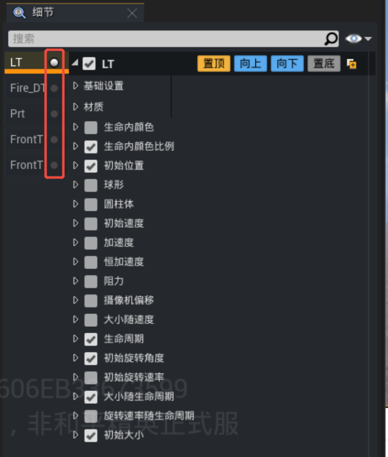

点击发射器或模块的勾选按钮，可选择是否启用对应发射器或模块，启用后特效会显示发射器或发射器会显示模块效果。

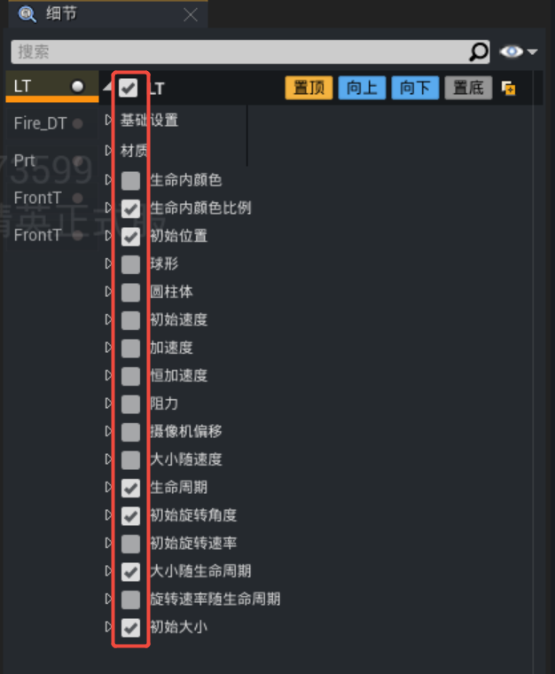

点击发射器最右侧的加号按钮，可选择添加发射器（AddEmitter）和管理发射器（重命名/删除/导出）。

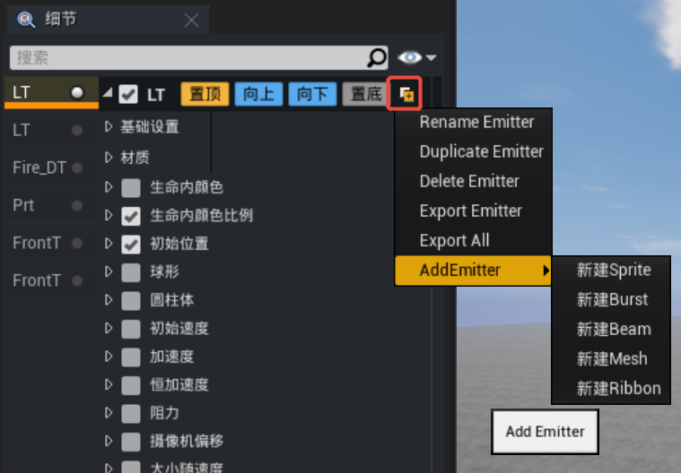

|操作名称|操作说明|
|:-:|-|
|重命名发射器（Rename Emitter）|修改当前发射器的名称|
|复制发射器（Duplicate Emitter）|复制当前发射器|
|删除发射器（Delete Emitter）|删除当前发射器|
|导出发射器（Export Emitter）|将当前发射器导入到指定特效中 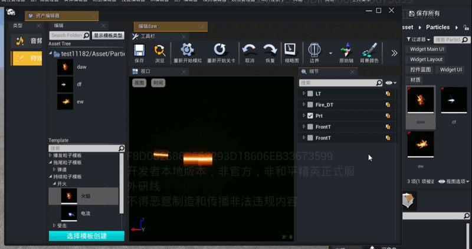|
|全部导出（Export All）|将当前特效的所有发射器导入到指定特效中 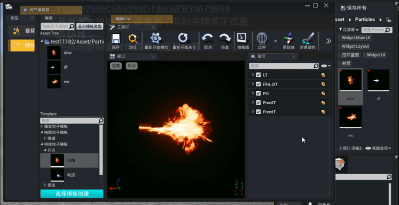|
|新增发射器（AddEmitter）|为当前特效新增发射器|
|新建Sprite|创建普通粒子发射器|
|新建Burst|创建爆发粒子发射器|
|新建Beam|创建射线粒子发射器|
|新建Mesh|创建网格粒子发射器|
|新建Ribbon|创建拖尾粒子发射器|

---

### 工具栏

工具栏的界面和操作说明如下：

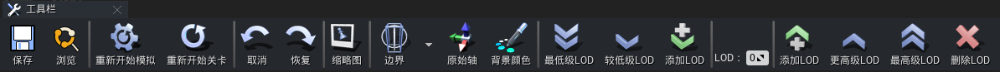

|按钮|操作名称|操作说明|
|:---:|:---:|---|
|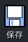|保存|保存当前特效|
||浏览|浏览至相关特效，并且在最近使用的内容浏览器中将其选中|
||重新开始模拟|在粒子编辑器视口中，刷新粒子效果|
|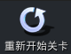|重新开始关卡|在粒子编辑器和场景中，同时刷新粒子效果 |
||取消|取消上个操作，等于Ctrl+Z的效果|
||恢复|恢复上个操作，等于Ctrl+Y的效果|
|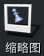|缩略图|根据当前视口的特效表现，重新截取缩略图 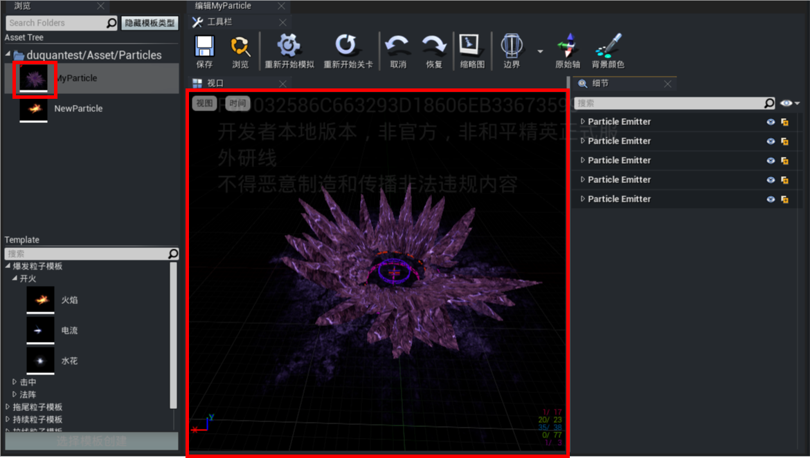|
|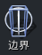|边界|显示当前特效的边界 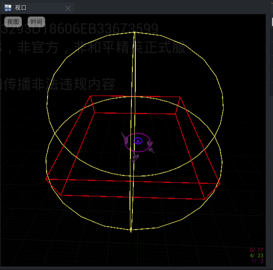|
||原始轴|显示当前特效的原始轴，可用于辅助调整粒子的初始位置 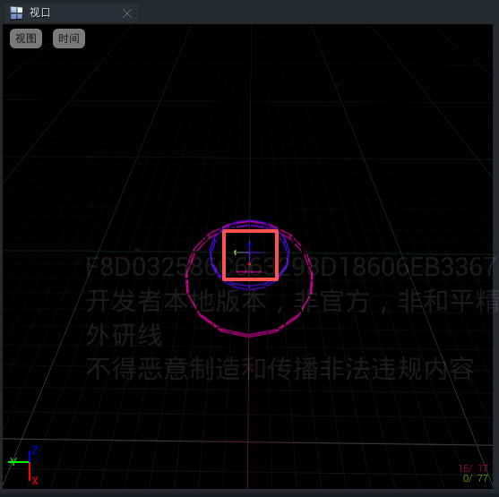|
|背景颜色|修改视口的背景颜色，未勾选【视图】控件的天空盒选项时生效 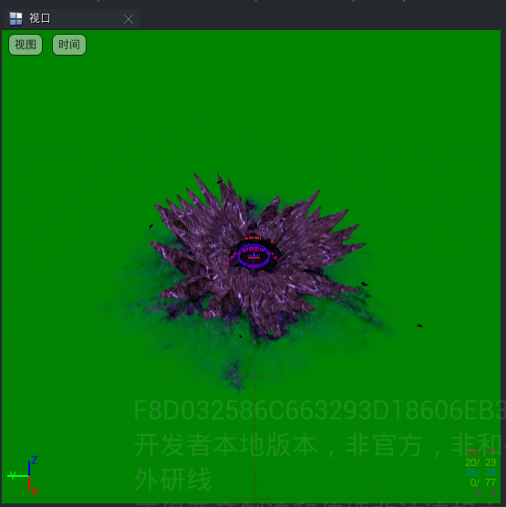|
||最低级LOD|切换至最低层的静态LOD，关于LOD概念的说明详见 [粒子系统细节级别（LOD）](https://dev.epicgames.com/documentation/zh-cn/unreal-engine/particle-system-level-of-detail-lod?application_version=4.27)|
|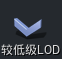|较低级LOD|切换比当前加载的LOD前低一层的静态LOD|
||添加LOD（左）|在当前加载的LOD前插入一个新的静态LOD|
|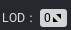|LOD|显示当前载入的LOD，以及粒子系统中存在的LOD数量|
||添加LOD（右）|在当前加载的LOD后插入一个新的静态LOD|
|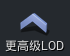|更高级LOD|切换比当前加载的LOD前高一层的静态LOD|
||最高级LOD|切换至最高层的静态LOD|
|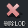|删除LOD|删除当前选中的静态LOD层|

## 粒子模块介绍

特效编辑器中，每个发射器包含多个不同类型的粒子模块，可通过启用并修改粒子模块来改变发射器的表现效果。

### 基础设置

基础设置模块用于控制粒子发射的基本行为。

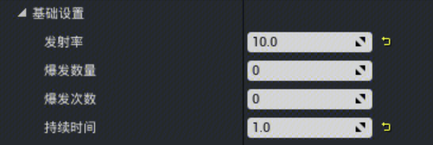

|属性名称|说明|
|:-:|-|
|发射率|设置发射器在播放期间每秒产生的粒子数量|
|爆发数量|设置单次爆发事件中瞬时生成的粒子数量|
|爆发次数|设置发射器单次播放周期内触发的爆发事件总数，设置为0时发射器会循环播放|
|持续时间|设置发射器单次播放的总时长，单位：秒|

---

### 材质

材质模块用于定义粒子渲染所使用的材质资源及其动画属性。

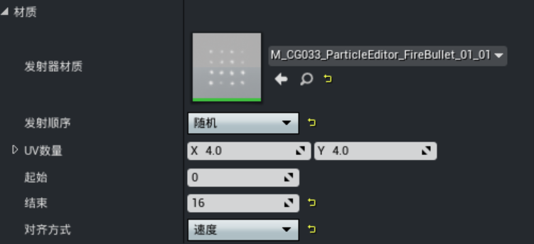

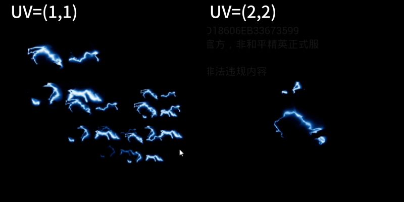

|属性名称|说明|
|:-:|-|
|发射器材质|指定用于渲染粒子外观的材质资源|
|发射顺序|控制粒子在生命周期内，如何从UV划分出的子图格序列中选择帧进行播放 • 无：不进行动画播放，每个粒子始终显示材质的原始完整图片 • 顺序：粒子按划分后的子图格，严格遵循从左到右、从上到下的顺序逐帧播放，形成连续动画 • 随机：粒子在播放时，从所有子图格中随机选择一帧显示，适用于产生变化丰富的非连续效果|
|UV数量|此参数将材质纹理在水平(U)和垂直(V)方向上划分为一个网格，子图格编号按从左到右、从上到下的顺序排列|
|起始|设置UV动画播放序列的起始帧编号，【发射顺序】选择“顺序”时生效|
|结束|设置UV动画播放序列的结束帧编号，【发射顺序】选择“顺序”时生效|
|对齐方式|材质的对齐方式会影响粒子大小的控制 • 正方形：粒子尺寸由大小相关模块的X值控制 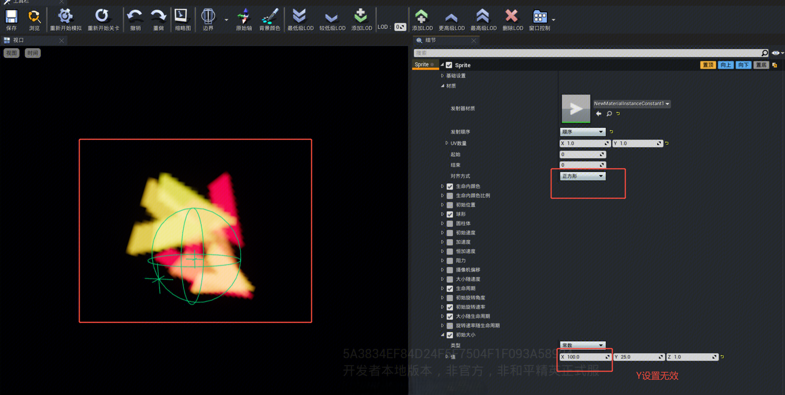 • 长方形：粒子尺寸由大小相关模块的X值和Y值控制 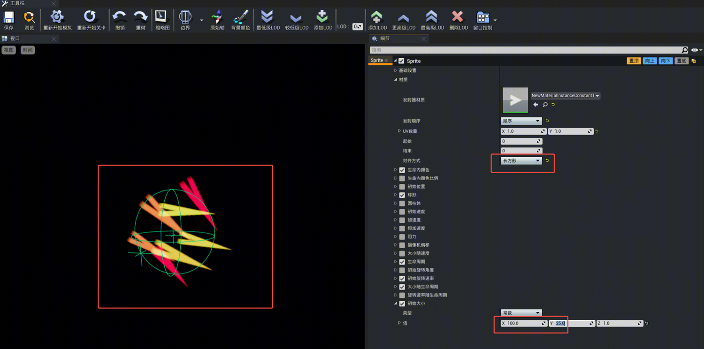 • 速度：粒子尺寸受 速度在X/Y轴的分量影响（速度越快，粒子在对应方向的尺寸越大）|

---

### 生命内颜色

该模块用于控制粒子在整个生命周期（0~1 表示从发射开始到结束的完整周期）内的颜色与透明度变化。

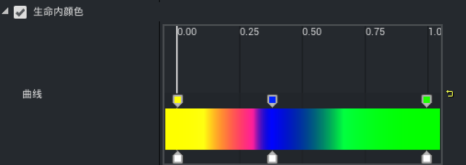

点击颜色条的上方（颜色标签区）或下方（透明度标签区），会在对应生命周期比例位置（0~1）生成可编辑的颜色标签与透明度标签。

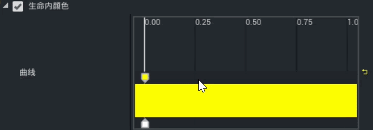

双击标签可调整粒子对应时间点的的颜色或透明度。

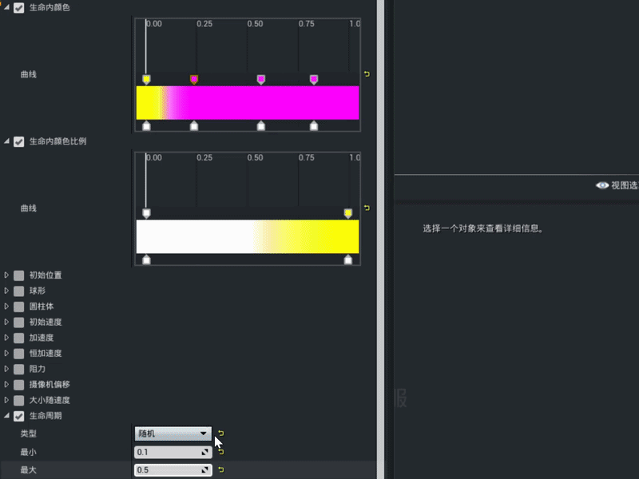

---

### 生命内颜色比例

生命内颜色比例模块用于控制粒子在发射过程中的颜色与透明度的叠加。粒子在生命周期中，其颜色与透明度将根据本模块的设置进行叠加计算，叠加方式为乘法混合，例如黄色叠加蓝色将得到绿色效果。该模块的操作逻辑与“生命内颜色”模块一致。

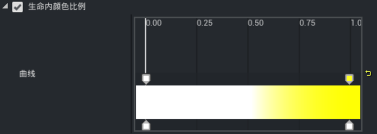

---

### 大小随生命周期

该模块用于控制粒子在运动过程中的大小变化，横轴表示生命周期，纵轴表示大小比例。具体编辑方式可参考 [关键帧和曲线](https://dev.epicgames.com/documentation/unreal-engine/keys-and-curves?application_version=4.27)。

> 材质的对齐方式会影响对粒子大小的控制，详细可见 [材质](https://developer.gp.qq.com/wikieditor/#/catalog/20236?autoJump=%E6%9D%90%E8%B4%A8) 模块

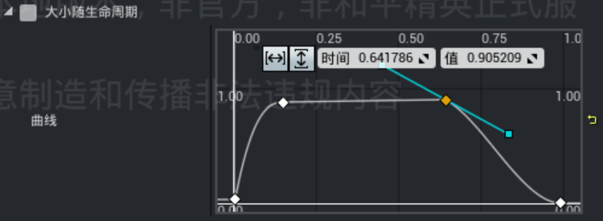

---
### 位置模块

初始位置模块用于设定粒子发射时的生成范围与分布形态，开发者可根据需求选择启用其中一个模块。

#### 初始位置

初始位置模块的配置说明如下：

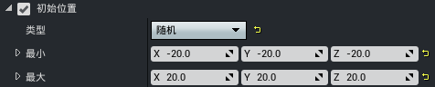

|属性名称|说明|
|:-:|-|
|类型|设置粒子生成时的位置分布方式 • 常数：粒子在具体点位生成 • 随机：粒子在由【最小】和【最大】坐标定义的立方体区域内随机生成|
|值|粒子生成的初始位置，【类型】选择“常数”时生效|
|最小|粒子生成区域在各轴向上的最小坐标值，【类型】选择“随机”时生效|
|最大|粒子生成区域在各轴向上的最大坐标值，【类型】选择“随机”时生效|

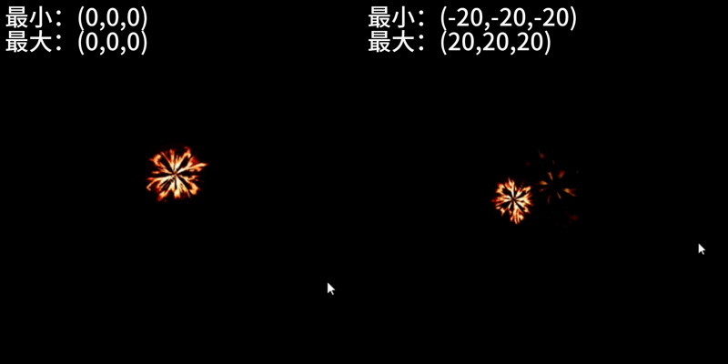

---

#### 球形

启用“球形”模块时，粒子在指定半径的球体空间内生成，配置说明如下：

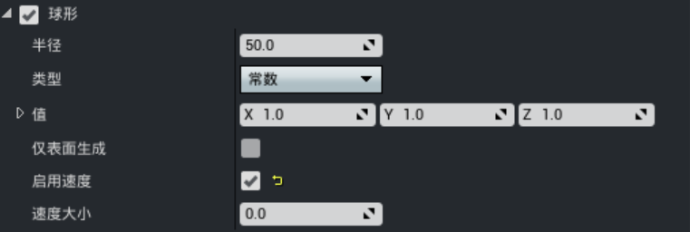

|属性名称|说明|
|:-:|-|
|半径|球体发射区域的半径值|
|类型|设置球体中心点相对于发射器原点的偏移方式 • 常数：球体中心点的偏移位置固定 • 随机：球体中心点由【最小】和【最大】坐标定义的立方体区域内随机偏移|
|值|球体中心点的固定偏移位置，【类型】选择“常数”时生效|
|最小|球体中心点在各轴向上的最小坐标值，【类型】选择“随机”时生效|
|最大|球体中心点在各轴向上的最大坐标值，【类型】选择“随机”时生效|
|仅表面生成|勾选后粒子仅生成在球体表面，禁用时在球体内部均匀分布|
|启用速度|是否赋予粒子初始外向速度|
|速度大小|粒子沿球体径向飞出的初始速度值，勾选【启用速度】时生效|

---

#### 圆柱体

启用“圆柱体”模块时，粒子在指定半径和高度的圆柱体空间内生成，配置说明如下：

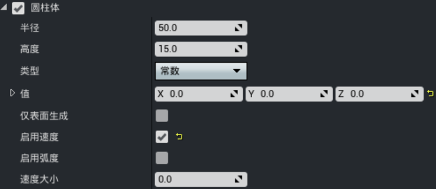

|属性名称|说明|
|:-:|-|
|半径|圆柱体底面半径|
|高度|圆柱体的高度值|
|类型|设置圆柱体中心点相对于发射器原点的偏移方式 • 常数：圆柱体中心点的偏移位置固定 • 随机：圆柱体中心点由【最小】和【最大】坐标定义的立方体区域内随机偏移|
|值|圆柱体中心点的固定偏移位置，【类型】选择“常数”时生效|
|最小|圆柱体中心点在各轴向上的最小坐标值，【类型】选择“随机”时生效|
|最大|圆柱体中心点在各轴向上的最大坐标值，【类型】选择“随机”时生效|
|仅表面生成|启用后粒子仅生成在圆柱体侧面，禁用时在圆柱体内部均匀分布|
|启用速度|是否赋予粒子径向初始速度|
|启用弧度|暂不支持|
|速度大小|粒子沿圆柱体径向飞出的初始速度值，勾选【启用速度】时生效|

---

### 初始速度

初始速度模块用于控制粒子在发射时的的速度大小。

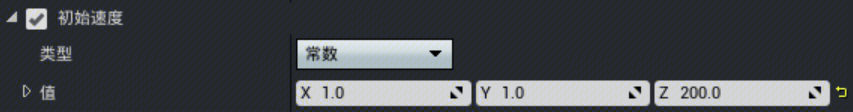

|属性名称|说明|
|:-:|-|
|类型|设置粒子初始速度的设定模式  • 常数：所有粒子的初始速度固定  • 随机：每个粒子的初始速度在设定范围内随机分布|
|值|设定固定的初始速度，单位：cm/s,【类型】选择“常数”时生效|
|最小|粒子在各轴向上的最小速度值，单位：cm/s，【类型】选择“随机”时生效|
|最大|粒子在各轴向上的最大速度值，单位：cm/s，【类型】选择“随机”时生效|

---

### 加速度

加速度模块用于控制粒子在运动过程中的加速度大小。

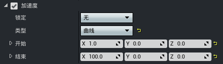

|属性名称|说明|
|:-:|-|
|锁定|锁定指定坐标轴，被锁定的轴向将不受加速度的影响|
|类型|设置加速度的变化模式 • 常数：粒子在整个生命周期内受到一个固定的加速度 • 曲线：粒子受到的加速度会在其生命周期内，从【开始】值逐渐过渡到【结束】值|
|值|设定一个固定的加速度向量，单位：cm/s²，【类型】选择“常数”时生效|
|开始|设定粒子在生命周期初始时刻的加速度向量，单位：cm/s²，【类型】选择“曲线”时生效|
|结束|设定粒子在生命周期结束时刻的加速度向量，单位：cm/s²，【类型】选择“曲线”时生效|

---

### 恒加速度

恒加速度模块与加速度的常数类型相似，会赋予粒子恒定不变的加速度。

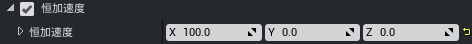

---

### 阻力

阻力模块用于模拟粒子在运动过程中因介质摩擦（如空气阻力、液体粘滞）而逐渐减速的效果。阻力值越大，粒子速度衰减越快，最终趋于静止。

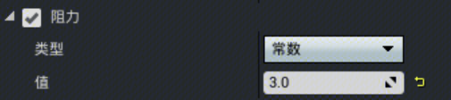

|属性名称|说明|
|:-:|-|
|类型|设置加速度的分布模式 • 常数：所有粒子受到恒定不变的阻力系数 • 随机：每个粒子受到的阻力系数在设定范围内随机分布|
|值|设定固定的阻力系数，【类型】选择“常数”时生效|
|最小|设定阻力系数的最小值，【类型】选择“随机”时生效|
|最小|设定阻力系数的最大值，【类型】选择“随机”时生效|

---

### 摄像机偏移

摄像机偏移用于微调粒子与摄像机之间相对位置，填入的数值越大，粒子离摄像机越近。通常用于以下两种情况：
- 避免摄像机穿透：当摄像机靠近或移动通过粒子效果（如雾气、灰尘）时，过近的距离会导致粒子不自然地放大或出现视觉瑕疵。通过设置适当的 Z 轴正偏移值（例如设置为 50，表示粒子沿摄像机前方偏移 50 个单位），可以确保粒子始终与摄像机保持一定距离，维持视觉上的合理性。
- 创建UI关联特效：对于需要固定在屏幕特定位置的粒子元素（如角色状态图标、对话气泡等），可通过计算并设置合适的偏移量，使粒子效果“附着”于屏幕指定区域，不受摄像机移动或旋转的影响，实现 UI 级别的视觉表现。

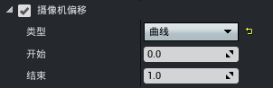

|属性名称|说明|
|:-:|-|
|类型|设置摄像机偏移的方式 • 常数：粒子的摄像机偏移值恒定不变 • 曲线：粒子的摄像机偏移值在其生命周期内，从开始值平滑过渡到结束值|
|值|设定粒子固定的摄像机偏移值，【类型】选择“常数”时生效|
|开始|粒子在生命周期初始时刻的摄像机偏移值，【类型】选择“曲线”时生效|
|结束|粒子在生命周期结束时刻的摄像机偏移值，【类型】选择“曲线”时生效|

---

### 大小随速度

大小随速度模块会根据粒子运动过程中的速度来动态控制其尺寸。

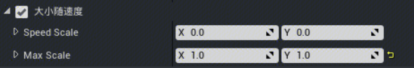

---

### 生命周期

生命周期模块用于控制粒子的生命时长。

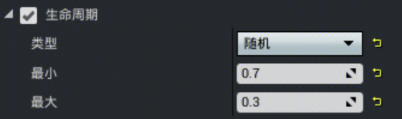

|属性名称|说明|
|:-:|-|
|类型|设置生命周期的模式 • 常数：所有粒子的生命周期固定 • 随机：每个粒子的生命周期在设定范围内随机分布|
|值|设定固定的生命周期，【类型】选择“常数”时生效|
|最小|设定生命周期的最小值，【类型】选择“随机”时生效|
|最小|设定生命周期的最大值，【类型】选择“随机”时生效|

---

### 初始旋转角度

初始旋转角度模块用于设定粒子发射时的旋转角度。

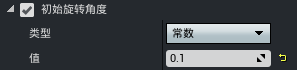

|属性名称|说明|
|:-:|-|
|类型|设置粒子初始角度的设定模式 • 常数：所有粒子的初始角度不变 • 随机：每个粒子的初始角度在设定范围内随机分布|
|值|设定固定的初始角度，单位：圈，【类型】选择“常数”时生效|
|最小|设定初始角度的最小值，单位：圈，【类型】选择“随机”时生效|
|最小|设定初始角度的最大值，单位：圈，【类型】选择“随机”时生效|

.gif)

---

### 初始旋转速率

初始旋转角度模块用于设定粒子运动过程中的旋转速度。

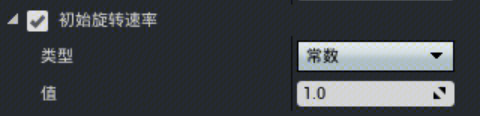

|属性名称|说明|
|:-:|-|
|类型|设置粒子初始旋转速率的设定模式 • 常数：所有粒子的初始旋转速率不变 • 随机：每个粒子的初始旋转速率在设定范围内随机分布|
|值|设定固定的初始旋转速率，单位：圈每秒，【类型】选择“常数”时生效|
|最小|设定初始旋转速率的最小值，单位：圈每秒，【类型】选择“随机”时生效|
|最小|设定初始旋转速率的最大值，单位：圈每秒，【类型】选择“随机”时生效|

.gif)

---

### 初始大小

粒子初始化的大小。

> 材质的对齐方式会影响对粒子大小的控制，详细可见 [材质](https://developer.gp.qq.com/wikieditor/#/catalog/20236?autoJump=%E6%9D%90%E8%B4%A8) 模块

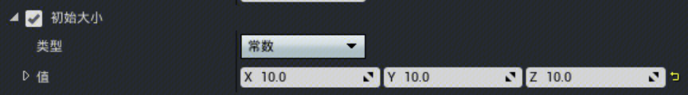

|属性名称|说明|
|:-:|-|
|类型|设置粒子初始大小的设定模式 • 常数：所有粒子的初始大小固定 • 随机：每个粒子的初始大小在设定范围内随机分布|
|值|设定固定的初始大小倍率，【类型】选择“常数”时生效|
|最小|设定初始大小的最小倍率，【类型】选择“随机”时生效|
|最小|设定初始大小的最大倍率，【类型】选择“随机”时生效|

## 旧版本特效编辑器

可通过菜单栏 ``编辑 ->工程设置 ->开启粒子编辑器v1`` 进行新旧版本特效编辑器的切换，勾选后重新打开特效就会出现旧版本的编辑态面板。

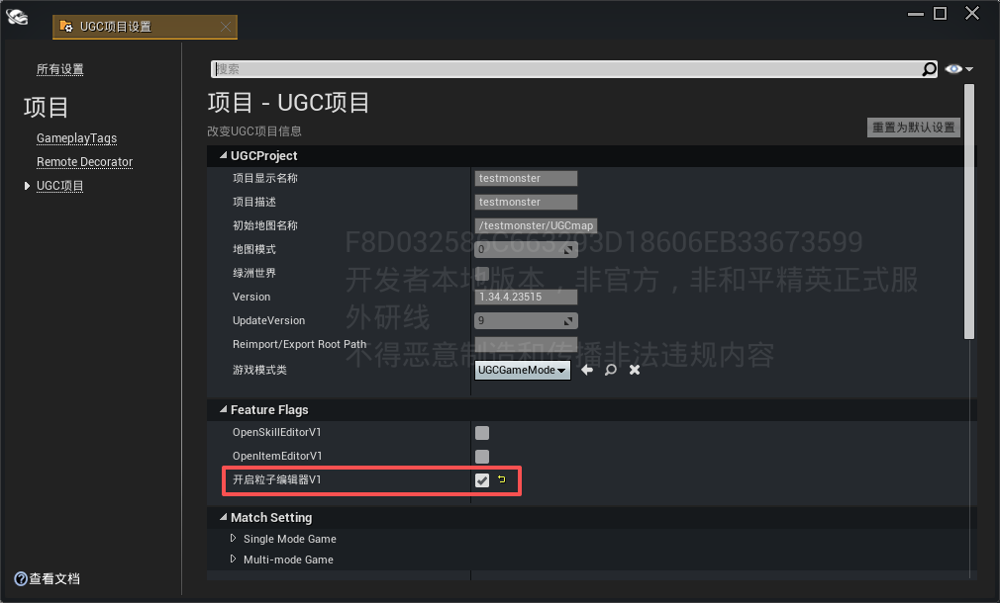
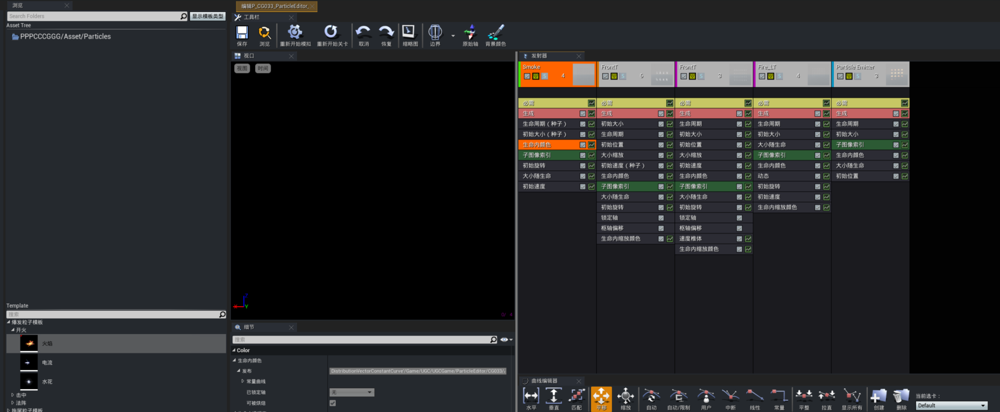
