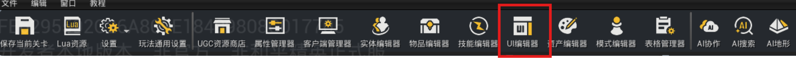
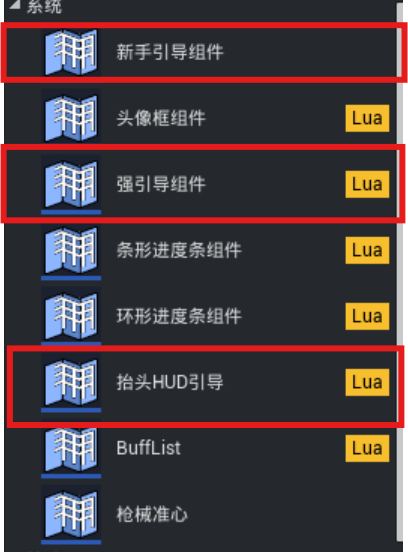

# 新手引导

本章节介绍新手引导系统提供的 UI 模板及其使用方法。提供三种引导UI模板：新手引导组件、强引导组件、抬头HUD引导。

## 常见使用场景与基本信息

使用新手引导组件前，需要满足以下条件：

1. UGCPlayerController 上需要挂载 ``BP_UGCNewbieGuideComponent``。
2. 组件初始化完成后，才能调用 ``NewbieGuideAPI`` 注册或触发引导。
3. Client 端通常可以不传 ``playerKey``，API 会自动使用本地玩家。
4. DS 端需要传入 ``playerKey``，用来指定要操作哪个玩家的引导。
5. 引导 UI 的显示和隐藏，需要在 ``onActivate``、``onComplete`` 回调中处理。

|场景|说明|
|-|-|
|首次进入玩法|弹出欢迎说明或基础操作提示|
|点击某个按钮|引导玩家点击指定 UI|
|达到某个条件|例如玩家完成一次操作后自动触发下一步|
|多步引导|按顺序完成“打开界面 → 点击按钮 → 关闭界面”等流程|
|可重复提示|例如每次进入危险区域都提示玩家|

|项目|内容|文件说明|
|-|-|-|
|组件名称|UGC 新手引导组件|
|主要组件文件|``BP_UGCNewbieGuideComponent.lua``|挂在 UGCPlayerController 上的组件，负责初始化、进度同步和示例 UI 控制|
|对外 API 文件|``NewbieGuideAPI.lua``|对外调用入口，开发者主要通过它注册、触发和完成引导|
|配置文件|``GuideConfig.lua``|	保存触发模式、运行端、状态等常量|
|默认注册入口|``GuideRegistration.lua``|默认引导注册文件，开发者可以在这里写自己的引导配置|
|单个引导数据|``GuideEntry.lua``|单个引导的数据对象，保存引导配置和当前状态|
|管理器|``GuideManager.lua``|管理引导注册、触发、排队、完成和进度|
|支持运行端|Client / DS||
|是否支持进度保存|支持|
|是否支持多个玩家|支持，每个玩家独立管理|

## 引导UI模板




[新手引导实例](./UI系统/20149_基础UI元件.md#新手引导)

[强引导组件](./UI系统/20383_强引导组件.md)

[抬头HUD引导](https://developer.gp.qq.com/wikieditor/#/catalog/20398?autoJump=%E9%98%9F%E4%BC%8D%E4%BF%A1%E6%81%AF%E9%9D%A2%E6%9D%BF) （以队伍UI界面为例）

## 配置细节

### 引入方式

```lua
local NewbieGuideAPI = require("ugc.UGCGame.GamePart.NewbieGuide.NewbieGuideAPI")
local GuideConfig = require("ugc.UGCGame.GamePart.NewbieGuide.GuideConfig")
```

NewbieGuideAPI 已经导出了常用枚举：

```lua
NewbieGuideAPI.TriggerMode
NewbieGuideAPI.State
NewbieGuideAPI.RunMode
```

> 注册一个引导时，需要传入一个配置表。

### 配置字段

|字段|类型|是否必填|默认值|说明|
|-|-|-|-|-|
|id|string|是|—|引导唯一 ID|
|priority|number|否|0|优先级，数值越小越先处理|
|triggerMode|number|否|Both|触发方式|
|runMode|number|否|Client|运行端|
|maxCompletionCount|number|否|1|最大完成次数，0 表示不限次数|
|prerequisites|table|否|{}|前置引导 ID 列表|
|conditionChecker|function|否|nil|轮询触发时的条件检查函数|
|condition|function|否|nil|``conditionChecker`` 的简写写法|
|onSetup|function|否|nil|注册引导时调用，常用于绑定事件|
|onTeardown|function|否|nil|注册引导时调用，常用于绑定事件|
|onActivate|function|否|nil|引导被触发时调用|
|onComplete|function|否|nil|引导完成时调用|
|userData|table|否|nil|自定义数据，可在回调中读取|

回调说明：
| 回调 | 调用时机 | 常见用途 |
|-|-|-|
| ``onSetup(entry, triggerFunc)`` | 引导注册时 | 绑定按钮点击、等级变化等事件 |
| ``onTeardown(entry)`` | 引导注销时 | 移除监听，清理临时数据 |
| ``conditionChecker(entry)`` | 轮询检查时 | 判断是否满足自动触发条件 |
| ``onActivate(entry)`` | 引导开始时 | 显示引导 UI、高亮按钮 |
| ``onComplete(entry)`` | 引导完成时 | 隐藏引导 UI、恢复界面 |

## 常用API

### 注册与触发

注册一个引导：
```
NewbieGuideAPI.RegisterGuide(config, playerKey)
```

| 返回值 | 说明 |
| --- | --- |
| `boolean` | `true` 表示注册成功，`false` 表示注册失败 |

注销一个引导：
```
NewbieGuideAPI.UnregisterGuide(guideId, playerKey)
```

手动触发一个引导：
```
NewbieGuideAPI.TriggerGuide(guideId, forceQueue, playerKey)
```

跳过当前引导：
```
NewbieGuideAPI.SkipCurrentGuide(playerKey)
```
跳过不会增加完成次数，也不会调用`onComplete`

| 参数 | 类型 | 必填 | 说明 |
| --- | --- | --- | --- |
| `config` | `table` | 是 | 引导配置 |
| `guideId` | `string` | 是 | 引导 ID |
| `playerkey` | `any` | 否 | 玩家标识，Client 端可不传 |
| `forceQueue` | `boolean` | 否 | 当前已有引导时，是否放入队列 |

### 状态查询

| 方法 | 说明 |
| --- | --- |
| `IsInitialized(playerkey)` | 判断组件是否已经初始化 |
| `GetGuideState(guideId, playerKey)` | 获取指定引导状态 |
| `GetCompletionCount(guideId, playerKey)` | 获取指定引导完成次数 |
| `GetCurrentGuideId(playerKey)` | 获取当前正在进行的引导 ID |
| `IsGuideActive(playerKey)` | 判断是否有引导正在进行 |
| `GetQueueLength(playerKey)` | 获取排队中的引导数量 |
| `GetQueuedGuideIds(playerKey)` | 获取排队中的引导 ID 列表 |
| `GetProgressData(playerKey)` | 获取当前进度数据 |

### 进度管理

| 方法 | 说明 |
| --- | --- |
| `SaveProgress(playerKey)` | 保存进度 |
| `LoadProgress(playerKey)` | 加载进度 |
| `ClearProgress(playerKey)` | 清空进度 |
| `SetProgressLoader(loader, playerKey)` | 设置自定义加载函数 |
| `SetProgressSaver(saver, playerKey)` | 设置自定义保存函数 |

### 轮询设置

| 方法 | 说明 |
| --- | --- |
| `SetConditionChecker(guideId, checker, playerKey)` | 设置指定引导的条件检查函数 |
| `SetPollingEnabled(enabled, playerKey)` | 开启或关闭轮询 |
| `SetCheckInterval(interval, playerKey)` | 设置轮询间隔，单位秒 |

### 事件监听

| 方法 | 说明 |
| --- | --- |
| `AddOnGuideActivatedListener(callback, playerKey)` | 监听引导激活 |
| `RemoveOnGuideActivatedListener(callback, playerKey)` | 移除引导激活监听 |
| `AddOnGuideCompletedListener(callback, playerKey)` | 监听引导完成 |
| `RemoveOnGuideCompletedListener(callback, playerKey)` | 移除引导完成监听 |
| `AddOnGuideQueuedListener(callback, playerKey)` | 监听引导进入队列 |
| `RemoveOnGuideQueuedListener(callback, playerKey)` | 移除引导排队监听 |
| `AddOnProgressChangedListener(callback, playerKey)` | 监听进度变化 |
| `RemoveOnProgressChangedListener(callback, playerKey)` | 移除进度变化监听 |

## 示例

### 注册并手动触发一个引导

适合最简单的新手提示

```lua
local NewbieGuideAPI = require("ugc.UGCGame.GamePart.NewbieGuide.NewbieGuideAPI")
local GuideConfig = require("ugc.UGCGame.GamePart.NewbieGuide.GuideConfig")

NewbieGuideAPI.RegisterGuide({
    id = "guide_basic",
    triggerMode = GuideConfig.TriggerMode.Event,

    ["onActivate"] = function(entry)
        print("guide_basic 激活，显示引导 UI")
    end,

    ["onComplete"] = function(entry)
        print("guide_basic 完成，隐藏引导 UI")
    end,
})

NewbieGuideAPI.TriggerGuide("guide_basic")

-- 玩家完成操作后调用
NewbieGuideAPI.CompleteCurrentGuide()
```

### 轮询触发引导

适合“玩家满足某个条件后自动弹出”的情况

```lua
local NewbieGuideAPI = require("ugc.UGCGame.GamePart.NewbieGuide.NewbieGuideAPI")
local GuideConfig = require("ugc.UGCGame.GamePart.NewbieGuide.GuideConfig")

local bHasClickedButtonEnough = false

NewbieGuideAPI.RegisterGuide({
    id = "guide_polling",
    triggerMode = GuideConfig.TriggerMode.Polling,

    ["conditionChecker"] = function(entry)
        return bHasClickedButtonEnough
    end,

    ["onActivate"] = function(entry)
        print("条件满足，显示引导")
    end,

    ["onComplete"] = function(entry)
        print("轮询引导完成")
    end,
})

-- 某业务逻辑中改变条件
bHasClickedButtonEnough = true
```

### 事件触发引导

适合“玩家升级、点击按钮、完成任务”等事件发生后触发
```lua
local NewbieGuideAPI = require("ugc.UGCGame.GamePart.NewbieGuide.NewbieGuideAPI")
local GuideConfig = require("ugc.UGCGame.GamePart.NewbieGuide.GuideConfig")

local MockEventSystem = {
    Listeners = {},
}

function MockEventSystem:AddListener(EventName, Callback)
    self.Listeners[EventName] = Callback
end

function MockEventSystem:RemoveListener(EventName)
    self.Listeners[EventName] = nil
end

function MockEventSystem:Fire(EventName, ...)
    if self.Listeners[EventName] then
        self.Listeners[EventName](...)
    end
end

NewbieGuideAPI.RegisterGuide({
    id = "guide_level_up",
    triggerMode = GuideConfig.TriggerMode.Event,

    ["onSetup"] = function(entry, triggerFunc)
        entry.LevelUpListener = function(PlayerKey, NewLevel)
            if NewLevel >= 5 then
                triggerFunc()
            end
        end

        MockEventSystem:AddListener("LevelUp", entry.LevelUpListener)
    end,

    ["onTeardown"] = function(entry)
        MockEventSystem:RemoveListener("LevelUp")
        entry.LevelUpListener = nil
    end,

    ["onActivate"] = function(entry)
        print("玩家达到 5 级，显示升级引导")
    end,
})

-- 模拟玩家升级
MockEventSystem:Fire("LevelUp", "player_1", 5)
```

### 前置依赖引导

适合多步流程，例如“先打开背包，再选择物品”
```lua
local NewbieGuideAPI = require("ugc.UGCGame.GamePart.NewbieGuide.NewbieGuideAPI")
local GuideConfig = require("ugc.UGCGame.GamePart.NewbieGuide.GuideConfig")

NewbieGuideAPI.RegisterGuide({
    id = "guide_open_bag",
    priority = 1,
    triggerMode = GuideConfig.TriggerMode.Event,

    ["onActivate"] = function(entry)
        print("步骤 1：引导玩家打开背包")
    end,

    ["onComplete"] = function(entry)
        print("步骤 1 完成")
    end,
})

NewbieGuideAPI.RegisterGuide({
    id = "guide_select_item",
    priority = 2,
    triggerMode = GuideConfig.TriggerMode.Event,
    prerequisites = { "guide_open_bag" },

    ["onActivate"] = function(entry)
        print("步骤 2：引导玩家选择物品")
    end,
})

-- 先完成第一步
NewbieGuideAPI.TriggerGuide("guide_open_bag")
NewbieGuideAPI.CompleteCurrentGuide()

-- 再触发第二步
NewbieGuideAPI.TriggerGuide("guide_select_item")
```

### 可重复触发的引导

适合每次进入某个区域都要提示的场景
```lua
local NewbieGuideAPI = require("ugc.UGCGame.GamePart.NewbieGuide.NewbieGuideAPI")
local GuideConfig = require("ugc.UGCGame.GamePart.NewbieGuide.GuideConfig")

NewbieGuideAPI.RegisterGuide({
    id = "guide_danger_area",
    triggerMode = GuideConfig.TriggerMode.Event,

    -- 0 表示不限完成次数
    maxCompletionCount = 0,

    ["onActivate"] = function(entry)
        print("你已进入危险区域，请注意安全")
    end,

    ["onComplete"] = function(entry)
        print("危险区域提示完成")
    end,
})

-- 每次进入危险区域时触发
NewbieGuideAPI.TriggerGuide("guide_danger_area")
```

### 排队显示多个引导

同一时间只能显示一个引导。如果当前已有引导，后触发的引导会进入队列
```lua
local NewbieGuideAPI = require("ugc.UGCGame.GamePart.NewbieGuide.NewbieGuideAPI")
local GuideConfig = require("ugc.UGCGame.GamePart.NewbieGuide.GuideConfig")

NewbieGuideAPI.RegisterGuide({
    id = "guide_first",
    priority = 1,
    triggerMode = GuideConfig.TriggerMode.Event,

    ["onActivate"] = function(entry)
        print("第一个引导显示")
    end,
})

NewbieGuideAPI.RegisterGuide({
    id = "guide_second",
    priority = 2,
    triggerMode = GuideConfig.TriggerMode.Event,

    ["onActivate"] = function(entry)
        print("第二个引导显示")
    end,
})

NewbieGuideAPI.TriggerGuide("guide_first")

-- 当前 guide_first 正在显示，guide_second 会进入队列
NewbieGuideAPI.TriggerGuide("guide_second")

-- 完成第一个后，第二个会自动显示
NewbieGuideAPI.CompleteCurrentGuide()
```

### 监听引导完成

适合在引导完成后做额外处理

```lua
local NewbieGuideAPI = require("ugc.UGCGame.GamePart.NewbieGuide.NewbieGuideAPI")

local function OnGuideCompleted(GuideId, CompletionCount)
    print("引导完成:", GuideId, "完成次数:", CompletionCount)
end

NewbieGuideAPI.AddOnGuideCompletedListener(OnGuideCompleted)

-- 不再需要监听时移除
NewbieGuideAPI.RemoveOnGuideCompletedListener(OnGuideCompleted)
```

### 在默认注册文件中添加引导

开发者可以在 `GuideRegistration.RegisterGuides` 中添加自己的引导
```lua
function GuideRegistration.RegisterGuides(playerKey, isServer)
    if not isServer then
        NewbieGuideAPI.RegisterGuide({
            id = "guide_welcome",
            triggerMode = GuideConfig.TriggerMode.Event,
            runMode = GuideConfig.RunMode.Client,
            maxCompletionCount = 1,

            ["onActivate"] = function(entry)
                local NewbieGuideComponent = NewbieGuideAPI.GetLocalComponent()

                if NewbieGuideComponent then
                    NewbieGuideComponent:ShowForceClickGuideOne()
                end
            end,

            ["onComplete"] = function(entry)
                local NewbieGuideComponent = NewbieGuideAPI.GetLocalComponent()

                if NewbieGuideComponent then
                    NewbieGuideComponent:HideForceClickGuideOne()
                end
            end,
        }, playerKey)
    end
end
```

> `id` 必须唯一，建议使用清晰的命名，例如 `guide_open_bag`
> `priority` 数值越小，越优先显示
> 同一时间只会有一个引导处于激活状态
> 需要玩家操作后才完成的引导，不要在 `onActivate` 里立刻调用 `CompleteCurrentGuide()`
> 使用 `onSetup` 绑定事件时，建议在 `onTeardown` 里解绑
> Client 端引导完成后，会同步到 DS 保存进度
> 如果引导只需要在客户端显示 UI，`runMode` 建议使用 `GuideConfig.RunMode.Client`
