# 枪械属性对照表

| 属性名 | 属性含义 | 取值 | 示例取值 |效果|
| :------: | ------ | ------ | ------ |------ |
| `射击前处理时长-PreFireTime` | **狙击枪**拉栓后到射击的停留时间 | (0,+∞) | x5 ||
|`射击后处理时长-PostFireTime`| **狙击枪**射击后到拉栓的停留时间 | (0,+∞) | x5 | |
|`单发换弹拉栓时长-ReloadDurationStart`| **狙击枪**换弹时，拉栓的动画时长 | (0,+∞) | =5 | |
|`单发换弹填弹时长-ReloadDurationLoop`| **狙击枪**换弹时，填充一发子弹的时长 （第二颗子弹开始计算）| (0,+∞) | =5 ||
| `全弹夹换弹时长` | **所有枪械**子弹打完后的换弹时长 | （0,+∞） | =1 | 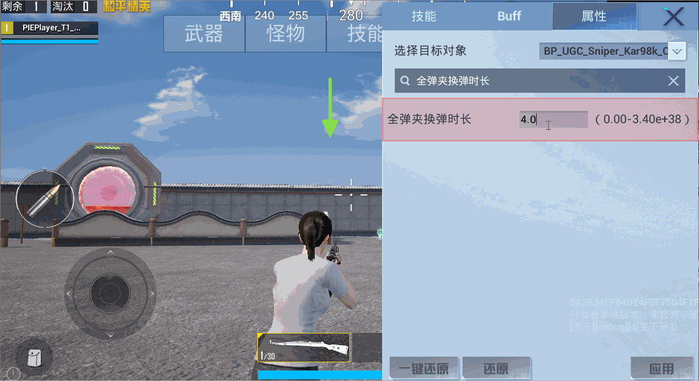|
| `全弹夹换弹时间修改参数` | **所有枪械**子弹打完后的换弹时长修改参数 | （0,+∞） | x5 | |
| `战术换弹时长` |**非狙击枪**子弹未打完后的换弹时长 | （0,+∞） | =5 | |
| `战术换弹时间修改参数` |**非狙击枪**子弹未打完后的换弹时长修改参数 | （0,+∞） | =5 | |
| `单发战术换弹时间修改参数-ReloadTimeTacticalOneByOneModifier` | **狙击枪**子弹未打完后的换弹时长修改参数 | (0,+∞) | x5 | |
| `所有换弹时间修改参数-AllReloadTimeModifier` | **所有枪械**战术/全弹夹换弹时间的修改参数 | （0,+∞） | =0.01 | |
| `垂直后坐力修改系数` | 开枪时枪口抬高幅度的大小，取值越大，幅度越大 | (0,+∞) | x100 | 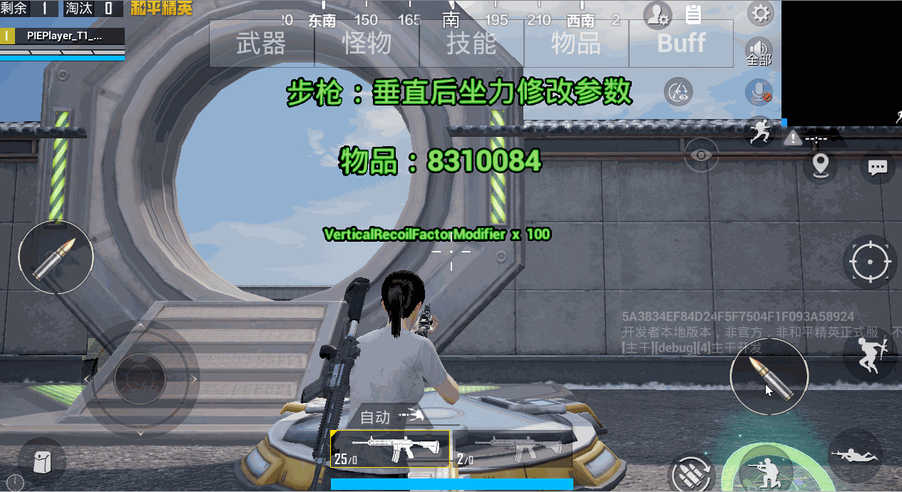 |
| `水平后坐力修改系数` | 开枪时枪口左右抖动的大小，取值越大，幅度越大 | (0,+∞) | x100 | 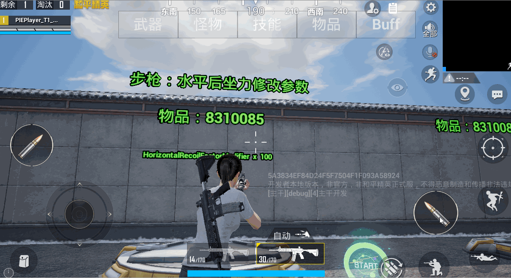|
| `霰弹枪垂直散布-ShotGunVerticalSpread` | 霰弹枪垂直方向的散布修改因子；取值越大，散布范围越大 | (0, 8) | / | - |
| `霰弹枪水平散布-ShotGunHorizontalSpread` | 霰弹枪水平方向的散布修改因子；取值越大，散布范围越大 | (0, 8) | / | - |
| `最终散布修改参数-DeviationFactorModifier` | 霰弹枪散布修改因子；取值越大，散布范围越大 | (0, 8) | =8 | 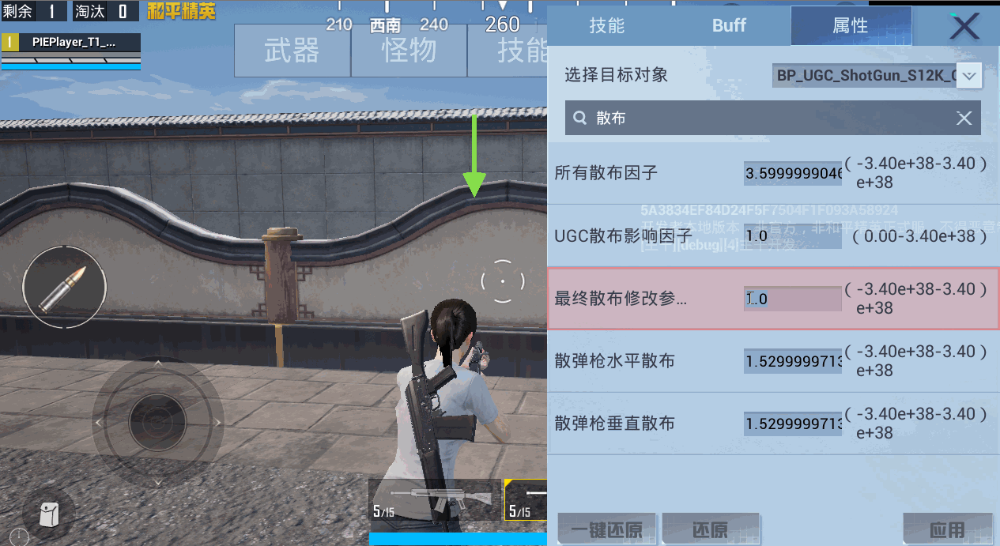 |
| `开镜速度` | 值越大，开镜速度越快 | （0, +∞） | x10 | 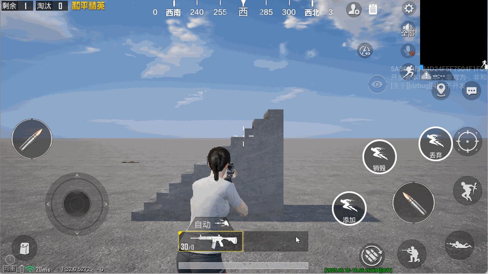|
| ``倍镜类别`` | 倍镜的枚举值 - 0：全息/红点 - 1：2倍镜 - 2：4倍镜 - 3：8倍镜 - 4：默认无倍镜 - 5：3倍镜 - 6：6倍镜  | (0, 6) | / | - |
| `开火动画抖动幅度` | 值越大，开火镜头抖动幅度越大 | (0, +∞) | x100  | 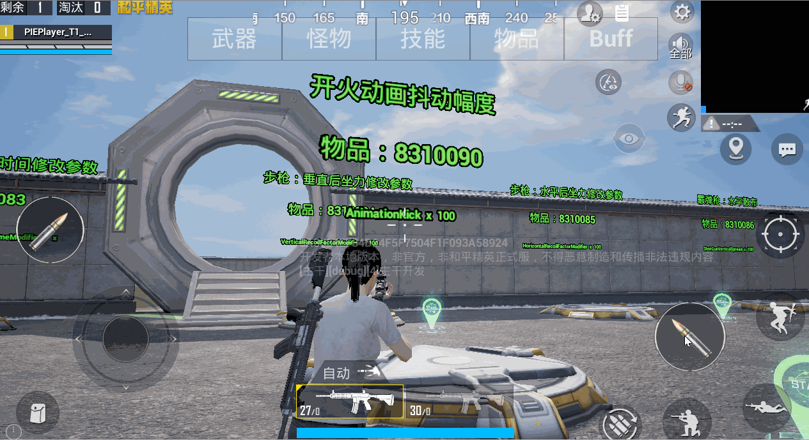|
| `UGC换弹时间影响因子-ReloadTimeFactorWrapper` | 所有枪械换单时间影响因子（战术+全换弹）| (0. +∞) | =0.2 | |
| `UGC切枪时间影响因子-SwitchTimeFactorWrapper` | 切枪时间影响因子 | (0, +∞) | =3 | |
| `UGC攻击间隔影响因子-ShootIntervalFactorWrapper` | 射击间隔时间的修改参数 |  (0, +∞) | =5 | |
| `UGC后坐力影响因子RecoilFactorWrapper` | 后坐力整体影响因子 | (0, +∞) | =50 | |
| `UGC散布影响因子-DeviationFactorWrapper` | 霰弹枪整体散布影响因子（垂直+水平） | （0,+∞） | 5 | 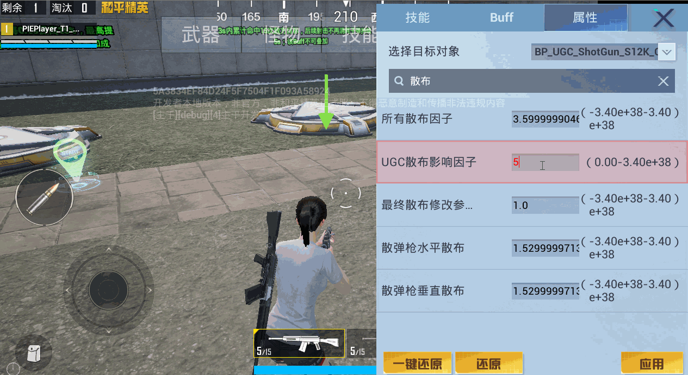 |
| `UGC一次拉栓子弹装填数量-MaxBulletNumInBarrelWrapper` | 狙击枪 | / | / | - |
| `UGC弹匣容量-MaxBulletNumlnOneClipWrapper` | 所有枪械的弹匣容量修改 | (0, +∞) | =50 |  |
| `枪械所有射速修改系数` | 枪械当前伤害修改的系数 | (0,+∞) | / |  - |
|  `全弹夹换弹开始到拔出弹匣时间` | 全换弹前半段 | （0,+∞） | / | - |
|  `全弹夹换弹时插入到换弹结束时间` | 全换弹后半段 | （0,+∞） | / | - |
| `战术换弹开始到拔出弹匣时间` | 战术换弹前半段 | （0,+∞） | / | - |
| `战术换弹时插入到换弹结束时间` | 战术换弹后半段 | （0,+∞） | / | - |
| `UGC换弹时间影响因子` | 全换弹、战术换弹的统一影响因子（越大换弹速度越慢） | （0,+∞） | 0.1 | |
| `UGC切枪时间影响因子` | 武器一、武器二切换时，当前枪械的切枪时间影响（越大切枪速度越慢） | （0,+∞） | 0.1 |  |
| `UGC后坐力影响因子` | 影响后坐力（越大，后坐力越强） | （0,+∞） | 100 | 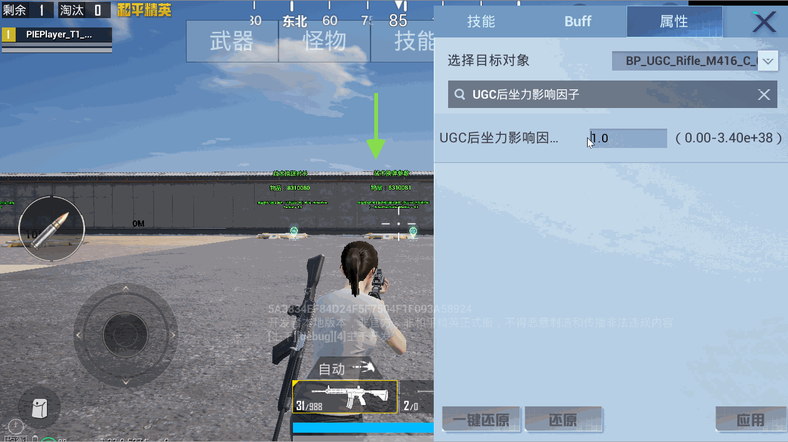 |
| `UGC全自动射击间隔` | 自动模式射击时间间隔（越大，射击间隔越长） | （0,+∞） | / | 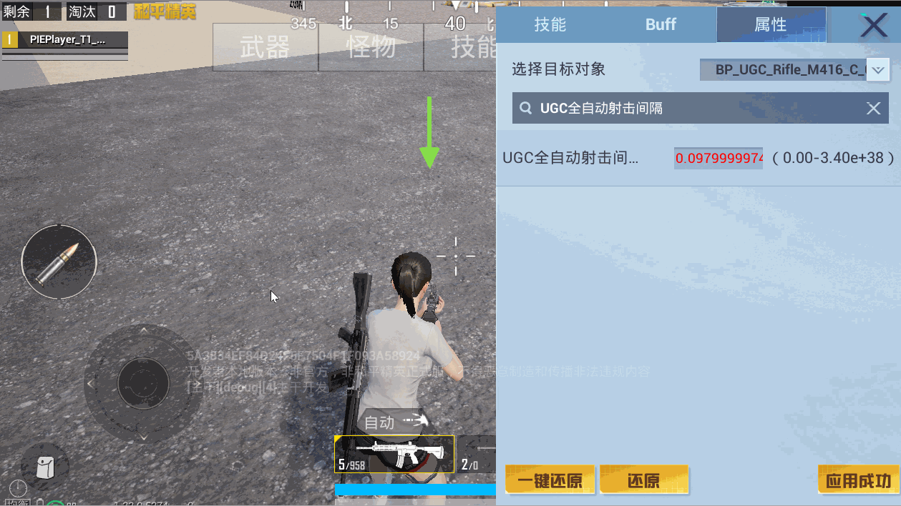|
| `UGC子弹基础伤害` | 子弹命中时的基础伤害值 | （0,+∞） | 100 | |
| `UGC连发数量` | 连发模式下，一次爆发子弹的数量 | （0,+∞） | 10 | 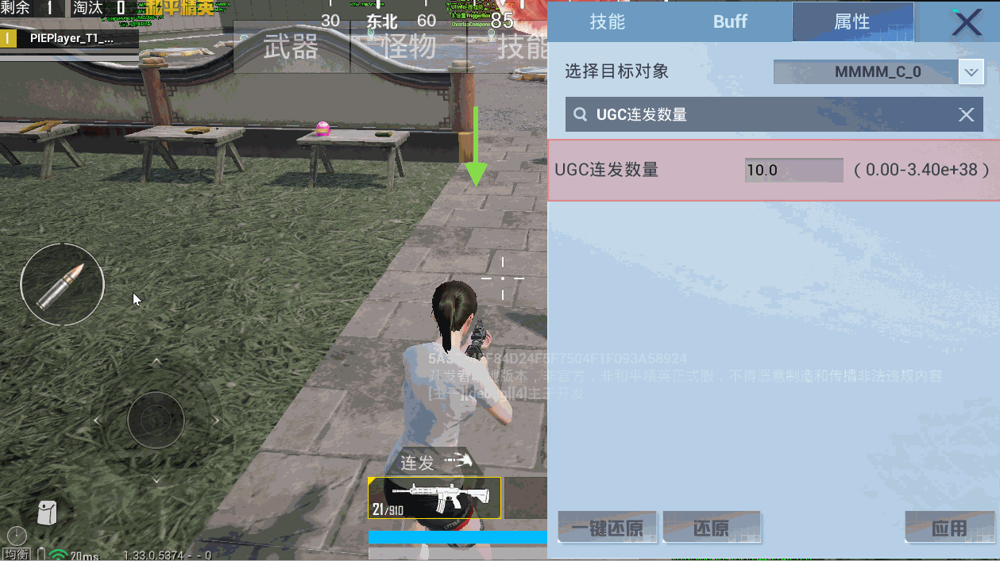|
| `UGC连发子弹间隔` | 连发模式下，爆发多颗子弹每一颗之间的间隔 | （0,+∞） | 0.5 | 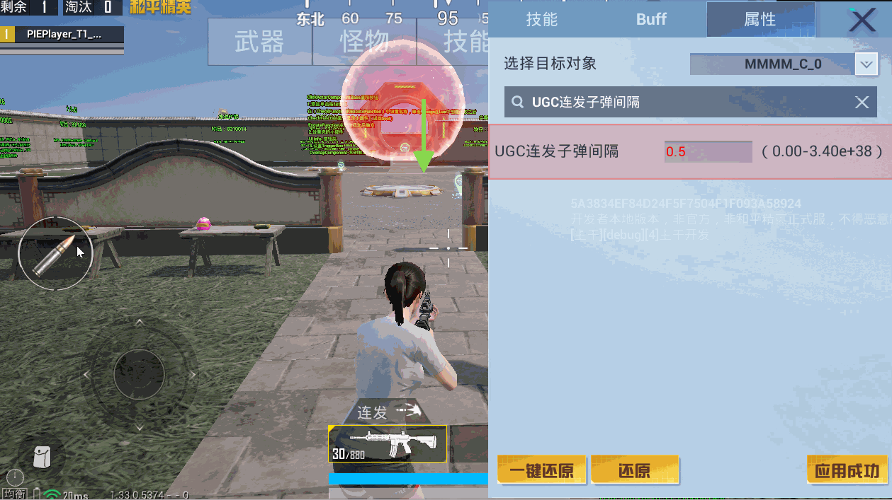|
| `UGC连发射击间隔` | 连发模式下，爆发子弹的间隔 | （0,+∞） | 1 | 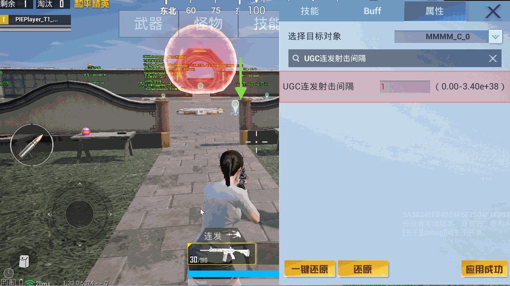 |
| `UGC弹匣容量` | 枪械本身的容量 | （0,+∞） | 50 | 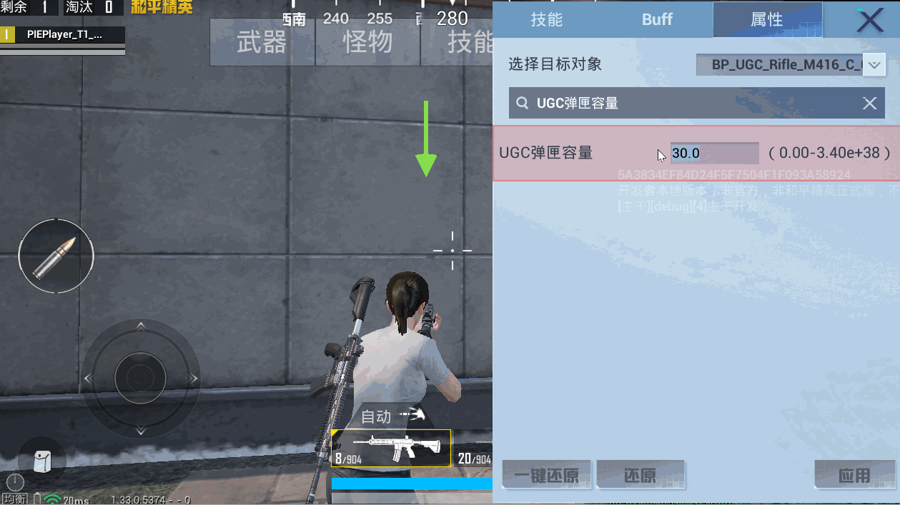 |
