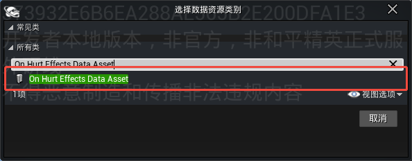
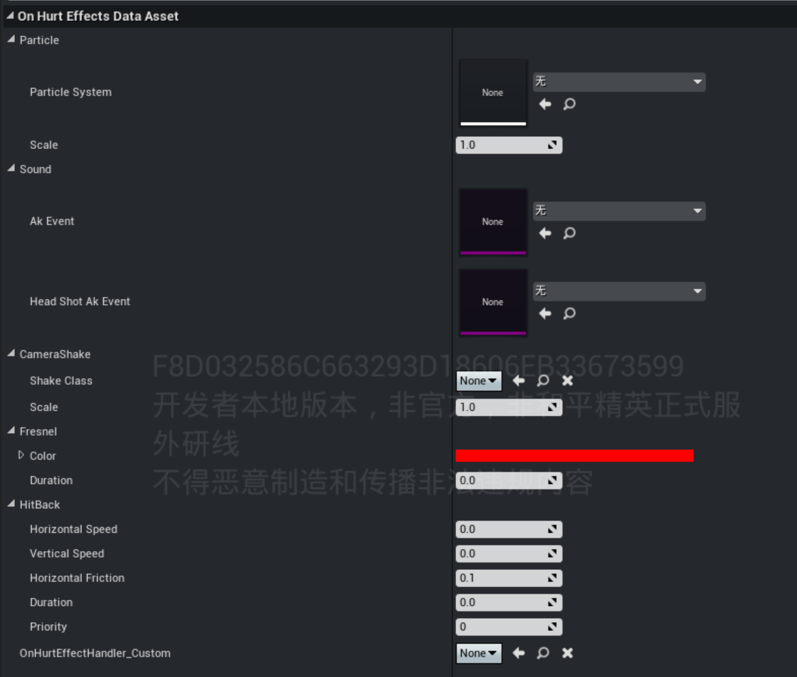
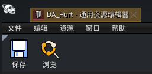
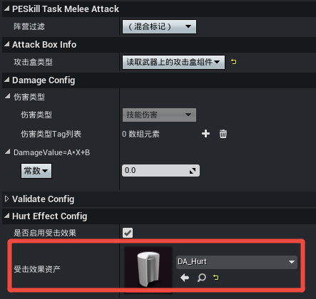

# 受击数据资产

受击是游戏中角色或物体受到攻击时产生的反馈，通常通过特效、音效、镜头抖动等多种效果组合的形式描述受击的程度，能够产生伤害的场景一般都伴随受击表现，因此通过数据资产蓝图的方式提供统一的受击表现数据配置，便于管理与复用。

## 创建数据资产蓝图

在编辑器内容浏览器窗口下，右键 ``各种各样 -> 数据资源``， 搜索“On Hurt Effects Data Asset”，基于该结构体创建数据资产蓝图。

## 配置受击数据

双击打开受击数据资产蓝图，进入编辑界面：

|属性名|属性说明|
|-|-|
|Particle System|受击时触发的粒子特效资源|
|Scale|受击粒子特效的缩放大小|
|Ak Event|命中非头部部位播放的音效|
|Head Shot Ak Event|命中头部播放的音效|
|Shake Class|播放的相机抖动蓝图资源|
|Scale|抖动强度|
|Fresnel|受击边缘光（菲涅尔效果）。角色受击时，在模型边缘渲染一圈高亮光效以强化打击反馈 • Color：边缘光的颜色（如红色伤害警示） • Duration：边缘光效果的持续时间（单位：秒）|
|Horizontal Speed|击退的水平方向上的速度|
|Vertical Speed|击退的垂直方向上的速度|
|Horizontal Friction|击退的水平方向上的摩擦力|
|Duration|击退的持续时间|
|Priority|击退的执行优先级，当多个击退效果作用于同一个目标时，将根据该优先级决定最终生效的击退效果|

设置完成后，点击【保存】按钮完成配置。

## 应用受击数据

所有支持配置受击数据资产蓝图的功能都可以应用受击数据，例如 [技能Task-近战攻击](../技能系统/技能编辑器2.0/20094_技能Task查询手册.md#技能Task-近战攻击) 提供了受击效果的配置项，关联后即会读取受击数据进行对应的效果表现。

