# 怪物快速配置指南

怪物是具备属性和状态的游戏对象，拥有独特的外观、行为模式和能力，是丰富游戏场景和强调互动性与游戏体验的重要元素，以下将以简单的怪物示例介绍如何快速创建与配置一个怪物。

## 配置依赖

怪物的移动行为依赖寻路系统，通过导航网格生成可移动区域，同时 ``AIWorldVolume`` 赋予识别交互对象的能力等，因此需要完成前置的配置事项，可参考 [导航网格配置](./20266_导航网格.md)。

## 创建怪物蓝图

编辑器菜单栏点击【实体编辑器】按钮，打开实体编辑器操作界面。


1. 从“怪物模板”窗口中选择近战小怪模板，下方“选择模板创建”按钮将高亮显示，并更名为“以 ``近战小怪模板`` 为模板创建”

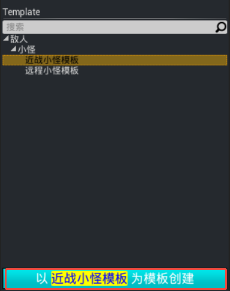
2. 点击“以 ``近战小怪模板`` 为模板创建” 按钮，弹出输入名称弹窗，输入怪物蓝图名称并点击确定
3. 新建的怪物蓝图将显示在“工程实体资源”窗口中，且怪物蓝图创建于 ``Asset/Blueprint/Prefabs/Monsters`` 路径下

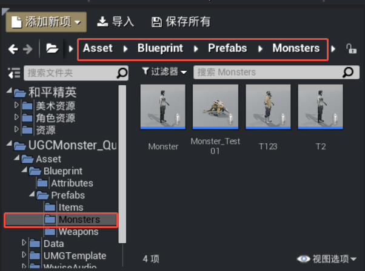

## 配置怪物能力

怪物具有属性、阵营、技能和行为逻辑等基础能力，也可以为怪物添加伤害飘字、死亡掉落等其他功能。

### 基础信息

怪物蓝图中的【细节】面板可以设置 [怪物血条](./20412_怪物血条.md)、怪物名称和阵营等基础信息。

在怪物蓝图中将 ``Character Name`` 属性改为“弓箭手”，血条保持默认显示效果。

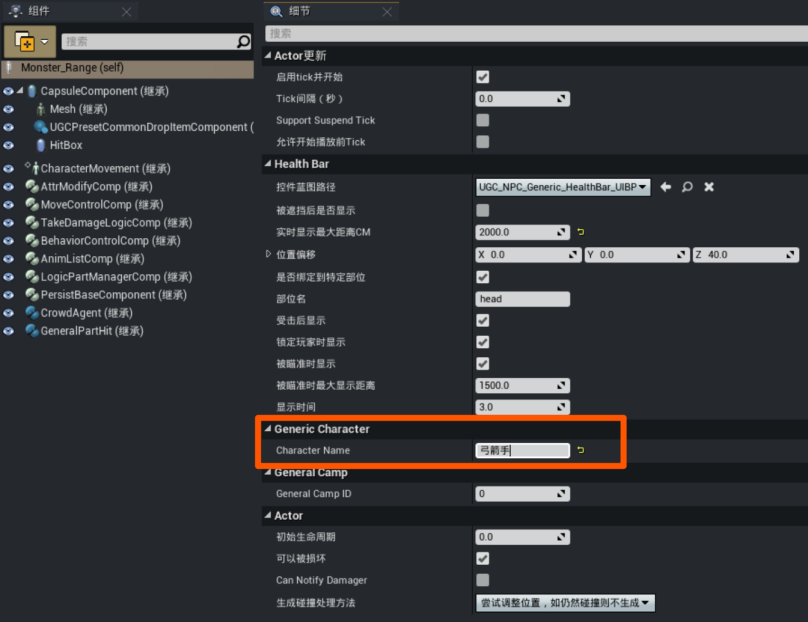

> 如果调试时怪物无法被攻击，需要确认怪物与玩家的阵营关系是否正确，可以参考 [配置阵营](../角色系统/20095_队伍与阵营.md#配置阵营)

---

### 实体类型

可以为各类怪物设置自定义的实体类型标签，例如精灵、机械兽、龙族等，实体类型标签也是一类基于 [GameplayTag](../20102_Gameplay标签.md) 定义的概念性标签，怪物基类提供了 ``SetEntityTypeTag`` 与 ``GetEntityTypeTag`` 函数用于运行时动态设置/查询实体类型标签。

示例代码：

```lua
-- 设置实体类型标签
local EntityTypeTag = UGCGameplayTagSystem.RequestGameplayTag("LogicPart.Filter.EntityType.Melee")
MonsterObject:SetEntityTypeTag(EntityTypeTag)

-- 查询实体类型标签
local TagInfo = MonsterObject:GetEntityTypeTag()
ugcprint(string.format("Monster Entity Type: %s", TagInfo.TagName))
```

---

### 怪物行为

怪物的行为逻辑通过 [行为树](https://dev.epicgames.com/documentation/zh-cn/unreal-engine/behavior-tree-in-unreal-engine---overview?application_version=5.5) 进行驱动，怪物系统已经为模板怪物默认添加了 ``UGC怪物行为树`` 模板，涵盖了常用的寻敌、巡逻、攻击等行为，且经由行为控制组件 ``BehaviorControlComp`` 反射行为树部分黑板变量，可以直接在蓝图中修改行为属性。

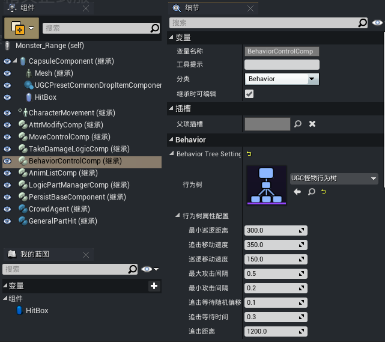

---

### 逻辑管理组件

[逻辑管理组件](./20162_怪物逻辑管理组件.md) ``LogicPartManagerComp`` 在行为树模板的基础上抽象封装了一套逻辑模块组件，在不修改行为树的前提下仅通过蓝图配置实现不同行为模式的怪物。

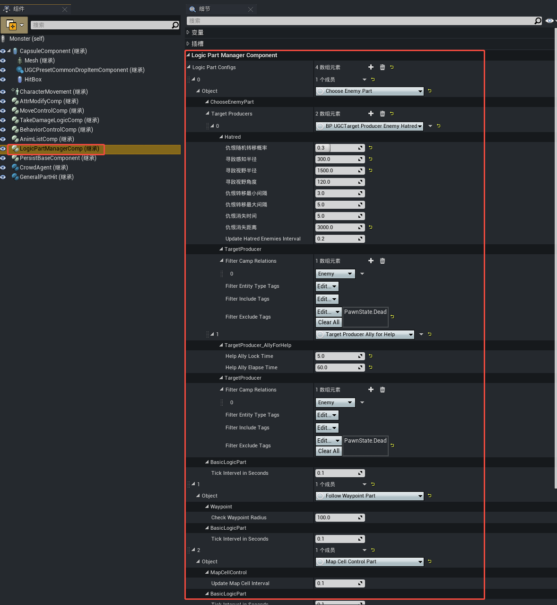

---

### 怪物动画

怪物蓝图的动画列表组件支持自定义修改怪物动画，默认提供了受击、死亡、休闲移动、战斗移动、休闲Idle和战斗Idle等六种状态动画，同时也支持 [怪物动画蓝图复用功能](./20017_怪物动画蓝图复用功能.md) 用于怪物“换皮”。

> 需要确保替换的动画资源的骨骼与怪物骨骼类型一致

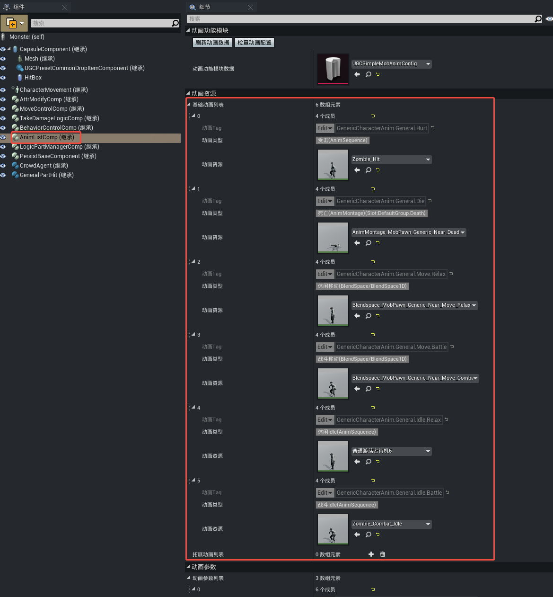
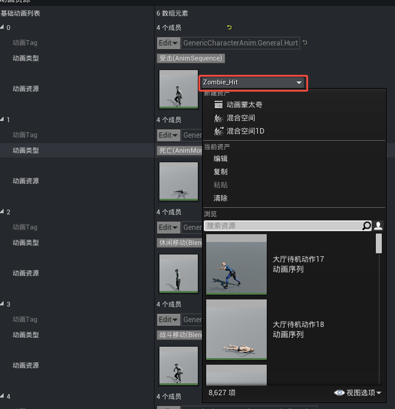

---

### 修改初始属性

怪物蓝图的属性修改组件提供基于 [属性管理器](../属性与伤害/20098_通用属性系统.md#属性管理器) 的属性初始值修改能力。

在怪物蓝图的 ``AttrModifyComp`` 组件中为“属性初始值配置”添加 ``血量`` 和 ``最大血量`` 两项修改，初始值均设置为300。

> 如果待修改属性具备相应最大值属性，通常需要同步修改

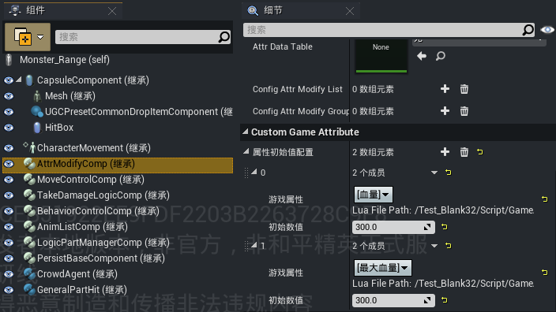

---

### 添加怪物技能

怪物释放技能的行为由行为树的逻辑驱动，[释放技能](./20179_任务节点查询手册.md#[Generic]施放技能) 任务节点提供 [虚拟技能槽](../技能系统/技能编辑器2.0/20091_技能编辑器.md#技能基础配置) 的参数配置，该节点的执行将触发对应槽位的技能。

怪物蓝图的 ```PersistBaseComponent``` 组件关联虚拟技能槽与技能蓝图，将 ``Skill.Slot.Main`` 槽位绑定的技能改为 ``PESkill_Monster_Claw``。

> 行为树模板默认使用的释放技能槽位是 ``Skill.Slot.Main``

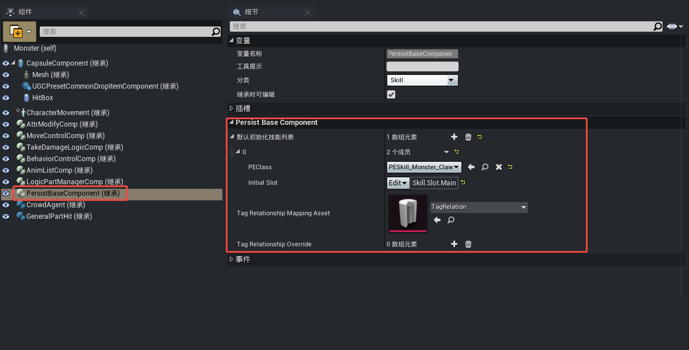

---

### 添加死亡掉落

怪物的死亡固定会触发掉落行为，通过 [掉落组件](../../../通用功能/20142_通用掉落组件.md) 可以配置需要掉落的物品信息。

在怪物蓝图的 ```UGCPresetCommonDropItemComponent``` 组件中通过 ``蓝图配置`` 的方式掉落 ``Item ID`` 为831101003的物品，数量为1，掉落物类型选择为“Wrapper”，掉落效果为立即掉出1份该物品。

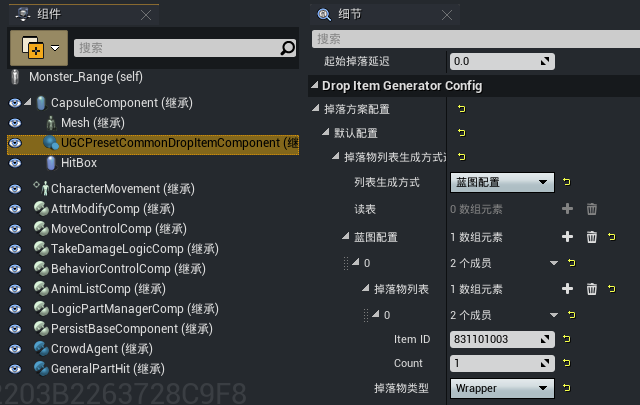
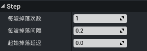

---

### 添加伤害飘字

为怪物添加伤害飘字的效果，在怪物蓝图的 ``TakeDamageLogicComp`` 组件中确认 ``伤害冒字`` 属性处于勾选状态。

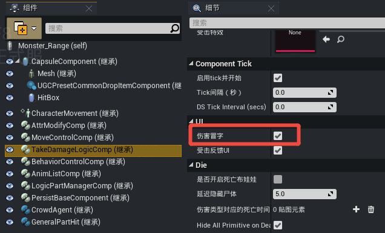

同时打开 ``UGCGameState`` 蓝图，确保 ``Enable Damage Number Pack for Generic Character`` 属性也处于勾选状态。

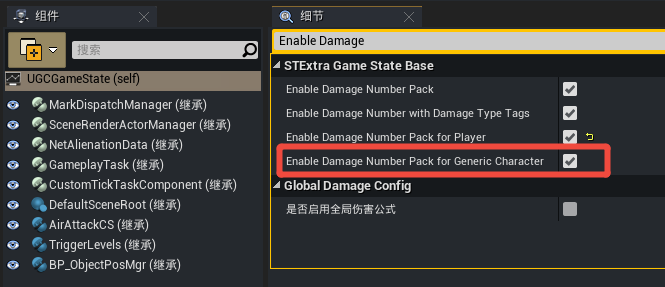

> 如果调试时没有正确显示飘字效果，可参考 [通用伤害飘字](../../../通用功能/20160_通用伤害飘字.md) 的属性说明进行检查

## 怪物调试

点击怪物蓝图菜单栏的【浏览】按钮，内容浏览器将自动跳转到该怪物蓝图所处的目录下。

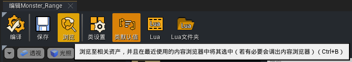
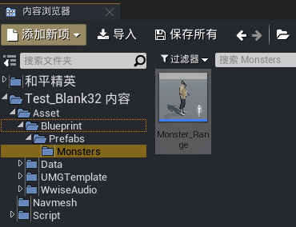

选中怪物蓝图放置到关卡场景的可移动区域范围内，启动 [Debug调试](../../../绿洲编辑器基础内容/调试游戏/307_编辑器Debug调试.md) 观察怪物的行为。

。

怪物默认处于巡逻状态，玩家靠近且在视野范围内时开始追击，当到达 ``追击距离`` 且处于 ``攻击距离`` 范围内时触发攻击行为，由于将怪物的技能替换为近战怪的攻击技能，因此怪物在进入远程攻击范围内时即开始攻击。

如果希望观察怪物实时的行为数据，可以通过 [怪物调试工具](./20161_怪物调试工具.md) 进行进一步的调试。

> ``追击距离`` 执行优先级高于 ``攻击距离``，如果未到达 ``追击距离`` 但满足 ``攻击距离`` 条件，此时并不会打断追击行为，仍会继续移动
