# 修改怪物模型

编辑器内置了包含人形怪物、兽型怪物、机械怪物等多种类型与风格的怪物资源，由于怪物美术资源制作规范的复杂性与性能因素，暂未支持怪物骨骼与模型的自定义制作与导入，目前提供了基于已有怪物资源的换皮与附加模型的功能。

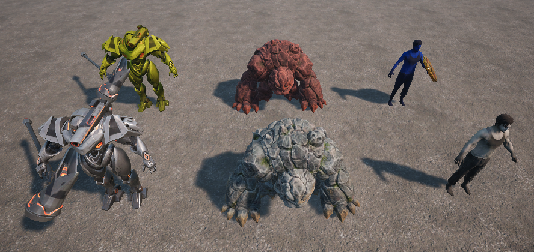

## 怪物换皮

实体编辑器中各类怪物模板的材质均继承自 ``M_UGC_Character`` 或者 ``Master_UGC_Mask_Base`` 制作，开发者可以基于这两个材质创建新的材质实例，通过调整材质实例的颜色参数来达到换皮的效果。

1. 右键 ``材料和纹理 -> 材质实例``，创建新的材质实例资源

	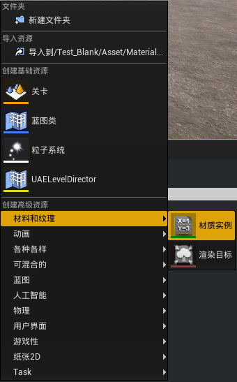

2. 打开材质实例，将 ``Parent`` 母材质设置为 ``Master_UGC_Mask_Base``

	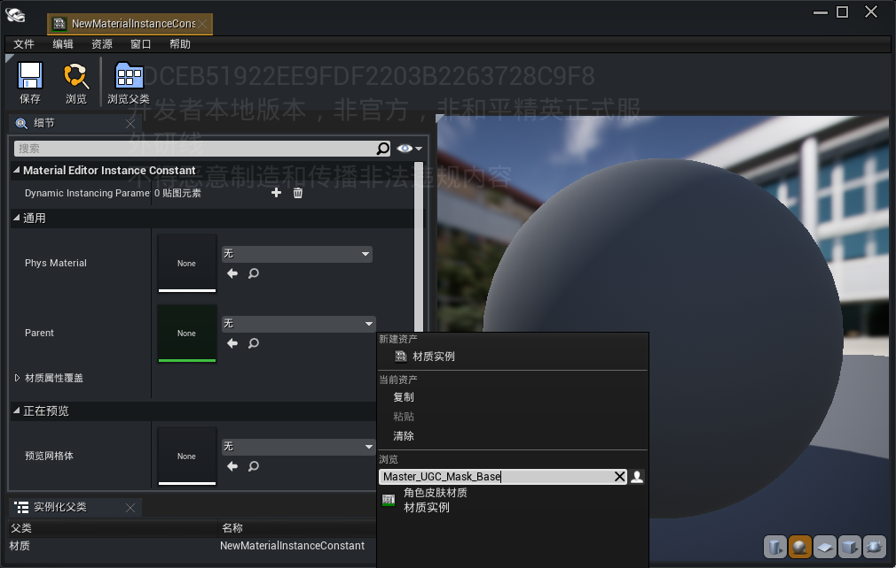

3. 打开目标怪物的原始材质实例，将 ``Texture`` 下的原始色、法线和金属粗糙度等贴图资源复制到新建的材质实例中

	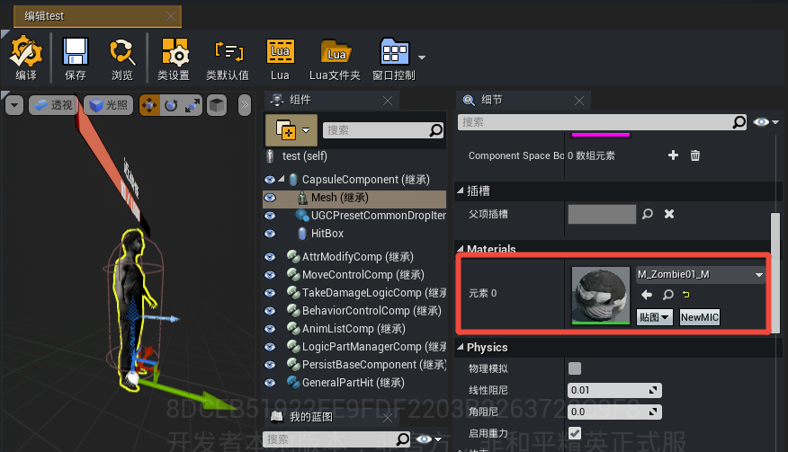
	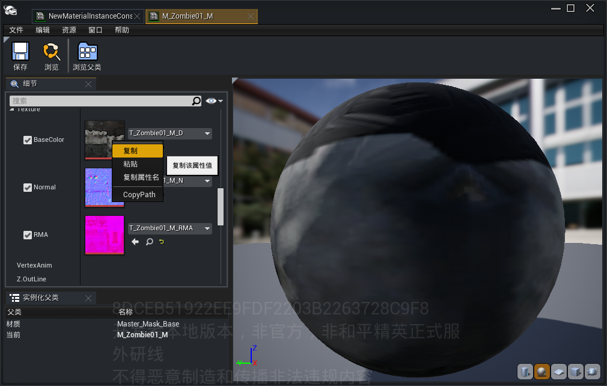

4. 在新材质实例中启用 ``ColorTint`` 参数并调整为合适的颜色

	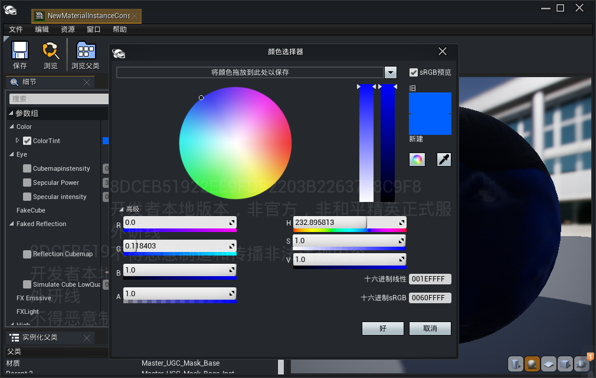

5. 将新材质实例替换至目标怪物Mesh骨骼网格体组件下即完成换皮效果

	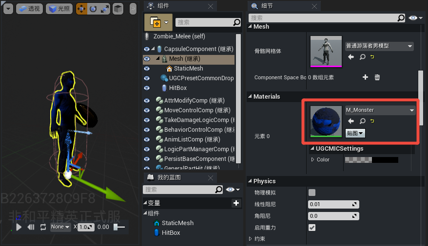

## 部位换色

编辑器对于一些怪物模型使用的材质支持按照部位进行换色，开发者在实体编辑器面板上可以直接查看到当前模型是否支持换色。打开实体编辑器，对于可以换色的怪物模型，细节面板中 ``Material`` 属性下会出现四种颜色。

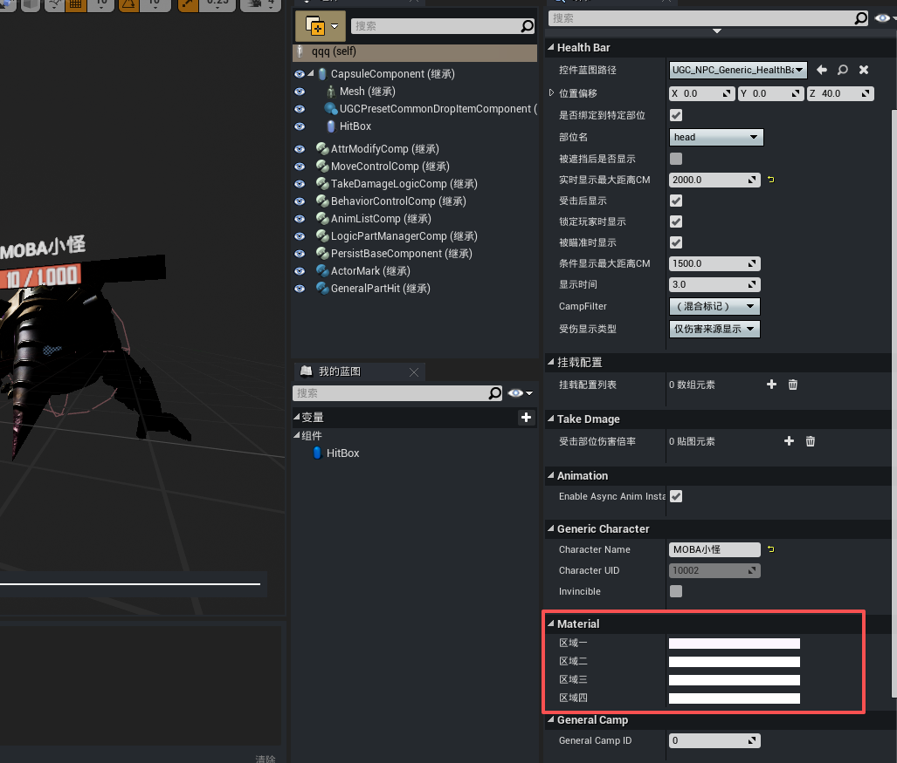

若不支持换色，细节面板中 ``Material`` 属性下则会显示不支持换色。

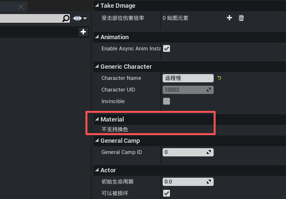

目前支持的换色骨骼有“机器蝎模型”、“后排刺客模型”、“快枪手模型”。

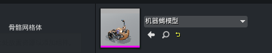
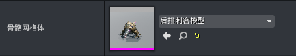
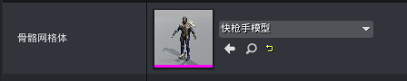

以下是实体编辑器中怪物模板的“后排刺客”为例演示部位换色。对于需要换色的区域，在细节面板中 ``Material`` 属性下点击区域后的按钮即可打开颜色选择器修改部位颜色。

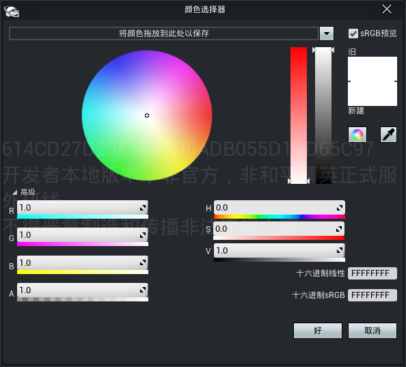

|选定区域|效果图|
|-|-|
|原色|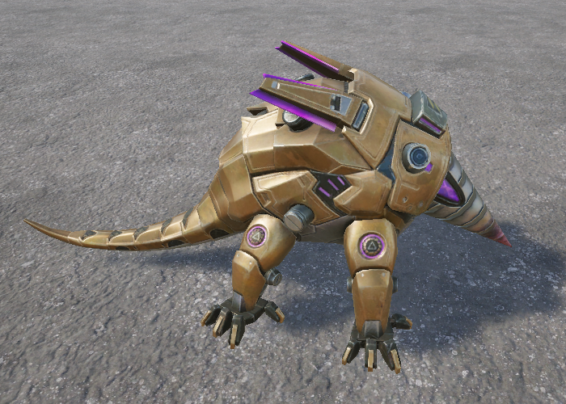|
|区域一|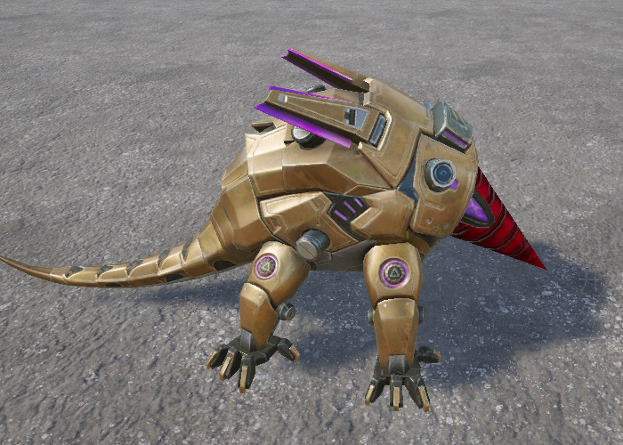|
|区域二|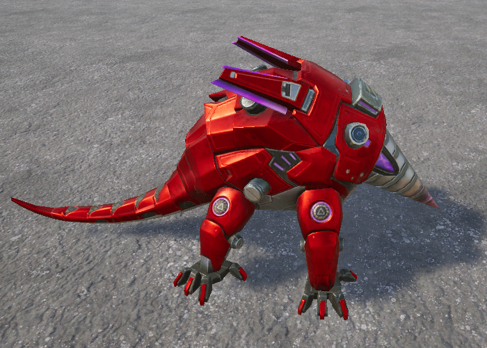|
|区域四|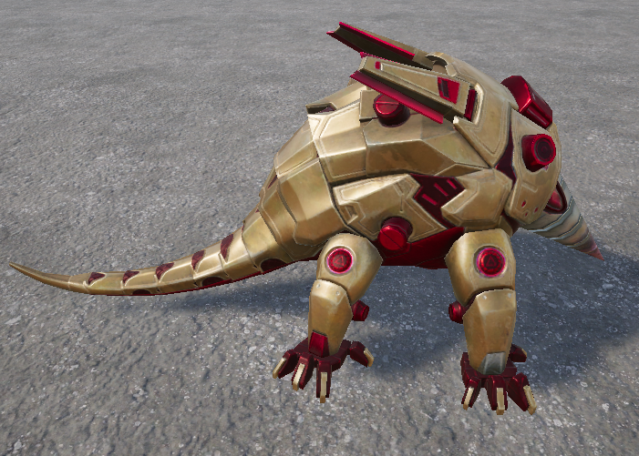|

## 附加模型

怪物蓝图提供了为怪物添加附加模型的功能，可以基于指定部位或者插槽挂载额外的静态模型。

打开怪物蓝图，在 ``挂载配置列表`` 属性下可以添加多组模型配置，每组模型需要指定挂载的部位或者骨骼的插槽名，且可以设置挂载点的偏移量，例如对近战僵尸怪的左手部位添加一个硬币模型。

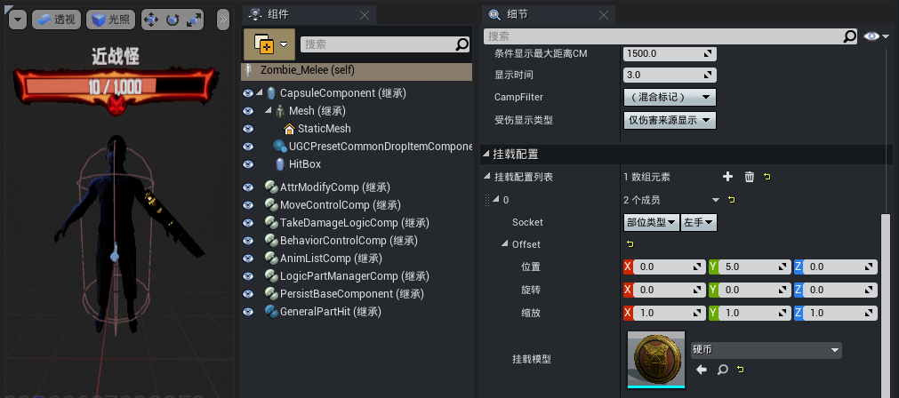

添加成功的模型将作为静态网格体组件追加到怪物的Mesh骨骼网格体组件下。

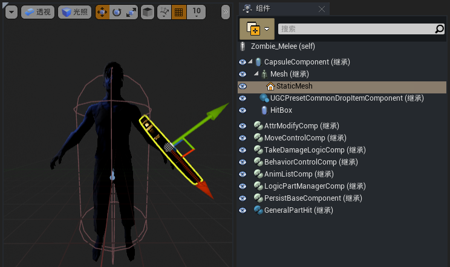
