# 怪物血条

怪物血条通过UI元件的形式提供组件化的使用方式，开发者可以设置血条的样式，同时怪物实体蓝图支持更加自定义的血条显示效果。

## 给怪物配置血条

###  创建怪物血条

在编辑器上方工具栏中打开 **UI编辑器** 。

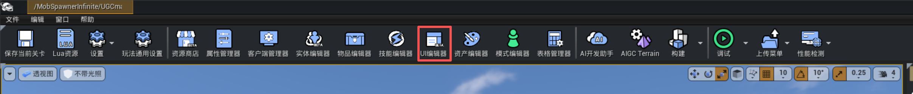

在左侧页签中选中 **元件** ，选择战斗-怪物血条模板创建。

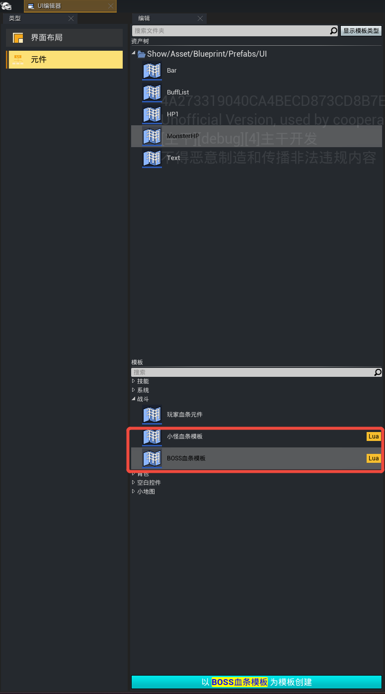

普通小怪血条样式：

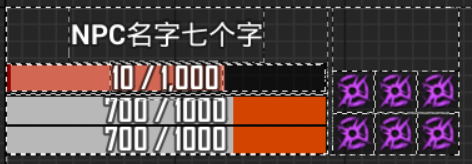

Boss怪血条样式：

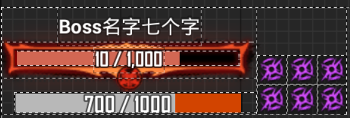

### 配置血条样式

创建血条UI后，点开可以看到其配置项，可以按需求对其进行配置。

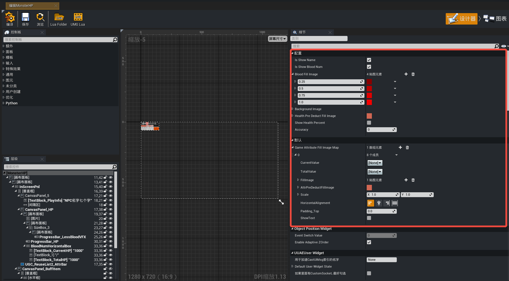

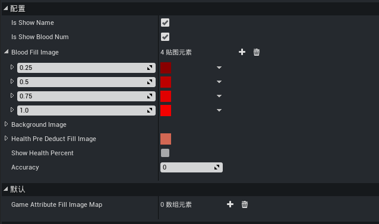

|属性名|属性说明|
|-|-|
|Is Show Name|是否显示怪物的名字，怪物的名字文本由 [怪物蓝图](./20144_怪物快速配置指南.md#创建怪物蓝图) 配置的 ``Character Name`` 属性决定<br>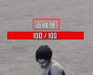|
|Is Show Blood Num|是否显示血条数值，样式为“当前值/最大值”<br>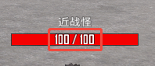|
|Blood Fill Image|一组血量百分比及显示颜色的映射关系，表示当前血量<=此百分比时血条显示的颜色，例如血量低于或等于50%时血条颜色为鲜红色：<br>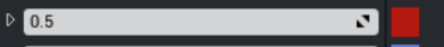|
|Background Image|血条背景图样式<br> 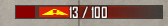 <br> 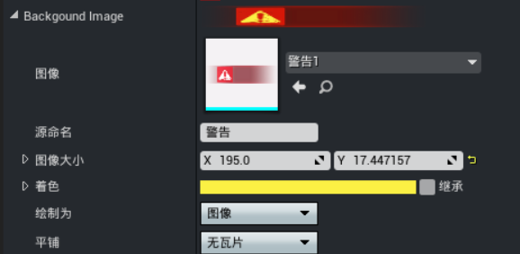
|Health Pre Deduct Fill Image|血条预扣除的颜色样式，即血量实际变化前的预显示颜色，例如预扣除颜色为白色的效果：<br>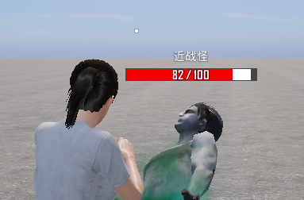|
|Show Health Percent|是否百分比显示血条<br>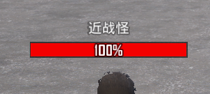|
|Accuracy|开启百分比血条时血条精确保留到小数点后几位<br>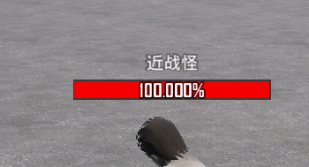|
|Game Attribute Fill Image Map|支持追加显示额外的属性条，需要绑定属性及配置颜色样式，配置内容等同于血条<br>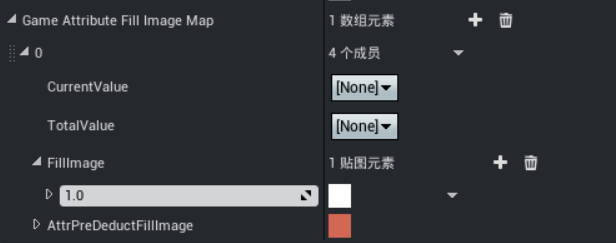|

配置完成后需要编译并保存才能生效。

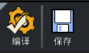

### 为怪物添加血条

通过实体编辑器 [创建一个怪物蓝图](./20144_怪物快速配置指南.md#创建怪物蓝图)，在怪物蓝图【细节】面板的“Health Bar”类别下，将血条组件配置到 ``控件蓝图路径`` 属性上即为怪物赋予了血条功能。

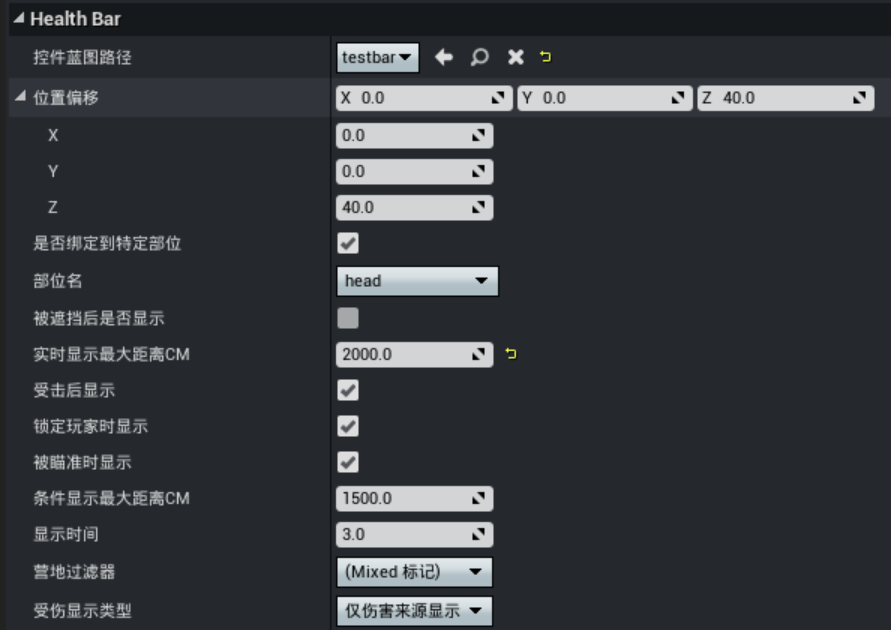

效果如图所示：

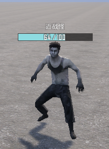

## 设置显示效果

怪物蓝图中除了关联血条元件，还集成了对血条功能的配置项，可以自定义血条的挂载位置、显示距离等多种规则。


|属性名|属性说明|
|-|-|
|控件蓝图路径|血条元件的蓝图类|
|位置偏移|血条显示位置相对于特定部位（绑定了特定部位）或Actor的坐标（未绑定特定部位）的位置偏移|
|是否绑定到特定部位|默认使用怪物Actor的坐标为基础位置，若勾选则将绑定到怪物的指定部位上|
|部位名|血条附着的部位名下拉框选项，默认为head头部<br>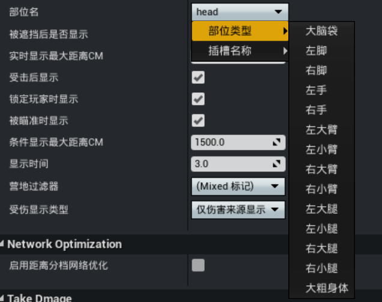|
|被遮挡后是否显示|若勾选，则当怪物被障碍物阻挡时仍会显示血条|
|实时显示最大距离CM|当玩家与怪物的距离小于该值时，血条会一直显示（单位：厘米）<br>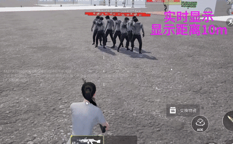<br>目前最多支持同时显示20组怪物血条，超过时优先显示距离玩家最近的怪物血条<br>如果设置为0，就会关闭玩家靠近实时显示血条的功能，但不会影响其他显示血条的方式|
|受击后显示|若勾选，怪物受到攻击后就会显示血条<br>.gif)<br>若不勾选，则怪物受击后不会因此显示血条，不影响到其他的显示规则|
|锁定玩家时显示|若勾选，玩家被怪物锁定或玩家身上有怪物仇恨时，怪物就会显示血条<br>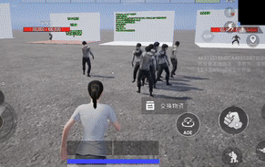<br>若不勾选，怪物锁定玩家后不会因此显示血条，不影响其他显示规则|
|被瞄准时显示|若勾选，怪物被玩家瞄准时会显示血条，若不勾选，怪物被瞄准后不会因此显示血条，不影响其他显示规则|
|条件显示最大距离CM|勾选了 ``被瞄准时显示`` 时生效，触发被瞄准显示的最大距离（单位：厘米），超过这个距离后玩家瞄准怪物不会显示怪物血条<br>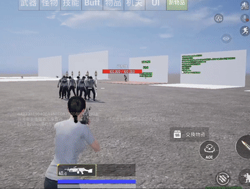|
|显示时间|不满足血条显示的条件时，多长时间内血条消失（单位：秒），包括：怪物未受击、怪物不再锁定玩家、怪物不再被瞄准（包括超出被瞄准时最大显示距离）|
|营地过滤器|基于 [阵营](../角色系统/20095_队伍与阵营.md#阵营系统) 的过滤器，怪物与玩家之间的阵营关系匹配该条件时才会显示血条|
|受伤显示类型|血条可见性目标的范围<br>- 仅伤害来源显示：血条只会对伤害来源的目标显示<br>- 伤害来源同阵营均显示：血条会对伤害来源的同阵营中的所有目标显示|

血条显示的逻辑流程图如下：

<div style="text-align: center;">
	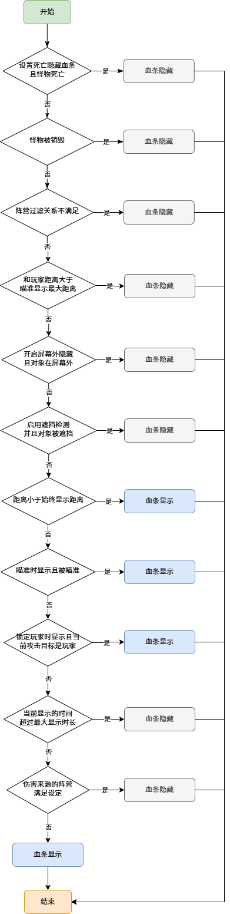
</div>

## 全局血条数量限制

怪物系统支持设置全局可见的血条数量，点击编辑器菜单栏的【玩法通用设置】按钮，在 ``DA_GameModeGeneral`` 数据资产蓝图中找到 ``血条显示最大数量`` 属性，设置并保存后即可生效，当血条显示逻辑流程图判定可显示的血条数量超过该设置值时，将按照距离由远至近逐一剔除血条。

> 全局血条数量设为0代表不显示血条，基于性能考虑，建议开发者设置一个合理值

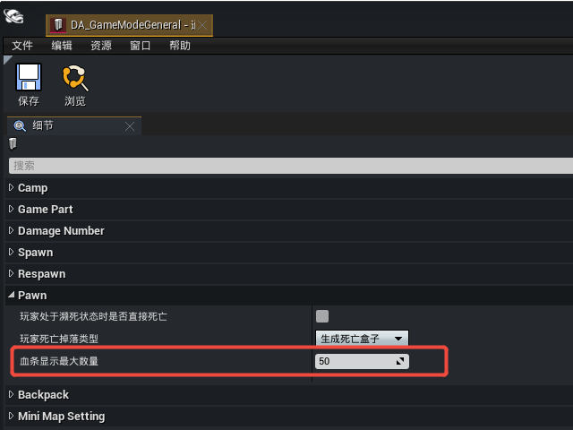

## 自定义血条控件

打开 **UI编辑器** 的类型中找到元件—战斗创建血条模板

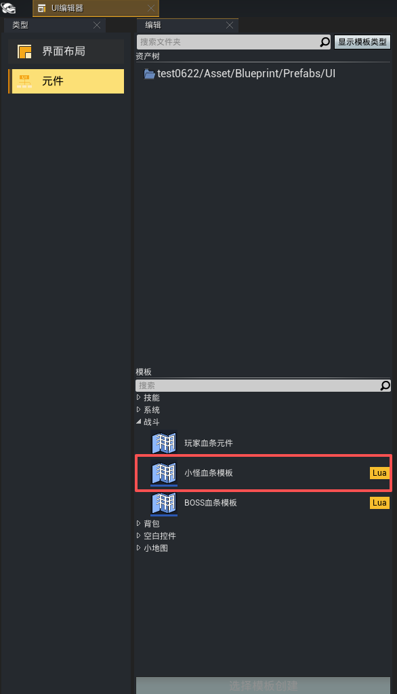

按需求添加所需的控件元素，例如通过子控件的方式引用血条控件（拖动血条控件时需拖进层次结构中），并在其下方添加一行包含文本与图片的水平框控件，新增控件行与血条控件通过垂直框进行上下布局。

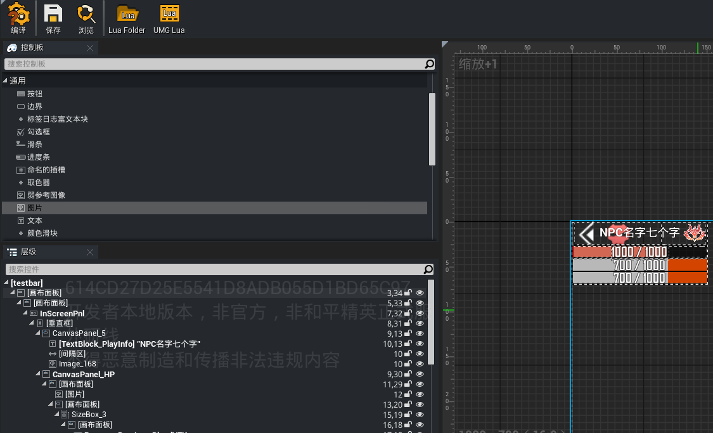

点击 【UMG Lua】按钮，设置血条组件的逻辑实现血条名字，血量的变化。
```lua
---@class testbar:UGCGenericCharacterPositionWidget
local testbar = { bInitDoOnce = false }

-- 角色的名字发生变化
---@param Name FName 变化后的名字
function testbar:BP_CharacterNameChange(InName)
    self:SetName(InName)
end

-- 角色的血量发生变化
---@param InHPCurrent float 变化后的血量
---@param InHPMax float 变化后的血量上限
function testbar:BP_CharacterHPChange(InHPCurrent, InHpMax)
    local Cur = 0
    local Total = 0
    if self.bShowHealthPercent then
        Cur = tonumber(InHPCurrent) or 0
        Total = tonumber(InHpMax) or 0
    else
        Cur = math.ceil(tonumber(InHPCurrent) or 0)
        Total = math.ceil(tonumber(InHpMax) or 0)
    end
    -- logD(string.format("testbar:Event_MobCharacterHPChange, HPCurrent = %s", Cur))
    self:SetBloodText(Cur, Total)
    self:UpdateColor()

    -- 更新虚条
    self.LastTimeRatioValue = (self.LastTimeRatioValue - self.CurPercent) * self.PreDeductPercent + self.CurPercent
    self.NeedTick = true
    self.TotalPieceTime = 0
    self.CurPercent = InHPCurrent / InHpMax
end
-- 初始化参数
function testbar:Event_InitParam()
    ---@field SetStateWidgetPanel:fun(InScreenPanel:UWidget,OutScreenPanel:UWidget,InArrowWidget:UWidget,InDistanPanel:UWidget,InDistanText:UTextBlock)
    self:SetStateWidgetPanel(self.InScreenPnl, self.OutScreenPnl, self.CanvasPanel_Arrow, nil, nil)
    print("[testbar] Event_InitParam")
end

return WBP_Custom1
```
将此控件蓝图绑定至怪物蓝图的 ``控件蓝图路径``，启动调试运行即可观察自定义的控件效果。

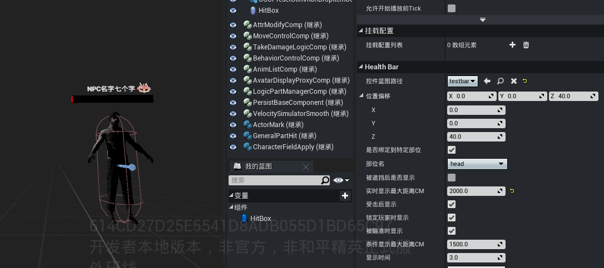
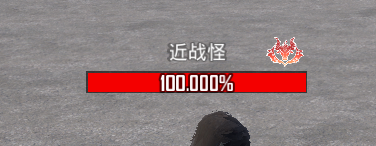

## API参考

### HP 更新

**BP_CharacterHPChange(InHPCurrent, InHpMax)**
>由 BP 层在角色 HP 变化时调用

|参数|类型|说明|
|-|-|-|
|InHPCurrent|number/string|当前血量|
|InHpMax|number/string|最大血量|

- 根据 bShowHealthPercent 决定是否取整
- 调用 SetBloodText() 更新文字 + 颜色 + 进度条
- 重置虚条动画状态（NeedTick=true, TotalPieceTime=0）
- 计算 CurPercent 供 Tick 使用

``` Lua
-- BP 层调用示例
self.MonsterHP_Widget:BP_CharacterHPChange(7500, 10000)
```

**SetBloodText(Cur, Total)**
>核心渲染 — 更新血量文本 + 主条进度 + 颜色

|参数|类型|说明|
|-|-|-|
|Cur|number|当前血量（已格式化）|
|Total|number|最大血量（已格式化）|

### 名称控制

**SetName(Name) / SetBossName(Name)**
>设置怪物/BOSS 名称

``` Lua
self.Widget:SetName("哥布林")
self.Widget:SetBossName("炎龙之王")
```

**SetShowName(Show) / SetShowBlood(Show)**
>全局开关名称或血量数字的显示

|参数|类型|说明|
|-|-|-|
|Show|bool|是否显示|

### 血条颜色

**SetBloodColor(CurrentBlood) / SetFillImage(Fill)**
>根据 HP 比例设置主血条填充颜色

- 内部通过 GetNearKey() 从 BloodFillImage 映射表查找最接近的颜色 Key
- 映射表结构：{ [0.3]=红色SlateBrush, [0.5]=黄色SlateBrush, [1.0]=绿色SlateBrush }
- 查找规则：取所有 ≥ 当前值的 Key 中差值最小的

``` Lua
-- 在 PreConstruct 或初始化时配置 BloodFillImage
-- Key 为 HP 比例阈值，Value 为对应的 SlateBrush
self.HPWidget.BloodFillImage = {
    [0.0] = RedBrush,    -- ≤0% 红色
    [0.3] = OrangeBrush, -- ≤30% 橙色
    [0.5] = YellowBrush, -- ≤50% 黄色
    [0.8] = LightGreen,  -- ≤80% 浅绿
    [1.0] = GreenBrush,  -- 100% 绿色
}
```

### Buff 系统

**SetBuffs(Target)**
>刷新所有 Buff 显示

|参数|类型|说明|
|-|-|-|
|Target|UPersistBaseComponent|角色的持久效果组件|

流程：

- 隐藏所有 6 个槽位
- 通过 GetAllBuffs() 筛选有效 Buff
- 取前 6 个逐个显示并绑定数据

**自动刷新机制**
Preconstruct 时绑定两个消息：

- UGC.PersistEffect.ApplyPersistEffect → 新增 Buff

- UGC.PersistEffect.UnApplyPersistEffect → 移除 Buff

- 任一事件触发 → OnPersistEffectChange() → 自动调 SetBuffs()

### 属性条（复用列表）
**UGC_ReuseList2_AttrBar_OnAfterNewItem(Widget, Idx)**

>复用列表创建子项时的回调

从 GameAttributeFillImageMap 取出配置数据,组装后传给子 Widget 的 OnUpdate(),用定时器设置布局缩放和对齐方式,子项会绑定到 OwnerCharacter 实时读取属性值。

### 箭头指引
**Event_InitParam()**

>向父类注册屏幕内/外面板和箭头引用

**Event_UpdateOutScreen(IsOutScreen)**
>屏幕内外状态变化回调

- 出屏 → 隐藏名称、显示箭头图标

- 入屏 → 显示名称、隐藏箭头图标

## 注意事项

1. 单客户端触发怪物的血条显示后，将同步至其他满足条件的客户端可见
2. 怪物血条显示方式可以使用多种搭配，只要满足任意一个配置方式就可以显示怪物血条，不会因为某个方式没激活或反激活使得别的显示方式不生效
