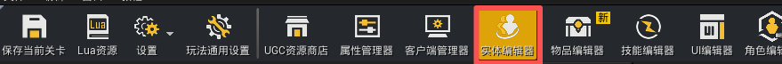
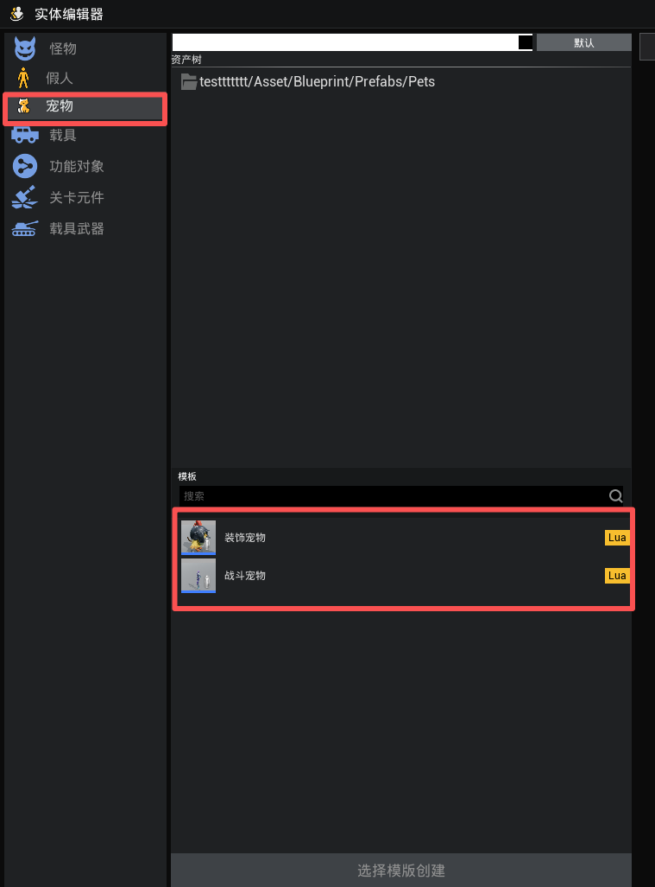
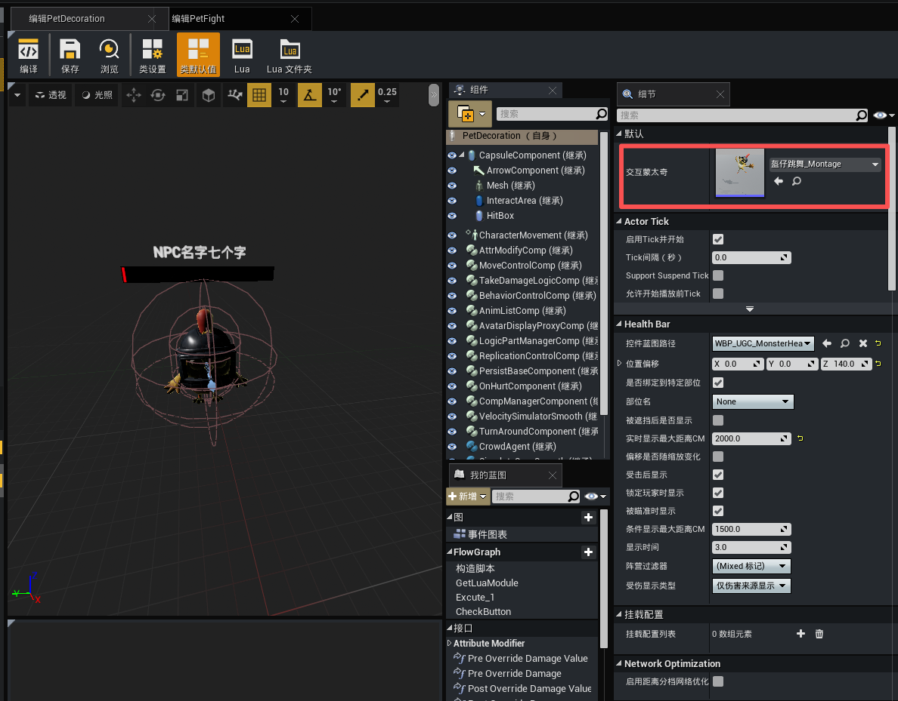
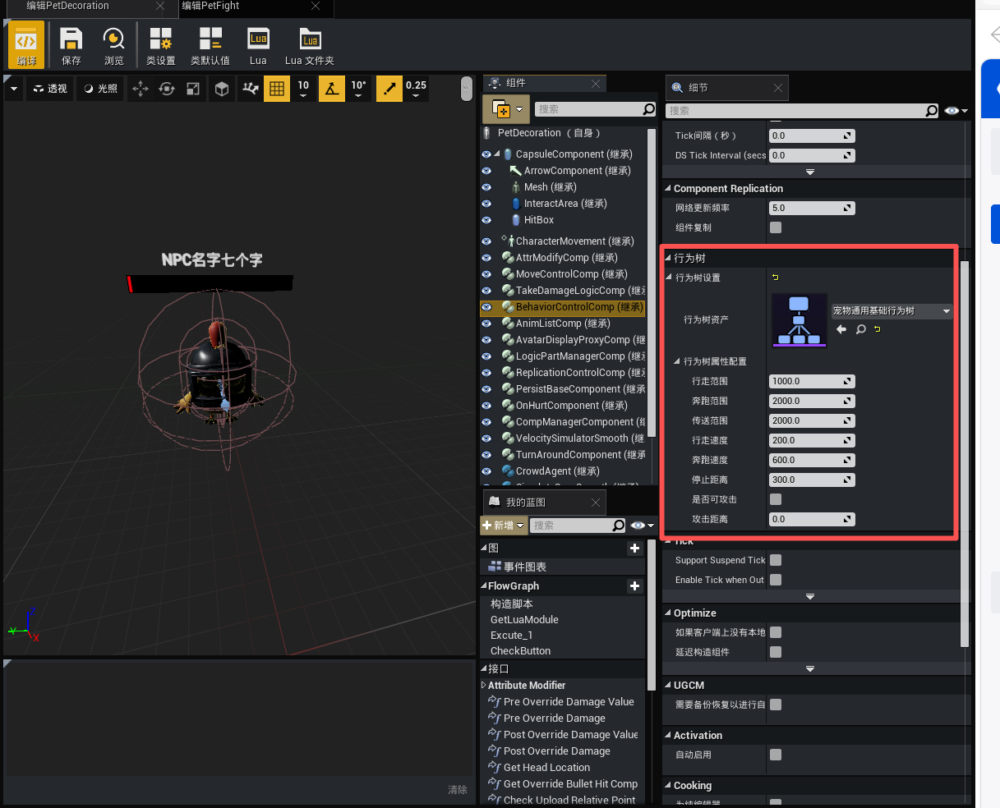
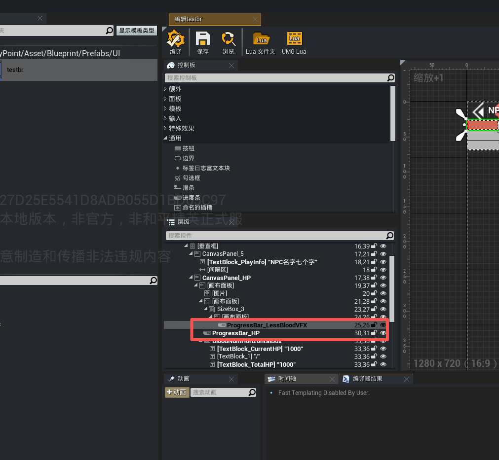
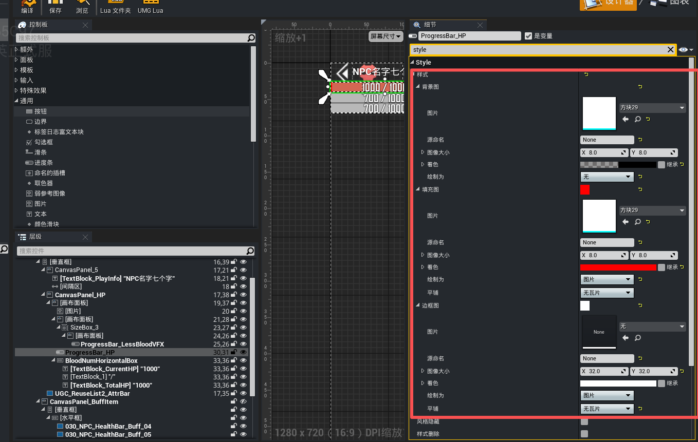

# 宠物模板

本文档将介绍如何配置宠物模板、行为参数，以及血条样式与主人变动通知的接入方式。

## 概述

宠物是UGC编辑器中的一种特殊实体，普通怪物没有显式主人，血条样式按阵营显示；宠物有了显式主人，阵营关系会随主人变化而变化，进而触发血条样式自动切换。宠物本质上是继承了怪物能力的对象，但额外提供了两层能力：

- 跟随与陪伴：默认具备「自动跟随主人」「超出范围传送回主人身边」的行为。

- 主人归属（MobOwner）：宠物在引擎底层继承了通用怪物的 MobOwner 机制，但将其作为显式概念开放给开发者，行为树与血条样式都会基于此关系联动。

## 创建宠物蓝图

编辑器菜单栏点击【实体编辑器】按钮，打开实体编辑器操作界面。



实体编辑器内预置了两个宠物模板，开发者可以根据需求创建或改造，在实体编辑器左侧 **宠物** 页签目录下即可找到这两个模板：
|模板|类型|核心行为|
|-|-|-|
|装饰宠物|装饰陪伴型|跟随主人 → 超范围传送 → 玩家靠近显示交互按钮 → 点击播放 Montage|
|战斗宠物|攻击型|跟随主人 → 仇恨列表中存在敌人则攻击 → 攻击时若远离主人则传回|



## 配置怪物

### 交互Montage配置

装饰型宠物默认绑定了一个交互 Montage，开发者可在细节面板的默认配置的 **交互蒙太奇** 中替换：



### 行为树配置

所有宠物默认共享同一棵行为树 **宠物通用基础行为树(BT_UGC_Pet_Follow)** ，参数配置在宠物蓝图的细节面板「行为树 → 行为树属性配置」中：



其中各个参数的含义如下：
|参数|含义|
|-|-|
|行走范围|距主人小于此值时用行走速度移动|
|奔跑范围|距主人介于「行走范围」与「传送范围」之间时用奔跑速度移动|
|传送范围|距主人大于此值时直接传送回主人身边||
|行走速度|宠物行走时的速度||
|奔跑速度|宠物奔跑时的速度||
|停止距离|	距主人小于此值时停止移动|
|是否可攻击|勾选后宠物会选择仇恨列表中的敌人攻击|
|攻击距离|有攻击目标时需移动到的释放距离|

### 血条样式配置

血条样式在蓝图侧配置，在运行时按玩家与宠物的阵营关系自动切换。首先创建[怪物血条](./20412_怪物血条.md#创建怪物血条)，细节面板中可以找到两个样式字典：Progress Bar HP Style — 主血条样式；Progress Bar Less Blood VFX Style — 虚条（预扣除伤害）样式。



每个字典以玩家与宠物的阵营关系为 Key，分为三档：

|阵营关系	|典型场景|
|-|-|
|Enemy（敌对）|敌方阵营玩家的宠物、敌人怪物|
|Neutral（中立）|中立怪物、双方可攻击的野怪|
|Same（同阵营）|我方宠物、友方 NPC|



**运行时切换逻辑**

切换由 WBP_UGC_MonsterHealthBar（WBP_UGC_BossHealthBar 结构相同）中的两个函数完成：

- 触发时机一：阵营 ID 变化时
	 ``` Lua
	 function MonsterHealthBar:BP_OnGeneralCampIDChanged()
			self:RefreshProgressBarStyle()
	end
	```
- 触发时机二：血条初始化时
	``` Lua
	function MonsterHealthBar:Event_InitParam()
    	self:SetStateWidgetPanel(...)
    	self:RefreshProgressBarStyle()  -- 首次出现按当前阵营关系选样式
	end
	```
- 切换核心实现
	``` Lua
	function MonsterHealthBar:RefreshProgressBarStyle()
			local LocalPlayerPawn = UGCGameSystem.GetLocalPlayerPawn()
			if not UE.IsValid(LocalPlayerPawn) then return end

			-- 取玩家与宠物的阵营关系（Enemy / Neutral / Same）
			local CampRelation = LocalPlayerPawn:GetGeneralCampRelationWithActor(self.OwnerCharacter)

			-- 查字典，取对应样式
			local HPStyle = self.ProgressBar_HP_Style:Find(CampRelation)
			if HPStyle then
					self.ProgressBar_HP.WidgetStyle = HPStyle
			end

			local LessBloodVFXStyle = self.ProgressBar_LessBloodVFX_Style:Find(CampRelation)
			if LessBloodVFXStyle then
					self.ProgressBar_LessBloodVFX.WidgetStyle = LessBloodVFXStyle
			end
	end
	```

>血条样式不直接监听 MobOwner，而是监听阵营关系（GetGeneralCampRelationWithActor）
阵营关系变化时（如主人切换、魅惑、归属变更），BP_OnGeneralCampIDChanged 自动触发 → 样式自动更新
同一血条控件两套字典都要配（主血条 + 虚条），否则会留空

### 主人变动通知
宠物对开发者暴露了 `MobOwner` 接口，可以在脚本中监听主人变更、主人死亡、主人下线等事件。

**核心 API**
|API|说明|
|-|-|
|GetMobOwner()|获取当前主人引用，无主人返回 nil|
|SetMobOwner(Character)	|设置主人，传 nil 表示清空；仅服务端可调用|
|OnGenericMobOwnerChanged	|主人引用变化时触发的委托（含设置新主人、清空、主人销毁）|

**监听主人变更**

``` Lua
-- 服务端 + 客户端
function MyPet:BeginPlay()
    self.OnGenericMobOwnerChanged:Add(self.OnOwnerChanged, self)
end

function MyPet:OnOwnerChanged()
    local owner = self:GetMobOwner()
    if owner then
        print("主人变为:", owner.CharacterName or "Unknown")
        -- 切换 UI / 重置 AI 行为 / 切换阵营逻辑
    else
        print("主人被清空")
        -- 变回中立、停止跟随、停止攻击
    end
end

function MyPet:EndPlay()
    self.OnGenericMobOwnerChanged:Remove(self.OnOwnerChanged, self)
end
```

**设置与清空主人**

``` Lua
-- 服务端：玩家召唤宠物时绑定主人
local pet = World.SpawnActor(BP_UGC_Pet_Fight, spawnPos)
pet:SetMobOwner(playerPawn)

-- 解除召唤 / 主人下线后会自动清空（系统已处理，无需手动 SetMobOwner(nil)）
```

**监听主人状态事件（GMP 消息）**

如果需要按原因做不同响应（死亡 复活 退出 / 掉线），可通过 GMP 全局消息精确监听：

|GMP 消息|触发场景|回调参数|
|-|-|-|
|UGC.PlayerPawn.PawnDefeat	|主人死亡|VictimPlayerKey, InstigatorPlayerKey, DamageType|
|UGC.PlayerPawn.PawnRespawn|主人复活|PlayerKey|
|UGC.Player.Exit|主人主动下线	|PlayerKey|
|UGC.Player.PlayerLost|主人掉线|PlayerKey|
|UGC.Player.PlayerReconnect	|主人重连|PlayerKey|

- 示例：宠物跟随主人时按主人状态调整行为
``` Lua
function MyPet:RegisterOwnerListeners()
    local ctx = self
    self.OwnerPlayerKey = self:GetMobOwner().PlayerKey or 0
    if self.OwnerPlayerKey == 0 then return end

    -- 主人死亡：暂停 AI
    UGCGenericMessageSystem.ListenGlobalMessage(
        ctx,
        UGCGenericMessageSystem.Messages.UGC.PlayerPawn.PawnDefeat,
        self, function(VictimPK, _, _)  -- 修正回调签名以匹配 GMP
            if VictimPK == self.OwnerPlayerKey then
                self.AI_SetEnabled(false)
                self.PlayAnimation("pet_mourn")
            end
        end
    )

    -- 主人复活：恢复 AI 并传送回身边
    UGCGenericMessageSystem.ListenGlobalMessage(
        ctx,
        UGCGenericMessageSystem.Messages.UGC.PlayerPawn.PawnRespawn,
        self, function(PlayerKey)
            if PlayerKey == self.OwnerPlayerKey then
                self.AI_SetEnabled(true)
                self.PlayAnimation("pet_idle")
            end
        end
    )
end
```
>注意：GMP 是全局广播，必须用 PlayerKey == self.OwnerPlayerKey 过滤，否则会响应到所有玩家的事件

主人销毁时系统会自动清空 MobOwner 并触发委托，开发者无需手动监听 EndPlay。
