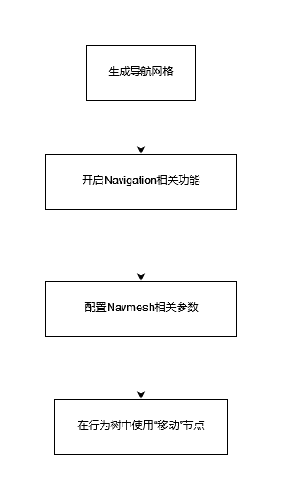
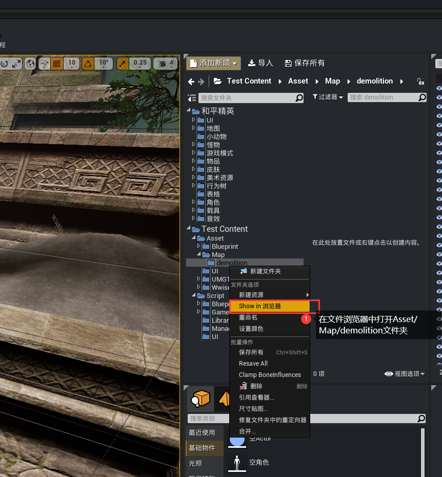
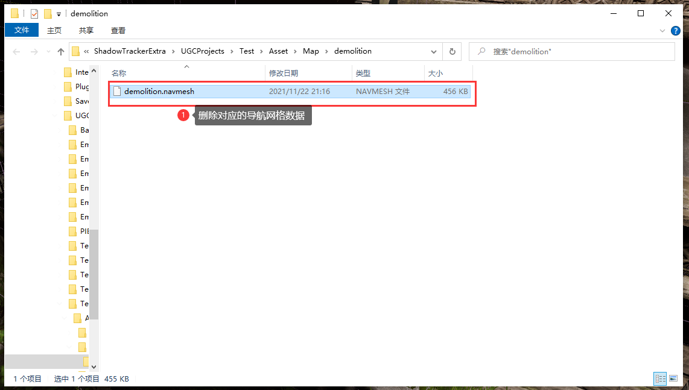
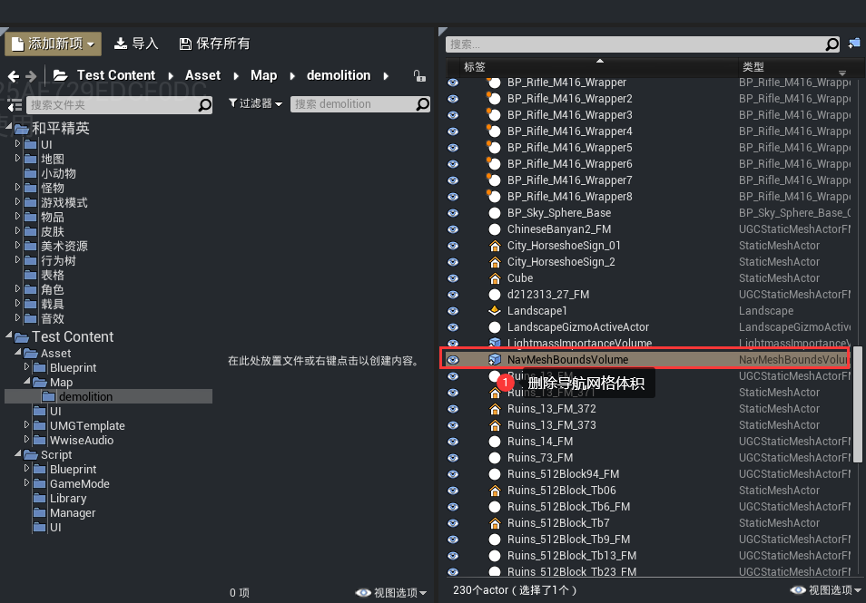
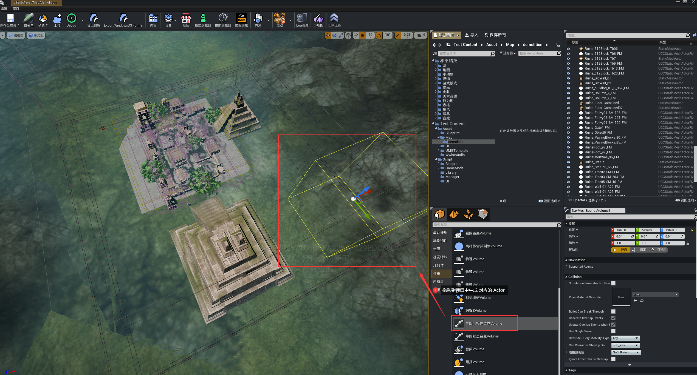
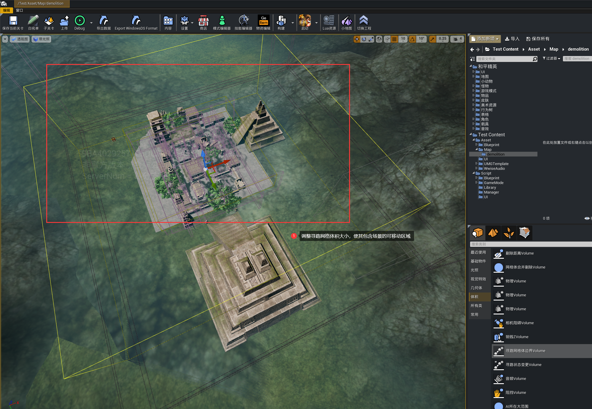
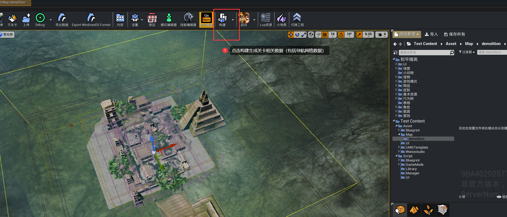
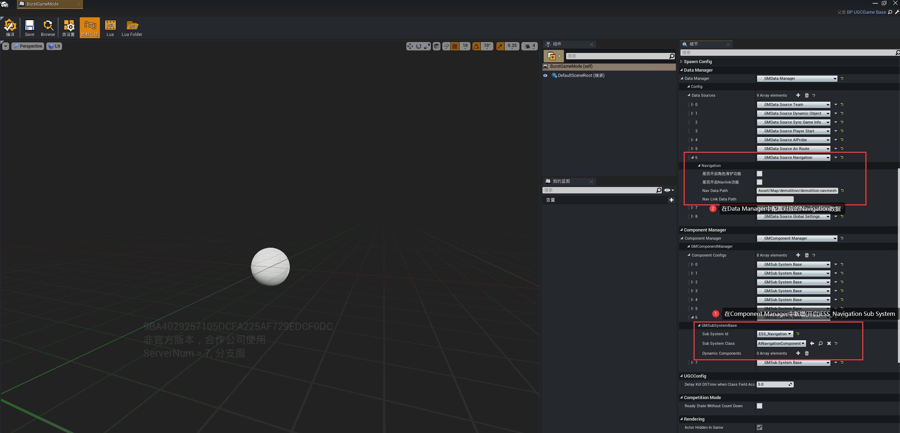
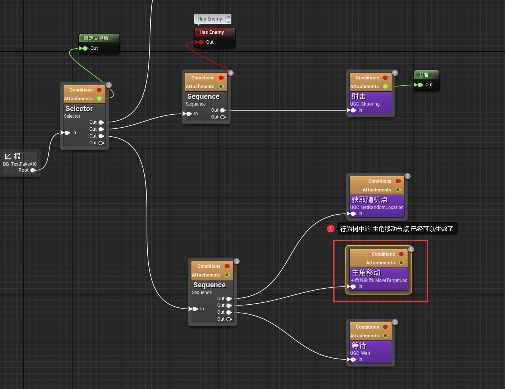

# 使用导航网格(NavMesh)

想让游戏中的动态物体能够自动寻路，就少不了使用导航网格(NavMesh)技术，下面会逐步介绍如何使用导航网格技术让你的怪物“动起来”。

---

## 流程

---

## 实战演练

#### 准备工作

1.以系统模板 Template_demolition 创建工程。

2.由于该工程下demolition地图的navmesh已经烘焙完成，我们删除Asset/Map/demolition文件夹中的demolition.navmesh：

3.调试游戏，会发现在游戏中，NPC已经无法移动。

4.在世界大纲视图中删除导航网格体积，构建项目后，启动游戏，会发现在游戏中，NPC依然无法移动。这是因为我们删除导航网格体积间接调整了地图生成的导航网格数据。

#### 实战

1.拖动 放置Actor面板 中的 体积 -> 寻路网格体边界Volume 到 视口中，生成对应的Actor。

2.调整寻路网格体积大小，使得覆盖整个场景的可移动区域。

3.点击构建，生成Navmesh数据。其中Navmesh数据会生成在和在一个和关卡同一个目录，并且和关卡同名的文件夹中。

例如Asset/Map/demolition.umap会生成Asset/Map/demolition/demolition.navmesh 的数据

4.打开Asset/Blueprint/BurstGameMode，并设置开启Navigation功能，设置对应的参数：

其中Nava Data Path就是刚才生成的Navmesh数据的位置
5.现在你已经可以在AI中使用相关的移动节点了(比如使用 主角移动 节点）

6.启动游戏，你会发现NPC已经可以移动了。
