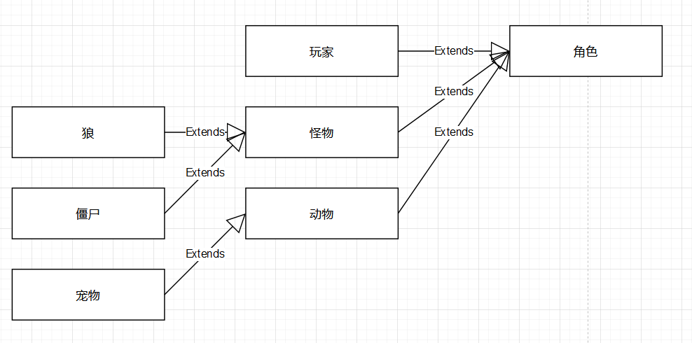
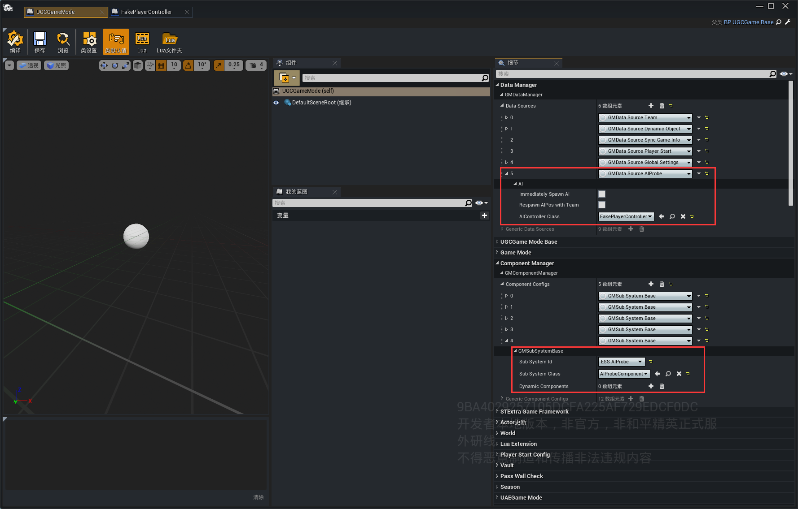
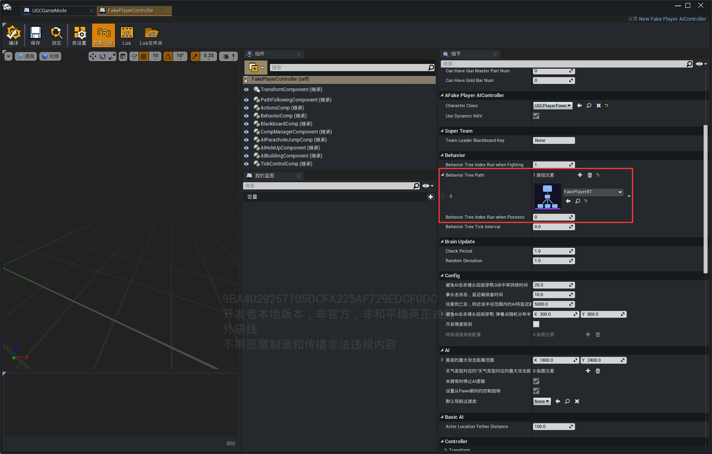
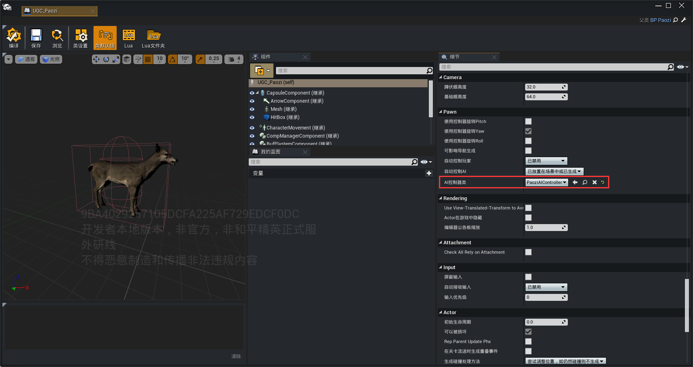
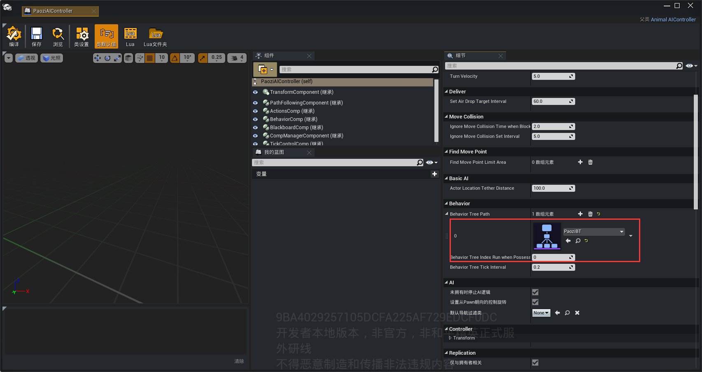

# 利用和平的角色拓展玩法内容

## 简介

在绿洲启元编辑器中，我们可以复用和平精英已经制作好的角色丰富自己的玩法。

## 角色框架

在和平精英中，角色分成 玩家，怪物和动物三大类，怪物有狼，僵尸，动物里面还有鹿，狍子等，可参考：



## 制作规范

根据角色框架，Pawn，AIController，会影响BT能够生效的节点，一般说来，角色类型决定了Pawn,AIController的基类，和能够使用的BT节点，参考：

| 类型 | Pawn父类(间接) | AIController父类 | 支持的和平BT节点 |
| ------ | ------ | ------ | ------ |
| 玩家(机器人) | STExtraPlayerCharacter | New Fake Player AIController | 通用，角色，玩家 |
| 怪物 | STExtraSimpleCharacter | Mob AIController | 通用，角色，怪物 |
| 动物 | STAnimalCharacter | Animal AIController | 通用，角色，动物 |

注：

1.复用和平的角色，尽量直接继承已经配置好的pawn蓝图类(例如： 和平精英/怪物/狼/Wolf/SC_WereWolf/BPPawn_Escape_WereWolf1.BPPawn_Escape_WereWolf1_C)，没有额外需求，尽量少的直接继承STExtraPlayerCharacter，STExtraSimpleCharacter，STAnimalCharacter这些类。

2.制作机器人的时候，可以直接复用UGCPlayerPawn

## 机器人

#### 配置规范

1.在GameMode中 配置GMComponentManager 和 GMDataManager，并在GMData Source AIProbe中配置AIController



2.在AIController中 配置 BT 和 Character



#### 使用方法

参考：

```lua
local AIPlayerKey = UGCFakePlayerSystem.GetRandomAIPlayerKey()
UGCFakePlayerSystem.SpawnFakePlayer(AIPlayerKey)
```

## 怪物和动物

#### 配置规范

1.在pawn中配置controller



2.在controller中配置BehaviorTree



## 注意事项

1.使用和平的AIController不需要在脚本中runBT，和平的AIController会自动的运行BehaviorTree

2.如果不使用和平的AIController，有些BT节点不能保证有效

3.部分节点生效还需要有其他正确的配置，比如移动相关节点，还需要正确配置Navigation

## 附件

<a href="https://cgugc-video-test-1258633575.cos.ap-shanghai.myqcloud.com/wiki_picture/FakePlayerDemo.zip">FakePlayerDemo.zip</a>
<a href="https://cgugc-video-test-1258633575.cos.ap-shanghai.myqcloud.com/wiki_picture/AnimalAndMonster.zip">AnimalAndMonster.zip</a>
