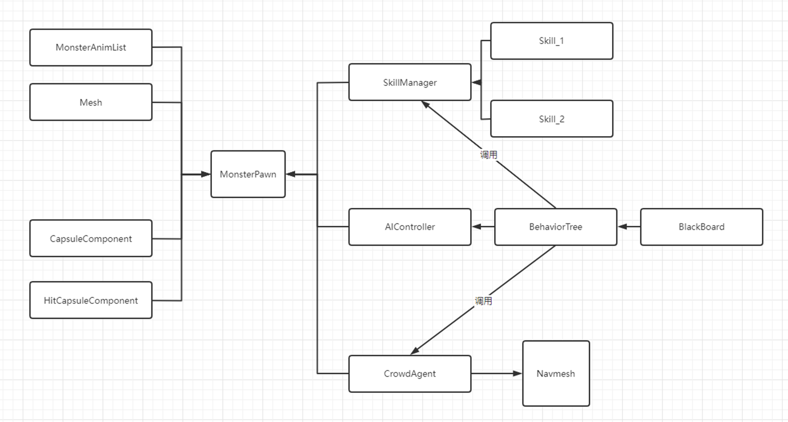

#  框架介绍

## 大致框架图

## 几个主要模块

### 模型+动画

- 模型，动画蓝图，动画列表为配套配置
- 模型和动画蓝图必须配套对应，动画列表可以根据实际情况，配置不同状态下的动画

### 碰撞体积，被击体积

- CapsuleComponent决定了碰撞体积
- HitCapsuleComponent决定了被击体积

### 技能管理器

- 技能管理器上配置了所有怪物可以释放的技能

### Ai控制器，行为树

- 行为树控制怪物所有的ai逻辑，黑板提供了变量功能

### 移动代理，寻路网格

- 负责让怪物在场景中移动起来，寻路网格标识了哪些区域是可行走的，哪些区域不可行走
