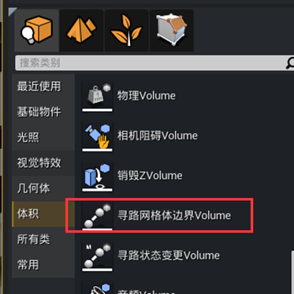
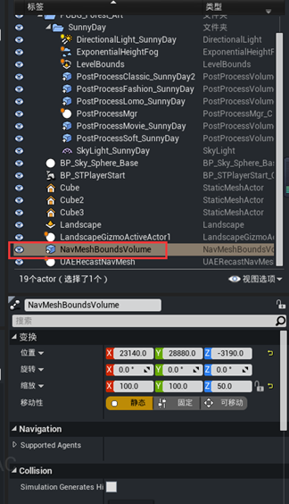
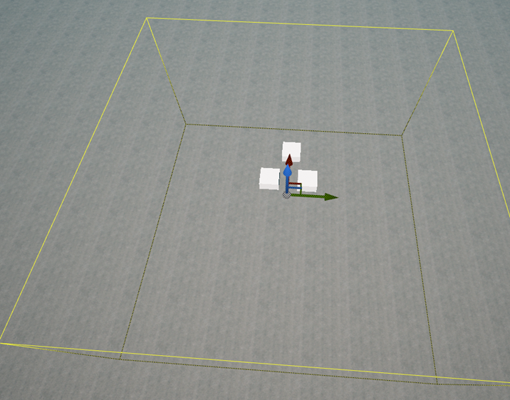
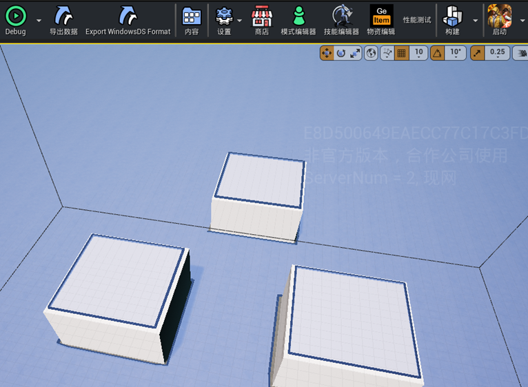
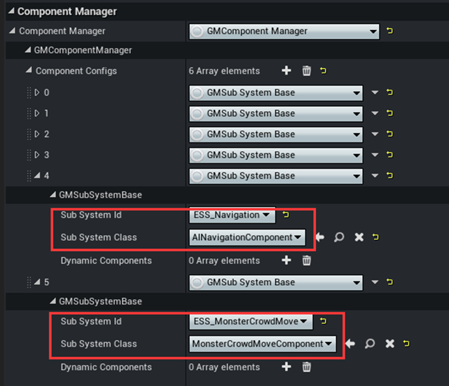
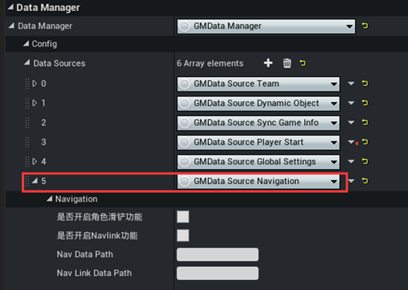

# 寻路网格烘焙以及组件配置

此教程仅为流程操作教程，更详细的寻路网格教学参见对应的Wiki文档

## 配置地图烘焙区域

---

- 体积中找到寻路网格体边界Volume

- 场景中编辑Volume的大小，让其包含需要烘焙的地图区域 

- 点击构建按钮，等待片刻寻路网格烘焙完成，编辑器中会绘制出可行走区域 

## 配置GameMode中NavMesh相关组件

---

- `GameMode`中`ComponentManager`中添加`ESS_Navigation`以及`ESS_MonsterCrowdMove`

- `GameMode`中`DataManager`中添加`Navigation`

