# 法术场

法术场是基于区域检测机制的持续性技能效果对象，通常适用于场景类技能效果的表现，例如毒雾陷阱、火龙卷、治疗泉水等等，技能编辑器封装了一套可配置化的法术场技能框架，并提供了多种蓝图模板帮助开发者快速实现法术场功能。

## 法术场概述

法术场作为一种特殊的技能效果，具有以下特征：

- 区域范围：范围通常是一个固定的区域（例如圆形或矩形），且效果作用于区域内的所有有效目标上，而非特定的单体目标
- 持续存在：法术场生成后不会立即消失，而是持续存在一段时间
- 周期性触发：以固定的频率周期性检测区域内的有效目标并执行效果的触发

### 基础框架

基于法术场的特征，以事件驱动的架构模式实现了法术场的框架，一个完整的配置框架由基础属性、区域检测、触发事件与执行动作等核心模块组成。

**基础属性**

法术场包含持续时间和检测间隔等基础属性，用以决定法术场的生命周期和效果触发频率。

**区域检测**

通过碰撞体组件决定法术场的区域范围，区域重叠检测组件对区域内的目标按指定的过滤条件进行筛选，选取结果即为法术场效果的作用目标。

**触发事件**

法术场提供了一批特定的事件，当事件触发时执行指定的动作行为以实现目标效果，即触发事件决定了动作的执行时机。

**执行动作**

当特定事件触发时需要执行的具体动作行为，目前法术场可执行的动作为释放技能或者添加Buff。

---

### 蓝图结构

法术场蓝图主要由 ``Collision（碰撞体）组件``、粒子特效、技能组件和区域重叠检测组件组成。

[碰撞体组件](https://dev.epicgames.com/documentation/unreal-engine/collision-overview?application_version=4.27&lang=zh-CN) 用于定义碰撞的检测范围，根据检测范围形状的不同分为 ``BoxCollision（立方体碰撞体）``、``CapsuleCollision（胶囊体碰撞体）`` 和 ``SphereCollision（球体碰撞体）`` 三种简单碰撞体。

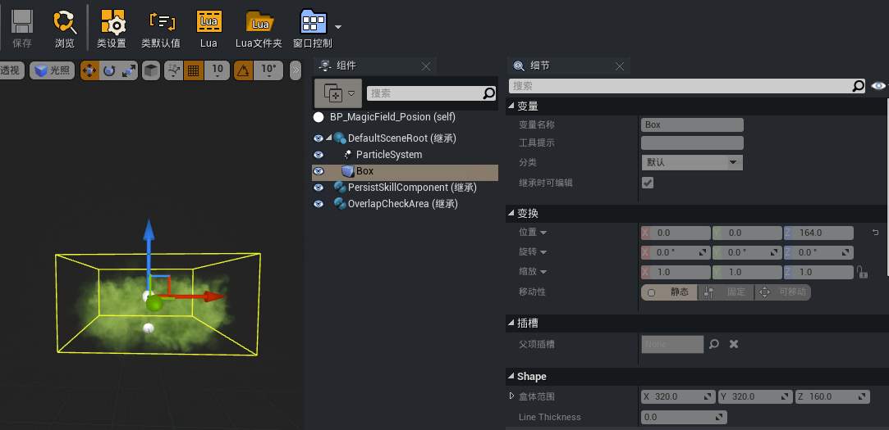

法术场根组件下可以挂载粒子特效组件，用于体现法术场的具体形态或者特效表现。

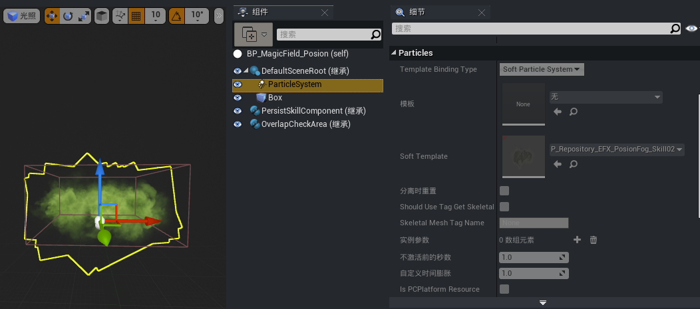

由于法术场可执行技能或者Buff效果，因此需要添加技能组件以保证技能逻辑的执行和同步。

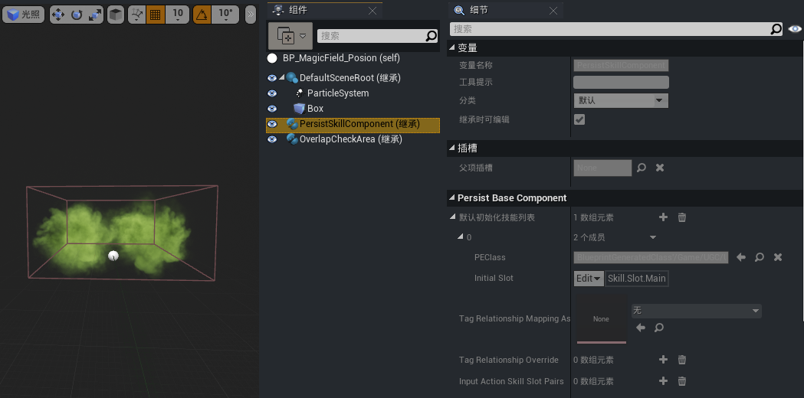

区域重叠检测组件基于碰撞体组件的范围进行目标检测，决定法术场效果的作用目标结果。

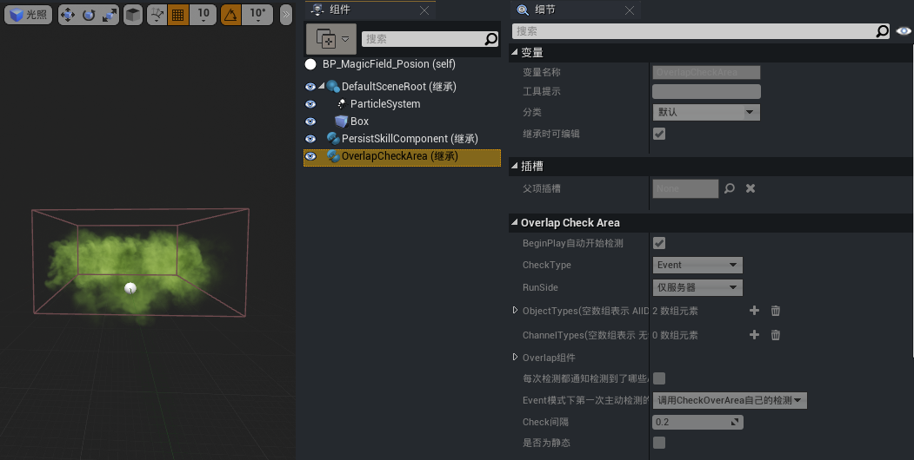

## 法术场模板

根据法术场效果的特性，提供了伤害场、治疗场、陷阱及发射抛体等四类模板，开发者可以基于特定模板或者空模板创建法术场蓝图并配置需要的功能效果。

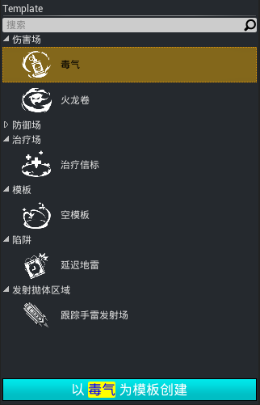

【伤害场】

以毒气为例，会在指定地点生成一团毒气，并对进入毒气范围内的敌人造成持续伤害。

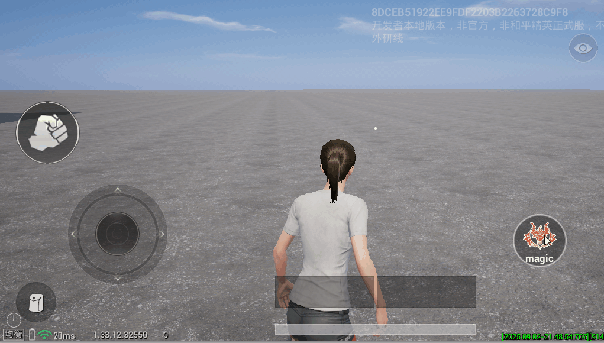

【治疗场】

对进入治疗场范围内的同伴进行持续治疗。

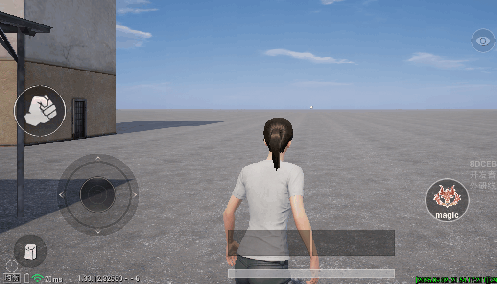

【陷阱】

对进入陷阱范围内的目标造成伤害和眩晕效果。

## 创建法术场蓝图

开发者可以基于法术场模板创建法术场蓝图，以创建火龙卷类型的法术场为例：

1. 打开技能编辑器，切换至【区域】页签，从“法术场模板”窗口中选择 ``火龙卷``，下方“选择模板创建”按钮将高亮显示，并更名为“以 ``火龙卷`` 为模板创建”

	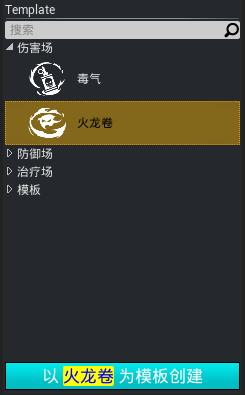

2. 点击“以 ``火龙卷`` 为模板创建” 按钮，弹出输入名称弹窗，输入法术场名称并点击确定

	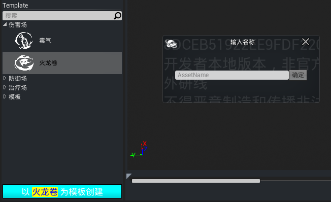

3. 新建的法术场将显示在“工程法术场资源”窗口中，且法术场蓝图创建于 ``Asset/Blueprint/Prefabs/Regions`` 路径下

	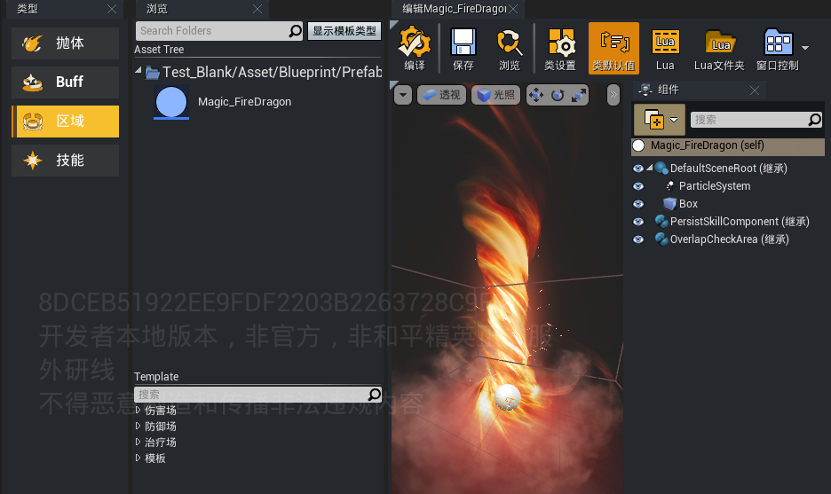

## 法术场配置详解

### 基础属性

法术场的基础属性决定存在的时长及效果的触发频率。

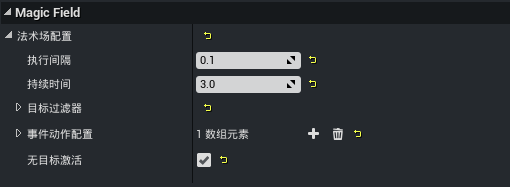

- 执行间隔：法术场的检测间隔时间，决定目标选取的频次和持续事件的触发频率
- 持续时间：法术场存在的时间，超过该时间后，法术场将被直接销毁
- 无目标激活：若勾选，则未选取到目标也可以触发事件对应的动作
- 创建类型：定义此法术场的创建方式
	- 由技能创建：通过技能/抛体释放法术场
	- 由自身创建：放置在关卡场景中生成，该方式生成的法术场无Owner
- 默认阵营ID：``创建类型`` 选择“由自身创建”时生效，为法术场分配一个阵营ID，此ID将作为后续 ``释放技能`` 动作时执行选取或者相关逻辑处理的的阵营值

### 区域检测

法术场支持自定义添加碰撞体组件，可以通过点击【添加组件】自行添加合适形状的碰撞体，调整碰撞体的大小以适配法术场的范围。

> 若无特殊需求，建议将碰撞通道预设置为 ``OverlapAllDynamic``

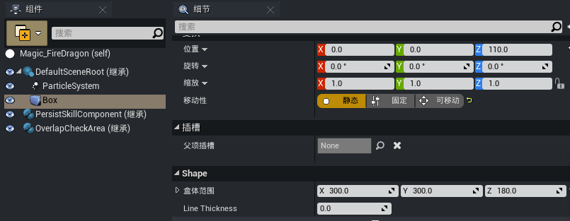

确保法术场配置了区域重叠检测组件并关联碰撞体组件，模板默认配置了区域重叠检测组件，如有需要可以通过点击【添加组件】自行添加。

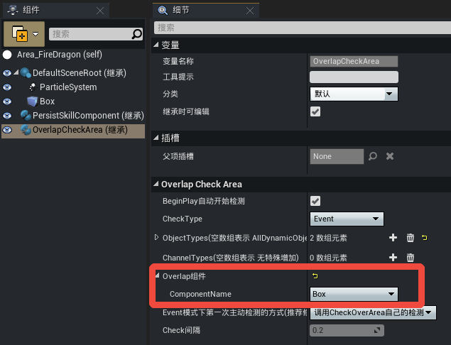

- BeginPlay自动开始检测：是否该组件启动BeginPlay时就进行检测
- CheckType：基于碰撞事件回调做检测还是Tick每帧检测，不推荐使用Tick，会有额外的性能消耗
- ObjectTypes：检测的Actor类型，不填代表所有Dynamic对象
- ChannelTypes：检测的碰撞通道类型，若有特殊需要可自行配置
- Overlap组件：选择需要用于区域检测的碰撞体组件
- Event模式下第一次主动检测的方式：``CheckType`` 为“Event”时第一次主动检测使用的组件，建议与模板的默认配置保持一致
- Check间隔：基于Tick检测模式下的检测时间间隔，仅针对 ``CheckType`` 为“Tick”时生效

### 碰撞过滤器

法术场应用了 [过滤器](../../../通用功能/20218_通用过滤器.md) 实现碰撞结果的筛选，符合过滤要求的碰撞单位才会受到法术场的效果影响。

### 触发事件

法术场提供了一批事件，以支持事件驱动动作的执行。

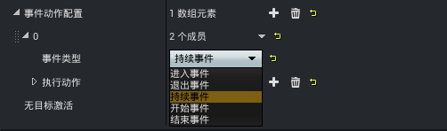

- 进入事件：当目标进入法术场的检测区域时触发
- 退出事件：当目标退出法术场的检测区域时触发
- 持续事件：当目标持续在法术场检测区域内时，周期性被触发，触发间隔由 ``执行间隔`` 属性决定
- 开始事件：当法术场生成时触发
- 结束事件：当法术场销毁时触发

### 执行动作

当指定事件触发时，执行特定动作，该动作对检测到的所有目标均生效。

#### 释放技能

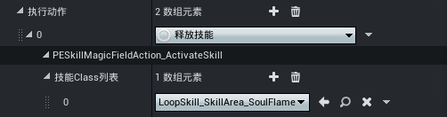

- 技能Class列表：要执行的目标技能蓝图

> 法术场作为该技能的施法者，由于法术场通过区域检测的方式选取目标，因此执行的技能无需再额外配置选取目标相关的Task

---

#### 添加Buff

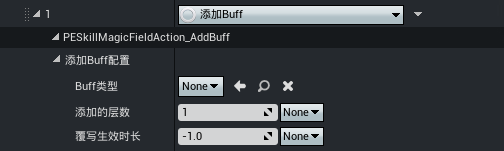

- Buff类型：需要添加的Buff蓝图
- 添加的层数：覆盖Buff的添加层数参数，-1代表不覆盖
- 覆写生效时长：覆盖Buff的持续时间参数，-1代表不覆盖

---

#### 移除Buff

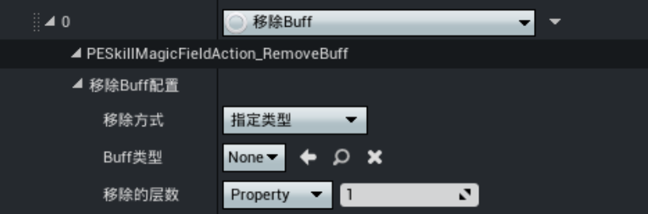

- buff类型：
	- 指定类型：根据配置的Buff基类移除匹配的Buff
	- 拥有任意Tag：当移除目标身上的Buff实例携带的类型Tag拥有配置的任一tag时，则移除对应的Buff实例
- Buff类型：要移除的 [Buff蓝图](./Buff编辑器2.0/20087_Buff编辑器.md)
- 移除的层数：移除的Buff层数，如果移除后为0将销毁Buff
	- Property：常量
	- Attribute：具体参考 [属性绑定](../属性与伤害/20098_通用属性系统.md)

---

#### 调用Lua脚本

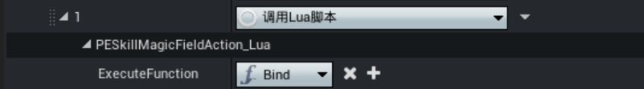

- ExecuteFunction：执行的lua函数

### 基于事件触发的多技能使用

当法术场满足在事件时支持释放多个技能

#### 法术场事件

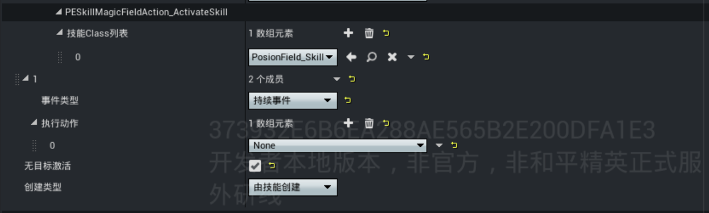

- 技能Class列表：需要触发的技能
- 事件类型：
  - 进入事件：当目标进入法术场的检测区域时触发
  - 退出事件：当目标退出法术场的检测区域时触发
  - 持续事件：当目标持续在法术场检测区域内时，周期性被触发，触发间隔由 ``执行间隔`` 属性决定
  - 开始事件：当法术场生成时触发
  - 结束事件：当法术场销毁时触发
- 执行动作：
  - 释放技能：触发技能列表中已配置的技能,具体可参考[释放技能](./20217_法术场.md#释放技能:~:text=目标都生效。-,释放技能,-技能Class列表)
  -  添加buff：添加的buff，具体可参考[添加Buff
](./20217_法术场.md#添加Buff:~:text=相关的Task-,添加Buff,-Buff类型：需要)
  -  调用Lua脚本：触发已配置的Lua脚本，具体可参考[调用Lua脚本](./技能编辑器2.0/20094_技能Task查询手册.md#技能Task-调用Lua脚本:~:text=添加给目标-,技能Task-调用Lua脚本,-在指定的)
  - 无目标激活：是否需要拥有目标才会激活法术场
  - 创建类型：
    - 由技能创建：法术场持有其施法者的信息，可用于追溯施法者
    - 由自身创建：法术场不携带施法者信息，但需额外配置[阵营](../角色系统/20095_队伍与阵营.md)

#### 碰撞事件

若要通过碰撞事件触发技能，必须先在目标的``OverlapCheckArea``组件中，正确配置所需碰撞盒的名称，仅当事件类型配置为``进入事件``和``退出事件``时该配置才可生效

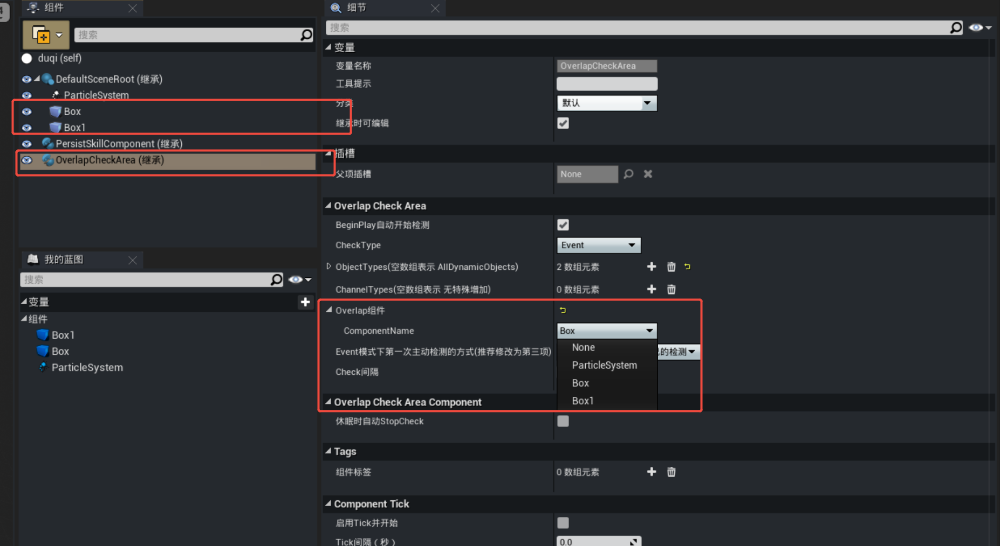

- Check Type：检测方式
  - Event：事件触发
  - Tick：根据Check间隔进行触发
- ObjectTypes：需要检测的碰撞对象类型，若为空则检测所有类型
- ChannerlTypes：需要检测的碰撞对象类型，若为空则检测所有类型
- ComponentName：需要触发事件的碰撞盒名称
- Event模式下第一次主动检测的方式：该配置选项忽略，不用改动
- Check间隔：当选择Tick模式下时，可以配置检测的间隔

碰撞事件也支持多个碰撞盒组合触发，但前提是必须为目标对象添加并**配置相应的 `` OverlapCheckArea ``组件**，并正确配置 ``ComponentName ``，才能确保事件正常触发

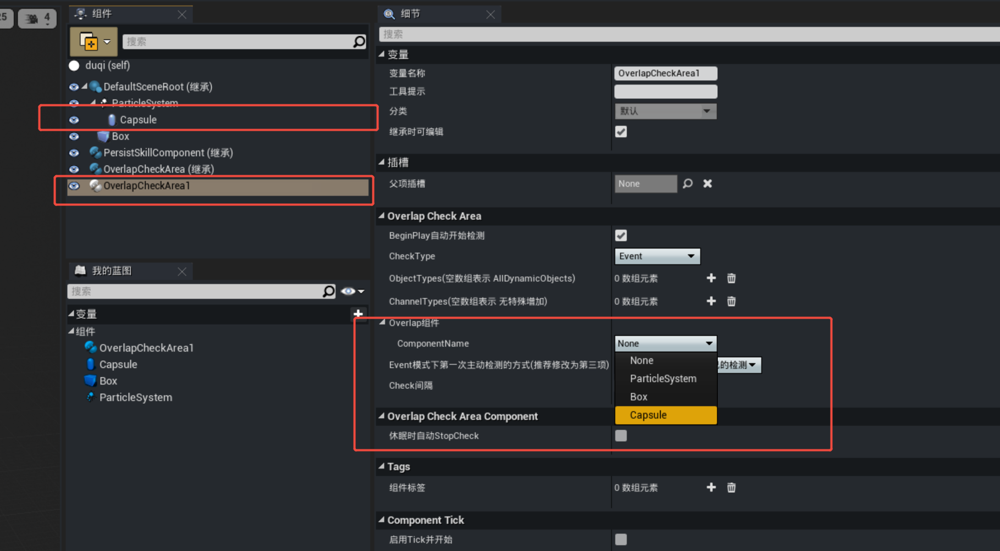

## 应用法术场

目前支持在关卡场景中放置和主动释放两种应用法术场的方式。

### 场景放置生成

当法术场蓝图的 ``创建类型`` 属性设置为“由自身创建”时，可将法术场蓝图拖放至场景中，游戏运行时即生成该法术场对象。

> 法术场的生命周期取决于法术场技能的持续时间

.gif)

---

### 主动释放法术场

可通过技能或者抛体的蓝图配置法术场功能，通过动作触发释放法术场。以技能释放场景为例，提供了 [生成法术场](https://developer.gp.qq.com/wikieditor/#/catalog/20186?autoJump=%E6%8A%80%E8%83%BDTask-%E7%94%9F%E6%88%90%E6%B3%95%E6%9C%AF%E5%9C%BA) 的技能Task。

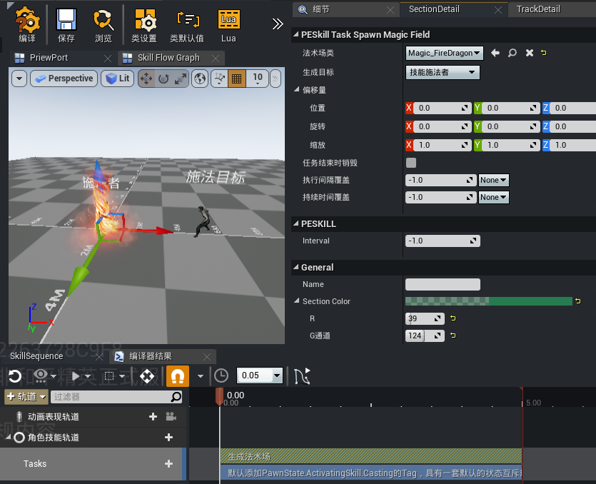

配置好法术场的参数后，当释放该技能时，即会在场景中生成一个火龙卷法术场，对进入火龙卷范围内的敌人造成伤害。

## 注意事项

当法术场的动作为释放技能时，需要注意以下两点：

1. 法术场为技能的施法者，因此部分技能Task并不适用法术场的技能配置，例如 [自动瞄准](./技能编辑器2.0/20094_技能Task查询手册.md#技能Task-自动瞄准) Task，推荐配置技能蓝图时，将 [技能预览设置](./技能编辑器2.0/20091_技能编辑器.md#技能预览设置) 中的 ``Actor类型`` 选为“法术场”，技能轨道会自动过滤不可用的Task。

	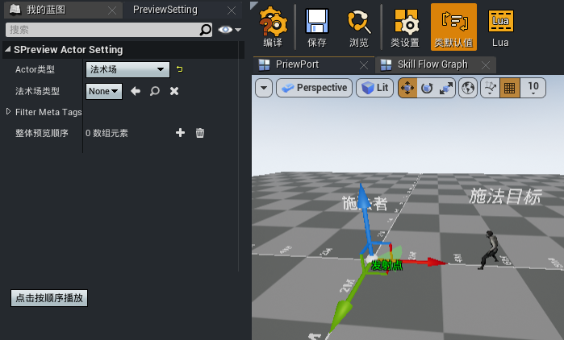
	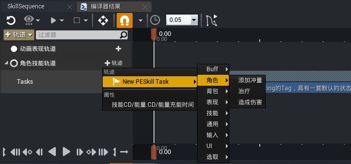

2. 部分技能Task涉及对Owner对象的依赖，例如 [造成伤害](./技能编辑器2.0/20094_技能Task查询手册.md#技能Task-造成伤害) Task，当 ``伤害数值`` 设为“公式计算”且 ``伤害数值属性来源`` 设为“Causer”时，依赖于施法者的属性进行伤害计算。此时，如果法术场是由场景放置生成的，则会因为无Owner而导致逻辑异常，因此使用场景放置生成法术场的时候，需要确保技能的逻辑没有对Owner相关的依赖。

	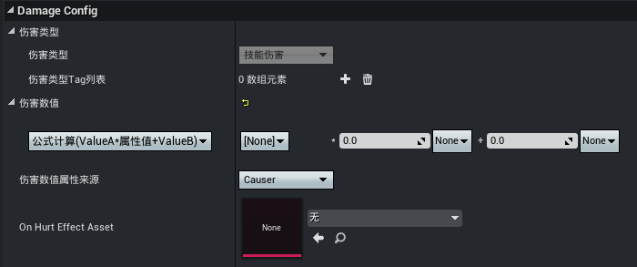
