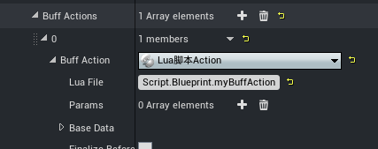
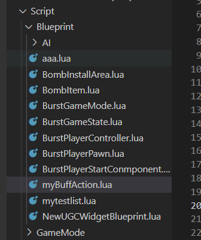

#  自定义自己的BuffAction

### 使用Lua脚本Action

- 在BuffActions中添加新的Action,类型选择Lua脚本Action
- 在LuaFile中填入路径



- 对应的脚本路径



- 脚本对应实现如下

```lua
local myBuffAction = {};

function myBuffAction:LuaDoAction()
    print("myBuffAction:LuaDoAction")
    return true
end

function myBuffAction:LuaUndoAction()
    print("myBuffAction:LuaUndoAction")
    return true
end

function myBuffAction:LuaResetAction()
    print("myBuffAction:LuaResetAction")
    return true
end

function myBuffAction:LuaUpdateAction(DeltaSeconds)
    print("myBuffAction:LuaUpdateAction:"..DeltaSeconds)
    return true
end

return myBuffAction;
```
