# BuffAction查询手册

## 添加Buff

向目标添加指定的Buff。

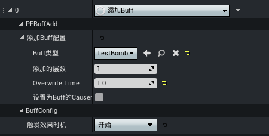

- Buff类型：指定添加的Buff蓝图
- 添加的层数：指定需要添加的层数
- Overwrite Time：Buff持续时间，-1代表不覆盖该Buff蓝图配置的生效时长
- 设置为Buff的Causer：此选项已弃用，开发者无需配置

## 修改人物属性

修改Buff目标的指定角色属性，遵循 [属性修改器](../../属性与伤害/20153_属性修改器.md) 的计算方式。

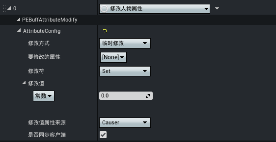

- 修改方式：临时修改/永久修改/持续修改
- 要修改的属性：预置血量、能量、信号等和平角色的基础属性，也支持绑定 [自定义属性](../../属性与伤害/20098_通用属性系统.md#自定义属性)
- 修改符：基于属性修改器的 [修改运算符](https://developer.gp.qq.com/wikieditor/#/catalog/20176?autoJump=%E5%B1%9E%E6%80%A7%E4%BF%AE%E6%94%B9%E7%AC%A6)
- 修改值：支持绑定常数、基于 [自定义属性](../../属性与伤害/20098_通用属性系统.md#自定义属性) 的计算公式或者指定Lua函数的返回值
- 修改值属性来源：若 ``修改值`` 设定为计算公式，则该项决定公式中所使用的属性的取值来源
	- Causer：属性取值源自施法者
	- Target：属性取值源自Buff目标

> - ``是否同步客户端`` 保持默认勾选
> - 属性绑定数据类型：float

## 造成伤害

对Buff的对象给与指定伤害。

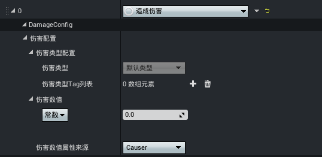

- 伤害类型Tag列表：可以为伤害添加额外的 [Tag标签](../../20102_Gameplay标签.md#GameplayTag概述)
- 伤害数值：支持绑定常数、基于 [自定义属性](../../属性与伤害/20098_通用属性系统.md#自定义属性) 的计算公式或者指定Lua函数的返回值
- 修改值属性来源：若 ``伤害数值`` 设定为计算公式，则该项决定公式中所使用的属性的取值来源
	- Causer：属性取值源自施法者
	- Target：属性取值源自Buff目标

## 调用Lua脚本

执行指定脚本里的可重载函数。

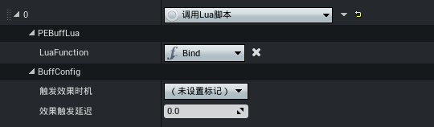

- LuaFunction：指定的重载函数

## 生成特效

播放指定的特效。

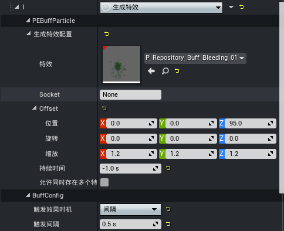

- 特效：选择要播放的特效资源
- 是否是强引用：建议勾选，否则影响特效资源的引用
- Socket：特效挂载的位置槽位，例如角色的某个骨骼；为空时，挂载到当前对象的世界坐标点上
- Offset：特效挂载位置或旋转的偏移量及缩放比例
- 缩放规则：
	- 保持相对缩放：与挂接目标保持相对缩放比例
	- 保持原始缩放：维持自身的原始缩放比例
- 持续时间：特效的持续时间，<0不会定时清除，只有在Buff结束时才清除
- 允许同时存在多个特效：勾选后，当多次触发该效果且之前生成的特效还未结束，则可以生成新的特效；反之亦然

## 治疗恢复

为Buff目标恢复指定血量。

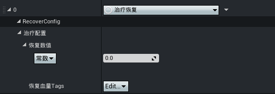

- 恢复数值：支持绑定常数、基于 [自定义属性](../../属性与伤害/20098_通用属性系统.md#自定义属性) 的计算公式或者指定Lua函数的返回值
- 恢复血量Tags：支持为治疗行为添加Tag，通过 [GameplayTag](../../20102_Gameplay标签.md#GameplayTag概述) 创建

## 移除Buff

为目标移除指定的Buff。

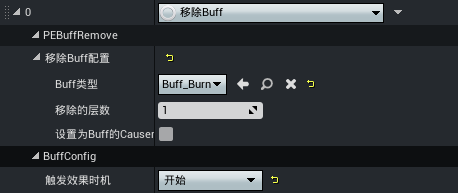

- Buff类型：指定移除的Buff蓝图
- 移除的层数：指定需要移除的层数

> ``设置为Buff的Causer`` 属性已弃用

## 播放声音

播放指定的音效。

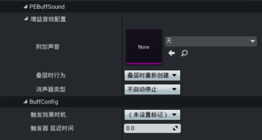

- Attach Sound：选择需要播放的音效资源
- 叠层时行为：
	- 叠层时重新创建：Buff叠加新一层时，对应的播放音效Action销毁旧的音效，重新创建播放新的音效
	- 叠层时叠加多个：Buff叠加新一层时，额外多创建一个新的音效
- 消声器类型：
	- 不自动停止：音效不会自动停止
	- 层数减少时停止：Buff层数减少时，自动停止
	- Buff结束时停止：Buff结束时，对应音效停止

## 下一次伤害属性修改

基于 [属性修改器](../../属性与伤害/20153_属性修改器.md) 的属性修改行为，临时修改Buff目标的指定属性值，当下一次受到任意伤害时（触发 [伤害公式](../../属性与伤害/20099_全局伤害公式.md)），自动移除相关修改。

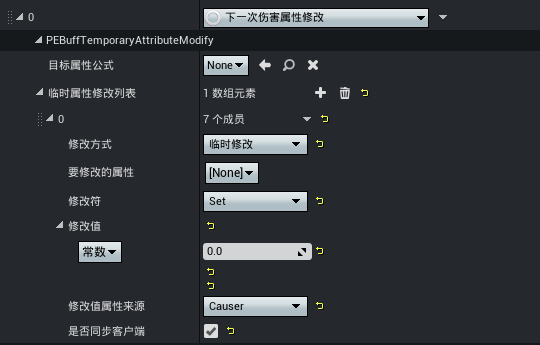

- 修改方式：临时修改/永久修改/持续修改
- 要修改的属性：支持和平角色与枪械的基础属性，也支持绑定 [自定义属性](../../属性与伤害/20098_通用属性系统.md#自定义属性)
- 修改符：基于属性修改器的 [修改运算符](https://developer.gp.qq.com/wikieditor/#/catalog/20176?autoJump=%E5%B1%9E%E6%80%A7%E4%BF%AE%E6%94%B9%E7%AC%A6)
- 修改值：支持绑定常数、基于 [自定义属性](../../属性与伤害/20098_通用属性系统.md#自定义属性) 的计算公式或者指定Lua函数的返回值
- 修改值属性来源：若 ``修改值`` 设定为计算公式，则该项决定公式中所使用的属性的取值来源
	- Causer：属性取值源自施法者
	- Target：属性取值源自Buff目标

> - ``目标属性公式`` 为预留项，保持 ``None``
> - ``是否同步客户端`` 保持默认勾选
> - 属性绑定数据类型：float

## 修改武器属性

修改Buff目标的指定武器属性，遵循 [属性修改器](../../属性与伤害/20153_属性修改器.md) 的计算方式。

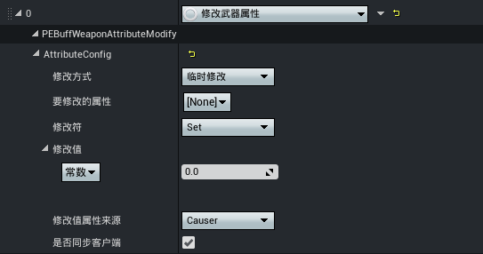

- 修改方式：临时修改/永久修改/持续修改
- 要修改的属性：预置和平枪械的基础属性，也支持绑定 [自定义属性](../../属性与伤害/20098_通用属性系统.md#自定义属性)
- 修改符：基于属性修改器的 [修改运算符](https://developer.gp.qq.com/wikieditor/#/catalog/20176?autoJump=%E5%B1%9E%E6%80%A7%E4%BF%AE%E6%94%B9%E7%AC%A6)
- 修改值：支持绑定常数、基于 [自定义属性](../../属性与伤害/20098_通用属性系统.md#自定义属性) 的计算公式或者指定Lua函数的返回值
- 修改值属性来源：若 ``修改值`` 设定为计算公式，则该项决定公式中所使用的属性的取值来源
	- Causer：属性取值源自施法者
	- Target：属性取值源自Buff目标

> - ``是否同步客户端`` 保持默认勾选
> - 属性绑定数据类型：float

## 屏幕特效

屏幕特效的设置与 [技能Task-屏幕特效](../技能编辑器2.0/20094_技能Task查询手册.md#技能Task-屏幕特效) 相同，可参考相关说明。

## 附加Actor

附加一个Actor到对应施法者身上。

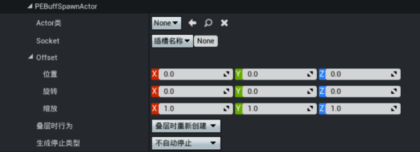

- 附加的Actor类：生成的Actor蓝图类
- Socket：支持按 ``部位类型`` 或者 ``插槽名称`` 附加
- Offset：挂载位置基于该Socket点的偏移
- 叠层时行为：
	- 叠层时重新创建：Buff叠加新一层时，销毁对应的旧Actor，重新创建新的Actor并附加
	- 叠层时叠加多个：Buff叠加新一层时，额外多创建一个新的Actor并附加
- 生成停止类型：
	- 不自动停止：Actor不会主动被Buff销毁
	- 层数减少时停止：Buff层数减少时，自动销毁
	- Buff结束时停止：Buff结束时，对应Actor销毁
